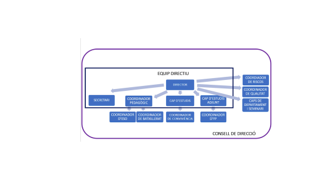
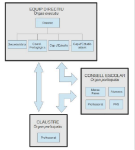

Memòria del pràcticum

Estudiant: David Garcia De Mercado (TEC1)

Centre: Puig Castellar, Santa Coloma de Gramenet

Mentor: Jaime Morcillo

Coordinadora: Adoración Cañal

Dades de l'estudiant 3 Resum biogràfic 3 Experiència docent 3 Filosofia docent 3

El centre i la seva organització 4 Coneixement i funcionament del centre 4 Entorn i infraestructura del centre 4 Oferta formativa del centre 4 Òrgans de govern, coordinació i avaluació del centre 4 Projecte de qualitat i de millora contínua 5 Organització i la gestió del centre 8 Projectes transversals de centre 8 Professorat, alumnat, famílies 9 Tipologia de l’alumnat 9 Funcions del professorat 10 Atenció a la diversitat 10 Convivència i clima escolar. Prevenció, gestió i resolució de conflictes 11 Relació amb les famílies 12 Comunicació general amb les famílies 12 Presencial 12 No presencial 12 Amb l’AMPA i els representants de les famílies 13 Comunicació específica amb cada una de les famílies 13 Presencial 13 No presencial 13 Recursos 13 Relacions del centre educatiu amb els recursos de l’entorn 13 Recursos organitzatius i metodològics 14 Grau de desenvolupament de l’estratègia digital de centre 14 Experiències 14 Connexions 15 Didàctica específica i actuació a l’aula 16 Organització didàctica del departament 16 Funcionament del departament de tecnologia 16 Tipologies d’activitats i estratègies d’aprenentatge 17 Innovació educativa 17 Recursos del departament 17 Els grups classe i el professorat 17 L’alumnat 17 El professorat 18 Les interaccions 18 Programació i actuació 19 Grup classe 19 Transferència de la programació a l’aula 19

1

Pràctica reflexiva 19 Experiències rellevants 20 Jornada d’innovació 20

Descripció de l’activitat 20 Aprenentatges obtinguts 20 Implementació en la pràctica educativa 20 Valoració personal 20 Reflexió final 21

2

Dades de l'estudiant

Resum biogràfic

Sóc graduat en Enginyeria Informàtica per la Universitat Politècnica de Catalunya (UPC). Durant els meus estudis de grau, vaig realitzar pràctiques en diverses empreses, exercint funcions de personal TIC en una i de programador web en tres. En el meu darrer any de carrera, vaig treballar en una empresa del sector privat en un àmbit aliè a la informàtica. Dos anys més tard, vaig iniciar la meva trajectòria docent, formalitzant el compromís de cursar el Màster en Formació del Professorat.

Experiència docent

Sóc professor des del novembre de 2023. Fins ara he fet tres substitucions, la tercera encara no ha finalitzat. He donat classes de:

Novembre 23 - Abril 24 — CFGM SMIX 1 - Xarxes locals.

Abril 24 - Juny 24 — ESO 1 - Eines digitals.

Abril 24 - Juny 24 — ESO 2 - Matemàtiques.

Abril 24 - Juny 24 — ESO 2 - Robòtica.

Abril 24 - Juny 24 — ESO 3 - Tecnologia.

Abril 24 - Juny 24 — ESO 3 - Robòtica.

Abril 24 - Juny 24 — CFGS ASIX 2 - Serveix de xarxa.

Setembre 24 - Actualitat — CFGS DAW 2 - Desenvolupament en entorn client.

Filosofia docent

La meva filosofia docent es fonamenta en un enfocament competencial de l’aprenentatge, en què l’alumnat adquireix els coneixements mitjançant l’experiència i l’aplicació pràctica. Crec fermament en la importància de garantir la igualtat d’oportunitats, adaptant els recursos i les metodologies a les necessitats individuals per tal d’afavorir un aprenentatge inclusiu i equitatiu. Considero fonamental potenciar les fortaleses de cada estudiant per fomentar-ne la motivació i l’autoconfiança, alhora que s’identifiquen i es treballen les mancances amb suport i orientació, amb l’objectiu d’assolir el màxim desenvolupament personal i acadèmic.

Pel que fa a les metodologies, combino la classe magistral amb la pràctica guiada i el treball per projectes. A les meves classes, promoc la participació activa de l’alumnat mitjançant preguntes retòriques i específiques, que serveixen tant per reenganxar els estudiants que es poden distreure com per verificar la comprensió dels continguts. Prioritzo una assimilació profunda d’un nombre reduït de conceptes abans que una cobertura accelerada d’un gran volum de continguts que pot comprometre l’adquisició real del coneixement.

3

El centre i la seva organització

Coneixement i funcionament del centre

Entorn i infraestructura del centre

El centre està situat al barri de Singuerlín a Santa Coloma de Gramenet, però acull alumnat de tot Santa Coloma, especialment de la seva àrea de proximitat assignada: els barris de Riu Nord i Riu Sud.

L’edifici té prop de 60 anys, i per tant algunes característiques com la instal·lació elèctrica no són òptimes. El centre és gran i té un taller de tecnologia, sis aules informàtiques (principalment destinades a cicles), i també una cantina on els alumnes poden comprar l’esmorzar o el berenar.

Oferta formativa del centre

La oferta formativa del centre és:

● ESO (4-5 línies, depenent del curs)

● Batxillerat cientificotecnològic (1 línia)

● Batxillerat de ciències de la salut (1 línia)

● Batxillerat d’humanitats (1 línia)

● Batxillerat de ciències socials (1 línia)

● Batxillerat d’humanitats i ciències socials (1 línia)

● CFGM de gestió administrativa (1 línia)

● CFGS d’administració i finances (1 línia)

● CFGM de sistemes microinformàtics i xarxes (4 línies)

● CFGS d’administració de sistemes informàtics en xarxa (1 línia)

● CFGS de desenvolupament d’aplicacions multiplataforma (1 línia)

● CFGS de desenvolupament d’aplicacions web (1 línia)

● Extraescolar de robòtica (1 línia)

Òrgans de govern, coordinació i avaluació del centre

Font: documentació interna de l’institut Puig Castellar

4

Font: documentació interna de l’institut Puig Castellar

Projecte de qualitat i de millora contínua

La política de qualitat de l’Institut Puig Castellar ha estat i estarà sempre d’acord a satisfer les expectatives i necessitats educatives de tots els membres de la comunitat educativa, oferint uns ensenyaments i serveis de qualitat. La política de qualitat està dirigida a:

● Contribuir a la consolidació d’un ensenyament de qualitat garantint la igualtat d’oportunitats.

● Aplicar una política de qualitat i millora contínua en tots els processos propis del centre, perquè permetin consolidar les bones pràctiques existents, garantir els serveis del centre i les accions educatives.

● Donar compliment als condicionaments que marquen les lleis en matèria d’educació o relacionades i, si s’escau, als requisits de les normes acreditadores de qualitat.

Els objectius de qualitat són:

● Millorar els resultats acadèmics i els indicadors de centre, optimitzant al màxim la utilització dels espais on s’imparteixen classes i del centre en general. ● Potenciar la confiança dels grups d’interès vers el centre, mitjançant la creació d’equips de millora, formació del professorat, gestió de la documentació, habilitació d’espais per a l’alumnat i manteniment de la col·laboració activa de les empreses participants en la formació de l’alumnat d’FP.

5

6

Font: Documentació interna de l’institut puig castellar.

Carta de serveis

La carta de Serveis és un document on queden recollits el llistat de serveis que ofereix el centre tot indicant el compromís de qualitat per a cadascun d’ells. Les cartes de servei d’ESO-BAT i de CCFF es troben publicades a la web del centre, apartat de qualitat.

Carta de compromís educatiu

La carta de compromís educatiu és un document on queden explícits el principis pedagògics del Centre. Aquest compromís s’ha de signar per part del Centre, per part de l’alumne i de la família si són menors d’edat, i per part del Centre i de l’alumne si són majors

7

d’edat. Els models estan penjats a la web del centre, apartat de qualitat, i hi ha un per a l'alumnat d’ESO, Batxillerat i CFGM i un altre per a l’alumnat de CFGS.

Organització i la gestió del centre

D'acord amb la legalitat vigent, els òrgans de govern i de participació del centre són els següents:

● Consell Escolar. El CE està format per: 7 representants del professorat, 4 representants de l'alumnat, 4 representants de les famílies, 1 representant de l'AFA, 1 representant del PAS, 1 representant de l'Ajuntament i 3 representants de l'equip directiu. En el si del CE funcionen com a mínim quatre comissions: la comissió permanent, la comissió econòmica, la comissió de convivència i la comissió d’igualtat.

● Claustre de professorat. Format per tot el professorat del centre en igualtat de drets i deures segons la responsabilitat del càrrec de cadascú.

● Equip directiu. Format pel director o la directora, el/la cap d'estudis, el/la coordinador/a pedagògic/a, el/la secretàri/a i l'adjunt/a al cap d'estudis. A aquest equip s'afegeixen el/la coordinador/a d'ESO, el/la coordinador/a de batxillerat i el/la coordinador/a de convivència.

● L’alumnat, a través de l’assemblea de delegats. Format per un delegat de cada grup i els representants de l’alumnat del Consell Escolar.

● Les famílies, a través de l’associació de famílies d'alumnes (AFA).

● Personal administratiu i de serveis (PAS).

● Personal del servei de neteja.

● Personal del servei de manteniment.

● Personal del servei de cantina.

Les NOFC són molt detallades i defineixen tots els aspectes requerits per la legalitat vigent, així com aspectes adicionals propis del centre. El PEC és clar amb els objectius i amb la forma d’avaluar-los.

Altres documents rellevants del centre són el projecte de direcció, la progrmació general anual i la memòria anual.

Projectes transversals de centre

● Desmobilitza’t: Un projecte pel benestar digital en forma de concurs, promogut pels alumnes de l’institut.

● GIUP: GIUP és PUIG al revés. El concepte sorgeix el curs 2013-2014 quan es va iniciar el projecte, amb la intenció de fer una mirada a allò que estem fent i donar-li una volta per poder veure-ho i treballar-ho d'una altra manera. La base del projecte és el foment de la convivència, i per això, es treballa conjuntament tant professorat com alumnat voluntari, per tal de poder ajudar i donar una volta a allò que no funciona per tal que funcioni. En aquest projecte alumnes de 4t de la ESO fan de padrins d’alumnes de 1r de la ESO. Els hi donen la benvinguda, i els acompanyen durant el seu primer any tot ensenyant el funcionament de l’institut i oferint suport.

● IOC: El Puig és un centre col·laborador amb l’IOC.

8

● OrientaFP: El programa OrientaFP del Departament d’Educació, acompanya i dona suport als centres que imparteixen ensenyaments professionals en la implementació, el desenvolupament i la millora d'estratègies, mesures i plans per a l'orientació acadèmica i professional de l'alumnat, proporcionant eines, recursos i experiències d'intercanvi mitjançant el treball en xarxa dels centres participants.

● Erasmus+: Aquest programa permet l’intercanvi d’alumnes entre centres Europeus. ● GEP: El curs 2017-2018 el Departament d’Ensenyament inicia el programa d’innovació pedagògica Generació Plurilingüe (GEP). La finalitat d’aquest programa és millorar la competència en llengües estrangeres de l’alumnat, afavorint el seu creixement acadèmic i posterior inserció laboral, i capacitant-lo per interactuar amb el món en diverses llengües i de manera crítica.

● Aula tecnològica: L'institut Puig Castellar ha estat un dels 71 centres educatius d'FP seleccionats per a la Conversió d'una aula en espais de tecnologia aplicada per al curs escolar 2023-2024 i el primer trimestre del curs escolar 2024-2025.

● L'associació esportiva Puig Castellar ofereix l'extraescolar d'esports per als joves del centre. Les extraescolars que ofereixen són: Bàsquet, Fútbol Sala, Hip-hop, Pàdel, Voleibol i Tennis Taula.

● TILC (tractament integrat de llengua i continguts): Al Puig Castellar treballem amb la metodologia TILC, per tal d'ensenyar de manera integrada els continguts i el llenguatge acadèmic dels àmibts curriculars no lingüístics, per millorar els resultats en l'aprenentatge de totes les matèries. El TILC també proposa desenvolupar les destreses cognitives, la consciència crítica i la perspectiva intercultural dels aprenents.

● Programa de foment de les llengües estrangeres a la Formació professional: La finalitat del programa és incorporar i normalitzar l’ús d’una llengua estrangera en situacions professionals habituals i en la presa de decisions en l’àmbit laboral.

Professorat, alumnat, famílies

Tipologia de l’alumnat

Santa Coloma és una ciutat de classe obrera construïda sobre l'antiga vila rural durant la massiva immigració dels anys seixanta. Les famílies que hi viuen són principalment oriündes del sud d’Espanya. Al llarg de les darreres migracions, ha arribat població provinent, majoritàriament, de països asiàtics (Xina, Bangladesh, Paquistan), països llatinoamericans (Equador, República Dominicana, Perú, Hondures) i països magribins (sobretot del Marroc) i països de l’Est d’Europa (Rússia, Romania, Ucraïna i Geòrgia).

Bona part de l’alumnat fa servir en la seva vida quotidiana principalment el castellà, i en segon terme el català, essent el castellà la llengua d’origen de la majoria dels alumnes. A banda del castellà i català, altres llengües d’origen de l’alumnat del centre són: l’àrab, l’amazic, el xinès (mandarí), l’urdú, l’hindi, el bengalí, el rus, i l’armeni.

9

Funcions del professorat

A més de les funcions docents habituals, part del professorat assumeix un o més càrrecs dels òrgans de govern i de coordinació, afegint tasques a la seva rutina. Els òrgans de govern i coordinació són:

● Òrgans col·legiats de govern i coordinació

○ Claustre del professorat

○ Consell Escolar

○ Equip directiu

○ Consell de direcció

● Òrgans unipersonals de direcció

○ Director/a

○ Cap d’estudis

○ Coordinador/a pedagògic/a

○ Secretari/ària

○ Cap d’estudis adjunt

● Càrrecs unipersonals de coordinació

○ Coordinador/a d’ESO

○ Coordinador/a de Batxillerat

○ Coordinador/a de Formació Professional

○ Coordinador/a de coeducació, convivència i benestar de l’alumnat

● Altres càrrecs i òrgans de coordinació organitzativa

○ Coordinador/a de prevenció de riscos laborals

○ Coordinador/a LIC

○ Coordinador/a d’informàtica

○ Coordinador/a d’extraescolars

○ Coordinador/a de lectura i biblioteca

○ Coordinadors/es del programa de gestió de l’alumnat i comunicació amb les famílies

○ Coordinadors/es dels Plans Individualitzats

○ Coordinadors/es d’ERASMUS

○ Coordinador de l’Associació Esportiva

○ Coordinador/a de l’IOC (Institut Obert de Catalunya)

○ Coordinador/a de Qualitat i Millora

○ Coordinador d’Orienta FP

○ Comissió de Qualitat i Millora.

○ Tutor/a de Pràctiques (FP)

Atenció a la diversitat

Pel que fa als criteris d’atenció a la diversitat, i atesa la mobilitat de l’alumnat i les circumstàncies concretes de cada curs i nivell, el centre necessita ser àgil i estar atent al tractament de la diversitat que cal aplicar cada curs acadèmic i, per això, caldrà analitzar, cada curs, quines són les característiques dels grups i quins recursos cal aplicar a cada cas concret.

10

Es procurarà atendre la diversitat de l’alumnat amb PI, i tant com es pugui, mitjançant optatives de reforç o ampliació.

L’alumnat nouvingut de llengües no romàniques de qualsevol dels cursos d’ESO serà atès a l’Aula d’Acollida les hores i el temps que es considerin necessàries segons les seves habilitats. L’alumnat nouvingut de llengües romàniques serà atès en primer lloc amb hores a l’Aula d’Acollida i incorporat a l’aula ordinària tan aviat com es pugui.

Al Pla d’Atenció a la Diversitat es detalla l’estructuració de l’atenció a la diversitat a l’ESO pel que fa a la formació de grups.

Les mesures d’atenció a la diversitat presents al pla d’acollida del centre són: ● El Pla Individualitzat. Realització i seguiment

● Mesures d’atenció a la diversitat de l’Institut Puig Castellar

○ Reducció de la ràtio a primer d’ESO

○ Reforç de català a primer d’ESO

○ Desdoblaments a primer d’ESO

○ Desdoblaments a les matèries instrumentals a segon d’ESO

○ Desdoblaments a segon d’ESO

○ Optativa de recuperació i reforç de matemàtiques

○ Optativa de reforç de les instrumentals a segon

○ Projecte de diversificació curricular a tercer d’ESO

○ Optativa de reforç de les instrumentals a tercer

○ Optativa de recuperació, reforç i ampliació de matemàtiques

○ Desdoblaments a tercer d’ESO

○ Optativa Oral English a tercer d’ESO

○ Projecte de diversificació curricular a quart d’ESO

○ Desdoblaments d’anglès a quart d’ESO

○ Optativa de reforç i ampliació d’anglès a quart d’ESO

○ Grup reduït a quart d’ESO

○ Els plans individualitzats dins de l’aula ordinària

● La UEC

● L’aula d’acollida

Convivència i clima escolar. Prevenció, gestió i resolució de conflictes

En el pla de convivència es recull tot el que es refereix a la convivència, la gestió de conflictes i la seva resolució. Els objectius del pla de convivència són els següents:

11

Font: Documentació interna de l’institut Puig Castellar.

Relació amb les famílies

Comunicació general amb les famílies

Presencial

● Obertura del curs al saló d’actes

● Trobada de principi de curs de les famílies del grup-classe amb el professor/a tutor/a.

● Trobada d’orientació acadèmica per a les famílies d’alumnat de 4t d’ESO abans de les preinscripcions.

● Trobades amb el responsable d’activitats extraescolars per als viatges dels nivells o grups que els realitzin; o bé amb el responsable d’Erasmus, si és el cas. ● Trobada de comiat d’etapa al saló d’actes per a 4t d’ESO.

● Trobada de comiat d’etapa per a Batxillerat i Cicles.

No presencial

● Missatges breus mitjançant SMS per faltes d’assistència.

12

● Circulars vàries sobre activitats i horaris especials de carnestoltes, Sant Jordi, final de trimestre, recuperacions de setembre, etc.

● Missatges mitjançant iEduca per informacions vàries que requereixen especial ressò (convocatòries de l’AMPA, vagues, xerrades informatives, etc.)

● Informació d’activitats, convocatòries, deures d’estiu, etc. mitjançant la pàgina web de l’institut.

Amb l’AMPA i els representants de les famílies

● Trobada setmanal de la direcció amb l’AMPA.

● Reunions del Consell Escolar i de les seves comissions.

● Comunicació regular d’activitats i esdeveniments amb l’AMPA i els membres del CE mitjançant correu electrònic

Comunicació específica amb cada una de les famílies

Presencial

● Reunions amb el professor/a-tutor/a (almenys una durant el curs pel que fa a l’ESO). ● Reunions amb un/a professor/a del grup-classe, si es considera oportú, i sota supervisió del professor-tutor o d’un membre de la junta directiva.

● Reunions del/la psicopedagog/a (i l'EAP, si escau) amb les famílies que ho necessitin o ho sol·licitin (beques, NEE, orientació, etc.).

● Reunions amb el membre adient de la junta directiva per qüestions de disciplina, faltes d'assistència, etc., o a requeriment de la família.

No presencial

● Comunicació entre la família i el professor-tutor per correu electrònic, per telèfon o mitjançant l’agenda escolar, quan n’hi hagi necessitat.

● Informes de preavaluació (per a l’ESO) i d’avaluació (per a l’ESO, el BAT i els Cicles). ● Fulls d’autorització de sortida durant el curs.

● Trucades imprescindibles de la Secretaria del centre a l’alumnat per a tràmits urgents.

Recursos

Relacions del centre educatiu amb els recursos de l’entorn

El centre té relació amb varies entitats externes:

● Centre de Recursos Pedagògics (CRP): Aquest centre ofereix formacions al personal del Puig. El Puig recull propostes per a sol·licitar formacions en camps o eines específics.

● Ajuntament: L’ajuntament promou una fira d’orientació on hi participa l’institut. ● Universitats:

○ UPC: Els alumnes del centre participen a concursos de robòtica que es fan a la UPC.

13

○ UAB: La UAB fa xerrades i tallers als que poden assistir els alumnes de l’institu (dissabtes a l’UAB).

● Fundació Catalunya la Pedrera: Organitzen el programa bojos per la ciència. El centre hi participa.

● Associació catalana de matemàtiques: Organitzen les proves Cangur i ESTALMAT.

Recursos organitzatius i metodològics

L’institut té sis aules informàtiques destinades als cicles formatius d’informàtica. També té un taller tecnològic per a impartir classes pràctiques de tecnologia a la ESO i el Batxillerat. Els alumnes també poden fer servir la biblioteca i un espai de taules al vestíbul per a treballar de forma independent fora de les hores de classe.

El centre organitza uns desdoblaments especials per a certes matèries, buscant donar reforç als alumnes que ho necessiten:

● A 1r ESO, a les hores de català i castellà es forma un grup adicional amb alumnes que necessiten reforç de totes les línies. Durant la hora de la matèria, el grup de reforç fa tasques adaptades. Es fa el mateix amb matemàtiques.

● A 2n ESO el grup de reforç es fa també a català i castellà.

● A 3r ESO el reforç és només de matemàtiques.

● A 4t ESO no hi ha reforç, si no que hi ha un grup especial amb adaptacions.

Grau de desenvolupament de l’estratègia digital de centre

Pel que fa als aspectes sobre tecnologia digital, cal tenir en compte que el centre fa anys que ha fet una clara aposta per la digitalització del centre. Així, tot l'alumnat i professorat disposa d'un usuari de centre que els permet tenir serveis com són el correu electrònic o l'emmagatzematge al núvol. Amb aquests usuaris es realitza tota la comunicació del centre.

Amb la incorporació del Pla d'Educació Digital de Catalunya, cada professor/a i cada alumne/a disposa d'un portàtil personal que pot emportar-se a casa o deixar al centre. Als alumnes de 1r de la ESO, durant la primera setmana de classe, els hi fan un curs breu de les eines digitals que hauràn de fer servir al centre per a que es familiaritzin.

Experiències

Trobo que és complicat donar temps a classe per a fer activitats i que sigui profitós. Els alumnes tendeixen a distreure’s i a parlar enlloc d’aprofitar per a provar de fer les activitats i preguntar dubtes. Es genera una situació molesta on els alumnes no acaben les activitats i per tant no han avançat tant com tenies previst, i a més quan proven de fer-les a casa sense poder preguntar dubtes no ho entenen.

El recurs de fer sortir alumnes a la pissarra per a corregir exercicis és molt útil. Permet fer partíceps a tota la classe en el procés d’ensenyament, a més de ser bo per a poder il·lustrar errors comuns que cometen els alumnes.

14

Connexions

Experiència viscuda,

activitat...

Disseny d’activitats per a un grup de segon de la ESO amb molta diversitat.

Alumne amb un

comportament molt

disruptiu tant a les classes com als passadissos, pati i altres espais.

Contingut concret i

assignatura

Aprenentatge i

Ensenyament de la

Tecnologia a Secundària I

Vectors del currículum – Vector d’universalitat del currículum.

Societat, Família i Educació

El conflicte i la seva

resolució.

Reflexiona, argumenta la connexió feta

Quan vaig treballar amb un grup de segon de la ESO molt divers, que tenia

alumnes d’acollida, del SIEI, amb Pis..., vaig haver de dissenyar activitats per a fer a les meves classes.

En aquell moment vaig crear múltiples tasques diferents, pensant en els diferents grups que tenia.

Després d’haver cursat l’assignatura he après que el que hauria d’haver fet en la mesura del possible és pensar en una activitat que permeti treballar a alumnes en diferents nivells.

D’aquesta manera podria incloure a tots els alumnes en la realització de

l’activitat, sense fer

diferenciacions clares, i també em facilitaria la feina de correcció.

D’aquesta unitat el que he après és que quan un

alumne és molt disruptiu sempre hi ha un motiu a darrere, i moltes vegades té a veure amb la seva vida personal. És important no pensar en els

comportaments negatius com a una cosa personal, ja que quasi mai ho són.

També he après que

desescalar la situació

sempre ha de ser la prioritat, i postposar el conflicte per a poder parlar amb els

alumnes a nivell individual és una eina molt potent. Quan vaig tractar amb aquest alumne disruptiu, cosa que vaig fer abans de

15

Organitzar activitats per a fer durant una visita.

Font: Elaboració pròpia.

Complements per a la Formació Disciplinar en Tecnologia

Tecnologia i context. Visites i sortides de l'àrea de tecnologia.

cursar el màster vaig

complir la majoria d’aquests punts, excepte el de tractar les disrupcions de manera individual. Sempre parlava amb l’alumne davant de companys, i crec que si hagués parlat amb ella de tu a tu ens haguéssim entès molt més fàcilment.

Aquesta unitat de

l’assignatura em va ajudar a entendre com fer bones sortides.

La clau és dissenyar

activitats que només es puguin fer al lloc que es visita, per tal de fer la sortida rellevant. Si

l’activitat es pot fer desde casa o el centre, no té cap sentit ser al lloc de la

sortida per a fer-la, i perd rellevància.

També vaig veure que és important trobar un equilibri entre el temps que es triga en fer l’activitat, i el temps que es deixa per a explorar el lloc o disfrutar de la visita. Si els alumnes només fan activitat durant tota la sortida no s’ho hauràn passat bé i l’activitat perd força.

Didàctica específica i actuació a l’aula

Organització didàctica del departament

Funcionament del departament de tecnologia

El departament de tecnologia es troba darrere del taller de tecnologia. Per a accedir-hi has de passar per dins del taller de tecnologia. Al departament hi han dues taules per a treballar i tota una sèrie de prestatgeries per a emmagatzemar tot el material de tecnologia. És simultàneament el departament i el magatzem de tecnologia.

16

Els professors del departament es reuneixen una vegada al mes per a fer una reunió de departament. Al departament hi passa una bona part de les seves hores de jornada el meu mentor, en Jaime Morcillo, que com a coordinador digital rep visites habituals d’alumnes i professors per igual, principalment sobre problemàtiques amb els ordinadors de préstec.

Tipologies d’activitats i estratègies d’aprenentatge

A l’assignatura de tecnologia es busca que els alumnes apliquin de forma pràctica el que veuen a classe. Així doncs, a més de les classes magistrals que treballen el contingut teòric, es fan pràctiques guiades, projectes, i altres activitats pràctiques per tal de que els alumnes reforcin els aprenentatges que veuen a classe.

Innovació educativa

Vegeu els projectes transversals del centre. Allà hi podeu trobar, entre altres, l’aplicació d’innovacions educatives com el projecte d’intercanvi erasmus+.

Recursos del departament

El departament disposa d’una gran quantitat de components electrònics per a fer pràctiques. També compta amb kits de robòtica de LEGO Spike, així com plaques Microbit i Arduino per a fer projectes de programació i robòtica. El taller és ampli i disposa de taules per a treballar bé amb les diferents eines disponibles al taller. Al taller també hi han quatre impressores 3D i màquines de cosir. El taller compta amb un projector i una pissarra blanca.

Quan és necessari, des del departament també es fan compres de material com fusta i metall per a les diferents construccions que hagin de fer els alumnes.

Per a una de les assignatures extraescolars de robòtica també compten amb uns kits de robòtica de l’empresa VEX, empresa que organitza competicions de robòtica.

Els grups classe i el professorat

L’alumnat

Tal i com explico al context del centre, l’alumnat és molt divers. Aquesta diversitat la he viscut a les observacions i intervencions. Ja la coneixia, donada la meva experiència prèvia com a docent, però sempre destaco la gran dificultat d’organitzar tasques per a grups tant diversos. Trobo que les mesures de suport universal que podem oferir arriben fins a cert límit, i a partir d’allà costa molt donar un servei ideal als alumnes.

Els alumnes de la ESO són molt moguts, i tenen poc respecte pel professorat. No és un problema específic del centre, sino generacional. L’alumnat es comporta com si fos a casa i amb una confiança excessiva, amb pocs límits i una autoritat autoassignada que dificulta molt la feina del professorat. Cal advertir que estic generalitzant, i que hi ha molt alumnat motivat a aprendre, o com a mínim amb prou educació o regulació per a no sabotejar la classe. Tanmateix, els alumnes problemàtics es fan notar més, i d’aquí surten les meves afirmacions. És difícil connectar amb l’alumnat, especialment quan en l’actualitat fins i tot se’ls hi fa difícil a ells connectar entre iguals.

17

La diferència entre l’alumnat de la ESO i el de batxillerat és molt marcada. A les meves observacions he notat que al batxillerat els alumnes respecten més al professorat i tenen més predisposició a aprendre. També es preocupen més per la nota que obtenen. A la ESO, en canvi, la preocupació arriba com a màxim a una distinció entre aprovat/suspès.

Si deixem de costat els moments en els que hi ha disrupció i que forcen a readreçar la classe, els alumnes responen prou bé quan se’ls demana que fagin exercicis, i es mostren prou motivats a sortir a la pissarra a corregir-los. És curiosa la dissonància entre les poques ganes de participar quan es fan preguntes, i la predisposició a sortir a la pissarra a fer una correcció.

A nivell de diferències de gènere, tinc la sensació de que les noies dónen més importància a tenir uns apunts endreçats, mentres que els nois confien (massa) en la seva capacitat d’enrecordar-se de les coses amb uns apunts mínims. Els nois destaquen en tenir més quantitat d’alumnes disruptius. També hi han noies disruptives, però els nois en són la majoria.

El professorat

Quan parlem de professorat sempre penso en la frase feta castellana “cada maestrillo tiene su librillo”. La varietat en la forma de fer dels professors és molt alta, i quan ets docent trobo que és molt important trobar el teu propi estil. Un docent mai farà classe còmode ni treurà tot el seu potencial si no troba i reforça el seu estil personal. Això no vol dir que no puguis agafar idees d’altres persones.

El personal docent del Puig Castellar és, en general, un professorat implicat, professional i amb voluntat de millora. El que he trobat, tant en la meva experiència prèvia com en el pràcticum, és que hi ha poca innovació i la varietat de metodologies no és molt alta. La gran majoria de docents (dels observats, tots) fan ús de les classes magistrals per a transmetre coneixements, i les fitxes d’activitats i pràctiques guiades predominen com a metodologies pràctiques. Els projectes són puntuals, sovint fets servir com a conclusió del curs enlloc de com a eina d’aplicació o transferència de coneixements d’unitats durant el curs.

Els docents veterans utilitzen sovint el recurs de les anècdotes, aprofitant tots els seus anys d’experiència, i he comprovat que és un recurs molt potent per a conservar o recuperar l’atenció dels alumnes.

Les interaccions

Les relacions entre alumnes em preocupen. Hi ha una clara línia invisible que separa els nois de les noies, que no interactuen entre ells, formant dos grups clars. No tinc la sensació de que els alumnes hagin desenvolupat les seves connexions fins a un nivell íntim, més personal. La conversa sempre és de broma i no toquen temes que no siguin superficials. La millor manera que tindria de descriure-ho és que tenen relacions parasocials, però en persona.

Quant a les relacions alumnat-professorat repeteixo el que he escrit més amunt, els alumnes són poc o gens educats i no respecten la figura del professor/a. Sovint, aquest poc respecte també el veuen a casa.

La interacció entre docents és principalment informal, amb converses en descansos o a la sala de professors. Les converses formals es tenen normalment en reunions de

18

departament, claustres, avaluacions, etc. Alguns professors col·laboren perquè fan codocència o desenvolupen un projecte, o formen part d’un comité. Jo mateix he tingut reunions “serioses” amb companys perquè he desenvolupat algunes eines per a l’institut durant aquest curs. Són habituals les converses de “teràpia” entre el professorat.

Programació i actuació

Podeu trobar la situació d’aprenentatge que s’ha dissenyat i impartit al document adjunt a aquesta memòria. A continuació es detallen alguns aspectes que queden fora de la plantilla de la SA.

La intervenció s’ha realitzat a l’assignatura optativa de 4t de la ESO de tecnologia.

Grup classe

El grup classe correspon a una optativa, i és petit. En total són 14 alumnes. És un grup molt divers, tot i la mida petita del mateix. Dels 14 alumnes, n’hi ha dos amb un diagnòstic de TEA, un d’ells amb transtorns emocionals, i l’altre a l’aula d’acollida. Dos alumnes més van a l’aula d’acollida, un d’ells no parla ni català ni castellà tot i ser el tercer any que va a l’aula d’acollida.

Al ser un grup petit, les disrupcions són molt puntuals i responen molt bé tant a les explicacions com al treball autònom a classe. S’ajuden entre ells i estàn motivats. Fan preguntes per entendre el temari.

Transferència de la programació a l’aula

En primer lloc, aclarir que a data de lliurament de memòria no s’ha completat la SA sencera. El tema de la meva SA, les portes lògiques, es dóna a final de curs i per tant hem començat més tard del que seria ideal. Tanmateix, ja hem fet 6 sessions i he pogut fer la pràctica reflexiva amb el meu mentor. A més, al juny farà dos cursos que sóc docent en actiu.

Com que el temps fins a tancar el curs és més aviat just, he escurçat algunes parts de la SA, i per tant a les primeres sis sessions hem cobert més temari del que havia previst. A la sessió 6 ja hem pogut fer exercicis de pràctica del mapa de Karnaugh. En algun moment he hagut d’improvitzar, quan els alumnes em feien preguntes relacionades amb el temari però més avançades, o expressant curiositat sobre el context del tema o aplicacions reals de la teoria. Crec que ho he fet bé, tot i que en el futur m’agradaria preparar exemples d’aplicació prèviament per a poder donar millor context al contingut. El grup classe ha respost prou bé a la meva entrada com a professor temporal. La dificultat que he trobat, però, és que la presència del professor titular a classe d’alguna manera em restava autoritat. Si el professor titular és a classe, ell és la màxima autoritat i en general em costava posar ordre i el Jaime m’havia de fer un cop de mà. La sessió 6 la vaig fer sol, en Jaime era d’excursió, i vaig notar com els alumnes responien molt millor als meus tocs d’atenció i indicacions.

Les activitats que hem fet a l’aula les he plantejat en directe i les hem fet junts. En futures ocasions crec que és millor plantejar fitxes d’activitats que poder repartir. Això estalvia temps durant la sessió, i fa que els exercicis que planteges són més ben pensats.

19

Pràctica reflexiva

A continuació trobareu les sessions de pràctica reflexiva que he fet de les meves sessions d’intervenció, amb les aportacions del meu mentor.

25/04/25

Reflexió individual

La sessió ha anat prou bé. He notat que els alumnes es distreien amb facilitat i els hi costava mantenir la concentració durant l’explicació dels diferents components analògics. Potser quan em coneguin una mica millor es centraràn més? El meu mentor ha hagut d’intervenir un parell de vegades per a que els alumnes deixessin de parlar. També fa aportacions anecdòtiques o històriques sobre alguns dels components, i afegeix context que no estic afegint a les meves explicacions.

Reflexió compartida

El meu mentor coincideix amb mi en que hauria de fer més exemples del que explico i fer servir més les anècdotes com a forma d’engrescar als alumnes.

Millores plantejades

Quan prepari les properes sessions buscaré contextos interessants per el que explico, i miraré de lligar la meva explicació amb petits tasts d’informació addicional que mantingui als alumnes engrescats.

30/04/25

Reflexió individual

La sessió ha anat prou bé. El sistema binari és un tema amb el que em sento molt còmode i crec que he fet una bona feina explicant-lo. Estic satisfet amb la feina feta.

Reflexió compartida

El meu mentor coincideix amb mi.

Millores plantejades

No es planteja cap millora nova.

07/05/25

Reflexió individual

Els alumnes entenien bé els conceptes de suma i resta de binaris, però es liaven quan a les operacions ens “emportavem una”. El mentor ha explicat una manera molt bona de fer les operacions on afegia un pas intermig, com si d’una suma passésim a dues. Als alumnes els hi ha anat molt bé, ja que amb la meva manera de fer-ho de cap els hi costaba molt. He de buscar formes més visuals d’explicar les coses, que jo ho sàpigui fer de cap no vol dir que els alumnes ho hagin de fer així.

Reflexió compartida

El mentor opina el mateix que jo.

20

Millores plantejades

He de revisar els meus apunts per a incloure-hi representacions gràfiques que facilitin als alumnes fer els exercicis i entendre el temari.

09/05/25

Reflexió individual

La sessió ha anat molt bé. Els alumnes han entès bé els conceptes que hem donat avui. Crec que ha estat bona idea introduïr la part del tema següent, tot i que veig que els alumnes “passen” si ja ho farem el proper dia, i no intenten ni entendre-ho.

Reflexió compartida

El mentor està d’acord amb mi. Proposa que enlloc d’introducció comenci a explicar directament i eviti que els alumnes “passin”.

Millores plantejades

Tot i amb el consell del mentor, crec que no canviaré la manera en la que faig aquestes introduccions, aprofitant els últims 5-10 minuts de classe. Crec que és bo donar als alumnes temps per païr el que s’ha fet abans d’introduïr una cosa nova.

14/05/25

Reflexió individual

Avui el mentor ha hagut d’intervenir molts cops per a explicar els mapes de Karnaugh als alumnes, que no acabaven d’entendre les meves explicacions. Tinc tendència a pensar que hi ha una explicació prou bona com perquè tots els alumnes t’entenguin, però la realitat és que hauria de trobar múltiples explicacions per a un mateix concepte, i treballar-lo des de diferents enfocaments. He de pensar més que no tothom aprèn de la mateixa manera.

Reflexió compartida

El mentor em comenta que la meva reflexió és molt encertada. Atribueix les diferents maneres d’explicar el temari als seus anys d’experiència, de veure com els alumnes responien a les seves explicacions. Tanmateix, està d’acord en que és una cosa que es pot millorar si es treballa de forma més deliberada.

Millores plantejades

Quan prepari explicacions hauria de plantejar diferents explicacions per al mateix concepte, buscant diferents analogies o plantejant l’explicació des de diferents prismes.

16/05/25

Reflexió individual

Aquesta sessió la he fet individualment, sense el mentor. Ha anat molt bé, hem treballat exercicis i els alumnes han respost molt bé. M’he sentit molt còmode. No veig quines millores aplicar.

Reflexió compartida

No hi han comentaris per part del mentor.

21

Millores plantejades

No es planteja cap millora.

Experiències rellevants

Jornada d’innovació

No he pogut assistir a cap jornada de formació durant la durada del pràcticum. A la meva substitució anterior vaig assistir a una sessió de formació organitzada pel departament d’educació sobre els kits de robòtica LEGO Spike, Microbit + CuteBot i Arduino. En aquesta secció parlaré sobre aquella formació.

Descripció de l’activitat

La formació sobre els kits de robòtica LEGO Spike, Microbit + CuteBot i Arduino es va dur a terme a l’institut ón treballava anteriorment al mes de juny de 2024, tot just finalitzar el curs. La finalitat del curs era ensenyar al professorat com fer servir els kits de robòtica recentment comprats pel centre, tot motivant-los a fer-los servir fora de l’assignatura de tecnologia també.

L’activitat la dirigia una persona designada pel departament que s’encarregava d’anar a múltiples instituts a fer la formació dels kits.

Aprenentatges obtinguts

Durant la formació vaig aprendre concretament a fer servir la placa Arduino UNO amb la programació de blocs. El formador ens va demanar que forméssim grups segons el kit del que ens agradaria aprendre i jo vaig escollir Arduino.

Em va semblar curiós el mètode de formació. Enlloc d’explicar com funcionaven exactament els kits, ens va lliurar uns manuals per cada kit amb exemples d’aplicació (una mena de petites pràctiques guiades) i es va dedicar a resoldre dubtes dels professors. Prèviament a la part pràctica de la sessió el formador va fer una xerrada sobre els kits, però més orientada a les possibles aplicacions i no tant a com funcionen.

Implementació en la pràctica educativa

Des d’aquella formació que no descarto mai l’ús dels kits de robòtica en classes que no són de robòtica per a il·lustrar conceptes o per a que els alumnes practiquin els conceptes tractats a classe d’una forma diferent. Em va semblar molt interessant i encertat aquest concepte d’emprar la robòtica en altres ambients.

Valoració personal

L’activitat m’ha semblat molt enriquidora, i la naturalesa explorativa de la mateixa crec que és un encert total de plantejament. Per ara no he pogut fer ús del que he après, però crec que el canvi de perspectiva que m’ha aportat a nivell de plantejar algunes activitats és important. Valoro molt el tenir en compte la robòtica com a possible opció a l’aula.

22

Reflexió final

La meva perspectiva ha canviat una mica durant la duració d’aquest quatrimestre. Més pel que he vist a classe que pel que he vist a les pràctiques.Tanmateix, les pràctiques també m’han ajudat a replantejar alguns aspectes de la meva filosofia docent. Segueixo pensant que l’enfocament competencial de l’aprenentatge és el que vull buscar en la meva docència, i també mantinc l’opinió de que la forma idònia de que els alumnes adquireixin i retinguin contingut és l’aplicació pràctica. En el que he canviat la meva opinió és en les metodologies que faria servir per a aquest objectiu. Arran de les intervencions que hem fet a l’assignatura d’Aprenentatge i ensenyament de la tecnologia a secundària II, he trobat dues metodologies que m’han agradat molt: el puzzle i el debat. Aquestes metodologies em semblen fantàstiques per varis motius: fomenten les interaccions entre alumnes, treballen la capacitat dels alumnes d’expressar-se i transmetre informació quan parlen, fomenten la col·laboració i permeten formar a experts en diferents temes, entre altres. Sempre he tingut tendència a fer classes magistrals per a explicar els conceptes jo mateix, però la metodologia del puzzle, per exemple, em permet fer una classe invertida on els alumnes s’expliquin diferents parts del tema que porten apreses de casa, i invertir part del temps en el que jo faria una classe magistral en que fagin exercicis. A més, de vegades entre companys i companyes es saben explicar alguns conceptes que com a professor potser no podries o no sabries.

Una altre opinió que he canviat és la de la personalització de l’aprenentatge. És impossible fer un aprenentatge bàsicament individualitzat per a 30 alumnes. I normalment no en tenim 30, sino 120 o més en total. Enlloc d’individualitzar, crec que el millor que puc fer és dissenyar de forma universal, buscant donar suports universals per a ser més inclusiu,. Però també permetre ampliar a través del disseny universal. El meu objectiu és dissenyar activitats de forma més modular, amb ampliacions en ment, que em permeti adaptar de forma senzilla una activitat durant el transcurs d’una sessió, buscant satisfer les necessitats individuals dels alumnes des d’una base preparada de forma universal.

Valoro molt el vincle que faig amb els meus alumnes, i la meva facilitat per a generar vincles és una de les meves millors eines a la meva professió. Crec que la clau en aquesta facilitat és el respecte mutu. Els alumnes són menors, no els hauríem de tractar com adults perquè no ho són, però són persones. És sorprenent el que et pot donar un alumne quan el tractes com una persona, després de que la meitat del cos docent l’hagi donat per perdut i es dediqui a expulsar-lo sistemàticament. Això ho sé de primera mà, i espero no cometre mai l’error d’etiquetar a cap alumne, i ser negligent en conseqüència.

El meu proper objectiu és millorar el màxim que pugui com a docent, adquirint noves pràctiques i metodologies per tal de comptar amb el millor ventall d’opcions per a oferir el millor servei possible als meus alumnes. El fracàs d’un professor es tradueix directament en el fracàs dels seus alumnes. Crec que el mínim que podem fer és no fallar-los d’inici.

23

### Tabla 1

| OBJECTIUS  | ESTRATÈGIES  | INDICADORS |

| --- | --- | --- |

| Millorar els resultats 
acadèmics d’FP | Impulsar la qualitat de 
l’acció educativa | % d’alumnat que acaben l’etapa i superen els estudis de CFGM |

### Tabla 2

|  |  | % d’alumnat que acaben l’etapa i superen els estudis de CFGS |

| --- | --- | --- |

|  | Impulsar el treball 
globalitzat de l'alumnat | % de professorat que 
treballa amb una 
metodologia globalitzada amb l’alumnat de CFGM |

|  | Impulsar el treball 
globalitzat de l'alumnat | % de professorat que 
treballa amb una 
metodologia globalitzada amb l’alumnat de CFGS |

|  | Incorporar l’ús de la llengua anglesa mitjançant la 
metodologia AICLE així com el projecte d’Aprenentatge Plurilingüe al Puig | % d’UF que utilitzen la 
metodologia AICLE |

|  | Incorporar l’ús de la llengua anglesa mitjançant la 
metodologia AICLE així com el projecte d’Aprenentatge Plurilingüe al Puig | % d’activitats realitzades en anglès mitjançant el 
projecte APP |

|  | Diversificació de l’ús de metodologies impulsant l’ús de les TAC | % de professorat que utilitza plataformes digitals i eines digitals properes a les 
emprades a les empreses |

|  | Impulsar el treball 
d’orientació de l’alumnat mitjançant el programa Orienta FP | % abandonament |

|  | Impulsar el treball tutorial, tot revisant periòdicament el PAT | % abandonament |

| Optimitzar els espais  | Manteniment i, en tot cas, readaptació dels espais de referència docent del centre (aules grup classe) | Enquestes de satisfacció |

| Optimitzar els espais  | Manteniment i, en tot cas, readaptació dels espais del centre que s’utilitzen per fer classe (biblioteca, saló d’actes…) | Enquestes de satisfacció |

### Tabla 3

| Potenciar la confiança dels grups d’interès | Creació d’equips de millora  | Acta de tancament dels equips de millora |

| --- | --- | --- |

| Potenciar la confiança dels grups d’interès | Formació del professorat  | Pla de formació del 
professorat |

| Potenciar la confiança dels grups d’interès | Col·laboració activa amb les empreses de pràctiques i FP Dual | % d’empreses amb què es col·labora |

| Potenciar la confiança dels grups d’interès | Col·laboració activa amb les empreses de pràctiques i FP Dual | Enquestes de satisfacció |

| Impulsar nous projectes i consolidar els existents | Projecte Erasmus+  | % alumnat que realitza 
mobilitats |

| Impulsar nous projectes i consolidar els existents | Projectes, interns, en xarxa i intercentres | Quantitat de projectes que es realitzen i valoració dels 
mateixos |

| Impulsar nous projectes i consolidar els existents | Borsa de treball alumnat  | % alumnat que utilitza el servei satisfactòriament |

| Impulsar nous projectes i consolidar els existents | FP dual  | % d’alumnat amb la modalitat d’FP dual |

| Impulsar nous projectes i consolidar els existents | FP dual  | Enquestes de satisfacció |

| Visibilitzar el centre en l’entorn  | Potenciar la promoció externa del centre | Nombre d’activitats que el centre desenvolupa amb 
institucions |

| Visibilitzar el centre en l’entorn  | Elaboració i revisió del Manual i Carta de serveis | Document revisat i actualitzat |

| Visibilitzar el centre en l’entorn  | Visibilitzar l’oferta educativa del centre | Canals de visibilització |

| Visibilitzar el centre en l’entorn  | Consolidació de la coordinació i la col·laboració amb el teixit empresarial de la zona | Nombre d’empreses amb les que es col·labora |

### Tabla 4

| Objectiu general  | Objectiu específic |

| --- | --- |

| 1. Assegurar i garantir la 
participació, la implicació i el compromís de tota la 
comunitat escolar. | 1.1 Sensibilitzar la comunitat escolar de la necessitat d'elaborar un Projecte de convivència amb la implicació i el compromís de tots els agents educatius. 
1.2 Elaborar una diagnosi participativa sobre la situació |

### Tabla 5

|  | de la convivència en el centre. 
1.3 Crear els espais necessaris per afavorir la participació dels diferents sectors de la comunitat en l'elaboració del projecte. |

| --- | --- |

| 2. Ajudar cada alumne a 
relacionar-se amb si mateix, amb els altres i amb el món. | 2.1 Potenciar les competències socioemocionals. 
2.2 Potenciar les habilitats i competències necessàries per a la gestió positiva dels conflictes. 
2.5 Educar en el valor de la norma i potenciar la participació de l'alumnat en la seva elaboració. |

| 3. Potenciar l'equitat i el 
respecte a la diversitat de l'alumnat en un marc de valors compartits. | 3.1 Garantir l'òptima incorporació dels nous membres de la comunitat escolar. 
3.4 Potenciar l'educació intercultural. |

| 5. Fomentar una cultura de la pau i la no-violència, juntament amb els valors que fan possible preservar i enriquir la vida de totes les persones. | 5.2 Formar les persones perquè siguin capaces d'informar-se, entendre i analitzar críticament situacions de conflicte social, de violència i de pau. |

