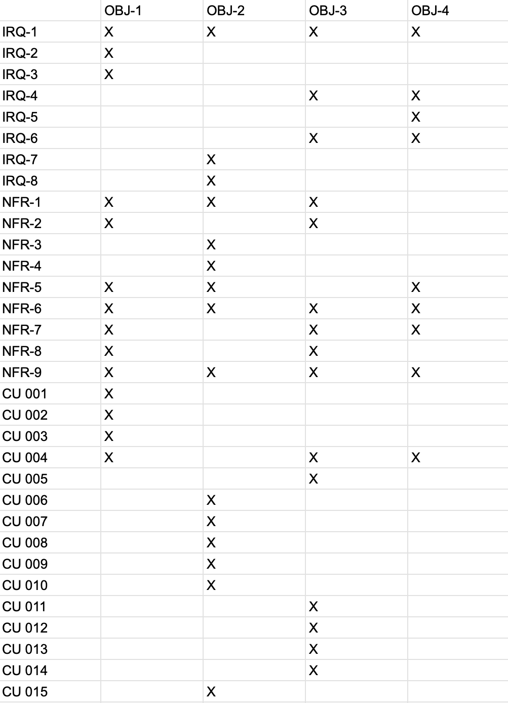

20 de mayo de 2025 - tercera versión

Ingeniería del software I

# MOVE&GROW

___

Beatriz del Barrio González

Camila Escobar Concha

Carolina Galán García

Lucía Carral Baleztena

Naroa Centurión Velasco

CAMINA, CUIDA, TRANSFORMA

Sembrando árboles gracias a tus pasos, construyendo un futuro más verde

Cada paso que das contribuye a un planeta más saludable. Los árboles son esenciales para combatir el cambio climático, absorber el dióxido de carbono y generar oxígeno.

Al caminar o usar el transporte público en lugar del coche, estás ayudando a reducir la huella de carbono y, gracias a tus pasos, estamos sembrando árboles para devolver al mundo un poco de lo que le hemos quitado.

CONTENIDOS:

## 1. Registro de Cambios

Hemos modificado la matriz de objetivos-requisitos, para que todos estén relacionados con los objetivos. Atendiendo a esta matriz los objetivos han sido añadidos correctamente a las tablas de los requisitos y los casos de uso.

Se han modificado los requisitos de acuerdo a las correcciones (han sido añadidos, eliminados y modificados), se han añadido sus tablas y se han rellenado en su mayoría. Como consecuencia, también ha habido que cambiar la matriz de requisitos con requisitos.

También hemos añadido un caso de uso más, el que ahora es el CU-004 Configurar objetivos, además de añadir las correcciones de los casos de uso indicadas en el Hito 1.

Para el Hito 3 hemos modificado los requisitos y los casos de uso. Algunos requisitos de información han sido omitidos, y se han añadido casos de uso en base a las opciones para gestionar los usuarios. Por ello, la matriz de objetivos-requisitos y la matriz de requisitos-requisitos se han corregido.

En el apartado de la memoria técnica hemos añadido información en las técnicas y herramientas.

El diagrama de clases del modelo de dominio también ha sido corregido, lo que ha implicado la creación de una tabla en el glosario de clases (la clase zona).

Se han añadido dos nuevos actores y el caso de uso gestionar usuario ha sido dividido en diferentes casos de uso.

## 2. Registro de uso de IA generativa

Durante la realización de este proyecto, hemos utilizado herramientas de inteligencia artificial generativa, como ChatGPT, de manera puntual y controlada. La hemos utilizado principalmente para reescribir algunos textos y resolver dudas puntuales que nos han ido surgiendo.

## 3. Memoria técnica

### 3.1. Introducción general del trabajo

La aplicación busca incentivar el uso de transporte sostenible (caminar, bicicleta, transporte público) de una manera divertida y competitiva. Los usuarios establecen rutas sostenibles en su vida diaria y, a medida que van logrando objetivos, se van plantando árboles en su nombre, contribuyendo así a la reforestación global y la lucha contra el cambio climático.

Esta memoria se organiza en varios apartados para facilitar su comprensión. En primer lugar, se introduce de forma general que aborda nuestra aplicación, seguida de la exposición de los objetivos funcionales identificados en la primera fase del proyecto. A continuación, se detallan las técnicas y herramientas utilizadas a lo largo del desarrollo, así como la organización interna del grupo de trabajo y la distribución de tareas. Posteriormente, se destacan los aspectos más relevantes que surgieron durante la realización de la práctica. Finalmente, se presentan las conclusiones que resumen la experiencia y los aprendizajes obtenidos durante el proyecto.

### 3.2. Objetivos

#### Rutas sostenibles:

La aplicación permitirá al usuario registrar todas sus rutas que sean beneficiosas para el medio ambiente, entre ellas el uso de transporte público (autobús, tren), caminar, utilizar bicicletas, patinete, entre otros. Permitirá registrarlas de varias maneras: rutas predeterminadas o no predeterminadas.

Rutas predeterminadas: Son aquellas que el usuario tenga ya registradas, como puede ser ir al trabajo, a la universidad o al supermercado

Rutas no predeterminadas: Son rutas espontáneas, como puede ser salir a correr, salir a dar una vuelta con amigos o pasear.

Se hace cuenta del tiempo total de estas rutas y al llegar a cierto objetivo, se planta un árbol en nombre del usuario.

#### Plantación de árboles:

A través de la donación de los usuarios a la aplicación, diversas empresas de reforestación que estén de voluntarios en el proyecto utilizaran los fondos para plantar árboles en zonas preasignadas. De esta manera se contribuye activamente al cuidado y recuperación del ecosistema.

#### Competencia amistosa:

La aplicación también fomentará la interacción entre usuarios. Estos podrán añadir amigos, y compartir con ellos sus logros y árboles que han ayudado a plantar. Este intercambio refuerza la motivación de los usuarios y su compromiso con el medio ambiente.

#### Promover actividad física:

Buscamos fomentar la actividad física incentivando a las personas a moverse más mediante el uso de la aplicación. Los usuarios serán motivados a través de recompensas relacionadas con la plantación y la interacción con amigos. De esta manera se fomenta el interés por la actividad física.

### 3.3. Técnicas y herramientas

La principal herramienta que hemos usado para este trabajo es Google Drive, esta plataforma la han sugerido los profesores para entregar el trabajo. En ella hemos creado una carpeta que luego hemos compartido con la profesora, y en ella hemos creado el documento principal, que este, y uno en sucio para poder compartir material entre nosotras más fácilmente. Como el documento principal estaba compartido entre todos los miembros, todos podíamos editarlo cuando quisiésemos, incluidos los profesores. En la corrección los profesores añadieron comentarios a ciertas partes para que nosotros pudiésemos verlos y corregir el trabajo.

Además también hemos usado mucho Telegram, una aplicación de mensajería. Creamos un chat grupal para hablar entre nosotras, al que también fue añadido un bot. Este bot ha estado registrando nuestros mensajes, y ha elaborado un informe con la participación de cada miembro que han podido leer los profesores. A través de esta aplicación nosotras hemos podido hablar y organizarnos cuando no podíamos hacerlo presencialmente. Y también hemos utilizado Trello, que era también una herramienta de comunicación. Es una especie de agenda virtual donde dejábamos constancia del trabajo realizado y a realizar para que el resto de integrantes lo viesen.

Otras herramientas usadas han sido: Studium, el campus virtual oficial de la Universidad de Salamanca, donde los profesores han colgado material de ayuda y guía; Whatsapp, otra aplicación de mensajería que también hemos usado para comunicarnos; ChatGPT, una inteligencia artificial online que hemos usado en ciertas partes específicas como recurso de información; y Google Meet, una aplicación de videollamadas que hemos usado para trabajar juntas.

Dentro del material proporcionado por los profesores, destacan el Proceso Unificado con enfoque ágil que establece los pasos principales y las herramientas necesarias para el desarrollo de un software , y el método de Durán y Bernárdez, que establece una metodología para la elicitación de requisitos. Ambos los hemos visto en clase y además disponemos de vídeos y documentos sobre ellos.

Nuestro principal método de trabajo ha sido llamarnos y repartirnos el trabajo, así si alguna tenía alguna duda o problema enseguida lo podía comunicar y pedir ayuda, ha sido muy práctico y cómodo porque hablábamos mientras trabajábamos, y también ha ayudado que este trabajo haya sido tan fácil de repartir.

### 3.4. Descripción del grupo de trabajo

Los datos de los miembros del grupo son los siguientes:

- Beatriz del Barrio González.

- Carolina Galán García.

- Camila Escobar Concha.

- Lucía Carral Baleztena.

- Naroa Centurión Velasco.

En un principio decidimos que tendríamos los siguientes roles:

- Coordinadora, Lucía.

- Controlador de Trello, Camila.

- Supervisor de tareas o analista, Carol.

- Portavoz, Naroa.

- Mediadora, Beatriz.

Finalmente, durante la realización de los dos primeros hitos no hemos dado demasiada importancia a los roles y todas hemos ido adoptando en algún momento cada rol sin darnos cuenta ni dejándolo reflejado en ningún documento.

Para el primer hito, nos organizamos repartiendo los diferentes apartados indicados en la rúbrica de evaluación, asegurándonos de que todas las secciones quedaran correctamente cubiertas. El diagrama de casos de uso fue elaborado de manera conjunta por todo el grupo.

Beatriz se encargó de la parte estética del documento, incluyendo la creación de la portada, la tabla de contenidos y la definición del estilo general. Además, junto a Carolina, desarrolló los apartados de requisitos de información y requisitos no funcionales.

Carolina, de manera individual, realizó también la matriz de rastreabilidad entre requisitos.

Por su parte, Lucía y Camila se ocuparon de describir los objetivos del proyecto y de confeccionar las tablas de casos de uso.

Naroa se encargó de la descripción de los actores y de la elaboración de la matriz de rastreabilidad entre objetivos y requisitos.

Una vez tuvimos la primera corrección cada una de las integrantes se encargó de corregir sus respectivas partes atendiendo a las anotaciones del documento.

Para la realización del segundo hito, comenzamos trabajando en conjunto en la elaboración del diagrama de clases del modelo de dominio, el cual expusimos posteriormente en clase.
Posteriormente, organizamos una reunión mediante Google Meet, en la que cada integrante se encargó de redactar una parte de la memoria técnica, además de resolver en equipo las dudas pendientes por corregir.

Para la elaboración del glosario de clases, decidimos dividirnos el trabajo: asignamos a cada integrante varias clases del diagrama para completar las respectivas tablas de manera individual.

Por otro lado, tratamos de mantener actualizado el tablero de Trello para reflejar el estado de las tareas. Sin embargo, esta herramienta no tuvo demasiado éxito, ya que al organizarnos principalmente a través de Telegram, donde resolvíamos dudas y repartíamos tareas de forma más ágil, acabamos dejando de lado el uso de Trello.

Para el tercer y último hito, usamos la misma técnica, repartir el trabajo. En una llamada nos repartimos los diagramas de secuencia, Naroa y Carolina realizaron el glosario de términos y Lucía, Camila y Beatriz se encargaron del modelo C4 y la propuesta de arquitectura.

### 3.5. Aspectos relevantes

La creación del diagrama de casos de uso ha sido una de las partes del Hito 1 que más  se nos dificultó. Definir los actores no lo fue tanto, pero identificar cada caso de uso sí, al igual que definirlo posteriormente. Además, el diseño del paso a paso de cada caso de uso en la parte de las tablas, aunque algunos no tenían gran dificultad, otros sí han sido más complejos de definir. A la hora de definir algún caso de uso, tuvimos que volver a diseñar el diagrama, lo que requería volver a invertirle tiempo a esa parte del trabajo.

A la hora de hacer la matriz de relación de objetivos con requisitos también le tuvimos que dar vueltas en conjunto, aunque algunos requisitos eran más claros con qué objetivo iban, otros en un inicio no le encontrábamos relación con ninguno.

La parte que nos resultó más difícil del segundo hito fue la del modelo de dominio. Nos costó bastante identificar las clases correctas, ya que decidir qué objetos deberían ser clases y qué relaciones debían existir entre ellas fue todo un reto, las relaciones entre clases también fueron complicadas, ya que tuvimos que definir si debían ser uno a muchos, muchos a muchos, o si había relaciones jerárquicas, lo que requirió mucho análisis y reflexión para asegurarnos de que el modelo fuera lo más preciso y eficiente posible.

### 3.6. Conclusiones

La realización de este proyecto nos ha permitido no solo aplicar los conocimientos teóricos adquiridos en clase, sino también desarrollar habilidades prácticas fundamentales para el trabajo en equipo y la gestión de proyectos. A lo largo de las distintas fases del trabajo, hemos aprendido la importancia de una buena comunicación interna, de la correcta distribución de tareas y de la flexibilidad a la hora de adaptarnos a imprevistos y dificultades.

Asimismo, hemos experimentado de primera mano el valor de combinar herramientas digitales para la colaboración, aunque también hemos aprendido que no todas las herramientas son igual de efectivas según el contexto del grupo. En nuestro caso, Telegram se consolidó como la vía principal de organización frente a otras plataformas como Trello.

Desde el punto de vista personal y grupal, este proyecto nos ha ayudado a mejorar nuestras habilidades de comunicación, organización, gestión del tiempo y resolución de conflictos, así como a reforzar nuestro compromiso con un objetivo común. Además, nos ha motivado especialmente el propósito sostenible y social de la aplicación, lo que añadió un componente de motivación y responsabilidad extra al trabajo realizado.

En conclusión, el desarrollo de este proyecto ha sido una experiencia enriquecedora tanto a nivel académico como personal, permitiéndonos consolidar conocimientos, identificar áreas de mejora y adquirir competencias esenciales para nuestro futuro profesional.

## 4. Objetivos:

### 4.1. Rutas sostenibles:

### 4.2. Plantación de árboles:

### 4.3. Competencia amistosa:

### 4.4. Promover la actividad física:

## 5. Requisitos de información (IRQ)

### 5.1.IRQ-001- Usuario

### 5.2. IRQ-002-Ruta nueva

### 5.3. IRQ- 003 Ruta predeterminada

### 5.4.IRQ-004 Objetivos

### 5.5. IRQ-005 Historial de objetivos.

### 5.6. IRQ-006 Compartir logros.

### 5.7. IRQ-007 Donación.

### 5.8. IRQ-008 Empresa.

## 6. Requisitos no funcionales (NFR)

### 6.1. NFR-001 Seguridad de los datos

### 6.2. NFR-002 Interfaz sencilla e intuitiva

### 6.3. NFR-003 Plazo de plantación

### 6.4. NFR-004 Leyes del país donde se realice la plantación

### 6.5. NFR-005 Aplicación móvil

### 6.6. NFR-006 Contestación del sistema

### 6.7. NFR-007 Actualización del código

### 6.8. NFR-008 Uso de buenas prácticas de desarrollo

### 6.9. NFR-009 Prevención de caídas

## 7 .Diagrama de casos de uso

## 8. Descripción de los actores

### 8.1. ACT-001 usuario

### 8.2. ACT-002 personal de árboles

### 8.3. ACT-003 administrador técnico

### 8.4. ACT-004 administrador de gestión

### 8.5. ACT-005 GPS

### 8.6. ACT-006 CUENTA BANCARIA

## 9. Tablas de casos de uso

Se utiliza esta tabla en vez de la tabla de Requisitos Funcionales:

### 9.1. CU-001 Iniciar sesión/registrarse

### 9.2. CU-002 Hacer ruta

### 9.3. CU 003 Ver logros/objetivos

### 9.4. CU-004 Configurar objetivos

### 9.5. CU-005 Competir con amigos

### 9.6. CU-006 Hacer donación

### 9.7. CU-007 Iniciar sesión empresa

### 9.8. CU-008 Plantar

### 9.9. CU-009 Mantenimiento de árboles

### 9.10. CU-010 Registrar árboles.

### 9.11. CU-011. Gestionar usuarios.

### 9.12. CU-012. Activar usuario.

### 9.13. CU-013. Desactivar usuario.

### 9.14. CU-014. Modificar usuarios.

### 9.15. CU-015 Gestionar pagos

## 10. Matriz de objetivos con requisitos

## 11. Matriz de requisitos con requisitos

## 12 .Diagrama de clases del modelo de dominio

## 13. Glosario de clases

## 14. Vista de interacción

A continuación se muestran los diagramas de secuencia de los diferentes casos de uso.

### 14.1. DS CU-001 Iniciar sesión/registrarse

### 14.2. DS CU-002 Hacer ruta

### 14.3. DS CU-003 Ver logros/objetivos

### 14.4. DS CU-004 Configurar objetivos

### 14.5. DS CU-005 Competir con amigos

### 14.6. DS CU-006 Hacer donación

### 14.7. DS CU-007 Iniciar sesión empresa

### 14.8. DS CU-008 Plantar

### 14.9. DS CU-009 Mantenimiento de árboles

### 14.10. DS CU-010 Registrar árboles

### 14.11. DS CU-011 Gestionar usuarios

### 14.12. DS CU-014 Activar usuario

### 14.13. DS CU-013 Desactivar Usuario

### 14.14. DS CU-014 Modificar usuario

### 14.15. DS CU-015 Gestionar pagos

## 15. Propuesta de arquitectura

## 16. Modelo C4

### Nivel de contexto

### Nivel de contenedores

### Nivel de componentes

### Nivel de código

## 17. Glosario de términos

Actores. Es un clasificador que modela un tipo de rol que juega una entidad que interacciona con el sujeto pero que es externa a él, un actor puede tener múltiples instancias físicas, una instancia física de un actor puede jugar diferentes papeles. Vendrán definidos por las plantillas del Método de Durán y Bernández, solo pueden tener asociaciones con casos de uso, subsistemas, componentes y clases, las asociaciones deben ser binarias.

Hay tres tipos de actores:

Principales: Tienen objetivos de usuario que se satisfacen mediante el uso de los servicios del sistema. Se identifican para encontrar los objetivos de usuario, los cuales dirigen los casos de uso.

De apoyo: Proporcionan un servicio al sistema, normalmente se trata de un sistema informático, pero podría ser una organización o una persona. Se identifican para clarificar las interfaces externas y los protocolos.

Pasivos: Están interesados en el comportamiento del caso de uso, pero no es principal ni de apoyo. Se identifican para asegurar que todos los intereses necesarios se han identificado y satisfecho.

Casos de uso. Conjunto de acciones realizadas por el sistema que dan lugar a un resultado observable. Especifica un comportamiento que el sujeto puede realizar en colaboración con uno o más actores, pero sin hacer referencia a su estructura interna. Puede contener posibles variaciones de su comportamiento básico incluyendo manejo de errores y excepciones. Vendrán definidos por las plantillas del Método de Durán y Bernández.

Clases. Clasificador que describe un conjunto de objetos que comparten la misma especificación de características, restricciones y semántica. Describe las propiedades y comportamiento de un grupo de objetos.

Diagrama de clases. Representación gráfica que muestra la relación entre los actores y los casos de uso o funcionalidades del sistema.

Diagrama de secuencia. Unidad de comportamiento que se centra en el intercambio de información observable entre elementos que pueden conectarse. Hacen hincapié en la secuencia de intercambio de mensajes entre objetos.

Tiene dos usos diferentes:

Forma de instancia, describe un escenario específico, una posible interacción.

Forma genérica, describe todas las posibles alternativas en un escenario. Puede incluir ramas, condiciones y bucles.

Memoria técnica. Introducción al trabajo, indica los aspectos técnicos principales y los explica.

Matriz de rastreabilidad obj-req. Matriz que relaciona los requisitos y los casos de uso con los objetivos. Si un requisito o caso de uso está relacionado con un objetivo (si viene definido en la tabla) se anota una cruz (o un 1, dependiendo de la notación).

Matriz de rastreabilidad req-req. Matriz que relaciona los requisitos entre ellos y los casos de uso. Si un requisito está relacionado con otro requisito o con un caso de uso (si viene definido en la tabla) se anota una cruz (o un 1, dependiendo de la notación).

Modelo C4.  Surge como solución para aliviar la brecha entre modelo y código, permite comunicar la arquitectura de un sistema en función del detalle que se quiera proporcionar. Está basado en cuatro niveles que describen el sistema con distintos grados de granularidad:

El nivel de contexto.

El nivel de contenedores.

El nivel de componentes.

El nivel de código.

Modelo de dominio. Representación de las clases conceptuales del mundo real, no de componentes software. No se trata de un conjunto de diagramas que describen clases software, u objetos software con responsabilidades.

Objetivos. La aplicación será creada y desarrollada para cumplir unos objetivos, pueden ser económicos, sociales, medioambientales, u otros. Vendrán definidos por las plantillas del Método de Durán y Bernández.

Propuesta arquitectónica. Define la estructura y organización de un sistema de software, incluyendo los componentes, sus interacciones y cómo se adaptan a los requisitos funcionales y no funcionales del sistema.

Requisitos de información. Condición o capacidad que un usuario necesita para resolver un problema o lograr un objetivo. Vendrán definidos por las plantillas del Método de Durán y Bernández.

Requisitos no funcionales. Condición o capacidad que debe tener un sistema o un componente de un sistema para satisfacer un contrato, una norma, una especificación u otro documento formal. Vendrán definidos por las plantillas del Método de Durán y Bernández.

### Tabla 1

| OBJ-<001> | Rutas sostenibles |

| --- | --- |

| Versión | 1.0  |

| Autores | Lucía Carral Baleztena
Camila Escobar Concha
Beatriz del Barrio González
Naroa Centurión Velasco
Carolina Galán García |

| Fuentes |  |

| Descripción | La aplicación permitirá al usuario registrar todas sus rutas que sean beneficiosas para el medio ambiente, entre ellas el uso de transporte público (autobús, tren), caminar, utilizar bicicletas, patinete, entre otros. Permitirá registrarlas de varias maneras: rutas predeterminadas o no predeterminadas. 
Rutas predeterminadas: Son aquellas que el usuario tenga ya registradas, como puede ser ir al trabajo, a la universidad o al supermercado
Rutas no predeterminadas: Son rutas espontáneas, como puede ser salir a correr, salir a dar una vuelta con amigos o pasear.
Se hace cuenta del tiempo total de estas rutas y al llegar a cierto objetivo, se planta un árbol en nombre del usuario.  |

| Importancia | Alta |

| Estado | Implementado |

### Tabla 2

| OBJ-<002> | Plantación de árboles |

| --- | --- |

| Versión |  1.0  |

| Autores | Lucía Carral Baleztena
Camila Escobar Concha
Beatriz del Barrio González
Naroa Centurión Velasco
Carolina Galán García |

| Fuentes |  |

| Descripción | A través de la donación de los usuarios a la aplicación, diversas empresas de reforestación que estén de voluntarios en el proyecto utilizaran los fondos para plantar árboles en zonas preasignadas. De esta manera se contribuye activamente al cuidado y recuperación del ecosistema.
 |

| Importancia | Alta |

| Estado | Implementado |

### Tabla 3

| OBJ-<003> | Competencia amistosa |

| --- | --- |

| Versión |  1.0  |

| Autores | Lucía Carral Baleztena
Camila Escobar Concha
Beatriz del Barrio González
Naroa Centurión Velasco
Carolina Galán García |

| Fuentes |  |

| Descripción | La aplicación también fomentará la interacción entre usuarios. Estos podrán añadir amigos, y compartir con ellos sus logros y árboles que han ayudado a plantar. Este intercambio refuerza la motivación de los usuarios y su compromiso con el medio ambiente. |

| Importancia | Alta |

| Estado | Implementado |

### Tabla 4

| OBJ-<004> | Promover la actividad física |

| --- | --- |

| Versión |  1.0  |

| Autores | Lucía Carral Baleztena
Camila Escobar Concha
Beatriz del Barrio González
Naroa Centurión Velasco
Carolina Galán García |

| Fuentes |  |

| Descripción | Buscamos fomentar la actividad física incentivando a las personas a moverse más mediante el uso de la aplicación. Los usuarios serán motivados a través de recompensas relacionadas con la plantación y la interacción con amigos. De esta manera se fomenta el interés por la actividad física. |

| Importancia | Alta |

| Estado | Implementado |

### Tabla 5

| IRQ-001 | Usuario | Usuario |

| --- | --- | --- |

| Versión | 2.0 (13 de mayo) | 2.0 (13 de mayo) |

| Autores | Camila Escobar Concha
Lucía Carral Baleztena
Beatriz del Barrio González
Carolina Galán García
Naroa Centurión Velasco
 (Universidad de Salamanca) | Camila Escobar Concha
Lucía Carral Baleztena
Beatriz del Barrio González
Carolina Galán García
Naroa Centurión Velasco
 (Universidad de Salamanca) |

| Fuentes |  |  |

| Objetivos asociados | ·        OBJ - 001 Rutas sostenibles.
·        OBJ - 002 Plantación de árboles.
·        OBJ - 003 Competición amistosa.
·        OBJ - 004 Promover la actividad física. | ·        OBJ - 001 Rutas sostenibles.
·        OBJ - 002 Plantación de árboles.
·        OBJ - 003 Competición amistosa.
·        OBJ - 004 Promover la actividad física. |

| Requisitos asociados | IRQ- 007 Compartir logros. | IRQ- 007 Compartir logros. |

| Descripción | El sistema deberá permitir al usuario:
 Registrarse, si no tiene una cuenta: deberá almacenar la información correspondiente al registro del usuario. En concreto: los datos personales del usuario.
Iniciar sesión, si ya tiene una cuenta registrada: para ello requerirá ciertos datos. En concreto: el nombre de usuario y la contraseña. 
Tener amistades, para lo que tendrá un buscador para poder encontrar a sus amigos y establecer amistades entre los usuarios. Deberá almacenar el nombre de usuario de estos. | El sistema deberá permitir al usuario:
 Registrarse, si no tiene una cuenta: deberá almacenar la información correspondiente al registro del usuario. En concreto: los datos personales del usuario.
Iniciar sesión, si ya tiene una cuenta registrada: para ello requerirá ciertos datos. En concreto: el nombre de usuario y la contraseña. 
Tener amistades, para lo que tendrá un buscador para poder encontrar a sus amigos y establecer amistades entre los usuarios. Deberá almacenar el nombre de usuario de estos. |

| Datos  | Nombre.
Apellidos. 
Edad.
Correo electrónico/número de teléfono
Contraseña.
Nombre de usuario 
Contraseña
Nombre de usuario de las amistades | Nombre.
Apellidos. 
Edad.
Correo electrónico/número de teléfono
Contraseña.
Nombre de usuario 
Contraseña
Nombre de usuario de las amistades |

| Tiempo de vida | Medio | Máximo |

| Tiempo de vida | <tiempo medio de vida> | <tiempo máximo de vida> |

| Ocurrencias simult. | Medio | Máximo |

| Ocurrencias simult. | <nº medio de ocurr. simult.> | <nº máximo de ocurr. simult.> |

| Importancia | <importancia del requisito> | <importancia del requisito> |

| Urgencia | <urgencia del requisito> | <urgencia del requisito> |

| Estado | <estado del requisito> | <estado del requisito> |

| Estabilidad | <estabilidad del requisito> | <estabilidad del requisito> |

| Comentarios | La información se comprueba y si algo no es correcto se vuelve a pedir.
Si todo sale bien se accede a la página de inicio | La información se comprueba y si algo no es correcto se vuelve a pedir.
Si todo sale bien se accede a la página de inicio |

### Tabla 6

| IRQ-002 | Ruta nueva | Ruta nueva |

| --- | --- | --- |

| Versión | 1.0 (9 de abril) | 1.0 (9 de abril) |

| Autores | Camila Escobar Concha
Lucía Carral Baleztena
Beatriz del Barrio González
Carolina Galán García
Naroa Centurión Velasco
 (Universidad de Salamanca) | Camila Escobar Concha
Lucía Carral Baleztena
Beatriz del Barrio González
Carolina Galán García
Naroa Centurión Velasco
 (Universidad de Salamanca) |

| Fuentes |  |  |

| Objetivos asociados | OBJ- 001 Rutas sostenibles. | OBJ- 001 Rutas sostenibles. |

| Requisitos asociados | 
 | 
 |

| Descripción | El sistema deberá permitir al usuario inicializar y finalizar nuevas rutas, para ello requerirá cierta información sobre ella. | El sistema deberá permitir al usuario inicializar y finalizar nuevas rutas, para ello requerirá cierta información sobre ella. |

| Datos  | Ubicación de origen y destino.
Tipo de ruta.
Método de transporte ( caminar, bicicleta, patinete, autobús y metro). | Ubicación de origen y destino.
Tipo de ruta.
Método de transporte ( caminar, bicicleta, patinete, autobús y metro). |

| Tiempo de vida | Medio | Máximo |

| Tiempo de vida | <tiempo medio de vida> | <tiempo máximo de vida> |

| Ocurrencias simult. | Medio | Máximo |

| Ocurrencias simult. | <nº medio de ocurr. simult.> | <nº máximo de ocurr. simult.> |

| Importancia | <importancia del requisito> | <importancia del requisito> |

| Urgencia | <urgencia del requisito> | <urgencia del requisito> |

| Estado | <estado del requisito> | <estado del requisito> |

| Estabilidad | <estabilidad del requisito> | <estabilidad del requisito> |

| Comentarios |  La información sobre cada ruta que hace el usuario debe quedar guardada en un historial asociado a la cuenta.
 Si al finalizar la ruta se ha alcanzado algún objetivo, se actualiza la información de objetivos asociada. |  La información sobre cada ruta que hace el usuario debe quedar guardada en un historial asociado a la cuenta.
 Si al finalizar la ruta se ha alcanzado algún objetivo, se actualiza la información de objetivos asociada. |

### Tabla 7

| IRQ-003 | Ruta predeterminada  | Ruta predeterminada  |

| --- | --- | --- |

| Versión | 1.0 (9 de abril) | 1.0 (9 de abril) |

| Autores | Camila Escobar Concha
Lucía Carral Baleztena
Beatriz del Barrio González
Carolina Galán García
Naroa Centurión Velasco
 (Universidad de Salamanca) | Camila Escobar Concha
Lucía Carral Baleztena
Beatriz del Barrio González
Carolina Galán García
Naroa Centurión Velasco
 (Universidad de Salamanca) |

| Fuentes |  |  |

| Objetivos asociados | OBJ- 001 Rutas sostenibles. | OBJ- 001 Rutas sostenibles. |

| Requisitos asociados | 
IRQ- 002 Ruta nueva. | 
IRQ- 002 Ruta nueva. |

| Descripción | El sistema deberá permitir al usuario establecer una ruta predeterminada, para ello guardará los datos obtenidos al crear una ruta y los guardará como una ruta predeterminada bajo un nombre. | El sistema deberá permitir al usuario establecer una ruta predeterminada, para ello guardará los datos obtenidos al crear una ruta y los guardará como una ruta predeterminada bajo un nombre. |

| Datos  | Nombre de la ruta.
Ubicación de origen y destino.
Tipo de ruta.
Método de transporte ( caminar, bicicleta, patinete, autobús y metro). | Nombre de la ruta.
Ubicación de origen y destino.
Tipo de ruta.
Método de transporte ( caminar, bicicleta, patinete, autobús y metro). |

| Tiempo de vida | Medio | Máximo |

| Tiempo de vida | <tiempo medio de vida> | <tiempo máximo de vida> |

| Ocurrencias simult. | Medio | Máximo |

| Ocurrencias simult. | <nº medio de ocurr. simult.> | <nº máximo de ocurr. simult.> |

| Importancia | <importancia del requisito> | <importancia del requisito> |

| Urgencia | <urgencia del requisito> | <urgencia del requisito> |

| Estado | <estado del requisito> | <estado del requisito> |

| Estabilidad | <estabilidad del requisito> | <estabilidad del requisito> |

| Comentarios |  La información sobre cada ruta que hace el usuario debe quedar guardada en un historial asociado a la cuenta.
 Si al finalizar la ruta se ha alcanzado algún objetivo, se actualiza la información de objetivos asociada. |  La información sobre cada ruta que hace el usuario debe quedar guardada en un historial asociado a la cuenta.
 Si al finalizar la ruta se ha alcanzado algún objetivo, se actualiza la información de objetivos asociada. |

### Tabla 8

| IRQ-004 | Objetivos  | Objetivos  |

| --- | --- | --- |

| Versión | 1.0 (9 de abril) | 1.0 (9 de abril) |

| Autores | Camila Escobar Concha
Lucía Carral Baleztena
Beatriz del Barrio González
Carolina Galán García
Naroa Centurión Velasco
 (Universidad de Salamanca) | Camila Escobar Concha
Lucía Carral Baleztena
Beatriz del Barrio González
Carolina Galán García
Naroa Centurión Velasco
 (Universidad de Salamanca) |

| Fuentes |  |  |

| Objetivos asociados | OBJ- 003  Competición amistosa.
OBJ- 004  Promover la actividad física. | OBJ- 003  Competición amistosa.
OBJ- 004  Promover la actividad física. |

| Requisitos asociados | 
IRQ- 002 Ruta nueva.
IRQ- 003 Ruta predeterminada.
 | 
IRQ- 002 Ruta nueva.
IRQ- 003 Ruta predeterminada.
 |

| Descripción | El sistema deberá permitir al usuario crear objetivos y ver los detalles de los objetivos establecidos por el sistema, este guardará los siguientes datos respecto a los objetivos: | El sistema deberá permitir al usuario crear objetivos y ver los detalles de los objetivos establecidos por el sistema, este guardará los siguientes datos respecto a los objetivos: |

| Datos  | Nombre del objetivo.
Descripción del objetivo.
Estado del objetivo (booleano). | Nombre del objetivo.
Descripción del objetivo.
Estado del objetivo (booleano). |

| Tiempo de vida | Medio | Máximo |

| Tiempo de vida | <tiempo medio de vida> | <tiempo máximo de vida> |

| Ocurrencias simult. | Medio | Máximo |

| Ocurrencias simult. | <nº medio de ocurr. simult.> | <nº máximo de ocurr. simult.> |

| Importancia | <importancia del requisito> | <importancia del requisito> |

| Urgencia | <urgencia del requisito> | <urgencia del requisito> |

| Estado | <estado del requisito> | <estado del requisito> |

| Estabilidad | <estabilidad del requisito> | <estabilidad del requisito> |

| Comentarios | Una vez un objetivo se marca completado (estado), este se convierte en un logro (objetivo cumplido). | Una vez un objetivo se marca completado (estado), este se convierte en un logro (objetivo cumplido). |

### Tabla 9

| IRQ-005 | Historial de objetivos  | Historial de objetivos  |

| --- | --- | --- |

| Versión | 1.0 (9 de abril) | 1.0 (9 de abril) |

| Autores | Camila Escobar Concha
Lucía Carral Baleztena
Beatriz del Barrio González
Carolina Galán García
Naroa Centurión Velasco
 (Universidad de Salamanca) | Camila Escobar Concha
Lucía Carral Baleztena
Beatriz del Barrio González
Carolina Galán García
Naroa Centurión Velasco
 (Universidad de Salamanca) |

| Fuentes |  |  |

| Objetivos asociados | OBJ- 004  Promover la actividad física. | OBJ- 004  Promover la actividad física. |

| Requisitos asociados | IRQ- 002 Ruta nueva.
IRQ- 003 Ruta predeterminada.
IRQ- 004 Objetivos  | IRQ- 002 Ruta nueva.
IRQ- 003 Ruta predeterminada.
IRQ- 004 Objetivos  |

| Descripción | El sistema deberá mostrar la información correspondiente a los objetivos y los logros, ya sean creados por el usuario o establecidos por el sistema. En concreto: | El sistema deberá mostrar la información correspondiente a los objetivos y los logros, ya sean creados por el usuario o establecidos por el sistema. En concreto: |

| Datos  | Nombre del objetivo
Descripción del objetivo.
Estado del objetivo. | Nombre del objetivo
Descripción del objetivo.
Estado del objetivo. |

| Tiempo de vida | Medio | Máximo |

| Tiempo de vida | <tiempo medio de vida> | <tiempo máximo de vida> |

| Ocurrencias simult. | Medio | Máximo |

| Ocurrencias simult. | <nº medio de ocurr. simult.> | <nº máximo de ocurr. simult.> |

| Importancia | <importancia del requisito> | <importancia del requisito> |

| Urgencia | <urgencia del requisito> | <urgencia del requisito> |

| Estado | <estado del requisito> | <estado del requisito> |

| Estabilidad | <estabilidad del requisito> | <estabilidad del requisito> |

| Comentarios | En cuanto al estado de un objetivo, al marcarse como completado (estado), este se convierte en un logro (objetivo cumplido). | En cuanto al estado de un objetivo, al marcarse como completado (estado), este se convierte en un logro (objetivo cumplido). |

### Tabla 10

| IRQ-006 | Compartir logros | Compartir logros |

| --- | --- | --- |

| Versión | 1.0 (9 de abril) | 1.0 (9 de abril) |

| Autores | Camila Escobar Concha
Lucía Carral Baleztena
Beatriz del Barrio González
Carolina Galán García
Naroa Centurión Velasco
 (Universidad de Salamanca) | Camila Escobar Concha
Lucía Carral Baleztena
Beatriz del Barrio González
Carolina Galán García
Naroa Centurión Velasco
 (Universidad de Salamanca) |

| Fuentes |  |  |

| Objetivos asociados |             ·        OBJ - 003 Competición amistosa.
·        OBJ - 004 Promover la actividad física. |             ·        OBJ - 003 Competición amistosa.
·        OBJ - 004 Promover la actividad física. |

| Requisitos asociados | IRQ- 004 Objetivos 
IRQ- 005 Historial de objetivos. | IRQ- 004 Objetivos 
IRQ- 005 Historial de objetivos. |

| Descripción | El sistema deberá permitir al usuario compartir con sus amigos los logros alcanzados. | El sistema deberá permitir al usuario compartir con sus amigos los logros alcanzados. |

| Datos  | Nombre del logro.
Descripción del logro. | Nombre del logro.
Descripción del logro. |

| Tiempo de vida | Medio | Máximo |

| Tiempo de vida | <tiempo medio de vida> | <tiempo máximo de vida> |

| Ocurrencias simult. | Medio | Máximo |

| Ocurrencias simult. | <nº medio de ocurr. simult.> | <nº máximo de ocurr. simult.> |

| Importancia | <importancia del requisito> | <importancia del requisito> |

| Urgencia | <urgencia del requisito> | <urgencia del requisito> |

| Estado | <estado del requisito> | <estado del requisito> |

| Estabilidad | <estabilidad del requisito> | <estabilidad del requisito> |

| Comentarios | Los logros solo podrán compartirse si existe una relación de amistad entre los usuarios. | Los logros solo podrán compartirse si existe una relación de amistad entre los usuarios. |

### Tabla 11

| IRQ-007 | Donación | Donación |

| --- | --- | --- |

| Versión | 1.0 (9 de abril) | 1.0 (9 de abril) |

| Autores | Camila Escobar Concha
Lucía Carral Baleztena
Beatriz del Barrio González
Carolina Galán García
Naroa Centurión Velasco
 (Universidad de Salamanca) | Camila Escobar Concha
Lucía Carral Baleztena
Beatriz del Barrio González
Carolina Galán García
Naroa Centurión Velasco
 (Universidad de Salamanca) |

| Fuentes |  |  |

| Objetivos asociados | OBJ- 002  Plantación de árboles. | OBJ- 002  Plantación de árboles. |

| Requisitos asociados |  |  |

| Descripción | Los usuarios podrán realizar donaciones para contribuir con la aplicación y favorecer la plantación de árboles. | Los usuarios podrán realizar donaciones para contribuir con la aplicación y favorecer la plantación de árboles. |

| Datos  | Cantidad a abonar.
Método de pago.
Datos necesarios para el pago. | Cantidad a abonar.
Método de pago.
Datos necesarios para el pago. |

| Tiempo de vida | Medio | Máximo |

| Tiempo de vida | <tiempo medio de vida> | <tiempo máximo de vida> |

| Ocurrencias simult. | Medio | Máximo |

| Ocurrencias simult. | <nº medio de ocurr. simult.> | <nº máximo de ocurr. simult.> |

| Importancia | <importancia del requisito> | <importancia del requisito> |

| Urgencia | <urgencia del requisito> | <urgencia del requisito> |

| Estado | <estado del requisito> | <estado del requisito> |

| Estabilidad | <estabilidad del requisito> | <estabilidad del requisito> |

| Comentarios |  |  |

### Tabla 12

| IRQ-008 | Empresa | Empresa |

| --- | --- | --- |

| Versión | 2.0 (14 de mayo) | 2.0 (14 de mayo) |

| Autores | Camila Escobar Concha
Lucía Carral Baleztena
Beatriz del Barrio González
Carolina Galán García
Naroa Centurión Velasco
 (Universidad de Salamanca) | Camila Escobar Concha
Lucía Carral Baleztena
Beatriz del Barrio González
Carolina Galán García
Naroa Centurión Velasco
 (Universidad de Salamanca) |

| Fuentes |  |  |

| Objetivos asociados | OBJ- 002  Plantación de árboles. | OBJ- 002  Plantación de árboles. |

| Requisitos asociados | IRQ-001 Usuario. | IRQ-001 Usuario. |

| Descripción | Los usuarios trabajadores del sistema de plantación o de la aplicación podrán registrarse e iniciar sesión con un rol distinto. Para ello el sistema deberá almacenar los datos personales necesarios para ello.
La empresa que haya iniciado sesión en el sistema podrá recibir las peticiones de plantación de los usuarios y registrar su proceso. El sistema almacenará esta información. | Los usuarios trabajadores del sistema de plantación o de la aplicación podrán registrarse e iniciar sesión con un rol distinto. Para ello el sistema deberá almacenar los datos personales necesarios para ello.
La empresa que haya iniciado sesión en el sistema podrá recibir las peticiones de plantación de los usuarios y registrar su proceso. El sistema almacenará esta información. |

| Datos  | Nombre.
Apellidos. 
Edad.
Correo electrónico/número de teléfono.
Contraseña.
Nombre del usuario solicitante.
Información de registro del árbol. | Nombre.
Apellidos. 
Edad.
Correo electrónico/número de teléfono.
Contraseña.
Nombre del usuario solicitante.
Información de registro del árbol. |

| Tiempo de vida | Medio | Máximo |

| Tiempo de vida | <tiempo medio de vida> | <tiempo máximo de vida> |

| Ocurrencias simult. | Medio | Máximo |

| Ocurrencias simult. | <nº medio de ocurr. simult.> | <nº máximo de ocurr. simult.> |

| Importancia | <importancia del requisito> | <importancia del requisito> |

| Urgencia | <urgencia del requisito> | <urgencia del requisito> |

| Estado | <estado del requisito> | <estado del requisito> |

| Estabilidad | <estabilidad del requisito> | <estabilidad del requisito> |

| Comentarios |  |  |

### Tabla 13

| NFR-001 | Seguridad de los datos |

| --- | --- |

| Versión | 1.0 (9 de abril) |

| Autores | Camila Escobar Concha
Lucía Carral Baleztena
Beatriz del Barrio González
Carolina Galán García
Naroa Centurión Velasco
 (Universidad de Salamanca) |

| Fuentes | ·         <fuente de la versión actual> (<organización de la fuente>)
... |

| Objetivos asociados | ·        OBJ - 001 Rutas sostenibles.
·        OBJ - 002 Plantación de árboles.
·        OBJ - 003 Competición amistosa. |

| Requisitos asociados | ·        IRQ-001 Usuario |

| Descripción | El sistema deberá asegurar que la información que se pide al iniciar sesión está totalmente encriptada y sigue patrones de alta seguridad, y que la autenticación es segura para los usuarios registrados. |

| Importancia | <importancia del requisito> |

| Urgencia | <urgencia del requisito> |

| Estado | <estado del requisito> |

| Estabilidad | <estabilidad del requisito> |

| Comentarios | <comentarios adicionales sobre el requisito> |

### Tabla 14

| NFR-002 | Interfaz sencilla e intuitiva |

| --- | --- |

| Versión | 1.0 (9 de abril) |

| Autores | Camila Escobar Concha
Lucía Carral Baleztena
Beatriz del Barrio González
Carolina Galán García
Naroa Centurión Velasco
 (Universidad de Salamanca) |

| Fuentes | ·         <fuente de la versión actual> (<organización de la fuente>)
... |

| Objetivos asociados | ·        OBJ - 001 Rutas sostenibles.
·        OBJ - 003 Competición amistosa. |

| Requisitos asociados |  |

| Descripción | El sistema deberá mostrar una interfaz sencilla e intuitiva durante cualquier tipo de uso de la aplicación, con gráficos con la suficiente calidad. |

| Importancia | <importancia del requisito> |

| Urgencia | <urgencia del requisito> |

| Estado | <estado del requisito> |

| Estabilidad | <estabilidad del requisito> |

| Comentarios | <comentarios adicionales sobre el requisito> |

### Tabla 15

| NFR-003 | Plazo de plantación |

| --- | --- |

| Versión | 1.0 (9 de abril) |

| Autores | Camila Escobar Concha
Lucía Carral Baleztena
Beatriz del Barrio González
Carolina Galán García
Naroa Centurión Velasco
 (Universidad de Salamanca) |

| Fuentes | ·         <fuente de la versión actual> (<organización de la fuente>)
... |

| Objetivos asociados | OBJ- 002 Plantación de árboles. |

| Requisitos asociados |  |

| Descripción | Cuando un usuario consigue plantar un árbol, la plantación real del árbol debe ocurrir en el plazo de un mes. |

| Importancia | <importancia del requisito> |

| Urgencia | <urgencia del requisito> |

| Estado | <estado del requisito> |

| Estabilidad | <estabilidad del requisito> |

| Comentarios | <comentarios adicionales sobre el requisito> |

### Tabla 16

| NFR-004 | Leyes del país donde se realice la plantación. |

| --- | --- |

| Versión | 1.0 (9 de abril) |

| Autores | Camila Escobar Concha
Lucía Carral Baleztena
Beatriz del Barrio González
Carolina Galán García
Naroa Centurión Velasco
 (Universidad de Salamanca) |

| Fuentes | ·         <fuente de la versión actual> (<organización de la fuente>)
... |

| Objetivos asociados | OBJ- 002 Plantación de árboles. |

| Requisitos asociados |  |

| Descripción |  La plantación de árboles debe estar regulada cumpliendo todas las leyes que deba. |

| Importancia | <importancia del requisito> |

| Urgencia | <urgencia del requisito> |

| Estado | <estado del requisito> |

| Estabilidad | <estabilidad del requisito> |

| Comentarios | <comentarios adicionales sobre el requisito> |

### Tabla 17

| NFR-005 | Aplicación móvil |

| --- | --- |

| Versión | 1.0 (9 de abril) |

| Autores | Camila Escobar Concha
Lucía Carral Baleztena
Beatriz del Barrio González
Carolina Galán García
Naroa Centurión Velasco
 (Universidad de Salamanca) |

| Fuentes | ·         <fuente de la versión actual> (<organización de la fuente>)
... |

| Objetivos asociados | ·        OBJ - 001 Rutas sostenibles.
·        OBJ - 002 Plantación de árboles.
·        OBJ - 004 Promover la actividad física. |

| Requisitos asociados |  |

| Descripción | La aplicación será móvil y estará disponible para los sistemas operativos más utilizados (Android, iOS). |

| Importancia | <importancia del requisito> |

| Urgencia | <urgencia del requisito> |

| Estado | <estado del requisito> |

| Estabilidad | <estabilidad del requisito> |

| Comentarios | <comentarios adicionales sobre el requisito> |

### Tabla 18

| NFR-006 | Contestación del sistema |

| --- | --- |

| Versión | 1.0 (9 de abril) |

| Autores | Camila Escobar Concha
Lucía Carral Baleztena
Beatriz del Barrio González
Carolina Galán García
Naroa Centurión Velasco
 (Universidad de Salamanca) |

| Fuentes | ·         <fuente de la versión actual> (<organización de la fuente>)
... |

| Objetivos asociados | ·        OBJ - 001 Rutas sostenibles.
·        OBJ - 002 Plantación de árboles.
·        OBJ - 003 Competición amistosa.
·        OBJ - 004 Promover la actividad física. |

| Requisitos asociados |  |

| Descripción | El sistema deberá responder a la mayoría de interacciones en un plazo menor a dos segundos. |

| Importancia | <importancia del requisito> |

| Urgencia | <urgencia del requisito> |

| Estado | <estado del requisito> |

| Estabilidad | <estabilidad del requisito> |

| Comentarios | <comentarios adicionales sobre el requisito> |

### Tabla 19

| NFR-007 | Actualización del código |

| --- | --- |

| Versión | 1.0 (9 de abril) |

| Autores | Camila Escobar Concha
Lucía Carral Baleztena
Beatriz del Barrio González
Carolina Galán García
Naroa Centurión Velasco
 (Universidad de Salamanca) |

| Fuentes | ·         <fuente de la versión actual> (<organización de la fuente>)
... |

| Objetivos asociados | ·        OBJ - 001 Rutas sostenibles.
·        OBJ - 003 Competición amistosa.
·        OBJ - 004 Promover la actividad física. |

| Requisitos asociados | NFR- 009 Prevención de caídas. |

| Descripción | El código debe estar documentado para facilitar futuras mejoras. |

| Importancia | <importancia del requisito> |

| Urgencia | <urgencia del requisito> |

| Estado | <estado del requisito> |

| Estabilidad | <estabilidad del requisito> |

| Comentarios | <comentarios adicionales sobre el requisito> |

### Tabla 20

| NFR-008 | Uso de buenas prácticas de desarrollo |

| --- | --- |

| Versión | 1.0 (9 de abril) |

| Autores | Camila Escobar Concha
Lucía Carral Baleztena
Beatriz del Barrio González
Carolina Galán García
Naroa Centurión Velasco
 (Universidad de Salamanca) |

| Fuentes | ·         <fuente de la versión actual> (<organización de la fuente>)
... |

| Objetivos asociados | ·        OBJ - 001 Rutas sostenibles.
·        OBJ - 003 Competición amistosa. |

| Requisitos asociados |  |

| Descripción | El sistema utilizará buenas prácticas de desarrollo (arquitectura modular, pruebas automatizadas). |

| Importancia | <importancia del requisito> |

| Urgencia | <urgencia del requisito> |

| Estado | <estado del requisito> |

| Estabilidad | <estabilidad del requisito> |

| Comentarios | <comentarios adicionales sobre el requisito> |

### Tabla 21

| NFR-009 | Prevención de caídas |

| --- | --- |

| Versión | 1.0 (9 de abril) |

| Autores | Camila Escobar Concha
Lucía Carral Baleztena
Beatriz del Barrio González
Carolina Galán García
Naroa Centurión Velasco
 (Universidad de Salamanca) |

| Fuentes | ·         <fuente de la versión actual> (<organización de la fuente>)
... |

| Objetivos asociados | ·        OBJ - 001 Rutas sostenibles.
·        OBJ - 002 Plantación de árboles.
·        OBJ - 003 Competición amistosa.
·        OBJ - 004 Promover la actividad física. |

| Requisitos asociados | NFR- 007 Actualización del código. |

| Descripción | Uso de servidores redundantes para evitar caídas del sistema. |

| Importancia | <importancia del requisito> |

| Urgencia | <urgencia del requisito> |

| Estado | <estado del requisito> |

| Estabilidad | <estabilidad del requisito> |

| Comentarios | <comentarios adicionales sobre el requisito> |

### Tabla 22

| ACT-001 | USUARIO |

| --- | --- |

| Versión | Versión 0.0 (31 de marzo) |

| Autores | Camila Escobar Concha
Lucía Carral Baleztena
Beatriz del Barrio González
Carolina Galán García
Naroa Centurión Velasco
 (Universidad de Salamanca) |

| Fuentes |  |

| Objetivos
asociados | OBJ-1
OBJ-2
OBJ-3
OBJ-4 |

| Requisitos
asociados | NFR-001
NFR-002
NFR-005
IRQ-001
IRQ-002
IRQ-003
IRQ-004
IRQ-005
IRQ-006
IRQ-007 |

| Descripción | Este actor representa a los usuarios que se descarga la app |

| Comentarios |  |

### Tabla 23

| ACT-002 | PERSONAL DE ÁRBOLES |

| --- | --- |

| Versión | Versión 0.0 (31 de marzo) |

| Autores | Camila Escobar Concha
Lucía Carral Baleztena
Beatriz del Barrio González
Carolina Galán García
Naroa Centurión Velasco
 (Universidad de Salamanca) |

| Fuentes |  |

| Objetivos
asociados | OBJ-2
 |

| Requisitos
asociados | NFR-003
NFR-004
IRQ-007
IRQ-008 |

| Descripción | Este actor representa al personal que se encarga de plantar, mantener y registrar los árboles |

| Comentarios |  |

### Tabla 24

| ACT-003 | ADMINISTRADOR TÉCNICO |

| --- | --- |

| Versión | Versión 0.0 (31 de marzo) |

| Autores | Camila Escobar Concha
Lucía Carral Baleztena
Beatriz del Barrio González
Carolina Galán García
Naroa Centurión Velasco
 (Universidad de Salamanca) |

| Fuentes |  |

| Objetivos
asociados | OBJ-1
OBJ-2
OBJ-3
OBJ-4 |

| Requisitos
asociados | NFR-001
NFR-002
NFR-005
NFR-006
NFR-007
NFR-008
NFR-009
 |

| Descripción | Este actor representa al personal que se encarga de gestionar los usuarios |

| Comentarios | Este actor hereda todo lo que hace el actor usuario por lo que también tiene los mismos objetivos y requisitos relacionados, aunque este tiene algunos de más que son los que pondremos en esta tabla y los requisitos funcionales se les ofrecerán con otros servicios |

### Tabla 25

| ACT-004 | ADMINISTRADOR DE GESTIÓN |

| --- | --- |

| Versión | Versión 0.0 (31 de marzo) |

| Autores | Camila Escobar Concha
Lucía Carral Baleztena
Beatriz del Barrio González
Carolina Galán García
Naroa Centurión Velasco
 (Universidad de Salamanca) |

| Fuentes |  |

| Objetivos
asociados | OBJ-2
 |

| Requisitos
asociados | IRQ-007
IRQ-008 |

| Descripción | Este actor representa al personal que se encarga de gestionar los pagos de las donaciones |

| Comentarios |  |

### Tabla 26

| ACT-004 | ADMINISTRADOR DE GESTIÓN |

| --- | --- |

| Versión | Versión 0.0 (31 de marzo) |

| Autores | Camila Escobar Concha
Lucía Carral Baleztena
Beatriz del Barrio González
Carolina Galán García
Naroa Centurión Velasco
 (Universidad de Salamanca) |

| Fuentes |  |

| Objetivos
asociados | OBJ-1
OBJ-3
 |

| Requisitos
asociados | IRQ-002
IRQ-003
NFR-001 |

| Descripción | Este actor representa la ubicación del móvil, la cual se usará en las rutas |

| Comentarios | Este actor no aparece en el diagrama de casos de uso ya que lo hemos usado para poder realizar el diagrama de secuencia de hacer ruta |

### Tabla 27

| ACT-004 | ADMINISTRADOR DE GESTIÓN |

| --- | --- |

| Versión | Versión 0.0 (31 de marzo) |

| Autores | Camila Escobar Concha
Lucía Carral Baleztena
Beatriz del Barrio González
Carolina Galán García
Naroa Centurión Velasco
 (Universidad de Salamanca) |

| Fuentes |  |

| Objetivos
asociados | OBJ-2
 |

| Requisitos
asociados | IRQ-007
NFR-001 |

| Descripción | Este actor representa la cuenta de banco del usuario, la cual se usará en las donaciones |

| Comentarios | Este actor no aparece en el diagrama de casos de uso ya que lo hemos usado para poder realizar el diagrama de secuencia de gestión de donaciones |

### Tabla 28

| CU-001 | Iniciar sesión/registrarse  | Iniciar sesión/registrarse  |

| --- | --- | --- |

| Versión | Versión 0.0 (24 de marzo) | Versión 0.0 (24 de marzo) |

| Autores | Camila Escobar Concha
Lucía Carral Baleztena
Beatriz del Barrio González
Carolina Galán García
Naroa Centurión Velasco
 (Universidad de Salamanca)
 | Camila Escobar Concha
Lucía Carral Baleztena
Beatriz del Barrio González
Carolina Galán García
Naroa Centurión Velasco
 (Universidad de Salamanca)
 |

| Fuentes |  |  |

| Objetivos asociados | ·         OBJ-001  Rutas sostenibles | ·         OBJ-001  Rutas sostenibles |

| Requisitos asociados | ·         IRQ-001
·         NFR-001 | ·         IRQ-001
·         NFR-001 |

| Descripción | Los usuarios podrán iniciar sesión con su cuenta y/o registrarse una vez descargada la aplicación. | Los usuarios podrán iniciar sesión con su cuenta y/o registrarse una vez descargada la aplicación. |

| Precondición | Tener la aplicación descargada en el móvil  | Tener la aplicación descargada en el móvil  |

| Secuencia normal | Paso | Acción |

| Secuencia normal | p1 | El usuario selecciona iniciar sesión |

| Secuencia normal | p2 | El sistema debe solicitar el usuario y contraseña |

| Secuencia normal | p3 | El usuario introduce los datos solicitados |

| Secuencia normal | p4 | El sistema verifica los datos  |

| Secuencia normal | p5 | Si el usuario no existe en el sistema entonces el sistema debe solicitar los datos necesarios para la creación de la cuenta |

| Secuencia normal | p6 | El sistema comprueba los datos  |

| Secuencia normal | p7 | Si el usuario  ha introducido los datos que se requieren correctamente, hay una creación de cuenta exitosa  |

|  | p8 | En caso de datos correctos, el sistema debe acceder a la cuenta del usuario y el caso de uso finaliza |

| Poscondición | El usuario accede a su cuenta | El usuario accede a su cuenta |

| Excepciones | Paso | Acción |

| Excepciones | p4 | Si el usuario intenta registrarse con una cuenta ya iniciada, le dara error y solicitará otra |

|  | p6 | Si el usuario no ha introducido los datos requeridos correctamente indicar qué datos son incorrectos o faltan, y no hay creación de cuenta aún.  |

|  | p6 | Si el usuario existe en el sistema y los datos son correctos entonces se salta al paso 8 |

| Rendimiento | Paso | Acción |

| Rendimiento | p1 | 5 minutos en registrarse |

| Rendimiento | p2 | <1 minuto en iniciar sesión |

| Frecuencia | Baja | Baja |

| Importancia | Alta | Alta |

| Urgencia | Alta | Alta |

| Estado | Definido | Definido |

| Estabilidad | Alta | Alta |

| Comentarios | Una vez iniciada sesión en un dispositivo móvil no es necesario iniciar cada que se sale de la aplicación a menos que el usuario elija cerrar sesión. | Una vez iniciada sesión en un dispositivo móvil no es necesario iniciar cada que se sale de la aplicación a menos que el usuario elija cerrar sesión. |

### Tabla 29

| CU-002 | Hacer ruta  | Hacer ruta  |

| --- | --- | --- |

| Versión | Versión 0.0 (24 de marzo) | Versión 0.0 (24 de marzo) |

| Autores | Camila Escobar Concha
Lucía Carral Baleztena
Beatriz del Barrio González
Carolina Galán García
Naroa Centurión Velasco
 (Universidad de Salamanca)
 | Camila Escobar Concha
Lucía Carral Baleztena
Beatriz del Barrio González
Carolina Galán García
Naroa Centurión Velasco
 (Universidad de Salamanca)
 |

| Fuentes |  |  |

| Objetivos asociados | ·         OBJ-001  Rutas sostenibles | ·         OBJ-001  Rutas sostenibles |

| Requisitos asociados | ·        IRQ-002
·        IRQ-003
·        NFR-001 | ·        IRQ-002
·        IRQ-003
·        NFR-001 |

| Descripción | Al elegir la opción de "Hacer ruta", el usuario podrá seleccionar el método de transporte sostenible que utilizará (caminar, bicicleta, patinete, transporte público, etc.) y registrar la información del punto de inicio y destino. Además, podrá establecer rutas predeterminadas para facilitar su uso en futuras ocasiones. Al finalizar la ruta, el sistema la registrará y actualizará el progreso del usuario en la aplicación. | Al elegir la opción de "Hacer ruta", el usuario podrá seleccionar el método de transporte sostenible que utilizará (caminar, bicicleta, patinete, transporte público, etc.) y registrar la información del punto de inicio y destino. Además, podrá establecer rutas predeterminadas para facilitar su uso en futuras ocasiones. Al finalizar la ruta, el sistema la registrará y actualizará el progreso del usuario en la aplicación. |

| Precondición | Estar registrado con una cuenta y tener el gps activado | Estar registrado con una cuenta y tener el gps activado |

| Secuencia normal | Paso | Acción  |

| Secuencia normal | p1 | El usuario elige la opción de “Hacer ruta”  |

| Secuencia normal | p2 | El usuario elige el método de transporte sostenible que utilizará |

| Secuencia normal | p3 | El usuario puede elegir una ruta predeterminada si tiene, o comenzar una ruta nueva |

| Secuencia normal | p4 | El usuario ingresa el punto de inicio y el destino  |

| Secuencia normal | p5 | El usuario inicia la ruta |

| Secuencia normal | p6 | El sistema comienza a registrar el recorrido |

| Secuencia normal | p7 | Una vez completada la ruta, el sistema la detecta automáticamente |

| Secuencia normal | p8 | El sistema registra la distancia recorrida y el tiempo empleado |

| Secuencia normal | p9 | Si el usuario ha alcanzado un objetivo de distancia o tiempo acumulado, el sistema le asigna una recompensa  |

| Secuencia normal | p10 | La ruta queda guardada en el historial del usuario y puede ser marcada como predeterminada si el usuario lo desea |

| Poscondición | El sistema actualiza el historial de rutas y logros del usuario. | El sistema actualiza el historial de rutas y logros del usuario. |

| Excepciones | Paso | Acción |

| Excepciones | p3 | Si el usuario elige una ruta predeterminada, entonces se salta al paso 5 |

| Excepciones | p6 | Si el usuario finaliza la ruta manualmente, entonces se salta al paso 7 |

| Excepciones | p1 | Si el usuario elige una ruta predeterminada y no la termina, es decir la finaliza antes o después, esta se tomará por el sistema como una ruta no  predeterminada para contar la distancia y tiempo y asignar su respectiva recompensa. |

| Rendimiento | Paso | Acción |

| Rendimiento | p1 | 2 minutos en establecer una nueva ruta |

| Rendimiento | p2 | >1 minuto en elegir una ruta predeterminada |

| Frecuencia | Media | Media |

| Importancia | Alta | Alta |

| Urgencia | Alta | Alta |

| Estado | Definido | Definido |

| Estabilidad | Media | Media |

| Comentarios | Las recompensas son sumas al usuario de llegar al objetivo de plantar uno o varios árboles, entre más recompensas y más recorridos, más se  acerca el usuario a completar sus objetivos . Adicionalmente los usuarios pueden ver su historial de rutas.  | Las recompensas son sumas al usuario de llegar al objetivo de plantar uno o varios árboles, entre más recompensas y más recorridos, más se  acerca el usuario a completar sus objetivos . Adicionalmente los usuarios pueden ver su historial de rutas.  |

### Tabla 30

| CU-<003> | Ver logros/objetivos | Ver logros/objetivos |

| --- | --- | --- |

| Versión | Versión 0.0 (24 de marzo) | Versión 0.0 (24 de marzo) |

| Autores | Camila Escobar Concha
Lucía Carral Baleztena
Beatriz del Barrio González
Carolina Galán García
Naroa Centurión Velasco
 (Universidad de Salamanca)
 | Camila Escobar Concha
Lucía Carral Baleztena
Beatriz del Barrio González
Carolina Galán García
Naroa Centurión Velasco
 (Universidad de Salamanca)
 |

| Fuentes |  |  |

| Objetivos asociados | ·         OBJ-001 Rutas sostenibles | ·         OBJ-001 Rutas sostenibles |

| Requisitos asociados | ·         IRQ-004
·         IRQ-005
·         IRQ-006 | ·         IRQ-004
·         IRQ-005
·         IRQ-006 |

| Descripción | Los usuarios pueden ver los logros y objetivos alcanzados en la aplicación como árboles plantados o metas completadas. | Los usuarios pueden ver los logros y objetivos alcanzados en la aplicación como árboles plantados o metas completadas. |

| Precondición | Tener una cuenta en la aplicación | Tener una cuenta en la aplicación |

| Secuencia normal | Paso | Acción |

| Secuencia normal | p1 | Seleccionar la opción de logros y objetivos |

| Secuencia normal | p2 | La aplicación muestra en pantalla un resumen de logros conseguidos con relación a las recompensas conseguidas por cada ruta  y futuros objetivos, como árboles plantados, kilómetros recorridos o número de rutas realizadas |

| Secuencia normal | p3 | El usuario puede seleccionar cualquiera de estas opciones para ver detalles más específicos |

| Secuencia normal | p4 | El sistema le muestra los detalles del dato elegido |

| Secuencia normal | p5 | El usuario tiene la opción de compartir sus logros |

| Secuencia normal | p6 | El usuario tiene la opción de añadir objetivos propios, selecciona “configurar objetivos” y lo personaliza |

| Secuencia normal | p7 | La aplicación guarda automáticamente los cambios realizados |

| Poscondición | Los usuarios han accedido a un resumen de sus logros y objetivos actualizados | Los usuarios han accedido a un resumen de sus logros y objetivos actualizados |

| Excepciones | Paso | Acción |

| Excepciones | p1 | Si la aplicación no puede añadir un objetivo propio, salta mensaje de error y la aplicación queda como estaba |

| Rendimiento | Paso | Acción |

| Rendimiento | p1 | <1 minuto en mostrar los logros |

| Rendimiento | p2 | <3 minutos en añadir un objetivo manualmente |

| Frecuencia | Alta | Alta |

| Importancia | Alta | Alta |

| Urgencia | Media | Media |

| Estado | Definido | Definido |

| Estabilidad | Alta | Alta |

| Comentarios | Se recomienda actualizar la aplicación regularmente para que los logros y objetivos estén bien sincronizados | Se recomienda actualizar la aplicación regularmente para que los logros y objetivos estén bien sincronizados |

### Tabla 31

| CU-004 | Configurar objetivos | Configurar objetivos |

| --- | --- | --- |

| Versión | Versión 0.0 (24 de marzo) | Versión 0.0 (24 de marzo) |

| Autores | Camila Escobar Concha
Lucía Carral Baleztena
Beatriz del Barrio González
Carolina Galán García
Naroa Centurión Velasco
 (Universidad de Salamanca)
 | Camila Escobar Concha
Lucía Carral Baleztena
Beatriz del Barrio González
Carolina Galán García
Naroa Centurión Velasco
 (Universidad de Salamanca)
 |

| Fuentes |  |  |

| Objetivos asociados | ·        OBJ - 001 Rutas sostenibles.
·        OBJ - 003 Competición amistosa.
·        OBJ - 004 Promover la actividad física. | ·        OBJ - 001 Rutas sostenibles.
·        OBJ - 003 Competición amistosa.
·        OBJ - 004 Promover la actividad física. |

| Requisitos asociados | ·         IRQ-004
·         IRQ-005
·         IRQ-006 | ·         IRQ-004
·         IRQ-005
·         IRQ-006 |

| Descripción | Los usuarios pueden configurar objetivos en la aplicación | Los usuarios pueden configurar objetivos en la aplicación |

| Precondición | Tener una cuenta en la aplicación | Tener una cuenta en la aplicación |

| Secuencia normal | Paso | Acción |

| Secuencia normal | p1 | Seleccionar la opción de crear objetivos |

| Secuencia normal | p2 | La aplicación le pide al usuario que ingrese el número objetivo de árboles plantados/kilómetros/tiempo de ruta que desea llegar a alcanzar |

| Secuencia normal | p3 | El sistema le muestra los detalles del objetivo creado |

| Secuencia normal | p4 | La aplicación guarda automáticamente los cambios realizados |

| Secuencia normal | p5 | La aplicación marcará como alcanzado el objetivo una vez el usuario lo complete |

| Poscondición | Los usuarios han accedido a un resumen de sus objetivos por alcanzar | Los usuarios han accedido a un resumen de sus objetivos por alcanzar |

| Excepciones | Paso | Acción |

| Excepciones | p2 | Si la aplicación no puede añadir un objetivo propio, salta mensaje de error y la aplicación queda como estaba |

| Rendimiento | Paso | Acción |

| Rendimiento | p1 | <3 minutos en configurar nuevo objetivo |

| Rendimiento |  |  |

| Frecuencia | Baja | Baja |

| Importancia | Media | Media |

| Urgencia | Baja | Baja |

| Estado | Definido | Definido |

| Estabilidad | Alta | Alta |

| Comentarios | Se recomienda actualizar la aplicación regularmente para que los logros y objetivos estén bien sincronizados | Se recomienda actualizar la aplicación regularmente para que los logros y objetivos estén bien sincronizados |

### Tabla 32

| CU-005 | Competir con amigos | Competir con amigos |

| --- | --- | --- |

| Versión | Versión 0.0 (24 de marzo) | Versión 0.0 (24 de marzo) |

| Autores | Camila Escobar Concha
Lucía Carral Baleztena
Beatriz del Barrio González
Carolina Galán García
Naroa Centurión Velasco
 (Universidad de Salamanca)
 | Camila Escobar Concha
Lucía Carral Baleztena
Beatriz del Barrio González
Carolina Galán García
Naroa Centurión Velasco
 (Universidad de Salamanca)
 |

| Fuentes |  |  |

| Objetivos asociados | ·         OBJ-003 Competencia amistosa | ·         OBJ-003 Competencia amistosa |

| Requisitos asociados | ·         IRQ-006 | ·         IRQ-006 |

| Descripción | Los usuarios pueden añadir amigos con los que automáticamente se comparten los objetivos alcanzados | Los usuarios pueden añadir amigos con los que automáticamente se comparten los objetivos alcanzados |

| Precondición | Tener una cuenta en la aplicación | Tener una cuenta en la aplicación |

| Secuencia normal | Paso | Acción |

| Secuencia normal | p1 | El usuario selecciona la opción de “amigos” en la aplicación |

| Secuencia normal | p2 | Si quiere añadir a un amigo, selecciona la opción e introduce el nombre con el que está registrado su amigo, le aparecerá la opción de “seguir” |

| Secuencia normal | p3 | El sistema lo añade a su lista de amigos |

| Secuencia normal | p4 | El usuario puede ver una tabla en la que aparecen sus amigos y los principales logros de cada uno |

| Secuencia normal | p5 | El sistema se encarga de actualizar en tiempo real las estadísticas de cada uno en el tablero de amigos según los usuarios van avanzando |

| Poscondición | El usuario interactúa y se motiva con los logros de sus amigos, pudiendo acceder al progreso de cada uno | El usuario interactúa y se motiva con los logros de sus amigos, pudiendo acceder al progreso de cada uno |

| Excepciones | Paso | Acción |

| Excepciones | p2 | Si el usuario no encuentra al amigo en la base de datos, el sistema le da la opción de invitación a la aplicación |

| Excepciones | p4 | Si la tabla de amigos no se sincroniza correctamente, el sistema lanza mensaje de error |

| Rendimiento | Paso | Acción |

| Rendimiento | p1 | <2 minutos en agregar amigos |

| Rendimiento | p2 | <1 minuto en compartir logros |

| Frecuencia | Media | Media |

| Importancia | Media | Media |

| Urgencia | Media | Media |

| Estado | Definido | Definido |

| Estabilidad | Media | Media |

| Comentarios | Esta opción promueve la competencia amistosa y la interacción entre usuarios | Esta opción promueve la competencia amistosa y la interacción entre usuarios |

### Tabla 33

| CU-<006> | Hacer donación | Hacer donación |

| --- | --- | --- |

| Versión | Versión 0.0 (24 de marzo) | Versión 0.0 (24 de marzo) |

| Autores | Camila Escobar Concha
Lucía Carral Baleztena
Beatriz del Barrio González
Carolina Galán García
Naroa Centurión Velasco
 (Universidad de Salamanca)
 | Camila Escobar Concha
Lucía Carral Baleztena
Beatriz del Barrio González
Carolina Galán García
Naroa Centurión Velasco
 (Universidad de Salamanca)
 |

| Fuentes |  |  |

| Objetivos asociados | ·         OBJ-002 Plantación de árboles | ·         OBJ-002 Plantación de árboles |

| Requisitos asociados | ·         IRQ-007
 | ·         IRQ-007
 |

| Descripción | Los usuarios podrán hacer donaciones monetarias que contribuyan al financiamiento de la aplicación. | Los usuarios podrán hacer donaciones monetarias que contribuyan al financiamiento de la aplicación. |

| Precondición | Estar registrado en la aplicación | Estar registrado en la aplicación |

| Secuencia normal | Paso | Acción |

| Secuencia normal | p1 | El usuario elige la opción de donaciones |

| Secuencia normal | p2 | El usuario indica el monto de donación |

| Secuencia normal | p3 | El usuario selecciona el método de pago disponible  |

| Secuencia normal | p4 | El usuario realiza el pago |

| Secuencia normal | p5 | El sistema procesa el pago y genera una comprobación de pago |

| Secuencia normal | p6 | El sistema actualiza el historial de donaciones del usuario |

| Secuencia normal | p7 | El usuario recibe una notificación de donación  |

| Poscondición | El usuario tiene una donación adicional en el historial de donaciones | El usuario tiene una donación adicional en el historial de donaciones |

| Excepciones | Paso | Acción |

| Excepciones | p5 | El usuario ingresa un método de pago inválido, por lo que no se realiza la donación y el caso de uso finaliza |

| Rendimiento | Paso | Acción |

| Rendimiento | p1 | 5 minutos en realizar donación |

| Frecuencia | Baja | Baja |

| Importancia | Alta | Alta |

| Urgencia | Alta | Alta |

| Estado | Definido | Definido |

| Estabilidad | Alta | Alta |

| Comentarios | Se pueden hacer donaciones ilimitadas por usuario. | Se pueden hacer donaciones ilimitadas por usuario. |

### Tabla 34

| CU-007 | Iniciar sesión empresa | Iniciar sesión empresa |

| --- | --- | --- |

| Versión | Versión 0.0 (24 de marzo) | Versión 0.0 (24 de marzo) |

| Autores | Camila Escobar Concha
Lucía Carral Baleztena
Beatriz del Barrio González
Carolina Galán García
Naroa Centurión Velasco
 (Universidad de Salamanca)
 | Camila Escobar Concha
Lucía Carral Baleztena
Beatriz del Barrio González
Carolina Galán García
Naroa Centurión Velasco
 (Universidad de Salamanca)
 |

| Fuentes |  |  |

| Objetivos asociados | ·         OBJ-002  Plantación de árboles | ·         OBJ-002  Plantación de árboles |

| Requisitos asociados | ·         IRQ-001
·         IRQ-008
·         NFR-001

 | ·         IRQ-001
·         IRQ-008
·         NFR-001

 |

| Descripción | Para registrar los árboles plantados las empresas deben iniciar sesión | Para registrar los árboles plantados las empresas deben iniciar sesión |

| Precondición | Tener la aplicación descargada en el móvil  | Tener la aplicación descargada en el móvil  |

| Secuencia normal | Paso | Acción  |

| Secuencia normal | p1 | Personal de empresa inicia sesión en la aplicación con usuario empresarial  |

| Secuencia normal | p2 | El sistema verifica los datos  |

| Secuencia normal | p4 | En caso de datos correctos acceder a la cuenta  |

| Poscondición | El personal de las empresas de árboles accede a su cuenta para registrar los árboles | El personal de las empresas de árboles accede a su cuenta para registrar los árboles |

| Excepciones | Paso | Acción |

| Excepciones | p1 | El personal ingresa los datos incorrectos por lo que no puede acceder a su cuenta |

| Excepciones | p2 | En caso de datos incorrectos volverlos a pedir |

| Rendimiento | Paso | Acción |

| Rendimiento | p1 | 1 minuto en iniciar sesión |

| Frecuencia | Media | Media |

| Importancia | Alta | Alta |

| Urgencia | Media | Media |

| Estado | Definido | Definido |

| Estabilidad | Alta | Alta |

| Comentarios | El personal de empresas de árboles no tendrá las mismas funciones que un usuario, solo podrá acceder a su cuenta para hacer el registro de árboles plantados | El personal de empresas de árboles no tendrá las mismas funciones que un usuario, solo podrá acceder a su cuenta para hacer el registro de árboles plantados |

### Tabla 35

| CU-008 | Plantar | Plantar |

| --- | --- | --- |

| Versión | Versión 0.0 (24 de marzo) | Versión 0.0 (24 de marzo) |

| Autores | Camila Escobar Concha
Lucía Carral Baleztena
Beatriz del Barrio González
Carolina Galán García
Naroa Centurión Velasco
 (Universidad de Salamanca)
 | Camila Escobar Concha
Lucía Carral Baleztena
Beatriz del Barrio González
Carolina Galán García
Naroa Centurión Velasco
 (Universidad de Salamanca)
 |

| Fuentes |  |  |

| Objetivos asociados | ·         OBJ-002  Plantación de árboles | ·         OBJ-002  Plantación de árboles |

| Requisitos asociados | ·         IRQ-008
·        NFR-003
·      NFR-004
 | ·         IRQ-008
·        NFR-003
·      NFR-004
 |

| Descripción | Las empresas de plantación voluntarias en la iniciativa recibirán notificaciones de los árboles a plantar asignados a su empresa, gestionando su participación. | Las empresas de plantación voluntarias en la iniciativa recibirán notificaciones de los árboles a plantar asignados a su empresa, gestionando su participación. |

| Precondición | Tener una cuenta registrada en la aplicación y estar inscrito como empresa voluntaria | Tener una cuenta registrada en la aplicación y estar inscrito como empresa voluntaria |

| Secuencia normal | Paso | Acción |

| Secuencia normal | p1 | El sistema muestra la cuenta de árboles a plantar contados durante la semana |

| Secuencia normal | p2 | La empresa voluntaria selecciona que quiere ser el que plante los árboles |

| Secuencia normal | p3 | El sistema asigna ubicación para la plantación |

| Secuencia normal | p4 | El sistema actualiza el estado de los árboles a plantar como “en proceso” |

| Poscondición | La empresa debe iniciar la actividad de plantar los árboles | La empresa debe iniciar la actividad de plantar los árboles |

| Excepciones | Paso | Acción |

| Excepciones | p2 | Si la ubicación asignada no es válida, el sistema asigna otra |

| Rendimiento | Paso | Acción |

| Rendimiento | p1 | <5 minutos confirmar participación |

| Rendimiento | p2 | <5 minutos asignar ubicación |

| Frecuencia | Media | Media |

| Importancia | Alta | Alta |

| Urgencia | Alta | Alta |

| Estado | Definido | Definido |

| Estabilidad | Alta | Alta |

| Comentarios |  |  |

### Tabla 36

| CU-009 | Mantenimiento de árboles | Mantenimiento de árboles |

| --- | --- | --- |

| Versión | Versión 0.0 (24 de marzo) | Versión 0.0 (24 de marzo) |

| Autores | Camila Escobar Concha
Lucía Carral Baleztena
Beatriz del Barrio González
Carolina Galán García
Naroa Centurión Velasco
 (Universidad de Salamanca)
 | Camila Escobar Concha
Lucía Carral Baleztena
Beatriz del Barrio González
Carolina Galán García
Naroa Centurión Velasco
 (Universidad de Salamanca)
 |

| Fuentes |  |  |

| Objetivos asociados | ·         OBJ-002  Plantación de árboles | ·         OBJ-002  Plantación de árboles |

| Requisitos asociados | ·        IRQ-008
·      NFR-004
 | ·        IRQ-008
·      NFR-004
 |

| Descripción | La empresa voluntaria de plantar los árboles, queda a cargo de su mantenimiento regular; riego, revisión de su estado, o notificación de cualquier problema al sistema. | La empresa voluntaria de plantar los árboles, queda a cargo de su mantenimiento regular; riego, revisión de su estado, o notificación de cualquier problema al sistema. |

| Precondición | La empresa debe de haber plantado los árboles asignados | La empresa debe de haber plantado los árboles asignados |

| Secuencia normal | Paso | Acción |

| Secuencia normal | p1 | El sistema muestra qué zona árboles plantados necesita mantenimiento |

| Secuencia normal | p3 | La empresa registra en el sistema la zona de árboles como “mantenido” |

|  | p4 | El sistema actualiza el estado de la zona de árboles planteados y el caso de uso finaliza |

| Poscondición | El estado de la zona de árboles queda actualizado | El estado de la zona de árboles queda actualizado |

| Excepciones | Paso | Acción |

| Excepciones | p3 | Si se presenta problemas como enfermedad o plagas, se notifica al sistema y este adapta futuros mantenimientos en base a esto |

| Excepciones |  |  |

| Rendimiento | Paso | Acción |

| Rendimiento | p1 | <10 minutos de registro de mantenimiento |

| Rendimiento | p2 | <5 minutos reprogramación de tareas |

| Frecuencia | Alta | Alta |

| Importancia | Alta | Alta |

| Urgencia | Alta | Alta |

| Estado | Definido | Definido |

| Estabilidad | Alta | Alta |

| Comentarios | Fundamental para garantizar que los árboles cumplan su función ambiental a largo plazo | Fundamental para garantizar que los árboles cumplan su función ambiental a largo plazo |

### Tabla 37

| CU-010 | Registrar árboles  | Registrar árboles  |

| --- | --- | --- |

| Versión | Versión 0.0 (24 de marzo) | Versión 0.0 (24 de marzo) |

| Autores | Camila Escobar Concha
Lucía Carral Baleztena
Beatriz del Barrio González
Carolina Galán García
Naroa Centurión Velasco
 (Universidad de Salamanca)
 | Camila Escobar Concha
Lucía Carral Baleztena
Beatriz del Barrio González
Carolina Galán García
Naroa Centurión Velasco
 (Universidad de Salamanca)
 |

| Fuentes |  |  |

| Objetivos asociados | ·         OBJ-002  Plantación de árboles | ·         OBJ-002  Plantación de árboles |

| Requisitos asociados | ·        IRQ-008 | ·        IRQ-008 |

| Descripción | Una vez las empresas voluntarias hayan realizado la plantación de árboles, esto deben ser registrados en el sistema para actualizar el proceso | Una vez las empresas voluntarias hayan realizado la plantación de árboles, esto deben ser registrados en el sistema para actualizar el proceso |

| Precondición | Tener la aplicación descargada en el móvil  | Tener la aplicación descargada en el móvil  |

| Secuencia normal | Paso | Acción |

| Secuencia normal | p1 | Selecciona la opción de "Registrar árboles plantados" |

| Secuencia normal | p2 | Ingresa los detalles de la plantación, es decir evidencia |

| Secuencia normal | p3 | Confirma la información ingresada. |

| Secuencia normal | p4 | El sistema verifica y registra los árboles como plantados. |

| Secuencia normal | p5 | Los árboles registrados aparecen reflejados en la cuenta del usuario y en el historial general de la aplicación |

| Poscondición | Los árboles quedan registrados en el sistema y se refleja en la aplicación | Los árboles quedan registrados en el sistema y se refleja en la aplicación |

| Excepciones | Paso | Acción |

| Excepciones | p1 | La empresa no ingresa una evidencia válida de que los árboles han sido plantados  |

| Rendimiento | Paso | Acción |

| Rendimiento | p1 | 10 minutos en completar el registro  |

| Frecuencia | Media | Media |

| Importancia | Alta | Alta |

| Urgencia | Alta | Alta |

| Estado | Definido | Definido |

| Estabilidad | Alta | Alta |

| Comentarios |  |  |

### Tabla 38

| CU-011 | Gestionar usuarios | Gestionar usuarios |

| --- | --- | --- |

| Versión | Versión 0.0 (24 de marzo) | Versión 0.0 (24 de marzo) |

| Autores | Camila Escobar Concha
Lucía Carral Baleztena
Beatriz del Barrio González
Carolina Galán García
Naroa Centurión Velasco
 (Universidad de Salamanca)
 | Camila Escobar Concha
Lucía Carral Baleztena
Beatriz del Barrio González
Carolina Galán García
Naroa Centurión Velasco
 (Universidad de Salamanca)
 |

| Fuentes |  |  |

| Objetivos asociados | ·         OBJ-003 Competencia amistosa | ·         OBJ-003 Competencia amistosa |

| Requisitos asociados | ·         IRQ-001
·         IRQ-008
 | ·         IRQ-001
·         IRQ-008
 |

| Descripción | El administrador técnico puede gestionar los usuarios de la aplicación, pudiendo activar, desactivar y modificar cuentas. | El administrador técnico puede gestionar los usuarios de la aplicación, pudiendo activar, desactivar y modificar cuentas. |

| Precondición | Tener permisos de administrador técnico | Tener permisos de administrador técnico |

| Secuencia normal | Paso | Acción |

| Secuencia normal | p1 | Seleccionar la opción de gestionar usuarios |

| Secuencia normal | p2 | Seleccionar usuario a gestionar |

| Secuencia normal | p3 | Elegir la acción a realizar (activar cuenta, desactivar cuenta, modificar cuenta) |

| Secuencia normal | p4 | Confirmar la acción realizada |

| Poscondición | Los cambios en la cuenta del usuario quedan registrados en el sistema | Los cambios en la cuenta del usuario quedan registrados en el sistema |

| Excepciones | Paso | Acción |

| Excepciones | p1 | Si se intenta modificar un usuario sin los permisos necesarios, se notifica al administrador |

| Excepciones | p2 | Si los datos ingresados para modificar un usuario no son válidos, se solicitan de nuevo |

| Rendimiento | Paso | Acción |

| Rendimiento | p1 | <3 minutos en gestionar un usuario |

| Frecuencia | Media | Media |

| Importancia | Alta | Alta |

| Urgencia | Media | Media |

| Estado | Definido | Definido |

| Estabilidad | Alta | Alta |

| Comentarios | El administrador debe garantizar la seguridad y privacidad de los usuarios | El administrador debe garantizar la seguridad y privacidad de los usuarios |

### Tabla 39

| CU-011 | Activar usuarios | Activar usuarios |

| --- | --- | --- |

| Versión | Versión 0.0 (24 de marzo) | Versión 0.0 (24 de marzo) |

| Autores | Camila Escobar Concha
Lucía Carral Baleztena
Beatriz del Barrio González
Carolina Galán García
Naroa Centurión Velasco
 (Universidad de Salamanca)
 | Camila Escobar Concha
Lucía Carral Baleztena
Beatriz del Barrio González
Carolina Galán García
Naroa Centurión Velasco
 (Universidad de Salamanca)
 |

| Fuentes |  |  |

| Objetivos asociados | ·         OBJ-003 Competencia amistosa | ·         OBJ-003 Competencia amistosa |

| Requisitos asociados | ·         IRQ-001
·         IRQ-008 | ·         IRQ-001
·         IRQ-008 |

| Descripción | El administrador técnico puede gestionar los usuarios de la aplicación, pudiendo activar, desactivar y modificar cuentas. | El administrador técnico puede gestionar los usuarios de la aplicación, pudiendo activar, desactivar y modificar cuentas. |

| Precondición | Tener permisos de administrador técnico y haber seleccionado activar usuario | Tener permisos de administrador técnico y haber seleccionado activar usuario |

| Secuencia normal | Paso | Acción |

| Secuencia normal | p1 | Activar cuenta |

| Secuencia normal | p2 | Mensaje de cuenta activada |

| Poscondición | Los cambios en la cuenta del usuario quedan registrados en el sistema | Los cambios en la cuenta del usuario quedan registrados en el sistema |

| Excepciones | Paso | Acción |

| Excepciones | p1 | Si se intenta activar una cuenta ya activa se enviará un mensaje diciendo que la cuenta seleccionada ya está activa |

| Rendimiento | Paso | Acción |

| Rendimiento | p1 | <3 minutos en gestionar un usuario |

| Frecuencia | Media | Media |

| Importancia | Alta | Alta |

| Urgencia | Media | Media |

| Estado | Definido | Definido |

| Estabilidad | Alta | Alta |

| Comentarios | El administrador debe garantizar la seguridad y privacidad de los usuarios | El administrador debe garantizar la seguridad y privacidad de los usuarios |

### Tabla 40

| CU-011 | Desactivar usuarios | Desactivar usuarios |

| --- | --- | --- |

| Versión | Versión 0.0 (24 de marzo) | Versión 0.0 (24 de marzo) |

| Autores | Camila Escobar Concha
Lucía Carral Baleztena
Beatriz del Barrio González
Carolina Galán García
Naroa Centurión Velasco
 (Universidad de Salamanca)
 | Camila Escobar Concha
Lucía Carral Baleztena
Beatriz del Barrio González
Carolina Galán García
Naroa Centurión Velasco
 (Universidad de Salamanca)
 |

| Fuentes |  |  |

| Objetivos asociados | ·         OBJ-003 Competencia amistosa | ·         OBJ-003 Competencia amistosa |

| Requisitos asociados | ·         IRQ-001
·         IRQ-008
 | ·         IRQ-001
·         IRQ-008
 |

| Descripción | El administrador técnico puede gestionar los usuarios de la aplicación, pudiendo activar, desactivar y modificar cuentas. | El administrador técnico puede gestionar los usuarios de la aplicación, pudiendo activar, desactivar y modificar cuentas. |

| Precondición | Tener permisos de administrador técnico | Tener permisos de administrador técnico |

| Secuencia normal | Paso | Acción |

| Secuencia normal | p1 | Desactivar usuario |

| Secuencia normal | p2 | Mensaje de cuenta desactivada |

| Poscondición | Los cambios en la cuenta del usuario quedan registrados en el sistema | Los cambios en la cuenta del usuario quedan registrados en el sistema |

| Excepciones | Paso | Acción |

| Excepciones | p1 | Si intenta desactivar una cuenta ya inactiva, el sistema enviará un mensaje de error |

| Rendimiento | Paso | Acción |

| Rendimiento | p1 | <3 minutos en gestionar un usuario |

| Frecuencia | Baja | Baja |

| Importancia | Alta | Alta |

| Urgencia | Media | Media |

| Estado | Definido | Definido |

| Estabilidad | Alta | Alta |

| Comentarios | El administrador debe garantizar la seguridad y privacidad de los usuarios | El administrador debe garantizar la seguridad y privacidad de los usuarios |

### Tabla 41

| CU-014 | Modificar usuarios | Modificar usuarios |

| --- | --- | --- |

| Versión | Versión 0.0 (24 de marzo) | Versión 0.0 (24 de marzo) |

| Autores | Camila Escobar Concha
Lucía Carral Baleztena
Beatriz del Barrio González
Carolina Galán García
Naroa Centurión Velasco
 (Universidad de Salamanca)
 | Camila Escobar Concha
Lucía Carral Baleztena
Beatriz del Barrio González
Carolina Galán García
Naroa Centurión Velasco
 (Universidad de Salamanca)
 |

| Fuentes |  |  |

| Objetivos asociados | ·         OBJ-003 Competencia amistosa | ·         OBJ-003 Competencia amistosa |

| Requisitos asociados | ·         IRQ-001
·         IRQ-008
 | ·         IRQ-001
·         IRQ-008
 |

| Descripción | El administrador técnico puede gestionar los usuarios de la aplicación, pudiendo activar, desactivar y modificar cuentas. | El administrador técnico puede gestionar los usuarios de la aplicación, pudiendo activar, desactivar y modificar cuentas. |

| Precondición | Tener permisos de administrador técnico | Tener permisos de administrador técnico |

| Secuencia normal | Paso | Acción |

| Secuencia normal | p1 | Modificar usuario |

| Secuencia normal | p2 | Ingresar los nuevos datos |

| Secuencia normal | p4 | Confirmar la acción realizada |

| Poscondición | Los cambios en la cuenta del usuario quedan registrados en el sistema | Los cambios en la cuenta del usuario quedan registrados en el sistema |

| Excepciones | Paso | Acción |

| Excepciones | p1 | Si los datos ingresados para modificar un usuario no son válidos, se solicitan de nuevo |

| Rendimiento | Paso | Acción |

| Rendimiento | p1 | <3 minutos en gestionar un usuario |

| Frecuencia | Media | Media |

| Importancia | Alta | Alta |

| Urgencia | Media | Media |

| Estado | Definido | Definido |

| Estabilidad | Alta | Alta |

| Comentarios | El administrador debe garantizar la seguridad y privacidad de los usuarios | El administrador debe garantizar la seguridad y privacidad de los usuarios |

### Tabla 42

| CU-015 | Gestionar pagos | Gestionar pagos |

| --- | --- | --- |

| Versión | Versión 0.0 (24 de marzo) | Versión 0.0 (24 de marzo) |

| Autores | Camila Escobar Concha
Lucía Carral Baleztena
Beatriz del Barrio González
Carolina Galán García
Naroa Centurión Velasco
 (Universidad de Salamanca)
 | Camila Escobar Concha
Lucía Carral Baleztena
Beatriz del Barrio González
Carolina Galán García
Naroa Centurión Velasco
 (Universidad de Salamanca)
 |

| Fuentes |  |  |

| Objetivos asociados | ·         OBJ-002  Plantación de árboles | ·         OBJ-002  Plantación de árboles |

| Requisitos asociados | ·         IRQ-008
 | ·         IRQ-008
 |

| Descripción | El administrador de gestión podrá supervisar, gestionar y revisar los pagos y donaciones realizados por los usuarios. | El administrador de gestión podrá supervisar, gestionar y revisar los pagos y donaciones realizados por los usuarios. |

| Precondición | Tener permisos de administrador de gestión | Tener permisos de administrador de gestión |

| Secuencia normal | Paso | Acción |

| Secuencia normal | p1 | Seleccionar la opción de gestión de pagos |

| Secuencia normal | p2 | Revisar los pagos y donaciones realizados |

| Secuencia normal | p3 | Validar estos pagos y donaciones |

| Secuencia normal | p4 | Confirmar el buen uso de estos fondos |

| Poscondición | Los pagos y donaciones quedan registrados y validados en el sistema | Los pagos y donaciones quedan registrados y validados en el sistema |

| Excepciones | Paso | Acción |

| Excepciones | p1 | Si el pago o donación no se ha validado correctamente, se solicita al usuario corregir o repetir el proceso de donación |

| Rendimiento | Paso | Acción |

| Rendimiento | p1 | <5 minutos validar cada donación |

| Frecuencia | Media | Media |

| Importancia | Alta | Alta |

| Urgencia | Alta | Alta |

| Estado | Definido | Definido |

| Estabilidad | Alta | Alta |

| Comentarios |  |  |

### Tabla 43

| Clase | Usuario. |

| --- | --- |

| Descripción | Representa a las personas que utilizan la aplicación. |

| Atributos | Nombre (String): nombre del usuario.
Apellidos (String): apellidos del usuario.
Correo (String): dirección de correo electrónico del usuario. |

| Operaciones | Enviar donación: el usuario puede enviar 0 o varias donaciones a una empresa de plantación.
Crear ruta predeterminada: el usuario puede establecer 0 o varias rutas predeterminadas para volver a realizarlas cuando quiera.
Competir: un usuario puede competir con 0 o varios usuarios diferentes.
Hacer una ruta: el usuario puede realizar 0 o varias rutas, ya sea una previamente predeterminada o una nueva.
Objetivos: el usuario puede completar 0 o varios objetivos.  |

### Tabla 44

| Clase | Hacer ruta. |

| --- | --- |

| Descripción | Opción de hacer una ruta, escogiendo cuál de los dos tipos definidos en las clases Ruta Predeterminada y Ruta no Predeterminada. |

| Atributos | Esta clase no tiene atributos. |

| Operaciones | Usuario: el usuario puede hacer una ruta 0 o muchas veces y la opción de hacer ruta es para 0 o más usuarios.
Ruta Predeterminada O Ruta no predeterminada: el usuario sólo puede hacer una de estas dos al mismo tiempo 0 o muchas veces. |

### Tabla 45

| Clase | Ruta predeterminada. |

| --- | --- |

| Descripción | Guardar las rutas predeterminadas del usuario. |

| Atributos | Punto de inicio (String): lugar de inicio de la ruta que se va a realizar.
Punto de destino (String): lugar de destino de la ruta que se va a realizar.
Método de transporte (Tipo de transporte): qué método de transporte se va a utilizar para la ruta.
Nombre (String): el nombre con el que se va a identificar la ruta predeterminada. |

| Operaciones | Creada por un usuario: una ruta predeterminada puede ser creada por uno o varios usuarios (ya que éstas no se comparten).
Hacer ruta Predeterminada: una misma ruta predeterminada puede realizarse 0 o muchas veces. |

### Tabla 46

| Clase | Ruta no predeterminada. |

| --- | --- |

| Descripción | Hacer una ruta no predeterminada, que no esté guardada ya previamente por el usuario. |

| Atributos | Iniciar (Boolean): “botón” de inicio, true cuando se inicia la ruta.
Parar (Boolean): “botón” de parar, true cuando el usuario termina la ruta.
Transporte (Tipo de transporte): qué método de transporte se va a utilizar para la ruta. |

| Operaciones | Hacer ruta no Predeterminada: la opción de realizar ruta no predeterminada puede realizarse 0 o muchas veces. |

### Tabla 47

| Clase | Objetivos. |

| --- | --- |

| Descripción | Representa los objetivos que establecen los usuarios con el fin de motivar al uso de la aplicación. |

|  | Nombre (String): Nombre del objetivo .
Descripción (String): Descripción del objetivo.
Completado (Boolean): “botón” para marcar la opción de completado. |

| Operaciones | Establecer objetivo: la opción de que el usuario puede establecer objetivos por su cuenta con una cantidad de árboles a plantar o distancia a recorrer.
Ver objetivos: El usuario puede ver los objetivos que ha completado y los que tiene por completar.  |

### Tabla 48

| Clase | Donaciones. |

| --- | --- |

| Descripción | Representa las donaciones monetarias realizadas por los usuarios para ayudar a la financiación de la aplicación. |

|  | Número de cuenta (String): Número de cuenta.
Cantidad (Float): Monto monetario de la donación. |

| Operaciones | Realizar donación: El usuario podrá realizar una aportación monetaria mediante la opción de donar. |

### Tabla 49

| Clase | Árbol. |

| --- | --- |

| Descripción | Representa al conjunto de árboles que planta un usuario al usar la aplicación. |

| Atributos | Usuario (String): identificador del usuario.
Cantidad (Integer): cantidad de árboles que gracias a ese usuario se han plantado. |

| Operaciones | Plantar árbol: el usuario al usar la aplicación mandará la orden de que un árbol sea plantado.
Proceso de plantación: la empresa de plantación se encargará de plantar correctamente el árbol.
Zona: La empresa planta el árbol en una zona asignada por la aplicación, esto queda registrado. |

### Tabla 50

| Clase | Tipo de transporte. |

| --- | --- |

| Descripción | Enumeración para elegir el tipo de transporte que usa el usuario. Las opciones son: andando, bus, metro, bicicleta y patinete eléctrico. |

| Atributos | Esta clase no tiene atributos. |

| Operaciones | Esta clase no tiene operaciones. |

### Tabla 51

| Clase | Mantenimiento. |

| --- | --- |

| Descripción | Se encarga de mantener los árboles |

| Atributos | Mantenimiento a realizar(Boolean): Se refiere a si hay que realizar mantenimiento o no |

| Operaciones | Zona: Un mantenimiento en específico se realiza en una zona que lo requiera. 
Empresa de plantación: es la empresa de plantación la que se encarga del mantenimiento o mantenimientos |

### Tabla 52

| Clase | Empresa de plantación |

| --- | --- |

| Descripción | Es la encargada de mantener y plantar los árboles que consiguen los usuarios mediante objetivos |

| Atributos | Nombre (String): El nombre de la empresa
Usuario (String): El usuario del empleado
Contraseña (String): La contraseña del usuario |

| Operaciones | Árbol: planta uno o varios árboles
Mantenimiento: se encarga del mantenimiento o mantenimientos
Donación: recibe 0 o varias donaciones por parte de los usuarios |

### Tabla 53

| Clase | Zona |

| --- | --- |

| Descripción | Lugares en los que están plantados los árboles conseguidos por los usuarios. |

| Atributos | Ubicación (String): Ubicación exacta de la zona de árboles
Hectáreas (float): Distancia que cubre la zona de árboles |

| Operaciones | Árbol: la zona en la que se plantan los árboles puede estar vacía todavía, o tener ya muchos registrados en ella
Mantenimiento: una misma zona es mantenida 0 o muchas veces |

