# Pestaña 2

# MANO A MANO

TU PUENTE A LA AYUDA Y LAS NUEVAS OPORTUNIDADES

Versión: 2.0

Fecha: 30/05/2025

Autores:

Ángel Enríquez Gago 
	angelenriquez2004@usal.es

Gerard Hernández Álvarez 
	gerard@usal.es

Elisa Miguel Rodríguez 
	elisamiguel@usal.es

Samuel Muñoz Espinosa 
	samuel4@usal.es

Eduardo Tomás Toranzo Martín
	eduardotomastoranzomartin@usal.es

## Tabla de contenidos

## Registro de cambios

## MEMORIA

### 1.1 Introducción

El lanzamiento del software tiene como idea solucionar el primer objetivo de desarrollo (ODS) planteado por la ONU y con el que colabora la unión europea mediante la Agenda 2030, en este caso el objetivo es Poner fin a la pobreza en todas sus formas en todo el mundo, surge de esto el software para conseguir que las personas con cualquier tipo de vulnerabilidad puedan lograr acceder a un sistema de solicitud y gestión de becas y ayudas, que permita que puedan mantener una calidad de vida digna, para esto, el software permite a el usuario conocer todas las ayudas y becas a las que tiene derecho en función de su grado de vulnerabilidad, además también permite la búsqueda de refugios donde poder pasar la noche y comedores sociales donde recibir un trozo de pan.

El software además se encuentra en desarrollo para poder solventar las necesidades de cualquier persona, desde personas sin ningún tipo de discapacidad hasta personas con discapacidades visuales, auditivas, motoras etc. Se plantea como solución una aplicación disponible en todas las instituciones de carácter público para facilitar el acceso a todo usuario interesado en comprobar su situación y evitarle a este que tenga que esperar además un cierto tiempo esperando su turno ante la hipotética situación de saturación de un espacio público, para solucionar además problemas que pudieran surgir, se dispondrá en estas de un personal que pueda ayudar  a solucionar cualquier incidencia que pueda ocurrir.

Las ideas principales barajadas fueron la de desarrollar un sistema que permitiera a cualquier usuario invertir en un fondo a largo plazo que permitiera a cualquier persona generar un ingreso pasivo para que poder generar una rentabilidad, también se planteó una solución al ODS 11 que consiste en Lograr que las ciudades sean más inclusivas, seguras, resilientes y sostenibles , en el que planteamos una plataforma que gestionará la eficiencia de los autobuses municipales para conseguir una mayor eficiencia energética en función del número de personas que había en cada trayecto y de cuál era su recorrido más óptimo, esta opción se descartó debido a que desde el grupo se le vio un mayor impacto en el beneficio de la ciudadania a la primera solución que le damos al ODS 1, o como nos gusta llamarla a nosotros “Mano a Mano”.

### 1.2 Objetivos

El objetivo principal de nuestro proyecto es crear una aplicación que haga más fácil el acceso a recursos sociales para personas en situaciones vulnerables. Estamos enfocados principalmente a los objetivos de desarrollo sostenible, sobre todo con el ODS 1: Fin de la pobreza, que es el que elegimos al comienzo del proyecto. Queremos que sea una herramienta segura y accesible que conecte a quienes necesitan ayuda con los recursos disponibles. Pensamos que, con todas las dificultades que sufren muchas personas solamente para poder cubrir sus necesidades básicas, es importante usar la tecnología para ayudar a los más necesitados.

Nuestro proyecto busca que los usuarios tengan a mano toda la información sobre comedores y refugios, así como la posibilidad de solicitar becas y ayudas económicas, y de inscribirse en programas de voluntariado, todo desde una única plataforma, diseñada para ser fácil de usar por cualquier persona.

En términos de funcionalidad, la aplicación permite que los usuarios se registren, inicien sesión y gestionen su perfil de forma simple, siempre protegiendo su privacidad y sus datos personales. También podrán consultar en tiempo real la disponibilidad de comedores sociales y refugios a través de un mapa interactivo, donde pueden encontrar los lugares más cercanos y hacer una reserva si lo necesitan. Además, el sistema ayuda a visualizar y solicitar becas o ayudas económicas, filtrando automáticamente aquellas que son adecuadas según el perfil del usuario, ya sea por ingresos, nivel académico o situación personal. También, fomenta la participación ciudadana a través de un área dedicada al voluntariado, donde los usuarios pueden inscribirse en actividades solidarias, consultar horarios y obtener información sobre las mismas. Los voluntarios podrán informarse y hacer donaciones a diferentes organizaciones, también tendrán acceso a un historial personal de sus donaciones que asegura la transparencia del proceso.

Además de los objetivos más técnicos que hemos mencionado, no podemos olvidarnos de las metas personales y grupales que forman parte del desarrollo del proyecto. A nivel individual, cada uno de nosotros está trabajando para mejorar y adquirir nuevos conocimientos en diseño y desarrollo de software, aplicando lo que aprendimos en clase a situaciones reales. Este esfuerzo también nos ha ayudado a organizarnos mejor. A nivel grupal, el proyecto nos ha dado la oportunidad de colaborar como equipo y experimentar diferentes roles. Mantener una buena comunicación ha sido muy importante también, ya que nos hemos ayudado en las partes que nos resultaban más complejas y aprender de las experiencias de cada uno. Siempre es enriquecedor compartir diferentes perspectivas y opiniones, que nos permite también que el proyecto sea más diverso.

### 1.3 Técnicas y Herramientas

Herramientas:

Trello

Es una herramienta de gestión de proyectos y tareas que se basa en sistemas de tableros, listas y tarjetas. Hemos utilizado esta herramienta para dividirnos las tareas del trabajo e ir actualizando el estado de las mismas para ver como vamos progresando cada integrante del grupo.

Google Drive:

Es un servicio de almacenamiento en la nube creado por Google. Te permite guardar archivos en línea, acceder a ellos desde cualquier dispositivo con internet y compartirlos fácilmente con otras personas. La hemos implementado como bien hemos dicho antes para compartir la progresión y poder trabajar simultáneamente en el trabajo de la asignatura.

Visual Paradigm:

Es una plataforma que permite crear diagramas y modelos para representar visualmente cómo funcionará un sistema, aplicación o base de datos.Esta herramienta la hemos implementado a la hora de la creación de los diagramas de clases y el modelado de dominio sirviendo de gran ayuda a la hora de esbozar nuestras ideas y plasmarlas en ella.

WhatsApp Messenger:

Es una aplicación de mensajería instantánea gratuita que permite enviar mensajes de texto, hacer llamadas de voz y video, compartir archivos, fotos, videos, notas de voz y más, a través de internet. Hemos hecho uso de ella para organizarnos en el tema de las quedadas, reuniones o llamadas a la hora de hacer el trabajo en grupo y comentar ideas y opiniones.

Telegram:

Es una app gratuita que permite chatear, hacer llamadas, enviar archivos, crear grupos y canales, todo a través de internet. Es una herramienta similar a WhatsApp y que la hemos aprovechado para hablar sobre el trabajo en general, cambios y correcciones que había que hacer además de preguntar dudas y comunicarnos entre nosotros.

Google Docs:

Es una herramienta de procesamiento de texto en línea (como Microsoft Word, pero en la nube), que te permite crear, editar y compartir documentos directamente desde tu navegador, sin necesidad de instalar nada. Hemos hecho uso de esta herramienta plasmando toda la información sobre el trabajo en ella y haciendo que sea nuestra herramienta principal para redactar, dar forma y componer nuestro trabajo de ingeniería del software.

Inteligencia Artificial (Chat-GPT, Gemini …):

Es una rama de la informática que busca crear sistemas o máquinas capaces de realizar tareas que normalmente requieren inteligencia humana, como aprender, razonar, tomar decisiones, resolver problemas o entender el lenguaje. Nos hemos ayudado de esta herramienta como un apoyo en la cual hemos preguntado dudas, hemos contrastado más información para añadir, también nos ha servido para ampliar conocimientos y mejorar nuestro trabajo y resumir y/o verificar antes de la entrega si nuestra información era correcta.

Técnicas y Métodos:

Proceso Unificado con enfoque ágil:

El desarrollo del proyecto lo hemos estructurado siguiendo las fases del Proceso Unificado, comenzando por una fase de requisitos en la que se realizó una recopilación exhaustiva de objetivos, requisitos funcionales y no funcionales, así como una detallada descripción de casos de uso y actores involucrados. A continuación, en la fase de análisis, se emplearon herramientas como diagramas, matrices de rastreabilidadbilidad y una planificación estructurada basada en los objetivos definidos, lo que permitió organizar de forma coherente el desarrollo posterior.

Durante la fase de requisitos, se ha trabajado directamente sobre los casos de uso, que incluyen no sólo las secuencias normales, sino también excepciones, condiciones previas y posteriores, así como el estado actual de su desarrollo, marcado como "En desarrollo" o "Implementado" según corresponda.

Además, este enfoque estructurado se complementa con prácticas propias de metodologías ágiles. Se observa una definición iterativa de objetivos y funcionalidades, organizadas en versiones progresivas (como v1.0, v1.1, etc.), y la participación de múltiples autores que colaboran activamente, lo que sugiere una dinámica de trabajo basada en sprints o entregas por hitos. También se establecen prioridades claras para cada funcionalidad (en términos de importancia y urgencia) y se documenta el estado de avance de manera continua. Finalmente, los comentarios integrados a lo largo del documento evidencian una revisión constante e iteraciones sucesivas fundamentadas en el feedback recibido del equipo y los docentes.

Modelado de casos de uso:

Se ha aplicado también la técnica de modelado de casos de uso como herramienta central para definir y estructurar las funcionalidades del sistema. Esta técnica nos permite representar de forma clara las interacciones entre los distintos actores (usuarios, voluntarios, administradores, organizaciones…) y el sistema, facilitando así la identificación de requisitos funcionales. Cada caso de uso ha sido descrito de manera detallada, incluyendo su versión, flujo normal de ejecución, excepciones, precondiciones, postcondiciones y estado de implementación. Esta técnica ha sido esencial para garantizar que el sistema responda a las necesidades reales de los usuarios y que las funcionalidades estén bien definidas y documentadas desde el inicio.

Matrices de Trazabilidad:

Además, se ha implementado el método de matrices de trazabilidad, una herramienta clave en la gestión de requisitos. A través de estas matrices, establecemos una relación clara entre los objetivos del proyecto, los requisitos definidos (tanto funcionales como no funcionales) y los casos de uso correspondientes. Esto ha permitido asegurar la cobertura completa de cada objetivo, verificar que todas las funcionalidades tienen una justificación clara y facilitar el seguimiento del desarrollo en cada fase del proyecto. La trazabilidad también ayuda a mantener la coherencia en el sistema y es especialmente útil a la hora de introducir cambios, ya que permite identificar de forma rápida qué partes del sistema se verán afectadas.

### 1.4 Descripción del grupo de trabajo

Roles del grupo

En el hito 1, Eduardo ha sido el jefe del equipo, de manera que ha sido el encargado de coordinar el grupo y asegurarse de cumplir los objetivos.

El revisor de calidad ha sido Gerard, el cual se encargó de hacer el repaso final del documento para asegurarse de que no hubiera ninguna errata de ningún tipo. El gestor de trello ha sido Samuel, el cual revisaba que el trello funcionara correctamente y cada tarea estuviera en la columna que le correspondía. La encargada de documentación ha sido Elisa, de forma que ha buscado la información necesaria para el desarrollo del trabajo.

Por último, Ángel ha sido el encargado de desarrollo técnico, haciéndose cargo del diseño de los diagramas y las herramientas necesarias para la representación del trabajo.

Distribución del trabajo

El trabajo lo hemos distribuido de forma que más o menos todos tuviéramos que trabajar la misma cantidad de horas, teniendo en cuenta la disponibilidad de cada uno, y siempre ayudándonos entre nosotros en caso de que alguien necesitara ayuda.
	En nuestro caso, Ángel se ha encargado de la representación de los diagramas en Visual Paradigm y la portada, Elisa  se ha encargado de la descripción de los actores. Samuel ha realizado la parte de los requisitos de información. Gerard ha sido el encargado de los objetivos. Eduardo ha	realizado la parte de las matrices y los requisitos no funcionales. Por otro lado, cada uno ha realizado tres casos de uso, y todos nos hemos encargado de revisar y juntar todas las partes en un único documento.

Gestión de Trello

En cuanto a la gestión del Trello, se rellenó al comienzo del trabajo con todas las tareas que debíamos realizar junto con el nombre de la persona que tenía asignada a cada tarea. Los integrantes iban desplazando las tareas por las distintas carpetas a medida que se iban completando.

Uso de Telegram

A través del grupo de telegram hemos ido conversando sobre las distintas dudas que nos surgían al ir realizando las tareas asignadas, de manera que  todos tuviéramos una idea común sobre el trabajo realizado.

### 1.5 Aspectos relevantes

Queremos destacar un buen trabajo en equipo. Hemos conseguido organizarnos con una distribución equitativa de las tareas, todos hemos tenido la misma responsabilidad, logrando así un desarrollo eficaz cumpliendo los plazos establecidos. Aún así, en ciertos momentos han surgido malentendidos de interpretación, pero hemos conseguido resolverlos mediante comunicación y reuniones telemáticas. Además, hemos dedicado tiempo a revisar, adaptar y corregir el hito 1, aportando coherencia al proyecto. Por otro lado, el diseño del diagrama de clases nos ha llevado mucha carga de trabajo. Hemos trazado distintas versiones al ver que ciertas cosas no tenían sentido, otras sobraban, etc. Sin embargo, creemos que todas estas complicaciones nos han llevado a comunicarnos y colaborar adecuadamente para lograr un trabajo cooperativo eficiente.

### 1.6 Conclusiones

En definitiva, hemos realizado los análisis de requisitos, elaboración de casos de uso y diseño del modelo de dominio. Hemos colaborado mediante herramientas como trello, telegram o google drive facilitando la comunicación y distribución de tareas. A nivel personal, hemos aprendido a trabajar en equipo, respetar distintas opiniones y dialogar para resolver conflictos. De cara al futuro, una posibilidad es implementarlo para personas con discapacidades de cualquier tipo, ya sea auditiva, visual, motora, etc.

## 2. CATÁLOGO DE REQUISITOS

### 2.1- Objetivos

### 2.2- Requisitos de información

#### 2.2.1 Requisitos de almacenamiento de la información

#### 2.2.2 Requisitos de restricción de la información

### 2.3- Requisitos funcionales

#### 2.3.1 Casos de uso

CU-010: Gestionar comedores y refugios

Este caso de uso corresponde a una operación de tipo CRUD (Crear, Leer, Actualizar, Eliminar), ya que contempla la gestión completa de los comedores y refugios registrados en el sistema. En concreto, permite: Crear nuevos comedores o refugios, ver los comedores y refugios disponibles, actualizar su información y eliminar los que ya no están disponibles. Por lo tanto, este caso de uso debería estar dividido en cuatro tablas diferenciadas, siguiendo la misma estructura aplicada en el caso de uso de las donaciones.

#### 2.3.2 Descripción de actores

#### 2.3.3 Diagrama

### 2.4- Requisitos no funcionales

### 2.5- Matrices de rastreabilidad

#### 2.5.1 Matriz objetivos-requisitos

#### 2.5.2 Matriz requisitos-requisitos

### 2.6- Ética de la informática

El proyecto respeta la privacidad de los usuarios cumpliendo con la ley de protección de datos (NFR-001). Estos datos son accesibles únicamente por administradores autorizados y su uso estará destinado a satisfacer las necesidades del usuario y favorecer un correcto funcionamiento del sistema. La función del programa está orientada a reducir la desigualdad económica y social, facilitando el acceso a ayudas y bienes esenciales para personas vulnerables.

## 3. MODELO DE ANÁLISIS

### 3.1 Introducción al modelo de análisis

El modelo de análisis se desarrolla a partir del catálogo de requisitos que ya hemos definido en los apartados anteriores. El objetivo es comenzar a dar forma a nuestro sistema de una forma más estructurada, pero aún sin entrar en la parte más técnica de implementación y desarrollo. En este apartado identificamos las principales clases y las relaciones que existen entre ellas, además de la utilización de cada una. Basándonos en los requisitos, se intenta desarrollar de manera que cumpla con las necesidades de los usuarios.

### 3.2 Modelo de dominio

GLOSARIO DE CLASES

### 3.3 Vista de interacción

CU-006

CU-001

CU-002

CU-008

CU-010

CU-011

CU-013

CU-015

CU-016

CU-017

CU-018

CU-019

CU-020

### 3.4 Propuesta de arquitectura

En la propuesta de arquitectura hemos representado el sistema en capas. Cada uno de los módulos, que hemos separado en forma de paquetes, se organiza internamente con una interfaz, un controlador y una entidad. Esta estructura nos permite separar las responsabilidades de una manera clara.

La interfaz permite la interacción del usuario, el controlador gestiona la lógica y la entidad representa los datos del sistema. El módulo de usuarios se relaciona con los demás módulos de manera que las funcionalidades están directamente relacionadas a través de su control. Esto nos permite que los diferentes servicios se integren correctamente a la vez que mantienen su independencia.

### 3.5 Glosario de Términos

Vulnerabilidad: condición social o económica que califica a una persona (en este caso usuarios) para recibir ayudas.

Beneficiario: usuario que accede a recursos sociales a través de la plataforma.

Voluntario: usuario que colabora en actividades de voluntariado o realiza donaciones.

Administrador: usuario con permisos y funciones de gestión y control del sistema.

Donación: aporte económico o material que se realiza de manera voluntaria a ONGs registradas.

Ayuda: apoyo económico o logístico ofrecido a usuarios vulnerables.

Comedor Social / Refugio: servicios disponibles para usuarios, visibles en un mapa dentro de la plataforma.

Autenticación obligatoria: requisito para que los usuarios inicien sesión y sean identificados antes de poder usar el sistema.

Proceso Unificado con enfoque ágil: metodología de desarrollo basada en fases e iteraciones, que permite la construcción del software de forma incremental.

Modelado de casos de uso: técnica que representa interacciones entre usuarios y el sistema. Refleja los requisitos funcionales.

Entidad no gubernamental (ONG): organización que recibe y gestiona donaciones a través del sistema.

Historial de voluntariado: registro de actividades solidarias realizadas por el usuario.

Reserva de recursos: sistema que permite bloquear temporalmente algunos recursos hasta su confirmación.

Mapa interactivo: herramienta visual para ubicar refugios y comedores disponibles.

Reserva de recursos: funcionalidad que bloquea temporalmente recursos hasta su confirmación.

Protección de datos: garantía de privacidad, cumpliendo con la normativa legal vigente.

### Tabla 1

| HITO | FECHA | DESCRIPCIÓN |

| --- | --- | --- |

| 2 | 15/04/2025 | Eliminar rendimiento y frecuencia en las tablas de casos de uso |

| 2 | 15/04/2025 | Corregir casos de uso, añadiendo un caso por cada funcionalidad del CRUD en el CU-003 de voluntariado. También añadiendo quien hace la acción en cada paso. |

| 2 | 21/04/2025 | Corregir la redacción de los objetivos. En el CU-016 “Hacer donaciones”, no hay que especificar todos los datos del donante debido a que el ya hay un requisito de información que los define. |

| 2 | 22/04/2025 | Cambiar los NRQ que describían funcionalidades por algunos que que crean restricciones sobre la aplicación como las contraseñas seguras o la autenticación de usuarios. |

| 2 | 28/04/2025 | Se añadió como requisito de información ONG y se separó ventas de donaciones dando lugar a dos requisitos distintos. Además de añadir otro requisito adicional, historial de voluntariados separándolo de voluntariado para diferenciarlo.  |

| 2 | 29/04/2025 | Ahora se menciona la ley de protección de datos en el NFR-001 “Protección de datos”. |

| 2 | 29/04/2025 | Actualizado el diagrama de clases |

| 2 | 29/04/2025 | Actualización de las matrices de rastreabilidad |

| 2 | 29/04/2025 | Se adopta la sugerencia en los requisitos no funcionales para el NFR-004 disponibilidad para el cambio en su descripción |

| 3 | 19/05/2025 | Se incluye el booleano de administrador dentro de los atributos de usuario en el modelo de dominio. También se ha corregido la multiplicidad de “solicitud” a “beneficiario”. |

| 3 | 15/05/2025 | Cambiada la tabla del CU-010 por un texto explicando cómo deberíamos hacerlo en caso de que sean CRUD. |

| 3 | 19/05/2025 | Actualizado el diagrama de casos de uso, eliminando las relaciones dobles y añadiendo la herencia de “administrador” a “organizaciones benéficas”. |

### Tabla 2

| OBJ-001 | Gestión de usuarios |

| --- | --- |

| Versión | 1.0  (20/03/2025) |

| Autores | Gerard Hernández Álvarez, Samuel Muñoz Espinos, Eduardo Tomás Martín Toranzo, Elisa Miguel Rodriguez y Ángel |

| Fuentes | Enunciado del proyecto |

| Descripción | Disponer de un sistema que permita al usuario iniciar sesión o registrarte si aún no está en el sistema, editar los datos de su perfil y recuperar contraseña si el usuario la ha olvidado mediante un link al correo electrónico asociado a su perfil. |

| Subobjetivos |  |

| Importancia | Alta |

| Urgencia | Normal |

| Estado | En desarrollo |

| Estabilidad | Normal |

| Comentarios |  |

### Tabla 3

| OBJ-002 | Gestión de donaciones |

| --- | --- |

| Versión | 1.0  (20/03/2025) |

| Autores | Gerard Hernández, Samuel Muñoz, Eduardo Toranzo, Elisa Miguel y Ángel Enríquez |

| Fuentes | Enunciado del proyecto |

| Descripción | Desarrollar una funcionalidad que permita registrar donaciones, acceder al historial de donaciones,validar pagos antes de realizar la transacción (por ejemplo, si la tarjeta es denegada) y validar que los datos son correctos. |

| Subobjetivos |  |

| Importancia | Alta |

| Urgencia | Normal |

| Estado | En desarrollo |

| Estabilidad | Media |

| Comentarios |  |

### Tabla 4

| OBJ-003 | Disponibilidad de comedores y refugios |

| --- | --- |

| Versión | 1.0  (20/03/2025) |

| Autores | Gerard Hernández, Samuel Muñoz, Eduardo Toranzo, Elisa Miguel y Ángel Enríquez |

| Fuentes | Enunciado del proyecto |

| Descripción | Desarrollar una funcionalidad que permita a los usuarios visualizar información detallada sobre comedores y refugios disponibles en la ciudad, mediante una interfaz con mapas interactivos. La funcionalidad deberá incluir la ubicación georreferenciada de cada punto, la posibilidad de consultar su disponibilidad en tiempo real y, en caso de ser posible, realizar reservas directamente desde la plataforma. Desarrollar una funcionalidad que permita a los usuarios visualizar información detallada sobre comedores y refugios en la ciudad, a través de una interfaz con mapas interactivos. |

| Subobjetivos |  |

| Importancia | Alta |

| Urgencia | Alta |

| Estado | En desarrollo |

| Estabilidad | Media |

| Comentarios | Incluir notificaciones sobre cambios en la disponibilidad. |

### Tabla 5

| OBJ-004 | Solicitud de becas y ayudas |

| --- | --- |

| Versión | 1.0  (20/03/2025) |

| Autores | Gerard Hernández, Samuel Muñoz, Eduardo Toranzo, Elisa Miguel y Ángel Enríquez |

| Fuentes | Enunciado del proyecto |

| Descripción | Desarrollar una funcionalidad que permita a los usuarios visualizar becas y ayudas disponibles para personas vulnerables, y solicitarlas. Desarrollar una funcionalidad que permita a los usuarios filtrar y ordenar usuarios según las condiciones que cumplen para recibir la beca o ayuda. (nota media, ingresos, discapacidad..) |

| Subobjetivos |  |

| Importancia | Alta |

| Urgencia | Alta |

| Estado | En desarrollo |

| Estabilidad | Media |

| Comentarios |  |

### Tabla 6

| OBJ-005 | Gestión de voluntariado |

| --- | --- |

| Versión | 1.0  (20/03/2025) |

| Autores | Gerard Hernández, Samuel Muñoz, Eduardo Toranzo, Elisa Miguel y Ángel Enríquez |

| Fuentes | Enunciado del proyecto |

| Descripción | Desarrollar una funcionalidad que permita a los usuarios gestionar los voluntariados e inscripción de voluntarios. Control y consulta de disponibilidad y horarios. |

| Subobjetivos |  |

| Importancia | Alta |

| Urgencia | Alta |

| Estado | En desarrollo |

| Estabilidad | Media |

| Comentarios |  |

### Tabla 7

| IRQ-001 | Perfil | Perfil |

| --- | --- | --- |

| Versión | 1.1 (31/03/2025) | 1.1 (31/03/2025) |

| Autores | Samuel Muñoz , Eduardo Toranzo, Elisa Miguel, Gerard Hernández y Ángel Enríquez | Samuel Muñoz , Eduardo Toranzo, Elisa Miguel, Gerard Hernández y Ángel Enríquez |

| Fuentes | Gerencia de proyectos y equipo de desarrollo | Gerencia de proyectos y equipo de desarrollo |

| Objetivos asociados | • OBJ-001
• OBJ-002
• OBJ-005 | • OBJ-001
• OBJ-002
• OBJ-005 |

| Requisitos asociados | • IRQ-003
• IRQ-006
• CRQ-003
• CRQ-004
• CRQ-005
• CRQ-006 | • IRQ-003
• IRQ-006
• CRQ-003
• CRQ-004
• CRQ-005
• CRQ-006 |

| Descripción | Se almacenarán los datos personales del usuario (nombre, apellido, dirección …), incluido el historial de donaciones y los datos propios para realizar cualquier tipo de beca o ayuda. | Se almacenarán los datos personales del usuario (nombre, apellido, dirección …), incluido el historial de donaciones y los datos propios para realizar cualquier tipo de beca o ayuda. |

| Datos específicos |     • Imagen
    • Nombre y apellidos
    • Contraseña
    • Email
    • Dirección
    • Datos de pago
    • Historial de donaciones
    • Becas o ayudas solicitadas |     • Imagen
    • Nombre y apellidos
    • Contraseña
    • Email
    • Dirección
    • Datos de pago
    • Historial de donaciones
    • Becas o ayudas solicitadas |

| Tiempo de vida | Medio | Máximo |

|  |  |  |

| Ocurrencias simultáneas | Medio | Máximo |

|  |  |  |

| Importancia | Muy alta | Muy alta |

| Urgencia | Muy alta | Muy alta |

| Estado | Realizado | Realizado |

| Estabilidad | Estable | Estable |

| Comentarios |  |  |

### Tabla 8

| IRQ-002 | Donaciones | Donaciones |

| --- | --- | --- |

| Versión | 1.1 (31/03/2025) | 1.1 (31/03/2025) |

| Autores | Samuel Muñoz , Eduardo Toranzo, Elisa Miguel, Gerard Hernández y Ángel Enríquez | Samuel Muñoz , Eduardo Toranzo, Elisa Miguel, Gerard Hernández y Ángel Enríquez |

| Fuentes | • Gerencia de proyectos y equipo de desarrollo | • Gerencia de proyectos y equipo de desarrollo |

| Objetivos asociados | • OBJ-002 | • OBJ-002 |

| Requisitos asociados | IRQ-001  
IRQ-003 
IRQ-008
CRQ-001
CRQ-002
CRQ-005  | IRQ-001  
IRQ-003 
IRQ-008
CRQ-001
CRQ-002
CRQ-005  |

| Descripción | Se almacenarán las donaciones que se hayan llevado a cabo, guardando la información sobre la donación realizada y la entidad que lo gestiona. | Se almacenarán las donaciones que se hayan llevado a cabo, guardando la información sobre la donación realizada y la entidad que lo gestiona. |

| Datos específicos |     • ID del producto
    • Factura
    • Nombre y apellidos
    • Email
    • Dirección
    • Datos de pago |     • ID del producto
    • Factura
    • Nombre y apellidos
    • Email
    • Dirección
    • Datos de pago |

| Tiempo de vida | Medio |  |

|  |  |  |

| Ocurrencias simultáneas | Medio |  |

|  |  |  |

| Importancia | Media | Media |

| Urgencia | Media | Media |

| Estado | En proceso | En proceso |

| Estabilidad | Estable | Estable |

| Comentarios |  |  |

### Tabla 9

| IRQ-003 | Ayuda | Ayuda |

| --- | --- | --- |

| Versión | 1.1 (31/03/2025) | 1.1 (31/03/2025) |

| Autores | Samuel Muñoz , Eduardo Toranzo, Elisa Miguel, Gerard Hernández y Ángel Enríquez | Samuel Muñoz , Eduardo Toranzo, Elisa Miguel, Gerard Hernández y Ángel Enríquez |

| Fuentes | • Gerencia de proyectos y equipo de desarrollo | • Gerencia de proyectos y equipo de desarrollo |

| Objetivos asociados | • OBJ-004
• OBJ-005  | • OBJ-004
• OBJ-005  |

| Requisitos asociados | • IRQ-004   
• IRQ-005   
• IRQ-007   
• CRQ-001 
• CRQ-002
• CRQ-003 
• CRQ-005
• CRQ-006 | • IRQ-004   
• IRQ-005   
• IRQ-007   
• CRQ-001 
• CRQ-002
• CRQ-003 
• CRQ-005
• CRQ-006 |

| Descripción | Se procesarán las solicitudes de ayuda y se le asignan a los voluntarios disponibles, y estos se encargarán de solucionar los problemas y/o dudas | Se procesarán las solicitudes de ayuda y se le asignan a los voluntarios disponibles, y estos se encargarán de solucionar los problemas y/o dudas |

| Datos específicos  |     • Fecha.
    • Nombre y apellidos del voluntario y del solicitante.
    • Email.
    • Número de teléfono del solicitante.
    • Dirección del solicitante de ayuda.
 |     • Fecha.
    • Nombre y apellidos del voluntario y del solicitante.
    • Email.
    • Número de teléfono del solicitante.
    • Dirección del solicitante de ayuda.
 |

|  |  |  |

| Tiempo de vida | Medio |  |

| Ocurrencias simultáneas | Medio |  |

| Importancia | Alta | Alta |

| Urgencia | Alta | Alta |

| Estado | Realizado | Realizado |

| Estabilidad | Estable | Estable |

| Comentarios | Se llevará un historial de las ayudas y los tipos de estas, además de quien la solicitó y quien la resolvió por si se nos fuera pedida por las autoridades pertinentes. | Se llevará un historial de las ayudas y los tipos de estas, además de quien la solicitó y quien la resolvió por si se nos fuera pedida por las autoridades pertinentes. |

### Tabla 10

| IRQ-004 | Comedores | Comedores |

| --- | --- | --- |

| Versión | 1.1 (31/03/2025) | 1.1 (31/03/2025) |

| Autores | Samuel Muñoz , Eduardo Toranzo, Elisa Miguel, Gerard Hernández y Ángel Enríquez | Samuel Muñoz , Eduardo Toranzo, Elisa Miguel, Gerard Hernández y Ángel Enríquez |

| Fuentes | Equipo de desarrollo | Equipo de desarrollo |

| Objetivos asociados |     • OBJ-003 |     • OBJ-003 |

| Requisitos asociados |     • IRQ-001 
    • IRQ-003 
    • CRQ-001
    • CRQ-002
    • CRQ-003
    • CRQ-005 
    • CRQ-006 |     • IRQ-001 
    • IRQ-003 
    • CRQ-001
    • CRQ-002
    • CRQ-003
    • CRQ-005 
    • CRQ-006 |

| Descripción | El sistema se encarga de  gestionar las personas que entren y salgan de los comedores para llevar la cuenta y mostrar la disponibilidad que haya al mostrar los comedores disponibles | El sistema se encarga de  gestionar las personas que entren y salgan de los comedores para llevar la cuenta y mostrar la disponibilidad que haya al mostrar los comedores disponibles |

| Datos específicos |     • Fecha.
    • Nombre y apellidos del solicitante.
    • Nombre y apellidos de los voluntarios.
    • Número de teléfono del solicitante.
    • Nombre del refugio y comedor. |     • Fecha.
    • Nombre y apellidos del solicitante.
    • Nombre y apellidos de los voluntarios.
    • Número de teléfono del solicitante.
    • Nombre del refugio y comedor. |

| Tiempo de vida | Medio | Máximo |

| Tiempo de vida |  |  |

| Ocurrencias simultáneas | Medio | Máximo |

| Ocurrencias simultáneas |  |  |

| Importancia | Media | Media |

| Urgencia | Media | Media |

| Estado | Realizado | Realizado |

| Estabilidad | Estable | Estable |

| Comentarios |  |  |

### Tabla 11

| IRQ-005 | Refugios | Refugios |

| --- | --- | --- |

| Versión | 1.1 (31/03/2025) | 1.1 (31/03/2025) |

| Autores | Samuel Muñoz , Eduardo Toranzo, Elisa Miguel, Gerard Hernández y Ángel Enríquez | Samuel Muñoz , Eduardo Toranzo, Elisa Miguel, Gerard Hernández y Ángel Enríquez |

| Fuentes | Equipo de desarrollo | Equipo de desarrollo |

| Objetivos asociados |     • OBJ-003 |     • OBJ-003 |

| Requisitos asociados |     • IRQ-001
    • IRQ-003
    • CRQ-001
    • CRQ-002
    • CRQ-003
    • CRQ-005 
    • CRQ-006 |     • IRQ-001
    • IRQ-003
    • CRQ-001
    • CRQ-002
    • CRQ-003
    • CRQ-005 
    • CRQ-006 |

| Descripción | El sistema se encarga de  gestionar las personas que entren y salgan de los comedores para llevar la cuenta y mostrar la disponibilidad que haya al mostrar los comedores disponibles | El sistema se encarga de  gestionar las personas que entren y salgan de los comedores para llevar la cuenta y mostrar la disponibilidad que haya al mostrar los comedores disponibles |

| Datos específicos |     • Fecha.
    • Nombre y apellidos del solicitante.
    • Nombre y apellidos de los voluntarios.
    • Número de teléfono del solicitante.
    • Nombre del refugio y comedor. |     • Fecha.
    • Nombre y apellidos del solicitante.
    • Nombre y apellidos de los voluntarios.
    • Número de teléfono del solicitante.
    • Nombre del refugio y comedor. |

| Tiempo de vida | Medio | Máximo |

| Tiempo de vida |  |  |

| Ocurrencias simultáneas | Medio | Máximo |

| Ocurrencias simultáneas |  |  |

| Importancia | Media | Media |

| Urgencia | Media | Media |

| Estado | Realizado | Realizado |

| Estabilidad | Estable | Estable |

| Comentarios |  |  |

### Tabla 12

| IRQ-006 | Historial de voluntariados | Historial de voluntariados |

| --- | --- | --- |

| Versión | 1.1 (31/03/2025) | 1.1 (31/03/2025) |

| Autores | Samuel Muñoz, Eduardo Toranzo, Elisa Miguel, Gerard Hernández y Ángel Enríquez | Samuel Muñoz, Eduardo Toranzo, Elisa Miguel, Gerard Hernández y Ángel Enríquez |

| Fuentes | Equipo de desarrollo | Equipo de desarrollo |

| Objetivos asociados |     • OBJ-005 |     • OBJ-005 |

| Requisitos asociados |     • IRQ-001
    • IRQ-004
    • IRQ-005
    • IRQ-007 
    • CRQ-006
     |     • IRQ-001
    • IRQ-004
    • IRQ-005
    • IRQ-007 
    • CRQ-006
     |

| Descripción | El sistema se encarga de listar todos los voluntarios, los refugios y/o comedores en donde ofrezcan servicios,así como la fecha en que prestaron el servicio guardando los datos como un historial.  | El sistema se encarga de listar todos los voluntarios, los refugios y/o comedores en donde ofrezcan servicios,así como la fecha en que prestaron el servicio guardando los datos como un historial.  |

| Datos específicos |     • Nombre y apellidos de los voluntarios inscritos en el voluntariado específico.
    • Fecha en la que se ha producido el voluntariado
    • Número de teléfono del voluntario.
    • Nombre del refugio y comedor.
    • Número de plazas ofertadas.
    
 |     • Nombre y apellidos de los voluntarios inscritos en el voluntariado específico.
    • Fecha en la que se ha producido el voluntariado
    • Número de teléfono del voluntario.
    • Nombre del refugio y comedor.
    • Número de plazas ofertadas.
    
 |

| Tiempo de vida | Medio | Máxima |

| Tiempo de vida |  |  |

| Ocurrencias simultáneas | Medio | Máxima |

| Ocurrencias simultáneas |  |  |

| Importancia | Alta | Alta |

| Urgencia | Media | Media |

| Estado | Realizado | Realizado |

| Estabilidad | Estable | Estable |

| Comentarios | Se llevará a cabo un historial de los voluntarios totales que hayan prestado servicios a lo largo de la vida de la aplicación. | Se llevará a cabo un historial de los voluntarios totales que hayan prestado servicios a lo largo de la vida de la aplicación. |

### Tabla 13

| IRQ-007 | Voluntariado | Voluntariado |

| --- | --- | --- |

| Versión | 1.1 (31/03/2025) | 1.1 (31/03/2025) |

| Autores | Samuel Muñoz, Eduardo Toranzo, Elisa Miguel, Gerard Hernández y Ángel Enríquez | Samuel Muñoz, Eduardo Toranzo, Elisa Miguel, Gerard Hernández y Ángel Enríquez |

| Fuentes | Equipo de desarrollo | Equipo de desarrollo |

| Objetivos asociados |     • OBJ-003
    • OBJ-005 |     • OBJ-003
    • OBJ-005 |

| Requisitos asociados |     • IRQ-001
    • IRQ-004
    • IRQ-005
    • IRQ-006
    • CRQ-005  |     • IRQ-001
    • IRQ-004
    • IRQ-005
    • IRQ-006
    • CRQ-005  |

| Descripción | El sistema ofertará los distintos voluntariados disponibles en los comedores, refugios, distintos espacios públicos… Con opción de poder apuntarse aquellos usuarios que son voluntarios. | El sistema ofertará los distintos voluntariados disponibles en los comedores, refugios, distintos espacios públicos… Con opción de poder apuntarse aquellos usuarios que son voluntarios. |

| Datos específicos |     • Fecha del voluntariado
    • Inscripción.
    • Localización del voluntariado.
    • Número de plazas ofertadas.
    • Número de plazas disponibles.
    • Horario
 |     • Fecha del voluntariado
    • Inscripción.
    • Localización del voluntariado.
    • Número de plazas ofertadas.
    • Número de plazas disponibles.
    • Horario
 |

| Tiempo de vida | Medio | Máxima |

| Tiempo de vida |  |  |

| Ocurrencias simultáneas | Medio | Máxima |

| Ocurrencias simultáneas |  |  |

| Importancia | Alta | Alta |

| Urgencia | Media | Media |

| Estado | Realizado | Realizado |

| Estabilidad | Estable | Estable |

| Comentarios |  |  |

### Tabla 14

| IRQ-008 | ONG | ONG |

| --- | --- | --- |

| Versión | 1.2 (30/04/2025) | 1.2 (30/04/2025) |

| Autores | Samuel Muñoz, Eduardo Toranzo, Elisa Miguel, Gerard Hernández y Ángel Enríquez | Samuel Muñoz, Eduardo Toranzo, Elisa Miguel, Gerard Hernández y Ángel Enríquez |

| Fuentes | Equipo de desarrollo | Equipo de desarrollo |

| Objetivos asociados |     • OBJ-002
    • OBJ-004 |     • OBJ-002
    • OBJ-004 |

| Requisitos asociados |     • IRQ-001
    • IRQ-002
    • IRQ-003
    • CRQ-005  |     • IRQ-001
    • IRQ-002
    • IRQ-003
    • CRQ-005  |

| Descripción | El sistema ofrecerá todas las ONG´s disponibles para realizar donaciones y el tipo de pago a escoger. | El sistema ofrecerá todas las ONG´s disponibles para realizar donaciones y el tipo de pago a escoger. |

| Datos específicos |     • Nombre y apellidos del donante.
    • Nombre de la organización no gubernamental
    • Número de teléfono del donante.
    • Importe a donar. |     • Nombre y apellidos del donante.
    • Nombre de la organización no gubernamental
    • Número de teléfono del donante.
    • Importe a donar. |

| Tiempo de vida | Medio | Máxima |

| Tiempo de vida |  |  |

| Ocurrencias simultáneas | Medio | Máxima |

| Ocurrencias simultáneas |  |  |

| Importancia | Alta | Alta |

| Urgencia | Media | Media |

| Estado | Realizado | Realizado |

| Estabilidad | Estable | Estable |

| Comentarios |  |  |

### Tabla 15

| CRQ-001 | Reserva de recursos |

| --- | --- |

| Versión | 1.0 (28/03/2025) |

| Autores | Elisa Miguel, Eduardo Toranzo, Samuel Muñoz, Gerard Hernández y Ángel Enríquez |

| Fuentes | Equipo de desarrollo |

| Objetivos asociados | OBJ-003 
OBJ-004 
OBJ-005  |

| Requisitos asociados | IRQ-002 
IRQ-003 
IRQ-004 
IRQ-005 
 |

| Descripción | Cuando un usuario accede a un recurso, este se considerará reservado durante un máximo de 10 minutos. Si en ese período la reserva no ha sido confirmada, el recurso se liberará automáticamente. |

| Importancia | Importante |

| Urgencia | Alta |

### Tabla 16

| CRQ-002 | No reservar recursos asignados |

| --- | --- |

| Versión | 1.0 (30/03/2025) |

| Autores | Elisa Miguel, Eduardo Toranzo, Samuel Muñoz, Gerard Hernández y Ángel Enríquez |

| Fuentes | Equipo de desarrollo |

| Objetivos asociados | OBJ-003 
OBJ-004 
OBJ-005 
 |

| Requisitos asociados | IRQ-002 
IRQ-003 
IRQ-004 
IRQ-005 
 |

| Descripción | Si un recurso ya ha sido asignado a un usuario, no podrá ser reservado a otro usuario. La disponibilidad es limitada. |

| Importancia | Importante |

| Urgencia | Alta |

### Tabla 17

| CRQ-003 | Acceso a ayudas y recursos |

| --- | --- |

| Versión | 1.0 (30/03/2025) |

| Autores | Elisa Miguel, Eduardo Toranzo, Samuel Muñoz, Gerard Hernández y Ángel Enríquez |

| Fuentes | Equipo de desarrollo |

| Objetivos asociados | OBJ-001
OBJ-003
OBJ-004
 |

| Requisitos asociados | IRQ-001
IRQ-003
IRQ-004
IRQ-005 |

| Descripción | El acceso a los recursos y ayudas estará restringido exclusivamente a los usuarios que no estén registrados como voluntarios. Garantizando que los voluntarios no accedan a beneficios destinados a quienes requieren asistencia. |

| Importancia | Importante |

| Urgencia | Media |

### Tabla 18

| CRQ-004 | Contraseñas seguras |

| --- | --- |

| Versión | 1.0 (30/03/2025) |

| Autores | Elisa Miguel, Eduardo Toranzo, Samuel Muñoz, Gerard Hernández y Ángel Enríquez |

| Fuentes | Equipo de desarrollo |

| Objetivos asociados | OBJ-001 |

| Requisitos asociados | IRQ-001 |

| Descripción | Las contraseñas de los usuarios deberán cumplir con requisitos de seguridad: mínimo 8 caracteres, al menos una mayúscula, una minúscula, un número y un carácter especial.  |

| Importancia | Alta |

| Urgencia | Alta |

### Tabla 19

| CRQ-005 | Autenticación obligatoria |

| --- | --- |

| Versión | 1.0 (30/03/2025) |

| Autores | Elisa Miguel, Eduardo Toranzo, Samuel Muñoz, Gerard Hernández y Ángel Enríquez |

| Fuentes | Equipo de desarrollo |

| Objetivos asociados | OBJ-001
OBJ-002
OBJ-003
OBJ-004
OBJ-005
 |

| Requisitos asociados | IRQ-001
IRQ-002
IRQ-003
IRQ-004
IRQ-005
IRQ-007
IRQ-008 |

| Descripción | Para acceder al sistema o a sus funcionalidades (como gestionar ayudas, recursos, usuarios o donaciones), todos los usuarios deberán autenticarse obligatoriamente. No se permitirá realizar ninguna acción sin haber iniciado sesión. La autenticación garantizará la identificación de los usuarios y la seguridad del sistema. |

| Importancia | Media |

| Urgencia | Media |

### Tabla 20

| CRQ-006 | Restricción de roles |

| --- | --- |

| Versión | 1.0 (30/03/2025) |

| Autores | Elisa Miguel, Eduardo Toranzo, Samuel Muñoz, Gerard Hernández y Ángel Enríquez |

| Fuentes | Equipo de desarrollo |

| Objetivos asociados | OBJ-001
OBJ-003
OBJ-004
 |

| Requisitos asociados | IRQ-001
IRQ-003
IRQ-004
IRQ-005
IRQ-006 |

| Descripción | Un usuario no podrá registrarse ni desempeñar simultáneamente los roles de voluntario y beneficiario. Si un usuario se encuentra registrado como voluntario, no podrá solicitar ayudas o recursos destinados a beneficiarios, y viceversa. Esta restricción busca asegurar la correcta separación de responsabilidades y mantener la integridad de la asistencia brindada. |

| Importancia | Alta |

| Urgencia | Alta |

### Tabla 21

| CU-001 | Registrar | Registrar |

| --- | --- | --- |

| Versión | 1.2 (20/03/2025) | 1.2 (20/03/2025) |

| Autores | Elisa Miguel, Eduardo Toranzo, Samuel Muñoz, Gerard Hernández y Ángel Enríquez | Elisa Miguel, Eduardo Toranzo, Samuel Muñoz, Gerard Hernández y Ángel Enríquez |

| Fuentes | Equipo de desarrollo, enunciado del proyecto | Equipo de desarrollo, enunciado del proyecto |

| Objetivos asociados | OBJ-001 Gestión de usuarios
OBJ-002 Gestión de donaciones
OBJ-003 Disponibilidad de  comedores y refugios
OBJ-004 Solicitud de becas y ayudas
OBJ-005 Gestión de voluntariado | OBJ-001 Gestión de usuarios
OBJ-002 Gestión de donaciones
OBJ-003 Disponibilidad de  comedores y refugios
OBJ-004 Solicitud de becas y ayudas
OBJ-005 Gestión de voluntariado |

| Requisitos asociados | IRQ-001   Perfil
IRQ-002   Donaciones
IRQ-003   Ayuda
IRQ-004   Comedores y refugios
IRQ-005   Voluntariado
CRQ-005   Autenticación obligatoria   | IRQ-001   Perfil
IRQ-002   Donaciones
IRQ-003   Ayuda
IRQ-004   Comedores y refugios
IRQ-005   Voluntariado
CRQ-005   Autenticación obligatoria   |

| Descripción | El sistema deberá permitir que cualquier persona interesada solicite su registro como usuario. Una vez completado este proceso, podrá acceder a la plataforma con una cuenta identificada y utilizar sus funcionalidades. | El sistema deberá permitir que cualquier persona interesada solicite su registro como usuario. Una vez completado este proceso, podrá acceder a la plataforma con una cuenta identificada y utilizar sus funcionalidades. |

| Precondición | El usuario debe no estar logueado en el sistema | El usuario debe no estar logueado en el sistema |

| Secuencia normal | Paso |  |

| Secuencia normal | 1 | El usuario accede a la página de registro. |

| Secuencia normal | 2 | El usuario completa el formulario con sus datos personales obligatorios. |

| Secuencia normal | 3 | El usuario confirma su información y envía la solicitud de registro. |

| Secuencia normal | 4 | El sistema valida los datos |

|  | 5 | El sistema crea la cuenta si todo es correcto. |

| Poscondición | El usuario una vez registrado puede acceder a todas las funcionalidades del sistema. | El usuario una vez registrado puede acceder a todas las funcionalidades del sistema. |

| Excepciones | Paso |  |

| Excepciones | 4 | Si los datos ingresados ya están registrados o están incompletos, el sistema mostrará un mensaje de error y solicitará correcciones (regresa al paso 2). |

| Rendimiento | Paso |  |

| Rendimiento |  |  |

| Frecuencia |  |  |

| Importancia | Importante | Importante |

| Urgencia | Alta | Alta |

| Estado | Implementado | Implementado |

| Estabilidad | Alta | Alta |

| Comentarios | Se podrá elegir al registrarse si el usuario entra como voluntario o como beneficiario de los recursos sociales descritos. | Se podrá elegir al registrarse si el usuario entra como voluntario o como beneficiario de los recursos sociales descritos. |

### Tabla 22

| CU-002 | Inscripción voluntariado | Inscripción voluntariado |

| --- | --- | --- |

| Versión | 1.0 (21/03/2025) | 1.0 (21/03/2025) |

| Autores | Elisa Miguel, Eduardo Toranzo, Samuel Muñoz, Gerard Hernández y Ángel Enríquez | Elisa Miguel, Eduardo Toranzo, Samuel Muñoz, Gerard Hernández y Ángel Enríquez |

| Fuentes |  |  |

| Objetivos asociados | OBJ-001   Gestion de Usuarios
OBJ-005   Gestión de Voluntariado
 | OBJ-001   Gestion de Usuarios
OBJ-005   Gestión de Voluntariado
 |

| Requisitos asociados | IRQ-001   Perfil
IRQ-003   Ayuda
IRQ-005   Voluntariado
CRQ-005   Autenticación obligatoria
CRQ-001   Reserva de recursos
CRQ-002   No reservar recursos asignados
CRQ-003   Acceso a ayudas y recursos | IRQ-001   Perfil
IRQ-003   Ayuda
IRQ-005   Voluntariado
CRQ-005   Autenticación obligatoria
CRQ-001   Reserva de recursos
CRQ-002   No reservar recursos asignados
CRQ-003   Acceso a ayudas y recursos |

| Descripción | El sistema deberá permitir a los usuarios acceder a la información sobre los voluntariados disponibles y, si están interesados, inscribirse en ellos. | El sistema deberá permitir a los usuarios acceder a la información sobre los voluntariados disponibles y, si están interesados, inscribirse en ellos. |

| Precondición | El usuario debe estar registrado en el sistema y haber iniciado sesión como voluntario. | El usuario debe estar registrado en el sistema y haber iniciado sesión como voluntario. |

| Secuencia normal | Paso |  |

| Secuencia normal | 1 | El usuario accede a la sección de voluntariados. |

| Secuencia normal | 2 | El sistema muestra la lista de voluntariados disponibles con información detallada. |

| Secuencia normal | 3 | El usuario selecciona un voluntariado de su interés. |

| Secuencia normal | 4 | El usuario solicita su inscripción en el voluntariado. |

|  | 5 | El sistema verifica la disponibilidad y confirma la inscripción. |

| Poscondición | El usuario queda inscrito en el voluntariado seleccionado y recibirá información adicional sobre su participación. | El usuario queda inscrito en el voluntariado seleccionado y recibirá información adicional sobre su participación. |

| Excepciones | Paso |  |

| Excepciones | 3 | Si el voluntariado ya ha alcanzado el número máximo de participantes, el sistema informará al usuario y evitará la inscripción. |

| Rendimiento | Paso |  |

| Rendimiento |  |  |

| Frecuencia |  |  |

| Importancia | Alta | Alta |

| Urgencia | Media | Media |

| Estado | En desarrollo | En desarrollo |

| Estabilidad | Media | Media |

| Comentarios | El sistema deberá garantizar que la información de los voluntariados esté siempre actualizada y permitir notificaciones sobre nuevas oportunidades de inscripción. | El sistema deberá garantizar que la información de los voluntariados esté siempre actualizada y permitir notificaciones sobre nuevas oportunidades de inscripción. |

### Tabla 23

| CU-003 | Crear voluntariado | Crear voluntariado |

| --- | --- | --- |

| Versión | 1.0 (20/03/2025) | 1.0 (20/03/2025) |

| Autores | Elisa Miguel, Eduardo Toranzo, Samuel Muñoz, Gerard Hernández y Ángel Enríquez | Elisa Miguel, Eduardo Toranzo, Samuel Muñoz, Gerard Hernández y Ángel Enríquez |

| Fuentes | Equipo de desarrollo, enunciado del proyecto | Equipo de desarrollo, enunciado del proyecto |

| Objetivos asociados | OBJ-001   Gestion de Usuarios
OBJ-005   Gestión de voluntariado
 | OBJ-001   Gestion de Usuarios
OBJ-005   Gestión de voluntariado
 |

| Requisitos asociados | IRQ-001   Perfil
IRQ-003   Ayuda
IRQ-005   Voluntariado
CRQ-005   Autenticación obligatoria
CRQ-001   Reserva de recursos
CRQ-002   No reservar recursos asignados
CRQ-003   Acceso a ayudas y recursos | IRQ-001   Perfil
IRQ-003   Ayuda
IRQ-005   Voluntariado
CRQ-005   Autenticación obligatoria
CRQ-001   Reserva de recursos
CRQ-002   No reservar recursos asignados
CRQ-003   Acceso a ayudas y recursos |

| Descripción | El sistema deberá permitir la creación de nuevas oportunidades de voluntariado, proporcionando toda la información necesaria. | El sistema deberá permitir la creación de nuevas oportunidades de voluntariado, proporcionando toda la información necesaria. |

| Precondición | El usuario debe tener permisos de administrador o ser responsable de voluntariados. | El usuario debe tener permisos de administrador o ser responsable de voluntariados. |

| Secuencia normal | Paso |  |

| Secuencia normal | 1 | El usuario accede a la sección de gestión de voluntariado. |

| Secuencia normal | 2 | El usuario selecciona la opción de crear un voluntariado. |

| Secuencia normal | 3 | El usuario introduce la información requerida. |

| Secuencia normal | 4 | El sistema valida y guarda el nuevo voluntariado |

| Poscondición | El nuevo voluntariado queda disponible para ser visualizado y gestionado. | El nuevo voluntariado queda disponible para ser visualizado y gestionado. |

| Excepciones | Paso |  |

| Excepciones | 3 | Si la información introducida no es correcta o es insuficiente, mostrará un mensaje de error y volverá a pedir los datos. |

| Rendimiento | Paso |  |

| Rendimiento |  |  |

| Frecuencia |  |  |

| Importancia | Crítica | Crítica |

| Urgencia | Alta | Alta |

| Estado | En desarrollo | En desarrollo |

| Estabilidad | Media | Media |

| Comentarios |  |  |

### Tabla 24

| CU-004 | Modificar voluntariado | Modificar voluntariado |

| --- | --- | --- |

| Versión | 1.0 (20/03/2025) | 1.0 (20/03/2025) |

| Autores | Elisa Miguel, Eduardo Toranzo, Samuel Muñoz, Gerard Hernández y Ángel Enríquez | Elisa Miguel, Eduardo Toranzo, Samuel Muñoz, Gerard Hernández y Ángel Enríquez |

| Fuentes | Equipo de desarrollo, enunciado del proyecto | Equipo de desarrollo, enunciado del proyecto |

| Objetivos asociados | OBJ-001   Gestion de Usuarios
OBJ-005   Gestión de voluntariado
 | OBJ-001   Gestion de Usuarios
OBJ-005   Gestión de voluntariado
 |

| Requisitos asociados | IRQ-001   Perfil
IRQ-003   Ayuda
IRQ-005   Voluntariado
CRQ-005   Autenticación obligatoria
CRQ-001   Reserva de recursos
CRQ-002   No reservar recursos asignados
CRQ-003  Acceso a ayudas y recursos | IRQ-001   Perfil
IRQ-003   Ayuda
IRQ-005   Voluntariado
CRQ-005   Autenticación obligatoria
CRQ-001   Reserva de recursos
CRQ-002   No reservar recursos asignados
CRQ-003  Acceso a ayudas y recursos |

| Descripción | El sistema deberá permitir editar los detalles de un voluntariado existente. | El sistema deberá permitir editar los detalles de un voluntariado existente. |

| Precondición | El usuario debe tener permisos de administrador o ser responsable de voluntariados. | El usuario debe tener permisos de administrador o ser responsable de voluntariados. |

| Secuencia normal | Paso |  |

| Secuencia normal | 1 | El usuario accede a la lista de voluntariados. |

| Secuencia normal | 2 | El usuario selecciona el voluntariado que quiere modificar. |

| Secuencia normal | 3 | El usuario edita la información necesaria. |

| Secuencia normal | 4 | El sistema valida y guarda los cambios realizados. |

| Poscondición | Los datos del voluntariado se actualizan correctamente en el sistema. | Los datos del voluntariado se actualizan correctamente en el sistema. |

| Excepciones | Paso |  |

| Excepciones | 2 | Si el voluntariado que se quiere modificar no existe, se informará del error. |

| Rendimiento | Paso |  |

| Rendimiento |  |  |

| Frecuencia |  |  |

| Importancia | Crítica | Crítica |

| Urgencia | Alta | Alta |

| Estado | En desarrollo | En desarrollo |

| Estabilidad | Media | Media |

| Comentarios |  |  |

### Tabla 25

| CU-005 | Ver voluntariado | Ver voluntariado |

| --- | --- | --- |

| Versión | 1.0 (20/03/2025) | 1.0 (20/03/2025) |

| Autores | Elisa Miguel, Eduardo Toranzo, Samuel Muñoz, Gerard Hernández y Ángel Enríquez | Elisa Miguel, Eduardo Toranzo, Samuel Muñoz, Gerard Hernández y Ángel Enríquez |

| Fuentes | Equipo de desarrollo, enunciado del proyecto | Equipo de desarrollo, enunciado del proyecto |

| Objetivos asociados | OBJ-001   Gestion de Usuarios
OBJ-005   Gestión de voluntariado
 | OBJ-001   Gestion de Usuarios
OBJ-005   Gestión de voluntariado
 |

| Requisitos asociados | IRQ-001   Perfil
IRQ-003   Ayuda
IRQ-005   Voluntariado
CRQ-005   Autenticación obligatoria
CRQ-001   Reserva de recursos
CRQ-002   No reservar recursos asignados
CRQ-003   Acceso a ayudas y recursos | IRQ-001   Perfil
IRQ-003   Ayuda
IRQ-005   Voluntariado
CRQ-005   Autenticación obligatoria
CRQ-001   Reserva de recursos
CRQ-002   No reservar recursos asignados
CRQ-003   Acceso a ayudas y recursos |

| Descripción | El sistema deberá permitir visualizar los voluntariados activos y sus detalles. | El sistema deberá permitir visualizar los voluntariados activos y sus detalles. |

| Precondición | El usuario debe tener permisos de administrador o ser responsable de voluntariados. | El usuario debe tener permisos de administrador o ser responsable de voluntariados. |

| Secuencia normal | Paso |  |

| Secuencia normal | 1 | El usuario accede a la sección de gestión de voluntariados |

| Secuencia normal | 2 | El sistema muestra la lista de voluntariados activos con detalles. |

| Poscondición | El usuario visualiza correctamente toda la información. | El usuario visualiza correctamente toda la información. |

| Excepciones | Paso |  |

| Excepciones |  |  |

| Rendimiento | Paso |  |

| Rendimiento |  |  |

| Frecuencia |  |  |

| Importancia | Crítica | Crítica |

| Urgencia | Alta | Alta |

| Estado | En desarrollo | En desarrollo |

| Estabilidad | Media | Media |

| Comentarios |  |  |

### Tabla 26

| CU-006 | Eliminar voluntariado | Eliminar voluntariado |

| --- | --- | --- |

| Versión | 1.0 (20/03/2025) | 1.0 (20/03/2025) |

| Autores | Elisa Miguel, Eduardo Toranzo, Samuel Muñoz, Gerard Hernández y Ángel Enríquez | Elisa Miguel, Eduardo Toranzo, Samuel Muñoz, Gerard Hernández y Ángel Enríquez |

| Fuentes | Equipo de desarrollo, enunciado del proyecto | Equipo de desarrollo, enunciado del proyecto |

| Objetivos asociados | OBJ-001   Gestion de Usuarios
OBJ-005   Gestión de voluntariado
 | OBJ-001   Gestion de Usuarios
OBJ-005   Gestión de voluntariado
 |

| Requisitos asociados | IRQ-001   Perfil
IRQ-003   Ayuda
IRQ-005   Voluntariado
CRQ-005   Autenticación obligatoria
CRQ-001   Reserva de recursos
CRQ-002   No reservar recursos asignados
CRQ-003   Acceso a ayudas y recursos | IRQ-001   Perfil
IRQ-003   Ayuda
IRQ-005   Voluntariado
CRQ-005   Autenticación obligatoria
CRQ-001   Reserva de recursos
CRQ-002   No reservar recursos asignados
CRQ-003   Acceso a ayudas y recursos |

| Descripción | El sistema deberá permitir eliminar oportunidades de voluntariado que ya no estén disponibles. | El sistema deberá permitir eliminar oportunidades de voluntariado que ya no estén disponibles. |

| Precondición | El usuario debe tener permisos de administrador o ser responsable de voluntariados. | El usuario debe tener permisos de administrador o ser responsable de voluntariados. |

| Secuencia normal | Paso |  |

| Secuencia normal | 1 | El usuario accede a la lista de voluntariados. |

| Secuencia normal | 2 | El usuario selecciona un voluntariado sin participantes activos. |

| Secuencia normal | 3 | El usuario confirma la eliminación. |

| Secuencia normal | 4 | El sistema elimina el voluntariado. |

| Poscondición | El voluntariado ya no está disponible en el sistema. | El voluntariado ya no está disponible en el sistema. |

| Excepciones | Paso |  |

| Excepciones | 2 | Si el voluntariado no existe el sistema impedirá la eliminación. |

| Rendimiento | Paso |  |

| Rendimiento |  |  |

| Frecuencia |  |  |

| Importancia | Crítica | Crítica |

| Urgencia | Alta | Alta |

| Estado | En desarrollo | En desarrollo |

| Estabilidad | Media | Media |

| Comentarios |  |  |

### Tabla 27

| CU-007 | Hacer voluntariado | Hacer voluntariado |

| --- | --- | --- |

| Versión | 1.0 (20/03/2025) | 1.0 (20/03/2025) |

| Autores | Elisa Miguel, Eduardo Toranzo, Samuel Muñoz, Gerard Hernández y Ángel Enríquez | Elisa Miguel, Eduardo Toranzo, Samuel Muñoz, Gerard Hernández y Ángel Enríquez |

| Fuentes | Equipo de desarrollo, enunciado del proyecto | Equipo de desarrollo, enunciado del proyecto |

| Objetivos asociados | OBJ-005 Gestión de voluntariado | OBJ-005 Gestión de voluntariado |

| Requisitos asociados | IRQ-005 Voluntariado | IRQ-005 Voluntariado |

| Descripción | El sistema deberá permitir a los usuarios inscribirse en actividades de voluntariado, consultar oportunidades disponibles y gestionar su participación en ellas. Los voluntarios podrán visualizar sus asignaciones y recibir notificaciones sobre cambios en sus actividades.
 | El sistema deberá permitir a los usuarios inscribirse en actividades de voluntariado, consultar oportunidades disponibles y gestionar su participación en ellas. Los voluntarios podrán visualizar sus asignaciones y recibir notificaciones sobre cambios en sus actividades.
 |

| Precondición | El usuario debe estar registrado en el sistema y cumplir con los requisitos del voluntariado. | El usuario debe estar registrado en el sistema y cumplir con los requisitos del voluntariado. |

| Secuencia normal | Paso |  |

| Secuencia normal | 1 | El usuario accede a la sección de voluntariado.. |

| Secuencia normal | 2 | Visualiza la lista de voluntariados activos y sus detalles. |

| Secuencia normal | 3 | Puede inscribirse en un voluntariado proporcionando la información requerida. |

|  | 4 | Recibe confirmación de su inscripción y detalles sobre su participación. |

| Poscondición | El usuario queda registrado en el voluntariado seleccionado, con la información correctamente almacenada en el sistema. | El usuario queda registrado en el voluntariado seleccionado, con la información correctamente almacenada en el sistema. |

| Excepciones | Paso |  |

| Excepciones | 3 | Si el voluntariado ya no está disponible, el sistema informará del error |

| Rendimiento | Paso |  |

| Rendimiento |  |  |

| Frecuencia |  |  |

| Importancia | Crítica | Crítica |

| Urgencia | Alta | Alta |

| Estado | En desarrollo | En desarrollo |

| Estabilidad | Media | Media |

| Comentarios |  |  |

### Tabla 28

| CU-008 | Buscar Comedores y Refugios | Buscar Comedores y Refugios |

| --- | --- | --- |

| Versión | 1.0 (21/03/2025) | 1.0 (21/03/2025) |

| Autores | Elisa Miguel, Eduardo Toranzo, Samuel Muñoz, Gerard Hernández y Ángel Enríquez | Elisa Miguel, Eduardo Toranzo, Samuel Muñoz, Gerard Hernández y Ángel Enríquez |

| Fuentes |  |  |

| Objetivos asociados | OBJ-001   Gestion de Usuarios
OBJ-003   Buscar comedores y refugios
 | OBJ-001   Gestion de Usuarios
OBJ-003   Buscar comedores y refugios
 |

| Requisitos asociados | IRQ-001   Perfil
IRQ-003   Ayuda
IRQ-004   Comedores y refugios
CRQ-005   Autenticación obligatoria
CRQ-001   Reserva de recursos
CRQ-002   No reservar recursos asignados
CRQ-003   Acceso a ayudas y recursos | IRQ-001   Perfil
IRQ-003   Ayuda
IRQ-004   Comedores y refugios
CRQ-005   Autenticación obligatoria
CRQ-001   Reserva de recursos
CRQ-002   No reservar recursos asignados
CRQ-003   Acceso a ayudas y recursos |

| Descripción | El sistema deberá permitir la búsqueda interactiva de comedores y refugios sobre la ciudad en la que se encuentre el usuario. Asimismo podrá ver la disponibilidad de estos mismos y optar por ayuda de los voluntarios sobre los lugares. | El sistema deberá permitir la búsqueda interactiva de comedores y refugios sobre la ciudad en la que se encuentre el usuario. Asimismo podrá ver la disponibilidad de estos mismos y optar por ayuda de los voluntarios sobre los lugares. |

| Precondición | El usuario debe tener permisos para acceder a los mapas y buscar sobre ellos, además de contactar a través de la web con los voluntarios. | El usuario debe tener permisos para acceder a los mapas y buscar sobre ellos, además de contactar a través de la web con los voluntarios. |

| Secuencia normal | Paso |  |

| Secuencia normal | 1 | El usuario accede a la sección de búsqueda de refugios y/o comedores. |

| Secuencia normal | 2 | Visualiza la lista de comedores y refugios en la plataforma conforme a su disponibilidad. |

| Secuencia normal | 3 | El usuario realiza una búsqueda mediante nombre y/o localización. |

| Secuencia normal | 4 | Puede situarse en el mapa para ver donde se encuentra y orientarse hacia donde se localice. |

|  | 5 | Adicionalmente se podrá reservar una plaza en el refugio o comedor al cual se vaya asistir si hay alta demanda. |

| Poscondición | El usuario recibe la ruta óptima junto con que tipo de transporte es el más adecuado hacia los comedores y refugios junto si lo ha solicitado el número de teléfono o la ayuda que ha pedido del voluntario disponible | El usuario recibe la ruta óptima junto con que tipo de transporte es el más adecuado hacia los comedores y refugios junto si lo ha solicitado el número de teléfono o la ayuda que ha pedido del voluntario disponible |

| Excepciones | Paso |  |

| Excepciones | 4 | Si no hay comedores ni refugios disponibles habrá opción de contactar con la institución pertinente. |

| Excepciones | 5 | Si se intenta reservar y ya no hay disponibilidad serás un usuario con opción de urgencia para el próximo comedor o refugio. |

| Rendimiento | Paso |  |

| Rendimiento |  |  |

| Frecuencia |  |  |

| Importancia | Alta | Alta |

| Urgencia | Alta | Alta |

| Estado | En desarrollo | En desarrollo |

| Estabilidad | Media | Media |

| Comentarios | El sistema debe permitir garantizar el acceso al mapa con los comedores, refugios y junto a los voluntarios, todos ellos con su disponibilidad . | El sistema debe permitir garantizar el acceso al mapa con los comedores, refugios y junto a los voluntarios, todos ellos con su disponibilidad . |

### Tabla 29

| CU-009 | Consultar disponibilidad de comedores y refugios. | Consultar disponibilidad de comedores y refugios. |

| --- | --- | --- |

| Versión | 1.0 (19/03/2025) | 1.0 (19/03/2025) |

| Autores | Elisa Miguel, Eduardo Toranzo, Samuel Muñoz, Gerard Hernández y Ángel Enríquez | Elisa Miguel, Eduardo Toranzo, Samuel Muñoz, Gerard Hernández y Ángel Enríquez |

| Fuentes |  |  |

| Objetivos asociados | OBJ-001   Gestion de Usuarios
OBJ-003: Disponibilidad de comedores y refugios
 | OBJ-001   Gestion de Usuarios
OBJ-003: Disponibilidad de comedores y refugios
 |

| Requisitos asociados | IRQ-001   Perfil
IRQ-003   Ayuda
IRQ-004   Comedores y refugios
CRQ-005  Autenticación obligatoria
CRQ-001   Reserva de recursos
CRQ-002  No reservar recursos asignados
CRQ-003   Acceso a ayudas y recursos | IRQ-001   Perfil
IRQ-003   Ayuda
IRQ-004   Comedores y refugios
CRQ-005  Autenticación obligatoria
CRQ-001   Reserva de recursos
CRQ-002  No reservar recursos asignados
CRQ-003   Acceso a ayudas y recursos |

| Descripción | El sistema una vez estando en el mapa interactivo deberá mostrar la disponibilidad de los comedores y refugios. | El sistema una vez estando en el mapa interactivo deberá mostrar la disponibilidad de los comedores y refugios. |

| Precondición | El usuario hace click en el mapa interactivo. | El usuario hace click en el mapa interactivo. |

| Secuencia normal | Paso |  |

| Secuencia normal | 1 | El usuario entra en el mapa interactivo para buscar refugios y comedores. |

| Secuencia normal | 2 | Si no hay ninguno disponible habrá opciones para contactar con la institución pertinente y que te solucione el problema. |

| Poscondición | El usuario obtiene los refugios y comedores ofertados disponibles . | El usuario obtiene los refugios y comedores ofertados disponibles . |

| Excepciones | Paso |  |

| Excepciones |  |  |

| Rendimiento | Paso |  |

| Rendimiento |  |  |

| Frecuencia |  |  |

| Importancia | Alta | Alta |

| Urgencia | Media | Media |

| Estado | En desarrollo | En desarrollo |

| Estabilidad | Media | Media |

| Comentarios |  |  |

### Tabla 30

| CU-011 | Cerrar sesión | Cerrar sesión |

| --- | --- | --- |

| Versión | 1.0 (19/03/2025) | 1.0 (19/03/2025) |

| Autores | Elisa Miguel, Eduardo Toranzo, Samuel Muñoz, Gerard Hernández y Ángel Enríquez | Elisa Miguel, Eduardo Toranzo, Samuel Muñoz, Gerard Hernández y Ángel Enríquez |

| Fuentes |  |  |

| Objetivos asociados | OBJ-001   Gestion de Usuarios | OBJ-001   Gestion de Usuarios |

| Requisitos asociados | IRQ-001   Perfil
CRQ-005   Autenticación obligatoria | IRQ-001   Perfil
CRQ-005   Autenticación obligatoria |

| Descripción | El sistema deberá permitir que el usuario cambie o quite su cuenta sin tener que cerrar la aplicación. | El sistema deberá permitir que el usuario cambie o quite su cuenta sin tener que cerrar la aplicación. |

| Precondición | El usuario desea “Cerrar sesión”. | El usuario desea “Cerrar sesión”. |

| Secuencia normal | Paso |  |

| Secuencia normal | 1 | El caso de uso comienza cuando el usuario selecciona “Cerrar sesión". |

| Secuencia normal | 2 | El sistema muestra un mensaje advirtiendo al usuario de si está seguro de que quiere cerrar sesión. |

| Secuencia normal | 3 | El usuario acepta o deniega la advertencia. |

| Secuencia normal | 4 | El sistema hace un “log out” del usuario. |

| Poscondición | El usuario debe volver a iniciar sesión para poder seguir utilizando la aplicación. | El usuario debe volver a iniciar sesión para poder seguir utilizando la aplicación. |

| Excepciones | Paso |  |

| Excepciones |  |  |

| Rendimiento |  |  |

| Frecuencia |  |  |

| Importancia | Alta | Alta |

| Urgencia | Alta | Alta |

| Estado | En desarrollo | En desarrollo |

| Estabilidad | Media | Media |

| Comentarios |  |  |

### Tabla 31

| CU-012 | Crear donaciones | Crear donaciones |

| --- | --- | --- |

| Versión | 1.0 (20/03/2025) | 1.0 (20/03/2025) |

| Autores | Elisa Miguel, Eduardo Toranzo, Samuel Muñoz, Gerard Hernández y Ángel Enríquez | Elisa Miguel, Eduardo Toranzo, Samuel Muñoz, Gerard Hernández y Ángel Enríquez |

| Fuentes | Equipo de desarrollo, enunciado del proyecto | Equipo de desarrollo, enunciado del proyecto |

| Objetivos asociados | OBJ-001   Gestion de usuarios
OBJ-002   Gestión de donaciones
 | OBJ-001   Gestion de usuarios
OBJ-002   Gestión de donaciones
 |

| Requisitos asociados | IRQ-001   Perfil
IRQ-002   Donaciones
IRQ-003   Ayuda
CRQ-005   Autenticación obligatoria
CRQ-001   Reserva de recursos
CRQ-002   No reservar recursos asignados | IRQ-001   Perfil
IRQ-002   Donaciones
IRQ-003   Ayuda
CRQ-005   Autenticación obligatoria
CRQ-001   Reserva de recursos
CRQ-002   No reservar recursos asignados |

| Descripción | El sistema deberá permitir la creación de nuevas donaciones. | El sistema deberá permitir la creación de nuevas donaciones. |

| Precondición | El usuario debe tener permisos de administrador. | El usuario debe tener permisos de administrador. |

| Secuencia normal | Paso |  |

| Secuencia normal | 1 | El caso de uso comienza cuando el administrador selecciona “Crear donaciones” |

| Secuencia normal | 2 | El administrador introduce la información requerida. |

| Secuencia normal | 3 | El sistema guarda la nueva donación. |

| Poscondición | La nueva donación queda disponible. | La nueva donación queda disponible. |

| Excepciones | Paso |  |

| Excepciones | 3 | Si la información introducida no es correcta, mostrará un error y volverá a pedir los datos. |

| Rendimiento | Paso |  |

| Rendimiento |  |  |

| Frecuencia |  |  |

| Importancia | Crítica | Crítica |

| Urgencia | Alta | Alta |

| Estado | En desarrollo | En desarrollo |

| Estabilidad | Media | Media |

| Comentarios |  |  |

### Tabla 32

| CU-013 | Eliminar donaciones | Eliminar donaciones |

| --- | --- | --- |

| Versión | 1.0 (20/03/2025) | 1.0 (20/03/2025) |

| Autores | Elisa Miguel, Eduardo Toranzo, Samuel Muñoz, Gerard Hernández y Ángel Enríquez | Elisa Miguel, Eduardo Toranzo, Samuel Muñoz, Gerard Hernández y Ángel Enríquez |

| Fuentes | Equipo de desarrollo, enunciado del proyecto | Equipo de desarrollo, enunciado del proyecto |

| Objetivos asociados | OBJ-001   Gestion de usuarios
OBJ-002   Gestión de donaciones
 | OBJ-001   Gestion de usuarios
OBJ-002   Gestión de donaciones
 |

| Requisitos asociados | IRQ-001   Perfil
IRQ-002   Donaciones
IRQ-003   Ayuda
CRQ-005   Autenticación obligatoria
CRQ-001   Reserva de recursos
CRQ-002   No reservar recursos asignados | IRQ-001   Perfil
IRQ-002   Donaciones
IRQ-003   Ayuda
CRQ-005   Autenticación obligatoria
CRQ-001   Reserva de recursos
CRQ-002   No reservar recursos asignados |

| Descripción | El sistema deberá permitir eliminar donaciones. | El sistema deberá permitir eliminar donaciones. |

| Precondición | El usuario debe tener permisos de administrador. | El usuario debe tener permisos de administrador. |

| Secuencia normal | Paso |  |

| Secuencia normal | 1 | El administrador pulsa “Eliminar donaciones” |

| Secuencia normal | 2 | Selecciona una donación. |

| Secuencia normal | 3 | La donación queda eliminada del sistema. |

| Poscondición | La donación ya no está disponible. | La donación ya no está disponible. |

| Excepciones | Paso |  |

| Rendimiento | Paso |  |

| Rendimiento |  |  |

| Frecuencia |  |  |

| Importancia | Crítica | Crítica |

| Urgencia | Alta | Alta |

| Estado | En desarrollo | En desarrollo |

| Estabilidad | Media | Media |

| Comentarios |  |  |

### Tabla 33

| CU-014 | Modificar donaciones | Modificar donaciones |

| --- | --- | --- |

| Versión | 1.0 (20/03/2025) | 1.0 (20/03/2025) |

| Autores | Elisa Miguel, Eduardo Toranzo, Samuel Muñoz, Gerard Hernández y Ángel Enríquez | Elisa Miguel, Eduardo Toranzo, Samuel Muñoz, Gerard Hernández y Ángel Enríquez |

| Fuentes | Equipo de desarrollo, enunciado del proyecto | Equipo de desarrollo, enunciado del proyecto |

| Objetivos asociados | OBJ-001   Gestion de usuarios
OBJ-002   Gestión de donaciones
 | OBJ-001   Gestion de usuarios
OBJ-002   Gestión de donaciones
 |

| Requisitos asociados | IRQ-001   Perfil
IRQ-002   Donaciones
IRQ-003   Ayuda
CRQ-005   Autenticación obligatoria
CRQ-001   Reserva de recursos
CRQ-002   No reservar recursos asignados | IRQ-001   Perfil
IRQ-002   Donaciones
IRQ-003   Ayuda
CRQ-005   Autenticación obligatoria
CRQ-001   Reserva de recursos
CRQ-002   No reservar recursos asignados |

| Descripción | El sistema deberá permitir editar los detalles de una donación existente. | El sistema deberá permitir editar los detalles de una donación existente. |

| Precondición | El usuario debe tener permisos de administrador. | El usuario debe tener permisos de administrador. |

| Secuencia normal | Paso |  |

| Secuencia normal | 1 | El administrador pulsa en “Modificar donaciones” |

| Secuencia normal | 2 | Selecciona una donación existente. |

| Secuencia normal | 3 | Modifica los datos necesarios. |

| Secuencia normal | 4 | Se actualiza la información. |

| Poscondición | La información de la donación se actualiza correctamente. | La información de la donación se actualiza correctamente. |

| Excepciones | Paso |  |

| Rendimiento | Paso |  |

| Rendimiento |  |  |

| Frecuencia |  |  |

| Importancia | Crítica | Crítica |

| Urgencia | Alta | Alta |

| Estado | En desarrollo | En desarrollo |

| Estabilidad | Media | Media |

| Comentarios |  |  |

### Tabla 34

| CU-015 | Ver donaciones | Ver donaciones |

| --- | --- | --- |

| Versión | 1.0 (20/03/2025) | 1.0 (20/03/2025) |

| Autores | Elisa Miguel, Eduardo Toranzo, Samuel Muñoz, Gerard Hernández y Ángel Enríquez | Elisa Miguel, Eduardo Toranzo, Samuel Muñoz, Gerard Hernández y Ángel Enríquez |

| Fuentes | Equipo de desarrollo, enunciado del proyecto | Equipo de desarrollo, enunciado del proyecto |

| Objetivos asociados | OBJ-001   Gestion de usuarios
OBJ-002   Gestión de donaciones
 | OBJ-001   Gestion de usuarios
OBJ-002   Gestión de donaciones
 |

| Requisitos asociados | IRQ-001   Perfil
IRQ-002   Donaciones
IRQ-003   Ayuda
CRQ-005   Autenticación obligatoria
CRQ-001   Reserva de recursos
CRQ-002   No reservar recursos asignados | IRQ-001   Perfil
IRQ-002   Donaciones
IRQ-003   Ayuda
CRQ-005   Autenticación obligatoria
CRQ-001   Reserva de recursos
CRQ-002   No reservar recursos asignados |

| Descripción | El sistema deberá permitir visualizar las donaciones existentes y sus detalles. | El sistema deberá permitir visualizar las donaciones existentes y sus detalles. |

| Precondición |  |  |

| Secuencia normal | Paso |  |

| Secuencia normal | 1 | El usuario pulsa “Ver donaciones” |

| Secuencia normal | 2 | Se muestran las donaciones existentes con su información asociada. |

| Poscondición | Muestra la información correctamente. | Muestra la información correctamente. |

| Excepciones | Paso |  |

| Excepciones | 2 | Si no hay donaciones, el sistema informa que no hay resultados. |

| Rendimiento | Paso |  |

| Rendimiento |  |  |

| Frecuencia |  |  |

| Importancia | Crítica | Crítica |

| Urgencia | Alta | Alta |

| Estado | En desarrollo | En desarrollo |

| Estabilidad | Media | Media |

| Comentarios |  |  |

### Tabla 35

| CU-016 | Hacer donaciones | Hacer donaciones |

| --- | --- | --- |

| Versión | 1.0 (20/03/2025) | 1.0 (20/03/2025) |

| Autores | Elisa Miguel, Eduardo Toranzo, Samuel Muñoz, Gerard Hernández y Ángel Enríquez | Elisa Miguel, Eduardo Toranzo, Samuel Muñoz, Gerard Hernández y Ángel Enríquez |

| Fuentes | Equipo de desarrollo, enunciado del proyecto | Equipo de desarrollo, enunciado del proyecto |

| Objetivos asociados | OBJ-001   Gestion de usuarios
OBJ-002   Gestión de donaciones | OBJ-001   Gestion de usuarios
OBJ-002   Gestión de donaciones |

| Requisitos asociados | IRQ-001   Perfil
IRQ-002   Donaciones
IRQ-003   Ayuda
CRQ-005   Autenticación obligatoria
CRQ-001   Reserva de recursos
CRQ-002   No reservar recursos asignados | IRQ-001   Perfil
IRQ-002   Donaciones
IRQ-003   Ayuda
CRQ-005   Autenticación obligatoria
CRQ-001   Reserva de recursos
CRQ-002   No reservar recursos asignados |

| Descripción | El sistema deberá permitir hacer donaciones. Pedirá datos de usuario, de la tarjeta, importe de la donación y la ONG a la que se quiere donar. | El sistema deberá permitir hacer donaciones. Pedirá datos de usuario, de la tarjeta, importe de la donación y la ONG a la que se quiere donar. |

| Precondición | El usuario debe tener permisos de administrador o ser responsable de voluntariados. | El usuario debe tener permisos de administrador o ser responsable de voluntariados. |

| Secuencia normal | Paso |  |

| Secuencia normal | 1 | Comienza cuando el usuario selecciona “Hacer donaciones” |

| Secuencia normal | 2 | El sistema solicita los datos del donante |

| Secuencia normal | 3 | El usuario introduce los datos y selecciona el importe de la donación y los datos de la tarjeta. |

| Secuencia normal | 4 | El sistema comprueba la información y gestiona el pago. |

|  | 5 | El sistema muestra la confirmación al usuario y el caso de uso finaliza. |

| Poscondición | Las donaciones registradas estarán correctamente registradas en el sistema, con información actualizada. | Las donaciones registradas estarán correctamente registradas en el sistema, con información actualizada. |

| Excepciones | Paso |  |

| Excepciones | 4 | Si falta algún dato o su formato es incorrecto, se produce un error y pide al usuario que vuelva verifique ese dato y vuelva a intentar. Vuelve al paso 2. |

| Excepciones | 4 | Si la tarjeta es denegada, se produce un error y el caso de uso finaliza. |

| Rendimiento | Paso |  |

| Rendimiento |  |  |

| Frecuencia |  |  |

| Importancia | Crítica | Crítica |

| Urgencia | Alta | Alta |

| Estado | En desarrollo | En desarrollo |

| Estabilidad | Media | Media |

| Comentarios |  |  |

### Tabla 36

| CU-017 | Iniciar sesión | Iniciar sesión |

| --- | --- | --- |

| Versión | 1.0 (20/03/2025) | 1.0 (20/03/2025) |

| Autores | Elisa Miguel, Eduardo Toranzo, Samuel Muñoz, Gerard Hernández y Ángel Enríquez | Elisa Miguel, Eduardo Toranzo, Samuel Muñoz, Gerard Hernández y Ángel Enríquez |

| Fuentes | Equipo de desarrollo, enunciado del proyecto | Equipo de desarrollo, enunciado del proyecto |

| Objetivos asociados | OBJ-001   Gestión de usuarios
OBJ-002   Gestión de donaciones
OBJ-003   Disponibilidad de comedores y refugios
OBJ-004   Solicitud de becas y ayudas
OBJ-005   Gestión de voluntariado | OBJ-001   Gestión de usuarios
OBJ-002   Gestión de donaciones
OBJ-003   Disponibilidad de comedores y refugios
OBJ-004   Solicitud de becas y ayudas
OBJ-005   Gestión de voluntariado |

| Requisitos asociados | IRQ-001   Perfil
CRQ-005   Autenticación obligatoria
CRQ-001   Reserva de recursos
CRQ-002   No reservar recursos asignados | IRQ-001   Perfil
CRQ-005   Autenticación obligatoria
CRQ-001   Reserva de recursos
CRQ-002   No reservar recursos asignados |

| Descripción | El sistema comprueba que los datos introducidos son los correspondientes con un usuario dado de alta. | El sistema comprueba que los datos introducidos son los correspondientes con un usuario dado de alta. |

| Precondición | El usuario hizo clic en el botón de “iniciar sesión” | El usuario hizo clic en el botón de “iniciar sesión” |

| Secuencia normal | Paso | Acción |

| Secuencia normal | 1 | El caso de uso comienza cuando el usuario selecciona “Iniciar sesión”. |

| Secuencia normal | 2 | El sistema solicita al usuario sus datos: dirección electrónica o nombre de usuario y contraseña. |

| Secuencia normal | 3 | El usuario introduce todos sus datos. |

| Secuencia normal | 4 | Se le muestra un mensaje de bienvenida. |

| Poscondición | El usuario ya identificado pasa a poder utilizar los recursos a su disposición. | El usuario ya identificado pasa a poder utilizar los recursos a su disposición. |

| Excepciones | Paso | Acción |

| Excepciones | 3 | Introdujo mal el nombre de usuario, dirección de correo o contraseña. |

| Rendimiento | Paso | Acción |

| Rendimiento |  |   |

| Frecuencia |  |  |

| Importancia | Importante | Importante |

| Urgencia | Alta | Alta |

| Estado | Implementado | Implementado |

| Estabilidad | Alta | Alta |

| Comentarios |  |  |

### Tabla 37

| CU-018 | Buscar Becas y Ayudas | Buscar Becas y Ayudas |

| --- | --- | --- |

| Versión | 1.0 (20/03/2025) | 1.0 (20/03/2025) |

| Autores | Elisa Miguel, Eduardo Toranzo, Samuel Muñoz, Gerard Hernández y Ángel Enríquez | Elisa Miguel, Eduardo Toranzo, Samuel Muñoz, Gerard Hernández y Ángel Enríquez |

| Fuentes | Equipo de desarrollo, enunciado del proyecto | Equipo de desarrollo, enunciado del proyecto |

| Objetivos asociados | OBJ-001   Gestión de usuarios
OBJ-004   Solicitud de becas y ayudas
 | OBJ-001   Gestión de usuarios
OBJ-004   Solicitud de becas y ayudas
 |

| Requisitos asociados | IRQ-001   Perfil
IRQ-003   Ayuda
CRQ-005   Acceder sin estar registrado
CRQ-001   Reserva de recursos
CRQ-002   No reservar recursos asignados | IRQ-001   Perfil
IRQ-003   Ayuda
CRQ-005   Acceder sin estar registrado
CRQ-001   Reserva de recursos
CRQ-002   No reservar recursos asignados |

| Descripción | Se le deberá mostrar al usuario o al administrador(previamente habiendo accedido a través del DNI.) la totalidad de las ayudas a las que esa persona pueda acceder en función de su situación de vulnerabilidad, todo esto tras haber seguido los filtrados de la base de datos para determinar un grado u otro. | Se le deberá mostrar al usuario o al administrador(previamente habiendo accedido a través del DNI.) la totalidad de las ayudas a las que esa persona pueda acceder en función de su situación de vulnerabilidad, todo esto tras haber seguido los filtrados de la base de datos para determinar un grado u otro. |

| Precondición | Debe tener los permisos correspondientes el usuario para su ejecución o que se la realice un supervisor. | Debe tener los permisos correspondientes el usuario para su ejecución o que se la realice un supervisor. |

| Secuencia normal | Paso |  |

| Secuencia normal | 1 | Presionar el botón de búsqueda de becas y ayudas   |

| Secuencia normal | 2 | Se le muestra al Usuario para que este indique los datos de la solicitud |

| Secuencia normal | 3 | El usuario debe darle a un botón de enviar los datos introducidos |

| Secuencia normal | 4 |  |

| Poscondición | Le salen al usuario todas las becas a las que dispone en función de su grado de vulnerabilidad. | Le salen al usuario todas las becas a las que dispone en función de su grado de vulnerabilidad. |

| Excepciones | Paso |  |

| Excepciones | 2 | Si hubiera habido algún tipo de problema se le solicita al usuario que introduzca los datos de nuevo |

| Excepciones | 4 |  |

| Rendimiento | Paso |  |

| Rendimiento |  |  |

| Frecuencia |  |  |

| Importancia | Crítica  | Crítica  |

| Urgencia | Alta | Alta |

| Estado | En desarrollo | En desarrollo |

| Estabilidad | Media | Media |

| Comentarios |  |  |

### Tabla 38

| CU-019 | Solicitar Becas o Ayudas | Solicitar Becas o Ayudas |

| --- | --- | --- |

| Versión | 1.0 (20/03/2025) | 1.0 (20/03/2025) |

| Autores | Elisa Miguel, Eduardo Toranzo, Samuel Muñoz, Gerard Hernández y Ángel Enríquez | Elisa Miguel, Eduardo Toranzo, Samuel Muñoz, Gerard Hernández y Ángel Enríquez |

| Fuentes | Equipo de desarrollo, enunciado del proyecto | Equipo de desarrollo, enunciado del proyecto |

| Objetivos asociados | OBJ-001   Gestión de usuarios
OBJ-004   Solicitud de becas y ayudas | OBJ-001   Gestión de usuarios
OBJ-004   Solicitud de becas y ayudas |

| Requisitos asociados | IRQ-001   Perfil
IRQ-003   Ayuda
CRQ-005   Autenticación obligatoria
CRQ-001   Reserva de recursos
CRQ-002   No reservar recursos asignados | IRQ-001   Perfil
IRQ-003   Ayuda
CRQ-005   Autenticación obligatoria
CRQ-001   Reserva de recursos
CRQ-002   No reservar recursos asignados |

| Descripción | Se le deberá mostrar al usuario o al administrador(previamente habiendo accedido a través del DNI.) la totalidad de las ayudas a las que esa persona pueda acceder en función de su situación de vulnerabilidad, todo esto tras haber seguido los filtrados de la base de datos para determinar un grado u otro. | Se le deberá mostrar al usuario o al administrador(previamente habiendo accedido a través del DNI.) la totalidad de las ayudas a las que esa persona pueda acceder en función de su situación de vulnerabilidad, todo esto tras haber seguido los filtrados de la base de datos para determinar un grado u otro. |

| Precondición | Debe tener los permisos correspondientes el usuario para su ejecución  o que se la realice un supervisor. | Debe tener los permisos correspondientes el usuario para su ejecución  o que se la realice un supervisor. |

| Secuencia normal | Paso |  |

| Secuencia normal | 1 | Selecciona solicitud de becas y ayudas  |

| Secuencia normal | 2 | Se le muestran al usuario las becas a las que tiene opción de solicitar por grado de vulnerabilidad |

| Secuencia normal | 3 | Se le muestran al usuario las ayudas a las que tiene opción de solicitar |

| Secuencia normal | 4 | Selecciona la beca o ayuda que quiere solicitar |

| Secuencia normal | 5 | Introduce datos |

| Poscondición | Le salen al usuario todas las becas a las que dispone en función de su grado de vulnerabilidad. | Le salen al usuario todas las becas a las que dispone en función de su grado de vulnerabilidad. |

| Excepciones | Paso |  |

| Excepciones | 2 | Si el usuario tuviera errores a la hora de introducir su usuario se le volvería a mostrar todo para que introduzca bien los casos |

| Excepciones | 4 | Si no aparece ninguna ayuda, saldrá un botón para solicitar que le ayude un supervisor. |

| Rendimiento | Paso |  |

| Rendimiento |  |  |

| Frecuencia |  |  |

| Importancia | Crítica  | Crítica  |

| Urgencia | Alta | Alta |

| Estado | En desarrollo | En desarrollo |

| Estabilidad | Media | Media |

| Comentarios |  |  |

### Tabla 39

| CU-020 | Gestionar becas y ayudas | Gestionar becas y ayudas |

| --- | --- | --- |

| Versión | 1.0 (21/03/2025) | 1.0 (21/03/2025) |

| Autores | Elisa Miguel, Eduardo Toranzo, Samuel Muñoz, Gerard Hernández y Ángel Enríquez | Elisa Miguel, Eduardo Toranzo, Samuel Muñoz, Gerard Hernández y Ángel Enríquez |

| Fuentes |  |  |

| Objetivos asociados | OBJ-001   Gestión de usuarios
OBJ-004   Solicitud de becas y ayudas 
 | OBJ-001   Gestión de usuarios
OBJ-004   Solicitud de becas y ayudas 
 |

| Requisitos asociados | IRQ-001   Perfil
IRQ-003   Ayuda
CRQ-005   Autenticación obligatoria
CRQ-001   Reserva de recursos
CRQ-002   No reservar recursos asignados | IRQ-001   Perfil
IRQ-003   Ayuda
CRQ-005   Autenticación obligatoria
CRQ-001   Reserva de recursos
CRQ-002   No reservar recursos asignados |

| Descripción | El sistema deberá permitir la gestión de usuarios registrados, incluyendo la creación, modificación, eliminación y consulta de sus datos. | El sistema deberá permitir la gestión de usuarios registrados, incluyendo la creación, modificación, eliminación y consulta de sus datos. |

| Precondición | El usuario debe tener permisos de administrador para gestionar los datos de los usuarios | El usuario debe tener permisos de administrador para gestionar los datos de los usuarios |

| Secuencia normal | Paso |  |

| Secuencia normal | 1 | El administrador accede a la sección de gestión de becas. |

| Secuencia normal | 2 | Visualiza la lista de becas que le salen al usuario en lala plataforma. |

| Secuencia normal | 3 | Puede buscar una beca por nivel de vulnerabilidad |

| Secuencia normal | 4 | Puede eliminar una beca a la que el usuario no quiera acceder en ese momento |

|  | 5 | Puede modificar la información de una beca ya registrada existente. |

|  |  |  |

| Poscondición | Los datos de los usuarios registrados estarán correctamente actualizados en el sistema, garantizando información precisa y control de accesos. | Los datos de los usuarios registrados estarán correctamente actualizados en el sistema, garantizando información precisa y control de accesos. |

| Excepciones | Paso |  |

| Excepciones | 4 | Si los datos de la nueva beca están incompletos o incorrectos, el sistema mostrará un mensaje de error y solicitará correcciones. |

| Excepciones | 5 | Si se intenta modificar una beca inexistente, el sistema informará del error. |

|  | 6 | Si se intenta eliminar una beca con funciones activas en el sistema, se solicitará una reasignación de responsabilidades antes de proceder. |

| Rendimiento | Paso |  |

| Rendimiento |  |  |

| Frecuencia |  |  |

| Importancia | Alta | Alta |

| Urgencia | Alta | Alta |

| Estado | En desarrollo | En desarrollo |

| Estabilidad | Media | Media |

| Comentarios | El sistema de poder permitir gestionar las becas sin ningún tipo de problema  | El sistema de poder permitir gestionar las becas sin ningún tipo de problema  |

### Tabla 40

| ACT-001 | Usuario registrado |

| --- | --- |

| Versión | 1.0 (19/03/2025) |

| Autores | Elisa Miguel, Eduardo Toranzo, Samuel Muñoz, Gerard Hernández y Ángel Enríquez. |

| Fuentes |  |

| Descripción | Este actor representa a un usuario que se ha registrado en la plataforma y puede buscar comedores sociales y refugios, consultar su disponibilidad, solicitar becas o ayudas y gestionar su perfil en la plataforma.  |

| Comentarios | Puede actualizar su información personal y ver sus solicitudes pendientes. |

### Tabla 41

| ACT-002 | Voluntario |

| --- | --- |

| Versión | 1.0 (19/03/2025) |

| Autores | Elisa Miguel, Eduardo Toranzo, Samuel Muñoz, Gerard Hernández y Ángel Enríquez |

| Fuentes |  |

| Descripción | Este actor representa a un usuario que desea participar en actividades de voluntariado. También pueden realizar donaciones. |

| Comentarios | Puede buscar oportunidades de voluntariado, inscribirse en actividades, y gestionar su participación en los proyectos ofrecidos.  |

### Tabla 42

| ACT-003 | Administrador |

| --- | --- |

| Versión | 1.0 (19/03/2025) |

| Autores | Elisa Miguel, Eduardo Toranzo, Samuel Muñoz, Gerard Hernández y Ángel Enríquez |

| Fuentes |  |

| Descripción | Este actor representa a un usuario encargado de gestionar la plataforma y supervisar el correcto funcionamiento de los servicios ofrecidos. |

| Comentarios | Tiene permisos para modificar configuraciones y controlar la actividad de la plataforma |

### Tabla 43

| ACT-004 | Organizaciones Benéficas |

| --- | --- |

| Versión | 1.0 (19/03/2025) |

| Autores | Elisa Miguel, Eduardo Toranzo, Samuel Muñoz, Gerard Hernández y Ángel Enríquez |

| Fuentes |  |

| Descripción | Este actor representa a organizaciones que ofrecen ayuda a personas en situaciones desfavorecidas. |

| Comentarios | Pueden publicar oportunidades de voluntariado y gestionar donaciones  |

### Tabla 44

| NFR-001 | Protección de datos |

| --- | --- |

| Versión | 1.0 (1/04/2025) |

| Autores | Elisa Miguel, Eduardo Toranzo, Samuel Muñoz, Gerard Hernández y Ángel Enríquez |

| Fuentes | Equipo de desarrollo |

| Objetivos asociados | OBJ-001   Gestión de usuarios
OBJ-002   Gestión de donaciones
OBJ-004   Solicitud de becas y ayudas  |

| Requisitos asociados | IRQ-001   Perfil
IRQ-002   Donaciones
CRQ-004 Contraseñas seguras
 |

| Descripción | Los usuarios no deben acceder a cierta información privada de los otros usuarios, salvo que estos sean administradores u tengan la licencia de organizaciones benéficas, respetando la ley de protección de datos. |

| Importancia | Alta |

| Urgencia | Alta |

| Estado | En proceso |

| Estabilidad | Alta |

| Comentarios | El usuario puede tener acceso a sus datos privados, será necesario que un administrador le modifique los datos si  se tiene que modificar más de un dato |

### Tabla 45

| NFR-002 | Rendimiento |

| --- | --- |

| Versión | 1.0 (1/04/2025) |

| Autores | Elisa Miguel, Eduardo Toranzo, Samuel Muñoz, Gerard Hernández y Ángel Enríquez |

| Fuentes | Equipo de desarrollo |

| Objetivos asociados | OBJ-001   Gestión de usuarios
OBJ-002   Gestión de donaciones
OBJ-003   Disponibilidad de comedores y refugios
OBJ-004   Solicitud de becas y ayudas 
OBJ-005   Gestión de voluntariado
 |

| Requisitos asociados | IRQ-001   Perfil
IRQ-002   Donaciones
IRQ-003   Ayuda
IRQ-004   Comedores y refugios
IRQ-005   Voluntariado
CRQ-005  Autenticación obligatoria
CRQ-001  Reserva de recursos
CRQ-002  No reservar recursos asignados
 |

| Descripción | El programa deberá ser capaz de procesar mil solicitudes simultáneas con un tiempo de respuesta promedio no mayor a 2 segundos por solicitud |

| Importancia | Alta |

| Urgencia | Alta |

| Estado | En proceso |

| Estabilidad | Alta |

| Comentarios | El sistema como se describe deberá ser eficiente para procesar mil solicitudes que pueden proceder de cualquiera de las terminales autorizadas para que el tiempo que pase el usuario no sea elevado y pueda producir que se generan colas para la utilización del programa |

### Tabla 46

| NFR-003 | Usabilidad |

| --- | --- |

| Versión | 1.0 (1/04/2025) |

| Autores | Elisa Miguel, Eduardo Toranzo, Samuel Muñoz, Gerard Hernández y Ángel Enríquez |

| Fuentes | Equipo de desarrollo |

| Objetivos asociados | OBJ-001   Gestión de usuarios
OBJ-002   Gestión de donaciones
OBJ-003   Disponibilidad de comedores y refugios
OBJ-004   Solicitud de becas y ayudas 
OBJ-005   Gestión de voluntariado
 |

| Requisitos asociados | IRQ-001   Perfil
IRQ-002   Donaciones
IRQ-003   Ayuda
IRQ-004   Comedores y refugios
IRQ-005   Voluntariado
CRQ-005  Autenticación obligatoria
CRQ-001  Reserva de recursos
CRQ-002  No reservar recursos asignados
 |

| Descripción | Las personas con discapacidad visual tendrán una opción que les permita escuchar las opciones que tienen disponibles |

| Importancia | Alta |

| Urgencia | Alta |

| Estado | En proceso |

| Estabilidad | Alta |

| Comentarios | En el caso de que una persona indique que tiene problemas visuales con indiferencia de grado de vulnerabilidad se desbloquea inmediatamente una opción que le dicte las opciones disponibles. |

### Tabla 47

| NFR-004 | Disponibilidad |

| --- | --- |

| Versión | 1.0 (1/04/2025) |

| Autores | Elisa Miguel, Eduardo Toranzo, Samuel Muñoz, Gerard Hernández y Ángel Enríquez |

| Fuentes | Equipo de desarrollo |

| Objetivos asociados | OBJ-001   Gestión de usuarios
OBJ-002   Gestión de donaciones
OBJ-003   Disponibilidad de comedores y refugios
OBJ-004   Solicitud de becas y ayudas 
OBJ-005   Gestión de voluntariado
 |

| Requisitos asociados | IRQ-001   Perfil
IRQ-002   Donaciones
IRQ-003   Ayuda
IRQ-004   Comedores y refugios
IRQ-005   Voluntariado
CRQ-005  Autenticación obligatoria
CRQ-001  Reserva de recursos
CRQ-002  No reservar recursos asignados
 |

| Descripción | El sistema deberá estar disponible y completamente operativo durante al menos 16 horas continuas por día, los 7 días de la semana, permitiendo el acceso a todos los usuarios autorizados. El tiempo máximo de inactividad permitido fuera de ese horario será de 1 hora semanal para mantenimiento programado. |

| Importancia | Alta |

| Urgencia | Alta |

| Estado | En proceso |

| Estabilidad | Alta |

| Comentarios | El sistema deberá poder funcionar de 0 a 16 horas diarias de manera continuada y sin pausa, siendo el tiempo programado para posibles actualizaciones en los horarios en los que no se afecte a los usuarios. |

### Tabla 48

|  | OBJ-001 | OBJ-002 | OBJ-003 | OBJ-004 | OBJ-005 |

| --- | --- | --- | --- | --- | --- |

| IRQ-001 | X | X |  | X |  |

| IRQ-002 |  | X |  | X | X |

| IRQ-003 |  |  |  | X | X |

| IRQ-004 |  |  | X |  |  |

| IRQ-005 |  |  | X |  |  |

| IRQ-006 |  |  |  |  |  |

| CRQ-001 |  |  | X | X | X |

| CRQ-002 |  |  | X | X | X |

| CRQ-003 | X |  |  | X |  |

| CRQ-004 | X |  |  |  |  |

| CRQ-005 |  |  |  |  |  |

| NFR-001 | X | X |  | X |  |

| NFR-002 | X | X | X | X | X |

| NFR-003 | X | X | X | X | X |

| NFR-004 | X | X | X | X | X |

| CU-001 | X | X | X | X | X |

| CU-002 | X |  |  |  | X |

| CU-003 | X |  |  |  | X |

| CU-004 | X |  |  |  | X |

| CU-005 | X |  |  |  | X |

| CU-006 | X |  |  |  | X |

| CU-007 |  |  |  |  | X |

| CU-008 | X |  | X |  |  |

| CU-009 | X |  | X |  |  |

| CU-010 | X |  | X |  |  |

| CU-011 | X |  |  |  |  |

| CU-012 | X | X |  |  |  |

| CU-013 | X | X |  |  |  |

| CU-014 | X | X |  |  |  |

| CU-015 | X | X |  |  |  |

| CU-016 | X | X |  |  |  |

| CU-017 | X | X | X | X | X |

| CU-018 | X |  |  | X |  |

| CU-019 | X |  |  | X |  |

| CU-020 | X |  |  | X |  |

### Tabla 49

|  | IRQ-001 | IRQ-00
2 | IRQ-00
3 | IRQ-004 | IRQ-005 | IRQ-006 | IRQ-007 | CRQ-001 | CRQ-002 | CRQ-003 | CRQ-004 | CRQ-005 | NFR-001 | NFR-002 | NFR-003 | NFR-004 | CU-001 | CU-002
 | CU-00
3
 | CU-004 | CU-005 | CU-006 | CU-007 | CU-008 | CU-009 | CU-010 | CU-011 | CU-012
 | CU-013 | CU-014 | CU-015 | CU-016 | CU-017 | CU-018 | CU-019 | CU-020 |

| --- | --- | --- | --- | --- | --- | --- | --- | --- | --- | --- | --- | --- | --- | --- | --- | --- | --- | --- | --- | --- | --- | --- | --- | --- | --- | --- | --- | --- | --- | --- | --- | --- | --- | --- | --- | --- |

| IRQ-001 |  |  |  |  |  |  |  |  | X |  |  |  |  |  |  |  |  |  |  |  |  |  |  |  |  |  |  |  |  |  |  |  |  |  |  |  |

| IRQ-002 | X |  | X |  | X |  |  |  |  | X |  |  |  |  |  |  |  |  |  |  |  |  |  |  |  |  |  |  |  |  |  |  |  |  |  |  |

| IRQ-003 |  |  | X | X | X |  |  |  | X | X |  |  |  |  |  |  |  |  |  |  |  |  |  |  |  |  |  |  |  |  |  |  |  |  |  |  |

| IRQ-004 | X |  | X |  |  |  |  |  |  |  |  |  |  |  |  |  |  |  |  |  |  |  |  |  |  |  |  |  |  |  |  |  |  |  |  |  |

| IRQ-005 | X |  | X |  |  |  |  |  |  |  |  |  |  |  |  |  |  |  |  |  |  |  |  |  |  |  |  |  |  |  |  |  |  |  |  |  |

| IRQ-006 | X | X |  |  |  |  |  |  |  |  |  |  |  |  |  |  |  |  |  |  |  |  |  |  |  |  |  |  |  |  |  |  |  |  |  |  |

| IRQ-007 | X | X |  |  |  |  |  |  |  |  |  |  |  |  |  |  |  |  |  |  |  |  |  |  |  |  |  |  |  |  |  |  |  |  |  |  |

| CRQ-001 |  | X | X | X | X |  |  |  |  |  |  |  |  |  |  |  |  |  |  |  |  |  |  |  |  |  |  |  |  |  |  |  |  |  |  |  |

| CRQ-002 |  | X | X | X | X |  |  |  |  |  |  |  |  |  |  |  |  |  |  |  |  |  |  |  |  |  |  |  |  |  |  |  |  |  |  |  |

| CRQ-003 | X |  | X |  |  |  |  |  |  |  |  |  |  |  |  |  |  |  |  |  |  |  |  |  |  |  |  |  |  |  |  |  |  |  |  |  |

| CRQ-004 | X |  |  |  |  |  |  |  |  |  |  |  |  |  |  |  |  |  |  |  |  |  |  |  |  |  |  |  |  |  |  |  |  |  |  |  |

| CRQ-005 | X |  | X |  |  |  |  |  |  |  |  |  |  |  |  |  |  |  |  |  |  |  |  |  |  |  |  |  |  |  |  |  |  |  |  |  |

| NFR-001 | X | X |  |  |  |  |  |  |  |  | X |  |  |  |  |  |  |  |  |  |  |  |  |  |  |  |  |  |  |  |  |  |  |  |  |  |

| NFR-002 | X | X | X | X | X |  |  | X | X |  |  | X |  |  |  |  |  |  |  |  |  |  |  |  |  |  |  |  |  |  |  |  |  |  |  |  |

| NFR-003 | X | X | X | X | X |  |  | X | X |  |  | X |  |  |  |  |  |  |  |  |  |  |  |  |  |  |  |  |  |  |  |  |  |  |  |  |

| NFR-004 | X | X | X | X | X |  |  | X | X |  |  | X |  |  |  |  |  |  |  |  |  |  |  |  |  |  |  |  |  |  |  |  |  |  |  |  |

| CU-001 | X | X | X | X | X |  |  |  |  |  |  | X |  |  |  |  |  |  |  |  |  |  |  |  |  |  |  |  |  |  |  |  |  |  |  |  |

| CU-002 | X |  | x |  | x |  |  | x | x | x |  | x |  |  |  |  |  |  |  |  |  |  |  |  |  |  |  |  |  |  |  |  |  |  |  |  |

| CU-003 | x |  | x |  | x |  |  | x | x | x |  | x |  |  |  |  |  |  |  |  |  |  |  |  |  |  |  |  |  |  |  |  |  |  |  |  |

| CU-004 | x |  | x |  | x |  |  | x | x | x |  | x |  |  |  |  |  |  |  |  |  |  |  |  |  |  |  |  |  |  |  |  |  |  |  |  |

| CU-005 | x |  | x |  | x |  |  | x | X | X |  | X |  |  |  |  |  |  |  |  |  |  |  |  |  |  |  |  |  |  |  |  |  |  |  |  |

| CU-006 | X |  | X |  | X |  |  | X | X | X |  | X |  |  |  |  |  |  |  |  |  |  |  |  |  |  |  |  |  |  |  |  |  |  |  |  |

| CU-007 |  |  |  |  | X |  |  |  |  |  |  |  |  |  |  |  |  |  |  |  |  |  |  |  |  |  |  |  |  |  |  |  |  |  |  |  |

| CU-008 | X |  | X | X |  |  |  | X | X | X |  | X |  |  |  |  |  |  |  |  |  |  |  |  |  |  |  |  |  |  |  |  |  |  |  |  |

| CU-009 | X |  | X | X |  |  |  | X | X | X |  | X |  |  |  |  |  |  |  |  |  |  |  |  |  |  |  |  |  |  |  |  |  |  |  |  |

| CU-010 | X |  | X | X |  |  |  | X | X | X |  | X |  |  |  |  |  |  |  |  |  |  |  |  |  |  |  |  |  |  |  |  |  |  |  |  |

| CU-011 | X |  |  |  |  |  |  |  |  |  |  | X |  |  |  |  |  |  |  |  |  |  |  |  |  |  |  |  |  |  |  |  |  |  |  |  |

| CU-012 | X | X | X |  |  |  |  | X | X |  |  | X |  |  |  |  |  |  |  |  |  |  |  |  |  |  |  |  |  |  |  |  |  |  |  |  |

| CU-013 | X | X | X |  |  |  |  | X | X |  |  | X |  |  |  |  |  |  |  |  |  |  |  |  |  |  |  |  |  |  |  |  |  |  |  |  |

| CU-014 | X | X | X |  |  |  |  | X | X |  |  | X |  |  |  |  |  |  |  |  |  |  |  |  |  |  |  |  |  |  |  |  |  |  |  |  |

| CU-015 | X | X | X |  |  |  |  | X | X |  |  | X |  |  |  |  |  |  |  |  |  |  |  |  |  |  |  |  |  |  |  |  |  |  |  |  |

| CU-016 | X | X | X |  |  |  |  | X | X |  |  | X |  |  |  |  |  |  |  |  |  |  |  |  |  |  |  |  |  |  |  |  |  |  |  |  |

| CU-017 | X |  |  |  |  |  |  | X | X |  |  | X |  |  |  |  |  |  |  |  |  |  |  |  |  |  |  |  |  |  |  |  |  |  |  |  |

| CU-018 | X |  | X |  |  |  |  | X | X |  |  | X |  |  |  |  |  |  |  |  |  |  |  |  |  |  |  |  |  |  |  |  |  |  |  |  |

| CU-019 | X |  | X |  |  |  |  | X | X |  |  | X |  |  |  |  |  |  |  |  |  |  |  |  |  |  |  |  |  |  |  |  |  |  |  |  |

| CU-020 | X |  | X |  |  |  |  | X | X |  |  | X |  |  |  |  |  |  |  |  |  |  |  |  |  |  |  |  |  |  |  |  |  |  |  |  |

### Tabla 50

| Clase | Descripción | Atributos | Métodos |

| --- | --- | --- | --- |

| Usuario | Representa a cualquier persona que interactúa con el sistema. | idUsuario, nombre, apellido, dni, correo, telefono, direccion, fechaNacimiento | registrar(), iniciarSesion() |

| Administrador | Usuario con permisos especiales para gestionar y supervisar el sistema. | esAdministrador | gestionarUsuarios(), asignarTareas() |

| Voluntario | Usuario que participa en actividades y realiza donaciones. | areaInteres, disponibilidad, experiencia | realizarDonacion(), inscribirseVoluntariado() |

| Beneficiario | Usuario que solicita becas o ayudas a través del sistema. | situacionLaboral, ingresosMensuales, numeroHijos | rellenarSolicitud() |

| Donación | Representa una donación hecha por un voluntario. | idDonacion, cantidad, fecha, metodoPago, descripcion | registrarDonacion() |

| Inscripción | Registro de un voluntario en un voluntariado. | idInscripcion, fecha, estado | confirmarInscripcion() |

| Voluntariado | Actividad en la que participan los voluntarios. | idVoluntariado, nombre, descripcion, fechaInicio, fechaFin | desarrollarActividad() |

| Solicitud | Documento que rellena un beneficiario para pedir una beca o ayuda. | idSolicitud, fecha, estado | enviarSolicitud() |

| Beca/Ayuda | Tipo de ayuda disponible para beneficiarios. | idBeca, descripcion, cantidad, requisitos | asignarBeca() |

| Lugar | Ubicación donde se lleva a cabo el voluntariado. Clase base de Refugio y Comedor. | ubicacion, capacidad | generarVoluntariado() |

| Refugio | Lugar específico para hospedaje de beneficiarios. | tipoRefugio, duracionMaximaEstancia | - |

| Comedor | Lugar específico donde se ofrece comida. | tipoComida, horarioAtencion | - |

### Tabla 51

| Enumeración | Valores posibles |

| --- | --- |

| Estado | Pendiente, Aceptada, Rechazada |

| MetodoDePago | Efectivo, Especie, Tarjeta |

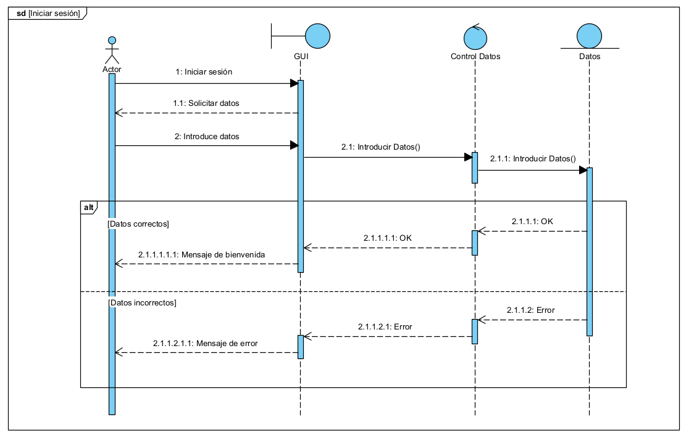

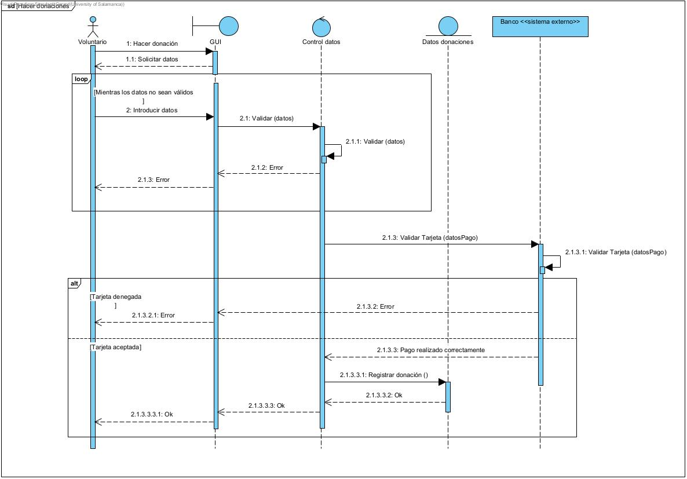

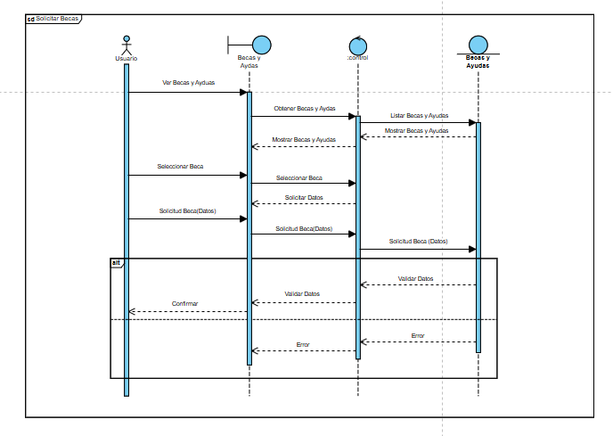

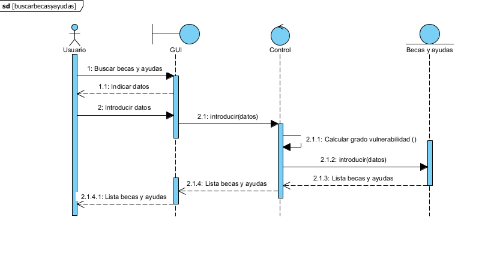

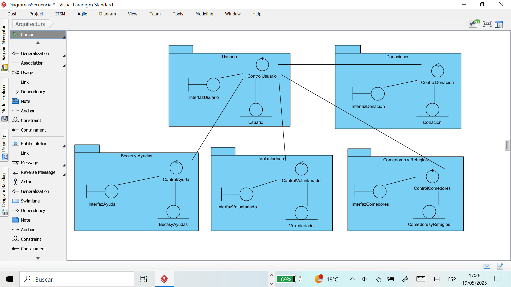

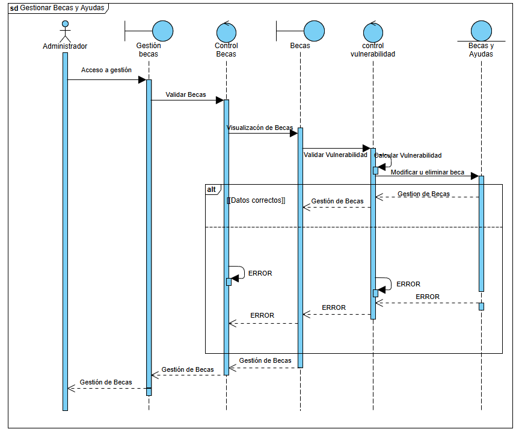

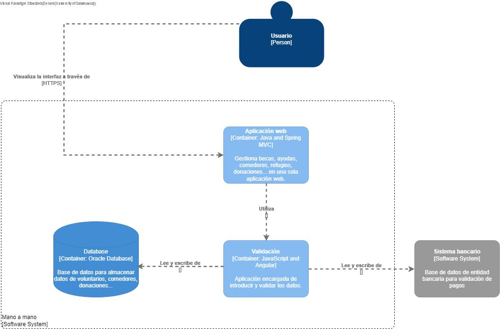

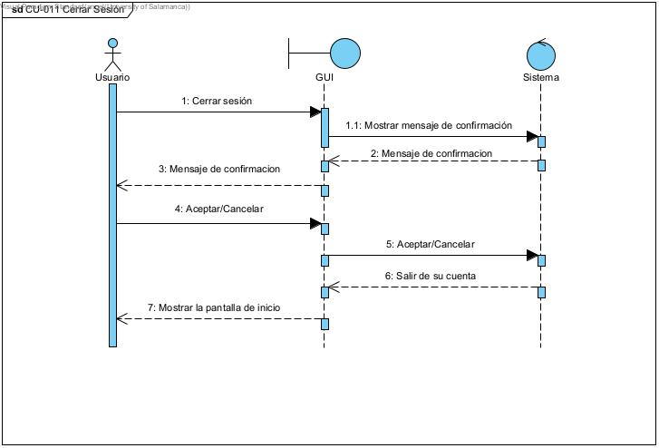

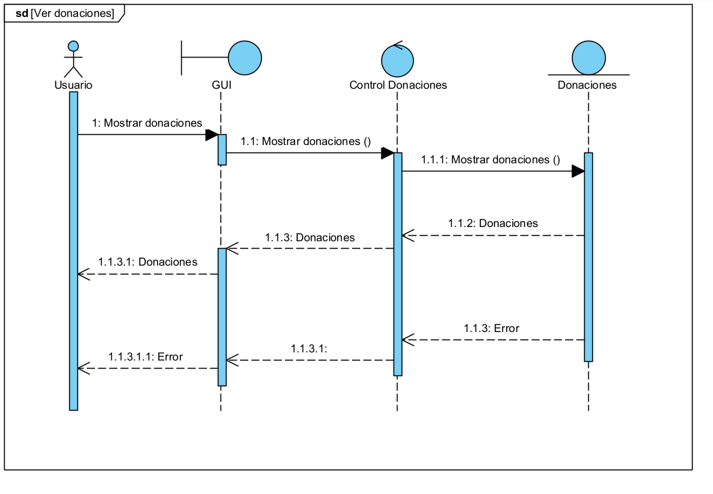

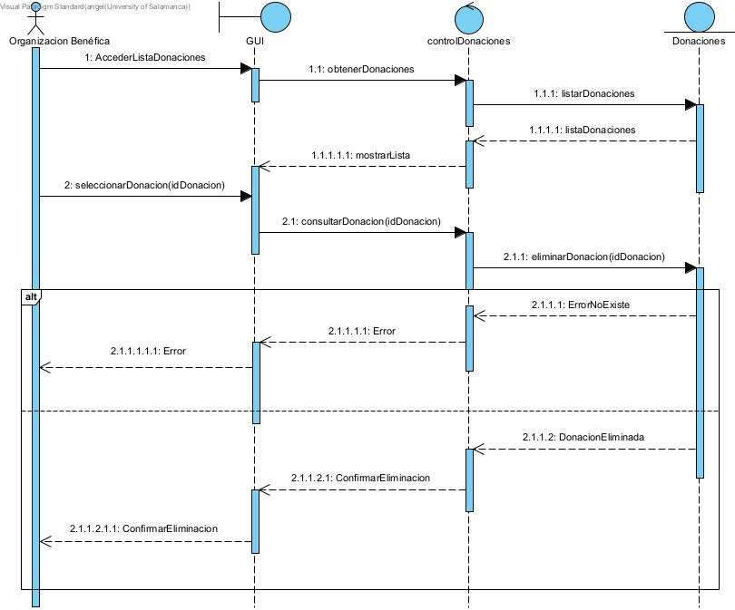

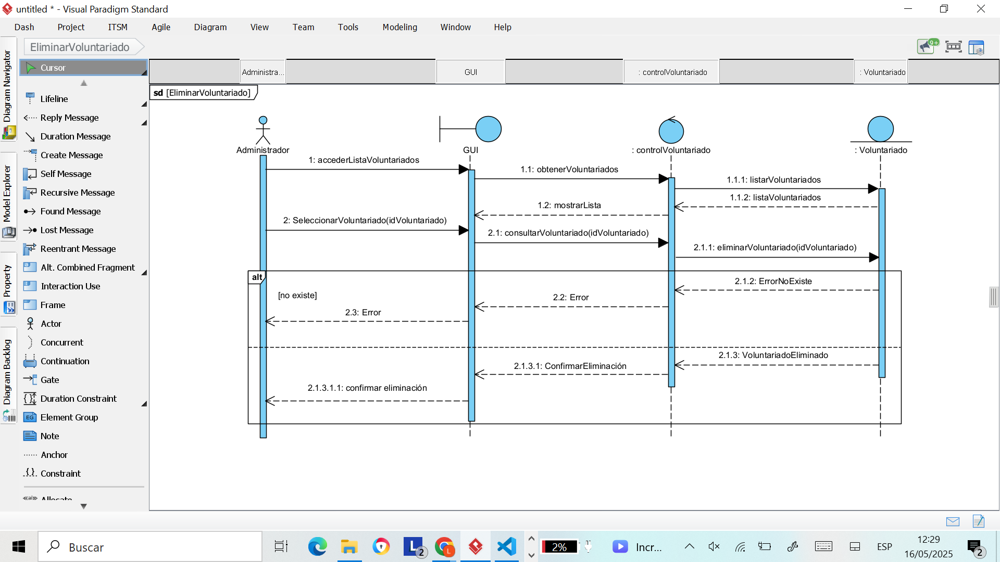

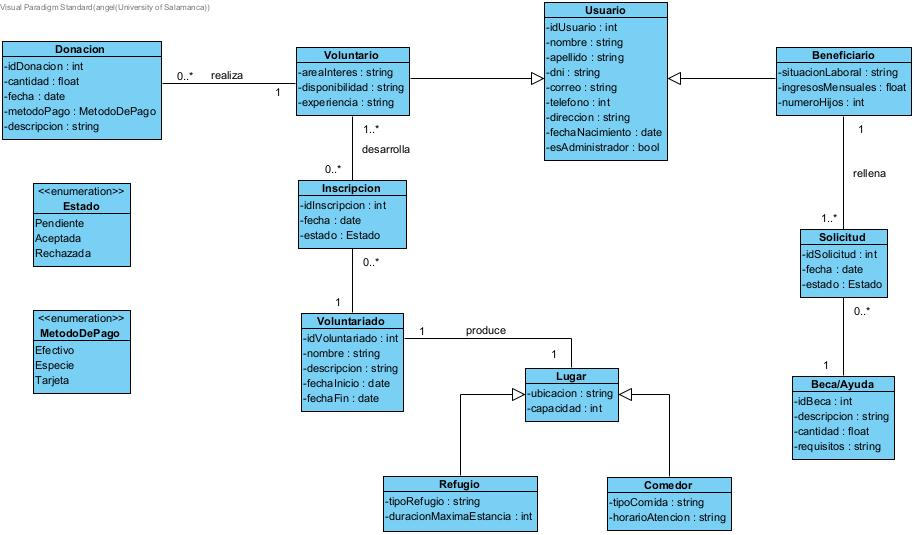

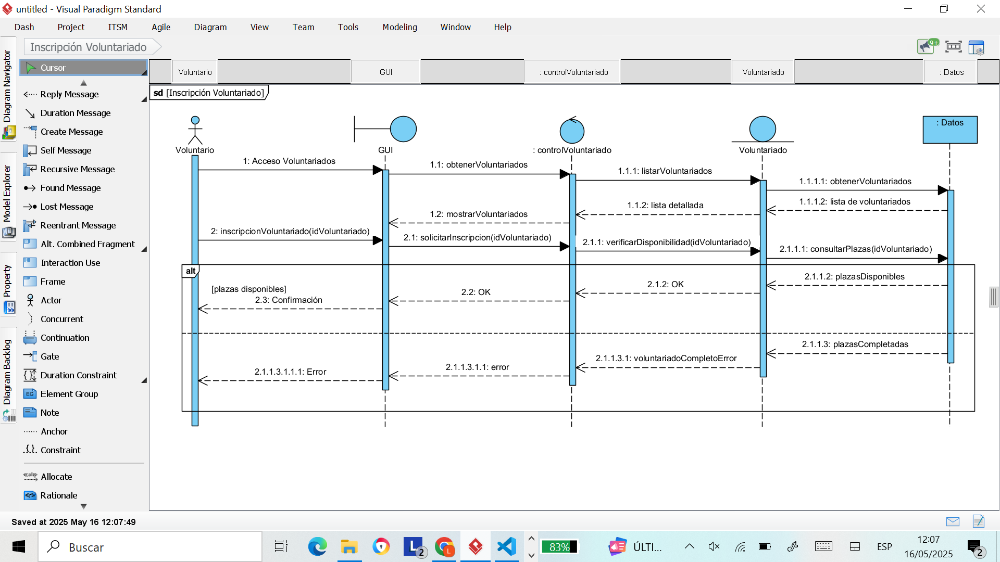

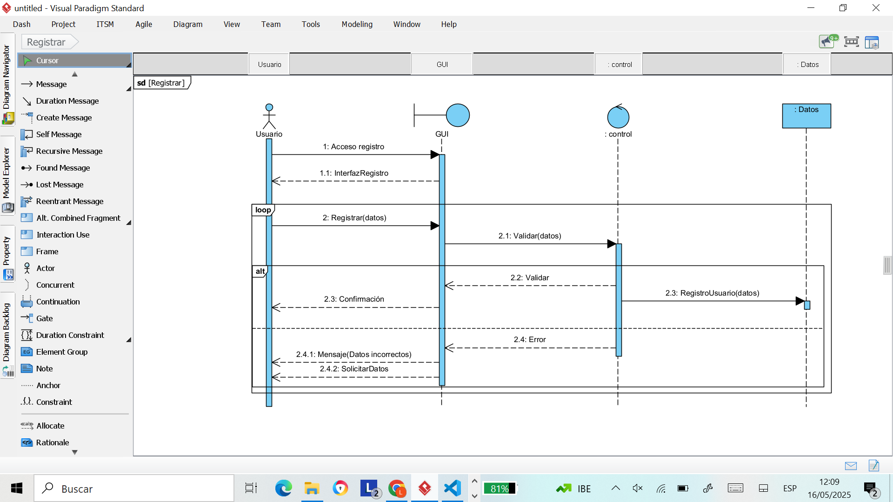

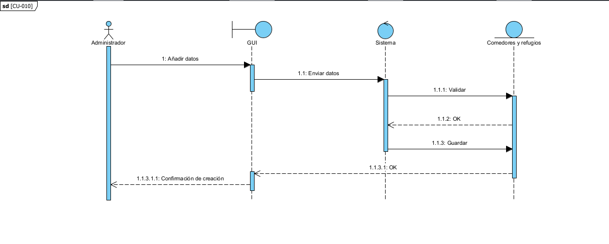

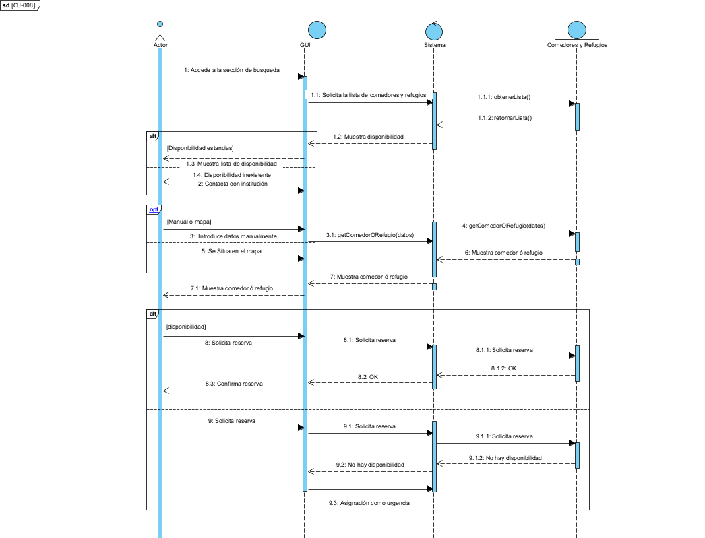

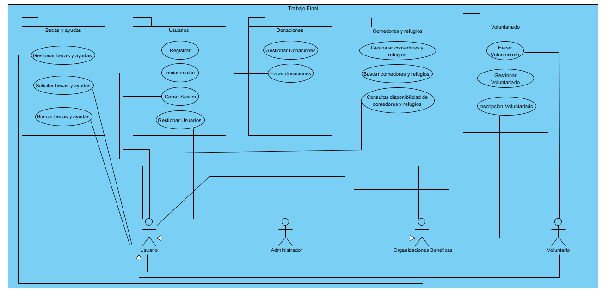
