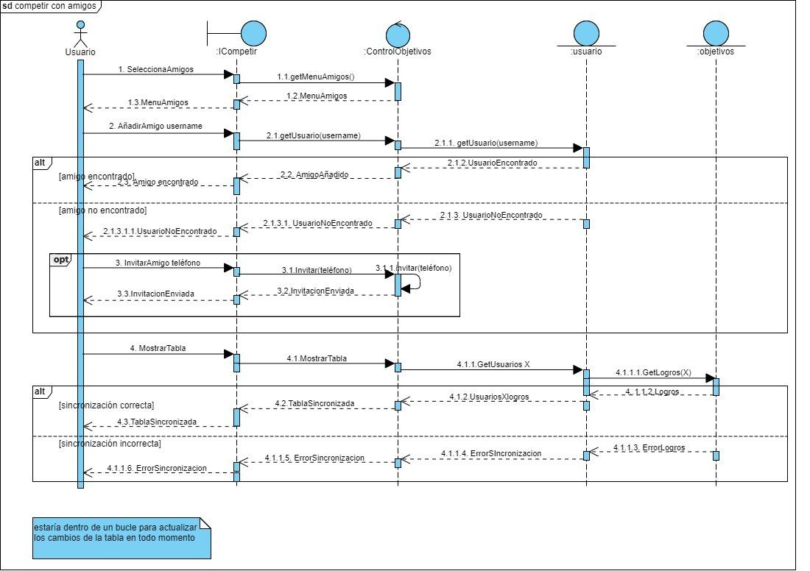
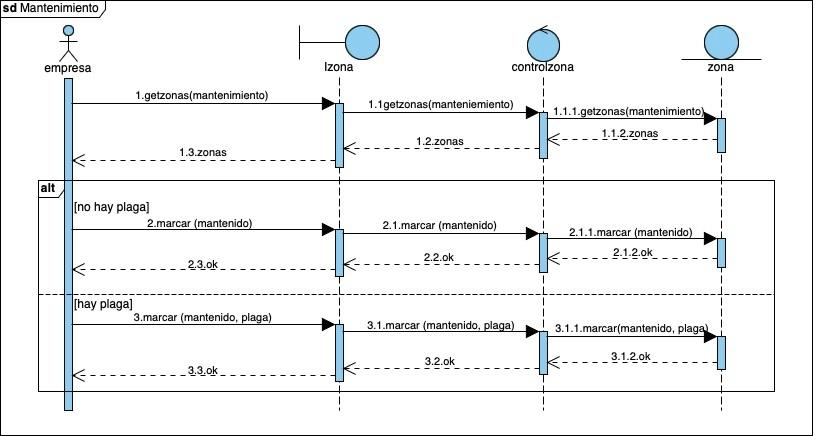
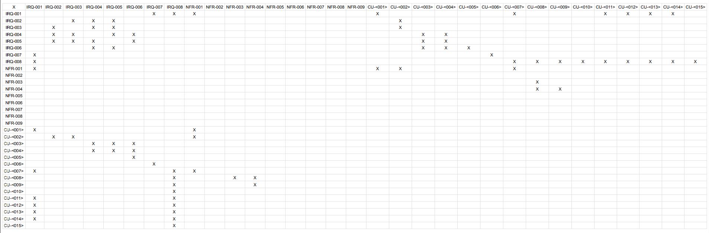
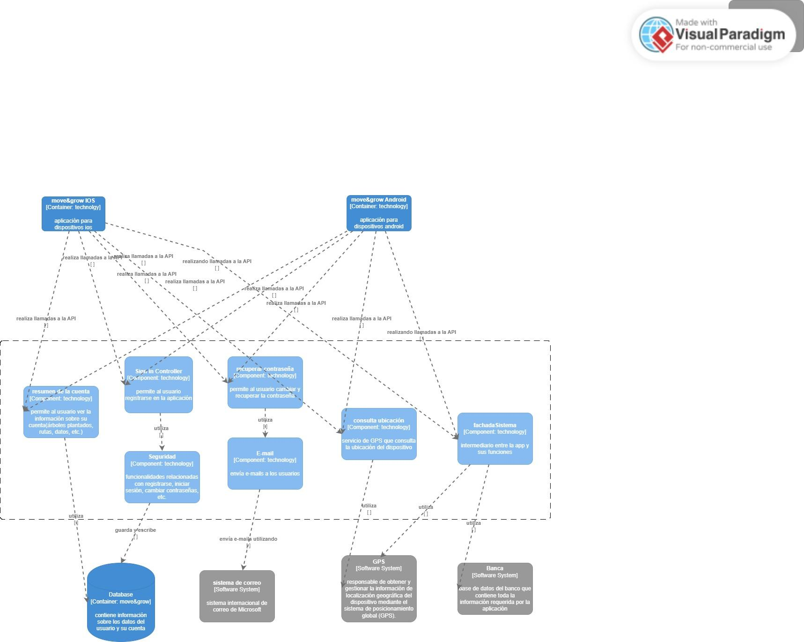
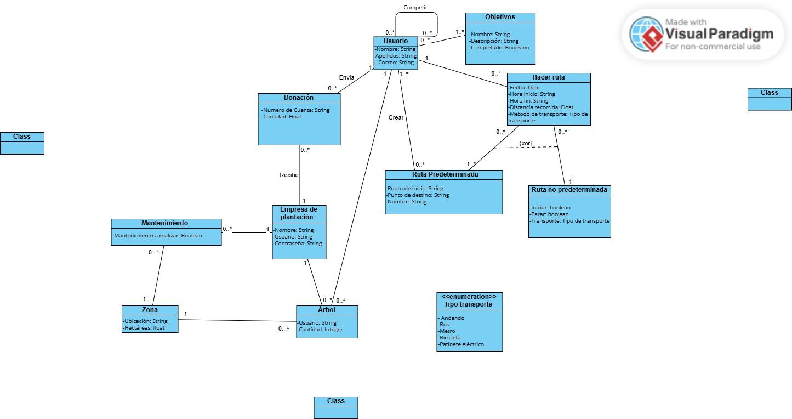
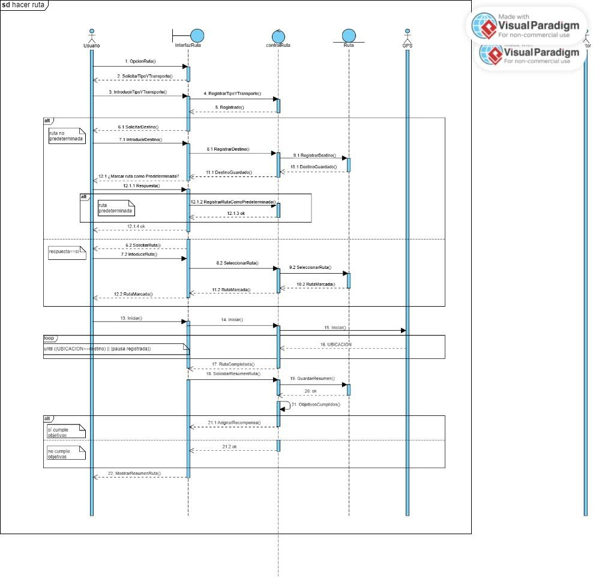
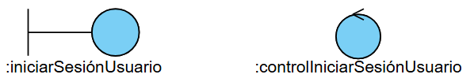
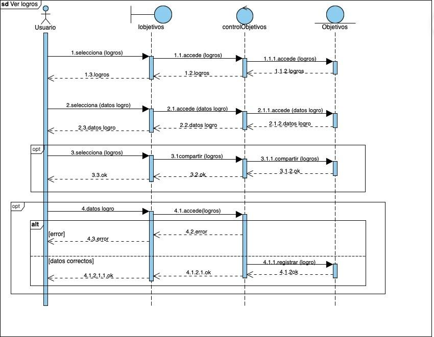

20 de mayo de 2025 - tercera versión

Ingeniería del software I

# MOVE&GROW

___

Beatriz del Barrio González

Camila Escobar Concha

Carolina Galán García

Lucía Carral Baleztena

Naroa Centurión Velasco

CAMINA, CUIDA, TRANSFORMA

Sembrando árboles gracias a tus pasos, construyendo un futuro más verde

Cada paso que das contribuye a un planeta más saludable. Los árboles son esenciales para combatir el cambio climático, absorber el dióxido de carbono y generar oxígeno.

Al caminar o usar el transporte público en lugar del coche, estás ayudando a reducir la huella de carbono y, gracias a tus pasos, estamos sembrando árboles para devolver al mundo un poco de lo que le hemos quitado.

CONTENIDOS:

## 1. Registro de Cambios

Hemos modificado la matriz de objetivos-requisitos, para que todos estén relacionados con los objetivos. Atendiendo a esta matriz los objetivos han sido añadidos correctamente a las tablas de los requisitos y los casos de uso.

Se han modificado los requisitos de acuerdo a las correcciones (han sido añadidos, eliminados y modificados), se han añadido sus tablas y se han rellenado en su mayoría. Como consecuencia, también ha habido que cambiar la matriz de requisitos con requisitos.

También hemos añadido un caso de uso más, el que ahora es el CU-004 Configurar objetivos, además de añadir las correcciones de los casos de uso indicadas en el Hito 1.

Para el Hito 3 hemos modificado los requisitos y los casos de uso. Algunos requisitos de información han sido omitidos, y se han añadido casos de uso en base a las opciones para gestionar los usuarios. Por ello, la matriz de objetivos-requisitos y la matriz de requisitos-requisitos se han corregido.

En el apartado de la memoria técnica hemos añadido información en las técnicas y herramientas.

El diagrama de clases del modelo de dominio también ha sido corregido, lo que ha implicado la creación de una tabla en el glosario de clases (la clase zona).

Se han añadido dos nuevos actores y el caso de uso gestionar usuario ha sido dividido en diferentes casos de uso.

## 2. Registro de uso de IA generativa

Durante la realización de este proyecto, hemos utilizado herramientas de inteligencia artificial generativa, como ChatGPT, de manera puntual y controlada. La hemos utilizado principalmente para reescribir algunos textos y resolver dudas puntuales que nos han ido surgiendo.

## 3. Memoria técnica

### 3.1. Introducción general del trabajo

La aplicación busca incentivar el uso de transporte sostenible (caminar, bicicleta, transporte público) de una manera divertida y competitiva. Los usuarios establecen rutas sostenibles en su vida diaria y, a medida que van logrando objetivos, se van plantando árboles en su nombre, contribuyendo así a la reforestación global y la lucha contra el cambio climático.

Esta memoria se organiza en varios apartados para facilitar su comprensión. En primer lugar, se introduce de forma general que aborda nuestra aplicación, seguida de la exposición de los objetivos funcionales identificados en la primera fase del proyecto. A continuación, se detallan las técnicas y herramientas utilizadas a lo largo del desarrollo, así como la organización interna del grupo de trabajo y la distribución de tareas. Posteriormente, se destacan los aspectos más relevantes que surgieron durante la realización de la práctica. Finalmente, se presentan las conclusiones que resumen la experiencia y los aprendizajes obtenidos durante el proyecto.

### 3.2. Objetivos

#### Rutas sostenibles:

La aplicación permitirá al usuario registrar todas sus rutas que sean beneficiosas para el medio ambiente, entre ellas el uso de transporte público (autobús, tren), caminar, utilizar bicicletas, patinete, entre otros. Permitirá registrarlas de varias maneras: rutas predeterminadas o no predeterminadas.

Rutas predeterminadas: Son aquellas que el usuario tenga ya registradas, como puede ser ir al trabajo, a la universidad o al supermercado

Rutas no predeterminadas: Son rutas espontáneas, como puede ser salir a correr, salir a dar una vuelta con amigos o pasear.

Se hace cuenta del tiempo total de estas rutas y al llegar a cierto objetivo, se planta un árbol en nombre del usuario.

#### Plantación de árboles:

A través de la donación de los usuarios a la aplicación, diversas empresas de reforestación que estén de voluntarios en el proyecto utilizaran los fondos para plantar árboles en zonas preasignadas. De esta manera se contribuye activamente al cuidado y recuperación del ecosistema.

#### Competencia amistosa:

La aplicación también fomentará la interacción entre usuarios. Estos podrán añadir amigos, y compartir con ellos sus logros y árboles que han ayudado a plantar. Este intercambio refuerza la motivación de los usuarios y su compromiso con el medio ambiente.

#### Promover actividad física:

Buscamos fomentar la actividad física incentivando a las personas a moverse más mediante el uso de la aplicación. Los usuarios serán motivados a través de recompensas relacionadas con la plantación y la interacción con amigos. De esta manera se fomenta el interés por la actividad física.

### 3.3. Técnicas y herramientas

La principal herramienta que hemos usado para este trabajo es Google Drive, esta plataforma la han sugerido los profesores para entregar el trabajo. En ella hemos creado una carpeta que luego hemos compartido con la profesora, y en ella hemos creado el documento principal, que este, y uno en sucio para poder compartir material entre nosotras más fácilmente. Como el documento principal estaba compartido entre todos los miembros, todos podíamos editarlo cuando quisiésemos, incluidos los profesores. En la corrección los profesores añadieron comentarios a ciertas partes para que nosotros pudiésemos verlos y corregir el trabajo.

Además también hemos usado mucho Telegram, una aplicación de mensajería. Creamos un chat grupal para hablar entre nosotras, al que también fue añadido un bot. Este bot ha estado registrando nuestros mensajes, y ha elaborado un informe con la participación de cada miembro que han podido leer los profesores. A través de esta aplicación nosotras hemos podido hablar y organizarnos cuando no podíamos hacerlo presencialmente. Y también hemos utilizado Trello, que era también una herramienta de comunicación. Es una especie de agenda virtual donde dejábamos constancia del trabajo realizado y a realizar para que el resto de integrantes lo viesen.

Otras herramientas usadas han sido: Studium, el campus virtual oficial de la Universidad de Salamanca, donde los profesores han colgado material de ayuda y guía; Whatsapp, otra aplicación de mensajería que también hemos usado para comunicarnos; ChatGPT, una inteligencia artificial online que hemos usado en ciertas partes específicas como recurso de información; y Google Meet, una aplicación de videollamadas que hemos usado para trabajar juntas.

Dentro del material proporcionado por los profesores, destacan el Proceso Unificado con enfoque ágil que establece los pasos principales y las herramientas necesarias para el desarrollo de un software , y el método de Durán y Bernárdez, que establece una metodología para la elicitación de requisitos. Ambos los hemos visto en clase y además disponemos de vídeos y documentos sobre ellos.

Nuestro principal método de trabajo ha sido llamarnos y repartirnos el trabajo, así si alguna tenía alguna duda o problema enseguida lo podía comunicar y pedir ayuda, ha sido muy práctico y cómodo porque hablábamos mientras trabajábamos, y también ha ayudado que este trabajo haya sido tan fácil de repartir.

### 3.4. Descripción del grupo de trabajo

Los datos de los miembros del grupo son los siguientes:

- Beatriz del Barrio González.

- Carolina Galán García.

- Camila Escobar Concha.

- Lucía Carral Baleztena.

- Naroa Centurión Velasco.

En un principio decidimos que tendríamos los siguientes roles:

- Coordinadora, Lucía.

- Controlador de Trello, Camila.

- Supervisor de tareas o analista, Carol.

- Portavoz, Naroa.

- Mediadora, Beatriz.

Finalmente, durante la realización de los dos primeros hitos no hemos dado demasiada importancia a los roles y todas hemos ido adoptando en algún momento cada rol sin darnos cuenta ni dejándolo reflejado en ningún documento.

Para el primer hito, nos organizamos repartiendo los diferentes apartados indicados en la rúbrica de evaluación, asegurándonos de que todas las secciones quedaran correctamente cubiertas. El diagrama de casos de uso fue elaborado de manera conjunta por todo el grupo.

Beatriz se encargó de la parte estética del documento, incluyendo la creación de la portada, la tabla de contenidos y la definición del estilo general. Además, junto a Carolina, desarrolló los apartados de requisitos de información y requisitos no funcionales.

Carolina, de manera individual, realizó también la matriz de rastreabilidad entre requisitos.

Por su parte, Lucía y Camila se ocuparon de describir los objetivos del proyecto y de confeccionar las tablas de casos de uso.

Naroa se encargó de la descripción de los actores y de la elaboración de la matriz de rastreabilidad entre objetivos y requisitos.

Una vez tuvimos la primera corrección cada una de las integrantes se encargó de corregir sus respectivas partes atendiendo a las anotaciones del documento.

Para la realización del segundo hito, comenzamos trabajando en conjunto en la elaboración del diagrama de clases del modelo de dominio, el cual expusimos posteriormente en clase.
Posteriormente, organizamos una reunión mediante Google Meet, en la que cada integrante se encargó de redactar una parte de la memoria técnica, además de resolver en equipo las dudas pendientes por corregir.

Para la elaboración del glosario de clases, decidimos dividirnos el trabajo: asignamos a cada integrante varias clases del diagrama para completar las respectivas tablas de manera individual.

Por otro lado, tratamos de mantener actualizado el tablero de Trello para reflejar el estado de las tareas. Sin embargo, esta herramienta no tuvo demasiado éxito, ya que al organizarnos principalmente a través de Telegram, donde resolvíamos dudas y repartíamos tareas de forma más ágil, acabamos dejando de lado el uso de Trello.

Para el tercer y último hito, usamos la misma técnica, repartir el trabajo. En una llamada nos repartimos los diagramas de secuencia, Naroa y Carolina realizaron el glosario de términos y Lucía, Camila y Beatriz se encargaron del modelo C4 y la propuesta de arquitectura.

### 3.5. Aspectos relevantes

La creación del diagrama de casos de uso ha sido una de las partes del Hito 1 que más  se nos dificultó. Definir los actores no lo fue tanto, pero identificar cada caso de uso sí, al igual que definirlo posteriormente. Además, el diseño del paso a paso de cada caso de uso en la parte de las tablas, aunque algunos no tenían gran dificultad, otros sí han sido más complejos de definir. A la hora de definir algún caso de uso, tuvimos que volver a diseñar el diagrama, lo que requería volver a invertirle tiempo a esa parte del trabajo.

A la hora de hacer la matriz de relación de objetivos con requisitos también le tuvimos que dar vueltas en conjunto, aunque algunos requisitos eran más claros con qué objetivo iban, otros en un inicio no le encontrábamos relación con ninguno.

La parte que nos resultó más difícil del segundo hito fue la del modelo de dominio. Nos costó bastante identificar las clases correctas, ya que decidir qué objetos deberían ser clases y qué relaciones debían existir entre ellas fue todo un reto, las relaciones entre clases también fueron complicadas, ya que tuvimos que definir si debían ser uno a muchos, muchos a muchos, o si había relaciones jerárquicas, lo que requirió mucho análisis y reflexión para asegurarnos de que el modelo fuera lo más preciso y eficiente posible.

### 3.6. Conclusiones

La realización de este proyecto nos ha permitido no solo aplicar los conocimientos teóricos adquiridos en clase, sino también desarrollar habilidades prácticas fundamentales para el trabajo en equipo y la gestión de proyectos. A lo largo de las distintas fases del trabajo, hemos aprendido la importancia de una buena comunicación interna, de la correcta distribución de tareas y de la flexibilidad a la hora de adaptarnos a imprevistos y dificultades.

Asimismo, hemos experimentado de primera mano el valor de combinar herramientas digitales para la colaboración, aunque también hemos aprendido que no todas las herramientas son igual de efectivas según el contexto del grupo. En nuestro caso, Telegram se consolidó como la vía principal de organización frente a otras plataformas como Trello.

Desde el punto de vista personal y grupal, este proyecto nos ha ayudado a mejorar nuestras habilidades de comunicación, organización, gestión del tiempo y resolución de conflictos, así como a reforzar nuestro compromiso con un objetivo común. Además, nos ha motivado especialmente el propósito sostenible y social de la aplicación, lo que añadió un componente de motivación y responsabilidad extra al trabajo realizado.

En conclusión, el desarrollo de este proyecto ha sido una experiencia enriquecedora tanto a nivel académico como personal, permitiéndonos consolidar conocimientos, identificar áreas de mejora y adquirir competencias esenciales para nuestro futuro profesional.

## 4. Objetivos:

### 4.1. Rutas sostenibles:

### 4.2. Plantación de árboles:

### 4.3. Competencia amistosa:

### 4.4. Promover la actividad física:

## 5. Requisitos de información (IRQ)

### 5.1.IRQ-001- Usuario

### 5.2. IRQ-002-Ruta nueva

### 5.3. IRQ- 003 Ruta predeterminada

### 5.4.IRQ-004 Objetivos

### 5.5. IRQ-005 Historial de objetivos.

### 5.6. IRQ-006 Compartir logros.

### 5.7. IRQ-007 Donación.

### 5.8. IRQ-008 Empresa.

## 6. Requisitos no funcionales (NFR)

### 6.1. NFR-001 Seguridad de los datos

### 6.2. NFR-002 Interfaz sencilla e intuitiva

### 6.3. NFR-003 Plazo de plantación

### 6.4. NFR-004 Leyes del país donde se realice la plantación

### 6.5. NFR-005 Aplicación móvil

### 6.6. NFR-006 Contestación del sistema

### 6.7. NFR-007 Actualización del código

### 6.8. NFR-008 Uso de buenas prácticas de desarrollo

### 6.9. NFR-009 Prevención de caídas

## 7 .Diagrama de casos de uso

## 8. Descripción de los actores

### 8.1. ACT-001 usuario

### 8.2. ACT-002 personal de árboles

### 8.3. ACT-003 administrador técnico

### 8.4. ACT-004 administrador de gestión

### 8.5. ACT-005 GPS

### 8.6. ACT-006 CUENTA BANCARIA

## 9. Tablas de casos de uso

Se utiliza esta tabla en vez de la tabla de Requisitos Funcionales:

### 9.1. CU-001 Iniciar sesión/registrarse

### 9.2. CU-002 Hacer ruta

### 9.3. CU 003 Ver logros/objetivos

### 9.4. CU-004 Configurar objetivos

### 9.5. CU-005 Competir con amigos

### 9.6. CU-006 Hacer donación

### 9.7. CU-007 Iniciar sesión empresa

### 9.8. CU-008 Plantar

### 9.9. CU-009 Mantenimiento de árboles

### 9.10. CU-010 Registrar árboles.

### 9.11. CU-011. Gestionar usuarios.

### 9.12. CU-012. Activar usuario.

### 9.13. CU-013. Desactivar usuario.

### 9.14. CU-014. Modificar usuarios.

### 9.15. CU-015 Gestionar pagos

## 10. Matriz de objetivos con requisitos

## 11. Matriz de requisitos con requisitos

## 12 .Diagrama de clases del modelo de dominio

## 13. Glosario de clases

## 14. Vista de interacción

A continuación se muestran los diagramas de secuencia de los diferentes casos de uso.

### 14.1. DS CU-001 Iniciar sesión/registrarse

### 14.2. DS CU-002 Hacer ruta

### 14.3. DS CU-003 Ver logros/objetivos

### 14.4. DS CU-004 Configurar objetivos

### 14.5. DS CU-005 Competir con amigos

### 14.6. DS CU-006 Hacer donación

### 14.7. DS CU-007 Iniciar sesión empresa

### 14.8. DS CU-008 Plantar

### 14.9. DS CU-009 Mantenimiento de árboles

### 14.10. DS CU-010 Registrar árboles

### 14.11. DS CU-011 Gestionar usuarios

### 14.12. DS CU-014 Activar usuario

### 14.13. DS CU-013 Desactivar Usuario

### 14.14. DS CU-014 Modificar usuario

### 14.15. DS CU-015 Gestionar pagos

## 15. Propuesta de arquitectura

## 16. Modelo C4

### Nivel de contexto

### Nivel de contenedores

### Nivel de componentes

### Nivel de código

## 17. Glosario de términos

Actores. Es un clasificador que modela un tipo de rol que juega una entidad que interacciona con el sujeto pero que es externa a él, un actor puede tener múltiples instancias físicas, una instancia física de un actor puede jugar diferentes papeles. Vendrán definidos por las plantillas del Método de Durán y Bernández, solo pueden tener asociaciones con casos de uso, subsistemas, componentes y clases, las asociaciones deben ser binarias.

Hay tres tipos de actores:

Principales: Tienen objetivos de usuario que se satisfacen mediante el uso de los servicios del sistema. Se identifican para encontrar los objetivos de usuario, los cuales dirigen los casos de uso.

De apoyo: Proporcionan un servicio al sistema, normalmente se trata de un sistema informático, pero podría ser una organización o una persona. Se identifican para clarificar las interfaces externas y los protocolos.

Pasivos: Están interesados en el comportamiento del caso de uso, pero no es principal ni de apoyo. Se identifican para asegurar que todos los intereses necesarios se han identificado y satisfecho.

Casos de uso. Conjunto de acciones realizadas por el sistema que dan lugar a un resultado observable. Especifica un comportamiento que el sujeto puede realizar en colaboración con uno o más actores, pero sin hacer referencia a su estructura interna. Puede contener posibles variaciones de su comportamiento básico incluyendo manejo de errores y excepciones. Vendrán definidos por las plantillas del Método de Durán y Bernández.

Clases. Clasificador que describe un conjunto de objetos que comparten la misma especificación de características, restricciones y semántica. Describe las propiedades y comportamiento de un grupo de objetos.

Diagrama de clases. Representación gráfica que muestra la relación entre los actores y los casos de uso o funcionalidades del sistema.

Diagrama de secuencia. Unidad de comportamiento que se centra en el intercambio de información observable entre elementos que pueden conectarse. Hacen hincapié en la secuencia de intercambio de mensajes entre objetos.

Tiene dos usos diferentes:

Forma de instancia, describe un escenario específico, una posible interacción.

Forma genérica, describe todas las posibles alternativas en un escenario. Puede incluir ramas, condiciones y bucles.

Memoria técnica. Introducción al trabajo, indica los aspectos técnicos principales y los explica.

Matriz de rastreabilidad obj-req. Matriz que relaciona los requisitos y los casos de uso con los objetivos. Si un requisito o caso de uso está relacionado con un objetivo (si viene definido en la tabla) se anota una cruz (o un 1, dependiendo de la notación).

Matriz de rastreabilidad req-req. Matriz que relaciona los requisitos entre ellos y los casos de uso. Si un requisito está relacionado con otro requisito o con un caso de uso (si viene definido en la tabla) se anota una cruz (o un 1, dependiendo de la notación).

Modelo C4.  Surge como solución para aliviar la brecha entre modelo y código, permite comunicar la arquitectura de un sistema en función del detalle que se quiera proporcionar. Está basado en cuatro niveles que describen el sistema con distintos grados de granularidad:

El nivel de contexto.

El nivel de contenedores.

El nivel de componentes.

El nivel de código.

Modelo de dominio. Representación de las clases conceptuales del mundo real, no de componentes software. No se trata de un conjunto de diagramas que describen clases software, u objetos software con responsabilidades.

Objetivos. La aplicación será creada y desarrollada para cumplir unos objetivos, pueden ser económicos, sociales, medioambientales, u otros. Vendrán definidos por las plantillas del Método de Durán y Bernández.

Propuesta arquitectónica. Define la estructura y organización de un sistema de software, incluyendo los componentes, sus interacciones y cómo se adaptan a los requisitos funcionales y no funcionales del sistema.

Requisitos de información. Condición o capacidad que un usuario necesita para resolver un problema o lograr un objetivo. Vendrán definidos por las plantillas del Método de Durán y Bernández.

Requisitos no funcionales. Condición o capacidad que debe tener un sistema o un componente de un sistema para satisfacer un contrato, una norma, una especificación u otro documento formal. Vendrán definidos por las plantillas del Método de Durán y Bernández.

### Tabla 1

| OBJ-<001> | Rutas sostenibles |

| --- | --- |

| Versión | 1.0  |

| Autores | Lucía Carral Baleztena
Camila Escobar Concha
Beatriz del Barrio González
Naroa Centurión Velasco
Carolina Galán García |

| Fuentes |  |

| Descripción | La aplicación permitirá al usuario registrar todas sus rutas que sean beneficiosas para el medio ambiente, entre ellas el uso de transporte público (autobús, tren), caminar, utilizar bicicletas, patinete, entre otros. Permitirá registrarlas de varias maneras: rutas predeterminadas o no predeterminadas. 
Rutas predeterminadas: Son aquellas que el usuario tenga ya registradas, como puede ser ir al trabajo, a la universidad o al supermercado
Rutas no predeterminadas: Son rutas espontáneas, como puede ser salir a correr, salir a dar una vuelta con amigos o pasear.
Se hace cuenta del tiempo total de estas rutas y al llegar a cierto objetivo, se planta un árbol en nombre del usuario.  |

| Importancia | Alta |

| Estado | Implementado |

### Tabla 2

| OBJ-<002> | Plantación de árboles |

| --- | --- |

| Versión |  1.0  |

| Autores | Lucía Carral Baleztena
Camila Escobar Concha
Beatriz del Barrio González
Naroa Centurión Velasco
Carolina Galán García |

| Fuentes |  |

| Descripción | A través de la donación de los usuarios a la aplicación, diversas empresas de reforestación que estén de voluntarios en el proyecto utilizaran los fondos para plantar árboles en zonas preasignadas. De esta manera se contribuye activamente al cuidado y recuperación del ecosistema.
 |

| Importancia | Alta |

| Estado | Implementado |

### Tabla 3

| OBJ-<003> | Competencia amistosa |

| --- | --- |

| Versión |  1.0  |

| Autores | Lucía Carral Baleztena
Camila Escobar Concha
Beatriz del Barrio González
Naroa Centurión Velasco
Carolina Galán García |

| Fuentes |  |

| Descripción | La aplicación también fomentará la interacción entre usuarios. Estos podrán añadir amigos, y compartir con ellos sus logros y árboles que han ayudado a plantar. Este intercambio refuerza la motivación de los usuarios y su compromiso con el medio ambiente. |

| Importancia | Alta |

| Estado | Implementado |

### Tabla 4

| OBJ-<004> | Promover la actividad física |

| --- | --- |

| Versión |  1.0  |

| Autores | Lucía Carral Baleztena
Camila Escobar Concha
Beatriz del Barrio González
Naroa Centurión Velasco
Carolina Galán García |

| Fuentes |  |

| Descripción | Buscamos fomentar la actividad física incentivando a las personas a moverse más mediante el uso de la aplicación. Los usuarios serán motivados a través de recompensas relacionadas con la plantación y la interacción con amigos. De esta manera se fomenta el interés por la actividad física. |

| Importancia | Alta |

| Estado | Implementado |

### Tabla 5

| IRQ-001 | Usuario | Usuario |

| --- | --- | --- |

| Versión | 2.0 (13 de mayo) | 2.0 (13 de mayo) |

| Autores | Camila Escobar Concha
Lucía Carral Baleztena
Beatriz del Barrio González
Carolina Galán García
Naroa Centurión Velasco
 (Universidad de Salamanca) | Camila Escobar Concha
Lucía Carral Baleztena
Beatriz del Barrio González
Carolina Galán García
Naroa Centurión Velasco
 (Universidad de Salamanca) |

| Fuentes |  |  |

| Objetivos asociados | ·        OBJ - 001 Rutas sostenibles.
·        OBJ - 002 Plantación de árboles.
·        OBJ - 003 Competición amistosa.
·        OBJ - 004 Promover la actividad física. | ·        OBJ - 001 Rutas sostenibles.
·        OBJ - 002 Plantación de árboles.
·        OBJ - 003 Competición amistosa.
·        OBJ - 004 Promover la actividad física. |

| Requisitos asociados | IRQ- 007 Compartir logros. | IRQ- 007 Compartir logros. |

| Descripción | El sistema deberá permitir al usuario:
 Registrarse, si no tiene una cuenta: deberá almacenar la información correspondiente al registro del usuario. En concreto: los datos personales del usuario.
Iniciar sesión, si ya tiene una cuenta registrada: para ello requerirá ciertos datos. En concreto: el nombre de usuario y la contraseña. 
Tener amistades, para lo que tendrá un buscador para poder encontrar a sus amigos y establecer amistades entre los usuarios. Deberá almacenar el nombre de usuario de estos. | El sistema deberá permitir al usuario:
 Registrarse, si no tiene una cuenta: deberá almacenar la información correspondiente al registro del usuario. En concreto: los datos personales del usuario.
Iniciar sesión, si ya tiene una cuenta registrada: para ello requerirá ciertos datos. En concreto: el nombre de usuario y la contraseña. 
Tener amistades, para lo que tendrá un buscador para poder encontrar a sus amigos y establecer amistades entre los usuarios. Deberá almacenar el nombre de usuario de estos. |

| Datos  | Nombre.
Apellidos. 
Edad.
Correo electrónico/número de teléfono
Contraseña.
Nombre de usuario 
Contraseña
Nombre de usuario de las amistades | Nombre.
Apellidos. 
Edad.
Correo electrónico/número de teléfono
Contraseña.
Nombre de usuario 
Contraseña
Nombre de usuario de las amistades |

| Tiempo de vida | Medio | Máximo |

| Tiempo de vida | <tiempo medio de vida> | <tiempo máximo de vida> |

| Ocurrencias simult. | Medio | Máximo |

| Ocurrencias simult. | <nº medio de ocurr. simult.> | <nº máximo de ocurr. simult.> |

| Importancia | <importancia del requisito> | <importancia del requisito> |

| Urgencia | <urgencia del requisito> | <urgencia del requisito> |

| Estado | <estado del requisito> | <estado del requisito> |

| Estabilidad | <estabilidad del requisito> | <estabilidad del requisito> |

| Comentarios | La información se comprueba y si algo no es correcto se vuelve a pedir.
Si todo sale bien se accede a la página de inicio | La información se comprueba y si algo no es correcto se vuelve a pedir.
Si todo sale bien se accede a la página de inicio |

### Tabla 6

| IRQ-002 | Ruta nueva | Ruta nueva |

| --- | --- | --- |

| Versión | 1.0 (9 de abril) | 1.0 (9 de abril) |

| Autores | Camila Escobar Concha
Lucía Carral Baleztena
Beatriz del Barrio González
Carolina Galán García
Naroa Centurión Velasco
 (Universidad de Salamanca) | Camila Escobar Concha
Lucía Carral Baleztena
Beatriz del Barrio González
Carolina Galán García
Naroa Centurión Velasco
 (Universidad de Salamanca) |

| Fuentes |  |  |

| Objetivos asociados | OBJ- 001 Rutas sostenibles. | OBJ- 001 Rutas sostenibles. |

| Requisitos asociados | 
 | 
 |

| Descripción | El sistema deberá permitir al usuario inicializar y finalizar nuevas rutas, para ello requerirá cierta información sobre ella. | El sistema deberá permitir al usuario inicializar y finalizar nuevas rutas, para ello requerirá cierta información sobre ella. |

| Datos  | Ubicación de origen y destino.
Tipo de ruta.
Método de transporte ( caminar, bicicleta, patinete, autobús y metro). | Ubicación de origen y destino.
Tipo de ruta.
Método de transporte ( caminar, bicicleta, patinete, autobús y metro). |

| Tiempo de vida | Medio | Máximo |

| Tiempo de vida | <tiempo medio de vida> | <tiempo máximo de vida> |

| Ocurrencias simult. | Medio | Máximo |

| Ocurrencias simult. | <nº medio de ocurr. simult.> | <nº máximo de ocurr. simult.> |

| Importancia | <importancia del requisito> | <importancia del requisito> |

| Urgencia | <urgencia del requisito> | <urgencia del requisito> |

| Estado | <estado del requisito> | <estado del requisito> |

| Estabilidad | <estabilidad del requisito> | <estabilidad del requisito> |

| Comentarios |  La información sobre cada ruta que hace el usuario debe quedar guardada en un historial asociado a la cuenta.
 Si al finalizar la ruta se ha alcanzado algún objetivo, se actualiza la información de objetivos asociada. |  La información sobre cada ruta que hace el usuario debe quedar guardada en un historial asociado a la cuenta.
 Si al finalizar la ruta se ha alcanzado algún objetivo, se actualiza la información de objetivos asociada. |

### Tabla 7

| IRQ-003 | Ruta predeterminada  | Ruta predeterminada  |

| --- | --- | --- |

| Versión | 1.0 (9 de abril) | 1.0 (9 de abril) |

| Autores | Camila Escobar Concha
Lucía Carral Baleztena
Beatriz del Barrio González
Carolina Galán García
Naroa Centurión Velasco
 (Universidad de Salamanca) | Camila Escobar Concha
Lucía Carral Baleztena
Beatriz del Barrio González
Carolina Galán García
Naroa Centurión Velasco
 (Universidad de Salamanca) |

| Fuentes |  |  |

| Objetivos asociados | OBJ- 001 Rutas sostenibles. | OBJ- 001 Rutas sostenibles. |

| Requisitos asociados | 
IRQ- 002 Ruta nueva. | 
IRQ- 002 Ruta nueva. |

| Descripción | El sistema deberá permitir al usuario establecer una ruta predeterminada, para ello guardará los datos obtenidos al crear una ruta y los guardará como una ruta predeterminada bajo un nombre. | El sistema deberá permitir al usuario establecer una ruta predeterminada, para ello guardará los datos obtenidos al crear una ruta y los guardará como una ruta predeterminada bajo un nombre. |

| Datos  | Nombre de la ruta.
Ubicación de origen y destino.
Tipo de ruta.
Método de transporte ( caminar, bicicleta, patinete, autobús y metro). | Nombre de la ruta.
Ubicación de origen y destino.
Tipo de ruta.
Método de transporte ( caminar, bicicleta, patinete, autobús y metro). |

| Tiempo de vida | Medio | Máximo |

| Tiempo de vida | <tiempo medio de vida> | <tiempo máximo de vida> |

| Ocurrencias simult. | Medio | Máximo |

| Ocurrencias simult. | <nº medio de ocurr. simult.> | <nº máximo de ocurr. simult.> |

| Importancia | <importancia del requisito> | <importancia del requisito> |

| Urgencia | <urgencia del requisito> | <urgencia del requisito> |

| Estado | <estado del requisito> | <estado del requisito> |

| Estabilidad | <estabilidad del requisito> | <estabilidad del requisito> |

| Comentarios |  La información sobre cada ruta que hace el usuario debe quedar guardada en un historial asociado a la cuenta.
 Si al finalizar la ruta se ha alcanzado algún objetivo, se actualiza la información de objetivos asociada. |  La información sobre cada ruta que hace el usuario debe quedar guardada en un historial asociado a la cuenta.
 Si al finalizar la ruta se ha alcanzado algún objetivo, se actualiza la información de objetivos asociada. |

### Tabla 8

| IRQ-004 | Objetivos  | Objetivos  |

| --- | --- | --- |

| Versión | 1.0 (9 de abril) | 1.0 (9 de abril) |

| Autores | Camila Escobar Concha
Lucía Carral Baleztena
Beatriz del Barrio González
Carolina Galán García
Naroa Centurión Velasco
 (Universidad de Salamanca) | Camila Escobar Concha
Lucía Carral Baleztena
Beatriz del Barrio González
Carolina Galán García
Naroa Centurión Velasco
 (Universidad de Salamanca) |

| Fuentes |  |  |

| Objetivos asociados | OBJ- 003  Competición amistosa.
OBJ- 004  Promover la actividad física. | OBJ- 003  Competición amistosa.
OBJ- 004  Promover la actividad física. |

| Requisitos asociados | 
IRQ- 002 Ruta nueva.
IRQ- 003 Ruta predeterminada.
 | 
IRQ- 002 Ruta nueva.
IRQ- 003 Ruta predeterminada.
 |

| Descripción | El sistema deberá permitir al usuario crear objetivos y ver los detalles de los objetivos establecidos por el sistema, este guardará los siguientes datos respecto a los objetivos: | El sistema deberá permitir al usuario crear objetivos y ver los detalles de los objetivos establecidos por el sistema, este guardará los siguientes datos respecto a los objetivos: |

| Datos  | Nombre del objetivo.
Descripción del objetivo.
Estado del objetivo (booleano). | Nombre del objetivo.
Descripción del objetivo.
Estado del objetivo (booleano). |

| Tiempo de vida | Medio | Máximo |

| Tiempo de vida | <tiempo medio de vida> | <tiempo máximo de vida> |

| Ocurrencias simult. | Medio | Máximo |

| Ocurrencias simult. | <nº medio de ocurr. simult.> | <nº máximo de ocurr. simult.> |

| Importancia | <importancia del requisito> | <importancia del requisito> |

| Urgencia | <urgencia del requisito> | <urgencia del requisito> |

| Estado | <estado del requisito> | <estado del requisito> |

| Estabilidad | <estabilidad del requisito> | <estabilidad del requisito> |

| Comentarios | Una vez un objetivo se marca completado (estado), este se convierte en un logro (objetivo cumplido). | Una vez un objetivo se marca completado (estado), este se convierte en un logro (objetivo cumplido). |

### Tabla 9

| IRQ-005 | Historial de objetivos  | Historial de objetivos  |

| --- | --- | --- |

| Versión | 1.0 (9 de abril) | 1.0 (9 de abril) |

| Autores | Camila Escobar Concha
Lucía Carral Baleztena
Beatriz del Barrio González
Carolina Galán García
Naroa Centurión Velasco
 (Universidad de Salamanca) | Camila Escobar Concha
Lucía Carral Baleztena
Beatriz del Barrio González
Carolina Galán García
Naroa Centurión Velasco
 (Universidad de Salamanca) |

| Fuentes |  |  |

| Objetivos asociados | OBJ- 004  Promover la actividad física. | OBJ- 004  Promover la actividad física. |

| Requisitos asociados | IRQ- 002 Ruta nueva.
IRQ- 003 Ruta predeterminada.
IRQ- 004 Objetivos  | IRQ- 002 Ruta nueva.
IRQ- 003 Ruta predeterminada.
IRQ- 004 Objetivos  |

| Descripción | El sistema deberá mostrar la información correspondiente a los objetivos y los logros, ya sean creados por el usuario o establecidos por el sistema. En concreto: | El sistema deberá mostrar la información correspondiente a los objetivos y los logros, ya sean creados por el usuario o establecidos por el sistema. En concreto: |

| Datos  | Nombre del objetivo
Descripción del objetivo.
Estado del objetivo. | Nombre del objetivo
Descripción del objetivo.
Estado del objetivo. |

| Tiempo de vida | Medio | Máximo |

| Tiempo de vida | <tiempo medio de vida> | <tiempo máximo de vida> |

| Ocurrencias simult. | Medio | Máximo |

| Ocurrencias simult. | <nº medio de ocurr. simult.> | <nº máximo de ocurr. simult.> |

| Importancia | <importancia del requisito> | <importancia del requisito> |

| Urgencia | <urgencia del requisito> | <urgencia del requisito> |

| Estado | <estado del requisito> | <estado del requisito> |

| Estabilidad | <estabilidad del requisito> | <estabilidad del requisito> |

| Comentarios | En cuanto al estado de un objetivo, al marcarse como completado (estado), este se convierte en un logro (objetivo cumplido). | En cuanto al estado de un objetivo, al marcarse como completado (estado), este se convierte en un logro (objetivo cumplido). |

### Tabla 10

| IRQ-006 | Compartir logros | Compartir logros |

| --- | --- | --- |

| Versión | 1.0 (9 de abril) | 1.0 (9 de abril) |

| Autores | Camila Escobar Concha
Lucía Carral Baleztena
Beatriz del Barrio González
Carolina Galán García
Naroa Centurión Velasco
 (Universidad de Salamanca) | Camila Escobar Concha
Lucía Carral Baleztena
Beatriz del Barrio González
Carolina Galán García
Naroa Centurión Velasco
 (Universidad de Salamanca) |

| Fuentes |  |  |

| Objetivos asociados |             ·        OBJ - 003 Competición amistosa.
·        OBJ - 004 Promover la actividad física. |             ·        OBJ - 003 Competición amistosa.
·        OBJ - 004 Promover la actividad física. |

| Requisitos asociados | IRQ- 004 Objetivos 
IRQ- 005 Historial de objetivos. | IRQ- 004 Objetivos 
IRQ- 005 Historial de objetivos. |

| Descripción | El sistema deberá permitir al usuario compartir con sus amigos los logros alcanzados. | El sistema deberá permitir al usuario compartir con sus amigos los logros alcanzados. |

| Datos  | Nombre del logro.
Descripción del logro. | Nombre del logro.
Descripción del logro. |

| Tiempo de vida | Medio | Máximo |

| Tiempo de vida | <tiempo medio de vida> | <tiempo máximo de vida> |

| Ocurrencias simult. | Medio | Máximo |

| Ocurrencias simult. | <nº medio de ocurr. simult.> | <nº máximo de ocurr. simult.> |

| Importancia | <importancia del requisito> | <importancia del requisito> |

| Urgencia | <urgencia del requisito> | <urgencia del requisito> |

| Estado | <estado del requisito> | <estado del requisito> |

| Estabilidad | <estabilidad del requisito> | <estabilidad del requisito> |

| Comentarios | Los logros solo podrán compartirse si existe una relación de amistad entre los usuarios. | Los logros solo podrán compartirse si existe una relación de amistad entre los usuarios. |

### Tabla 11

| IRQ-007 | Donación | Donación |

| --- | --- | --- |

| Versión | 1.0 (9 de abril) | 1.0 (9 de abril) |

| Autores | Camila Escobar Concha
Lucía Carral Baleztena
Beatriz del Barrio González
Carolina Galán García
Naroa Centurión Velasco
 (Universidad de Salamanca) | Camila Escobar Concha
Lucía Carral Baleztena
Beatriz del Barrio González
Carolina Galán García
Naroa Centurión Velasco
 (Universidad de Salamanca) |

| Fuentes |  |  |

| Objetivos asociados | OBJ- 002  Plantación de árboles. | OBJ- 002  Plantación de árboles. |

| Requisitos asociados |  |  |

| Descripción | Los usuarios podrán realizar donaciones para contribuir con la aplicación y favorecer la plantación de árboles. | Los usuarios podrán realizar donaciones para contribuir con la aplicación y favorecer la plantación de árboles. |

| Datos  | Cantidad a abonar.
Método de pago.
Datos necesarios para el pago. | Cantidad a abonar.
Método de pago.
Datos necesarios para el pago. |

| Tiempo de vida | Medio | Máximo |

| Tiempo de vida | <tiempo medio de vida> | <tiempo máximo de vida> |

| Ocurrencias simult. | Medio | Máximo |

| Ocurrencias simult. | <nº medio de ocurr. simult.> | <nº máximo de ocurr. simult.> |

| Importancia | <importancia del requisito> | <importancia del requisito> |

| Urgencia | <urgencia del requisito> | <urgencia del requisito> |

| Estado | <estado del requisito> | <estado del requisito> |

| Estabilidad | <estabilidad del requisito> | <estabilidad del requisito> |

| Comentarios |  |  |

### Tabla 12

| IRQ-008 | Empresa | Empresa |

| --- | --- | --- |

| Versión | 2.0 (14 de mayo) | 2.0 (14 de mayo) |

| Autores | Camila Escobar Concha
Lucía Carral Baleztena
Beatriz del Barrio González
Carolina Galán García
Naroa Centurión Velasco
 (Universidad de Salamanca) | Camila Escobar Concha
Lucía Carral Baleztena
Beatriz del Barrio González
Carolina Galán García
Naroa Centurión Velasco
 (Universidad de Salamanca) |

| Fuentes |  |  |

| Objetivos asociados | OBJ- 002  Plantación de árboles. | OBJ- 002  Plantación de árboles. |

| Requisitos asociados | IRQ-001 Usuario. | IRQ-001 Usuario. |

| Descripción | Los usuarios trabajadores del sistema de plantación o de la aplicación podrán registrarse e iniciar sesión con un rol distinto. Para ello el sistema deberá almacenar los datos personales necesarios para ello.
La empresa que haya iniciado sesión en el sistema podrá recibir las peticiones de plantación de los usuarios y registrar su proceso. El sistema almacenará esta información. | Los usuarios trabajadores del sistema de plantación o de la aplicación podrán registrarse e iniciar sesión con un rol distinto. Para ello el sistema deberá almacenar los datos personales necesarios para ello.
La empresa que haya iniciado sesión en el sistema podrá recibir las peticiones de plantación de los usuarios y registrar su proceso. El sistema almacenará esta información. |

| Datos  | Nombre.
Apellidos. 
Edad.
Correo electrónico/número de teléfono.
Contraseña.
Nombre del usuario solicitante.
Información de registro del árbol. | Nombre.
Apellidos. 
Edad.
Correo electrónico/número de teléfono.
Contraseña.
Nombre del usuario solicitante.
Información de registro del árbol. |

| Tiempo de vida | Medio | Máximo |

| Tiempo de vida | <tiempo medio de vida> | <tiempo máximo de vida> |

| Ocurrencias simult. | Medio | Máximo |

| Ocurrencias simult. | <nº medio de ocurr. simult.> | <nº máximo de ocurr. simult.> |

| Importancia | <importancia del requisito> | <importancia del requisito> |

| Urgencia | <urgencia del requisito> | <urgencia del requisito> |

| Estado | <estado del requisito> | <estado del requisito> |

| Estabilidad | <estabilidad del requisito> | <estabilidad del requisito> |

| Comentarios |  |  |

### Tabla 13

| NFR-001 | Seguridad de los datos |

| --- | --- |

| Versión | 1.0 (9 de abril) |

| Autores | Camila Escobar Concha
Lucía Carral Baleztena
Beatriz del Barrio González
Carolina Galán García
Naroa Centurión Velasco
 (Universidad de Salamanca) |

| Fuentes | ·         <fuente de la versión actual> (<organización de la fuente>)
... |

| Objetivos asociados | ·        OBJ - 001 Rutas sostenibles.
·        OBJ - 002 Plantación de árboles.
·        OBJ - 003 Competición amistosa. |

| Requisitos asociados | ·        IRQ-001 Usuario |

| Descripción | El sistema deberá asegurar que la información que se pide al iniciar sesión está totalmente encriptada y sigue patrones de alta seguridad, y que la autenticación es segura para los usuarios registrados. |

| Importancia | <importancia del requisito> |

| Urgencia | <urgencia del requisito> |

| Estado | <estado del requisito> |

| Estabilidad | <estabilidad del requisito> |

| Comentarios | <comentarios adicionales sobre el requisito> |

### Tabla 14

| NFR-002 | Interfaz sencilla e intuitiva |

| --- | --- |

| Versión | 1.0 (9 de abril) |

| Autores | Camila Escobar Concha
Lucía Carral Baleztena
Beatriz del Barrio González
Carolina Galán García
Naroa Centurión Velasco
 (Universidad de Salamanca) |

| Fuentes | ·         <fuente de la versión actual> (<organización de la fuente>)
... |

| Objetivos asociados | ·        OBJ - 001 Rutas sostenibles.
·        OBJ - 003 Competición amistosa. |

| Requisitos asociados |  |

| Descripción | El sistema deberá mostrar una interfaz sencilla e intuitiva durante cualquier tipo de uso de la aplicación, con gráficos con la suficiente calidad. |

| Importancia | <importancia del requisito> |

| Urgencia | <urgencia del requisito> |

| Estado | <estado del requisito> |

| Estabilidad | <estabilidad del requisito> |

| Comentarios | <comentarios adicionales sobre el requisito> |

### Tabla 15

| NFR-003 | Plazo de plantación |

| --- | --- |

| Versión | 1.0 (9 de abril) |

| Autores | Camila Escobar Concha
Lucía Carral Baleztena
Beatriz del Barrio González
Carolina Galán García
Naroa Centurión Velasco
 (Universidad de Salamanca) |

| Fuentes | ·         <fuente de la versión actual> (<organización de la fuente>)
... |

| Objetivos asociados | OBJ- 002 Plantación de árboles. |

| Requisitos asociados |  |

| Descripción | Cuando un usuario consigue plantar un árbol, la plantación real del árbol debe ocurrir en el plazo de un mes. |

| Importancia | <importancia del requisito> |

| Urgencia | <urgencia del requisito> |

| Estado | <estado del requisito> |

| Estabilidad | <estabilidad del requisito> |

| Comentarios | <comentarios adicionales sobre el requisito> |

### Tabla 16

| NFR-004 | Leyes del país donde se realice la plantación. |

| --- | --- |

| Versión | 1.0 (9 de abril) |

| Autores | Camila Escobar Concha
Lucía Carral Baleztena
Beatriz del Barrio González
Carolina Galán García
Naroa Centurión Velasco
 (Universidad de Salamanca) |

| Fuentes | ·         <fuente de la versión actual> (<organización de la fuente>)
... |

| Objetivos asociados | OBJ- 002 Plantación de árboles. |

| Requisitos asociados |  |

| Descripción |  La plantación de árboles debe estar regulada cumpliendo todas las leyes que deba. |

| Importancia | <importancia del requisito> |

| Urgencia | <urgencia del requisito> |

| Estado | <estado del requisito> |

| Estabilidad | <estabilidad del requisito> |

| Comentarios | <comentarios adicionales sobre el requisito> |

### Tabla 17

| NFR-005 | Aplicación móvil |

| --- | --- |

| Versión | 1.0 (9 de abril) |

| Autores | Camila Escobar Concha
Lucía Carral Baleztena
Beatriz del Barrio González
Carolina Galán García
Naroa Centurión Velasco
 (Universidad de Salamanca) |

| Fuentes | ·         <fuente de la versión actual> (<organización de la fuente>)
... |

| Objetivos asociados | ·        OBJ - 001 Rutas sostenibles.
·        OBJ - 002 Plantación de árboles.
·        OBJ - 004 Promover la actividad física. |

| Requisitos asociados |  |

| Descripción | La aplicación será móvil y estará disponible para los sistemas operativos más utilizados (Android, iOS). |

| Importancia | <importancia del requisito> |

| Urgencia | <urgencia del requisito> |

| Estado | <estado del requisito> |

| Estabilidad | <estabilidad del requisito> |

| Comentarios | <comentarios adicionales sobre el requisito> |

### Tabla 18

| NFR-006 | Contestación del sistema |

| --- | --- |

| Versión | 1.0 (9 de abril) |

| Autores | Camila Escobar Concha
Lucía Carral Baleztena
Beatriz del Barrio González
Carolina Galán García
Naroa Centurión Velasco
 (Universidad de Salamanca) |

| Fuentes | ·         <fuente de la versión actual> (<organización de la fuente>)
... |

| Objetivos asociados | ·        OBJ - 001 Rutas sostenibles.
·        OBJ - 002 Plantación de árboles.
·        OBJ - 003 Competición amistosa.
·        OBJ - 004 Promover la actividad física. |

| Requisitos asociados |  |

| Descripción | El sistema deberá responder a la mayoría de interacciones en un plazo menor a dos segundos. |

| Importancia | <importancia del requisito> |

| Urgencia | <urgencia del requisito> |

| Estado | <estado del requisito> |

| Estabilidad | <estabilidad del requisito> |

| Comentarios | <comentarios adicionales sobre el requisito> |

### Tabla 19

| NFR-007 | Actualización del código |

| --- | --- |

| Versión | 1.0 (9 de abril) |

| Autores | Camila Escobar Concha
Lucía Carral Baleztena
Beatriz del Barrio González
Carolina Galán García
Naroa Centurión Velasco
 (Universidad de Salamanca) |

| Fuentes | ·         <fuente de la versión actual> (<organización de la fuente>)
... |

| Objetivos asociados | ·        OBJ - 001 Rutas sostenibles.
·        OBJ - 003 Competición amistosa.
·        OBJ - 004 Promover la actividad física. |

| Requisitos asociados | NFR- 009 Prevención de caídas. |

| Descripción | El código debe estar documentado para facilitar futuras mejoras. |

| Importancia | <importancia del requisito> |

| Urgencia | <urgencia del requisito> |

| Estado | <estado del requisito> |

| Estabilidad | <estabilidad del requisito> |

| Comentarios | <comentarios adicionales sobre el requisito> |

### Tabla 20

| NFR-008 | Uso de buenas prácticas de desarrollo |

| --- | --- |

| Versión | 1.0 (9 de abril) |

| Autores | Camila Escobar Concha
Lucía Carral Baleztena
Beatriz del Barrio González
Carolina Galán García
Naroa Centurión Velasco
 (Universidad de Salamanca) |

| Fuentes | ·         <fuente de la versión actual> (<organización de la fuente>)
... |

| Objetivos asociados | ·        OBJ - 001 Rutas sostenibles.
·        OBJ - 003 Competición amistosa. |

| Requisitos asociados |  |

| Descripción | El sistema utilizará buenas prácticas de desarrollo (arquitectura modular, pruebas automatizadas). |

| Importancia | <importancia del requisito> |

| Urgencia | <urgencia del requisito> |

| Estado | <estado del requisito> |

| Estabilidad | <estabilidad del requisito> |

| Comentarios | <comentarios adicionales sobre el requisito> |

### Tabla 21

| NFR-009 | Prevención de caídas |

| --- | --- |

| Versión | 1.0 (9 de abril) |

| Autores | Camila Escobar Concha
Lucía Carral Baleztena
Beatriz del Barrio González
Carolina Galán García
Naroa Centurión Velasco
 (Universidad de Salamanca) |

| Fuentes | ·         <fuente de la versión actual> (<organización de la fuente>)
... |

| Objetivos asociados | ·        OBJ - 001 Rutas sostenibles.
·        OBJ - 002 Plantación de árboles.
·        OBJ - 003 Competición amistosa.
·        OBJ - 004 Promover la actividad física. |

| Requisitos asociados | NFR- 007 Actualización del código. |

| Descripción | Uso de servidores redundantes para evitar caídas del sistema. |

| Importancia | <importancia del requisito> |

| Urgencia | <urgencia del requisito> |

| Estado | <estado del requisito> |

| Estabilidad | <estabilidad del requisito> |

| Comentarios | <comentarios adicionales sobre el requisito> |

### Tabla 22

| ACT-001 | USUARIO |

| --- | --- |

| Versión | Versión 0.0 (31 de marzo) |

| Autores | Camila Escobar Concha
Lucía Carral Baleztena
Beatriz del Barrio González
Carolina Galán García
Naroa Centurión Velasco
 (Universidad de Salamanca) |

| Fuentes |  |

| Objetivos
asociados | OBJ-1
OBJ-2
OBJ-3
OBJ-4 |

| Requisitos
asociados | NFR-001
NFR-002
NFR-005
IRQ-001
IRQ-002
IRQ-003
IRQ-004
IRQ-005
IRQ-006
IRQ-007 |

| Descripción | Este actor representa a los usuarios que se descarga la app |

| Comentarios |  |

### Tabla 23

| ACT-002 | PERSONAL DE ÁRBOLES |

| --- | --- |

| Versión | Versión 0.0 (31 de marzo) |

| Autores | Camila Escobar Concha
Lucía Carral Baleztena
Beatriz del Barrio González
Carolina Galán García
Naroa Centurión Velasco
 (Universidad de Salamanca) |

| Fuentes |  |

| Objetivos
asociados | OBJ-2
 |

| Requisitos
asociados | NFR-003
NFR-004
IRQ-007
IRQ-008 |

| Descripción | Este actor representa al personal que se encarga de plantar, mantener y registrar los árboles |

| Comentarios |  |

### Tabla 24

| ACT-003 | ADMINISTRADOR TÉCNICO |

| --- | --- |

| Versión | Versión 0.0 (31 de marzo) |

| Autores | Camila Escobar Concha
Lucía Carral Baleztena
Beatriz del Barrio González
Carolina Galán García
Naroa Centurión Velasco
 (Universidad de Salamanca) |

| Fuentes |  |

| Objetivos
asociados | OBJ-1
OBJ-2
OBJ-3
OBJ-4 |

| Requisitos
asociados | NFR-001
NFR-002
NFR-005
NFR-006
NFR-007
NFR-008
NFR-009
 |

| Descripción | Este actor representa al personal que se encarga de gestionar los usuarios |

| Comentarios | Este actor hereda todo lo que hace el actor usuario por lo que también tiene los mismos objetivos y requisitos relacionados, aunque este tiene algunos de más que son los que pondremos en esta tabla y los requisitos funcionales se les ofrecerán con otros servicios |

### Tabla 25

| ACT-004 | ADMINISTRADOR DE GESTIÓN |

| --- | --- |

| Versión | Versión 0.0 (31 de marzo) |

| Autores | Camila Escobar Concha
Lucía Carral Baleztena
Beatriz del Barrio González
Carolina Galán García
Naroa Centurión Velasco
 (Universidad de Salamanca) |

| Fuentes |  |

| Objetivos
asociados | OBJ-2
 |

| Requisitos
asociados | IRQ-007
IRQ-008 |

| Descripción | Este actor representa al personal que se encarga de gestionar los pagos de las donaciones |

| Comentarios |  |

### Tabla 26

| ACT-004 | ADMINISTRADOR DE GESTIÓN |

| --- | --- |

| Versión | Versión 0.0 (31 de marzo) |

| Autores | Camila Escobar Concha
Lucía Carral Baleztena
Beatriz del Barrio González
Carolina Galán García
Naroa Centurión Velasco
 (Universidad de Salamanca) |

| Fuentes |  |

| Objetivos
asociados | OBJ-1
OBJ-3
 |

| Requisitos
asociados | IRQ-002
IRQ-003
NFR-001 |

| Descripción | Este actor representa la ubicación del móvil, la cual se usará en las rutas |

| Comentarios | Este actor no aparece en el diagrama de casos de uso ya que lo hemos usado para poder realizar el diagrama de secuencia de hacer ruta |

### Tabla 27

| ACT-004 | ADMINISTRADOR DE GESTIÓN |

| --- | --- |

| Versión | Versión 0.0 (31 de marzo) |

| Autores | Camila Escobar Concha
Lucía Carral Baleztena
Beatriz del Barrio González
Carolina Galán García
Naroa Centurión Velasco
 (Universidad de Salamanca) |

| Fuentes |  |

| Objetivos
asociados | OBJ-2
 |

| Requisitos
asociados | IRQ-007
NFR-001 |

| Descripción | Este actor representa la cuenta de banco del usuario, la cual se usará en las donaciones |

| Comentarios | Este actor no aparece en el diagrama de casos de uso ya que lo hemos usado para poder realizar el diagrama de secuencia de gestión de donaciones |

### Tabla 28

| CU-001 | Iniciar sesión/registrarse  | Iniciar sesión/registrarse  |

| --- | --- | --- |

| Versión | Versión 0.0 (24 de marzo) | Versión 0.0 (24 de marzo) |

| Autores | Camila Escobar Concha
Lucía Carral Baleztena
Beatriz del Barrio González
Carolina Galán García
Naroa Centurión Velasco
 (Universidad de Salamanca)
 | Camila Escobar Concha
Lucía Carral Baleztena
Beatriz del Barrio González
Carolina Galán García
Naroa Centurión Velasco
 (Universidad de Salamanca)
 |

| Fuentes |  |  |

| Objetivos asociados | ·         OBJ-001  Rutas sostenibles | ·         OBJ-001  Rutas sostenibles |

| Requisitos asociados | ·         IRQ-001
·         NFR-001 | ·         IRQ-001
·         NFR-001 |

| Descripción | Los usuarios podrán iniciar sesión con su cuenta y/o registrarse una vez descargada la aplicación. | Los usuarios podrán iniciar sesión con su cuenta y/o registrarse una vez descargada la aplicación. |

| Precondición | Tener la aplicación descargada en el móvil  | Tener la aplicación descargada en el móvil  |

| Secuencia normal | Paso | Acción |

| Secuencia normal | p1 | El usuario selecciona iniciar sesión |

| Secuencia normal | p2 | El sistema debe solicitar el usuario y contraseña |

| Secuencia normal | p3 | El usuario introduce los datos solicitados |

| Secuencia normal | p4 | El sistema verifica los datos  |

| Secuencia normal | p5 | Si el usuario no existe en el sistema entonces el sistema debe solicitar los datos necesarios para la creación de la cuenta |

| Secuencia normal | p6 | El sistema comprueba los datos  |

| Secuencia normal | p7 | Si el usuario  ha introducido los datos que se requieren correctamente, hay una creación de cuenta exitosa  |

|  | p8 | En caso de datos correctos, el sistema debe acceder a la cuenta del usuario y el caso de uso finaliza |

| Poscondición | El usuario accede a su cuenta | El usuario accede a su cuenta |

| Excepciones | Paso | Acción |

| Excepciones | p4 | Si el usuario intenta registrarse con una cuenta ya iniciada, le dara error y solicitará otra |

|  | p6 | Si el usuario no ha introducido los datos requeridos correctamente indicar qué datos son incorrectos o faltan, y no hay creación de cuenta aún.  |

|  | p6 | Si el usuario existe en el sistema y los datos son correctos entonces se salta al paso 8 |

| Rendimiento | Paso | Acción |

| Rendimiento | p1 | 5 minutos en registrarse |

| Rendimiento | p2 | <1 minuto en iniciar sesión |

| Frecuencia | Baja | Baja |

| Importancia | Alta | Alta |

| Urgencia | Alta | Alta |

| Estado | Definido | Definido |

| Estabilidad | Alta | Alta |

| Comentarios | Una vez iniciada sesión en un dispositivo móvil no es necesario iniciar cada que se sale de la aplicación a menos que el usuario elija cerrar sesión. | Una vez iniciada sesión en un dispositivo móvil no es necesario iniciar cada que se sale de la aplicación a menos que el usuario elija cerrar sesión. |

### Tabla 29

| CU-002 | Hacer ruta  | Hacer ruta  |

| --- | --- | --- |

| Versión | Versión 0.0 (24 de marzo) | Versión 0.0 (24 de marzo) |

| Autores | Camila Escobar Concha
Lucía Carral Baleztena
Beatriz del Barrio González
Carolina Galán García
Naroa Centurión Velasco
 (Universidad de Salamanca)
 | Camila Escobar Concha
Lucía Carral Baleztena
Beatriz del Barrio González
Carolina Galán García
Naroa Centurión Velasco
 (Universidad de Salamanca)
 |

| Fuentes |  |  |

| Objetivos asociados | ·         OBJ-001  Rutas sostenibles | ·         OBJ-001  Rutas sostenibles |

| Requisitos asociados | ·        IRQ-002
·        IRQ-003
·        NFR-001 | ·        IRQ-002
·        IRQ-003
·        NFR-001 |

| Descripción | Al elegir la opción de "Hacer ruta", el usuario podrá seleccionar el método de transporte sostenible que utilizará (caminar, bicicleta, patinete, transporte público, etc.) y registrar la información del punto de inicio y destino. Además, podrá establecer rutas predeterminadas para facilitar su uso en futuras ocasiones. Al finalizar la ruta, el sistema la registrará y actualizará el progreso del usuario en la aplicación. | Al elegir la opción de "Hacer ruta", el usuario podrá seleccionar el método de transporte sostenible que utilizará (caminar, bicicleta, patinete, transporte público, etc.) y registrar la información del punto de inicio y destino. Además, podrá establecer rutas predeterminadas para facilitar su uso en futuras ocasiones. Al finalizar la ruta, el sistema la registrará y actualizará el progreso del usuario en la aplicación. |

| Precondición | Estar registrado con una cuenta y tener el gps activado | Estar registrado con una cuenta y tener el gps activado |

| Secuencia normal | Paso | Acción  |

| Secuencia normal | p1 | El usuario elige la opción de “Hacer ruta”  |

| Secuencia normal | p2 | El usuario elige el método de transporte sostenible que utilizará |

| Secuencia normal | p3 | El usuario puede elegir una ruta predeterminada si tiene, o comenzar una ruta nueva |

| Secuencia normal | p4 | El usuario ingresa el punto de inicio y el destino  |

| Secuencia normal | p5 | El usuario inicia la ruta |

| Secuencia normal | p6 | El sistema comienza a registrar el recorrido |

| Secuencia normal | p7 | Una vez completada la ruta, el sistema la detecta automáticamente |

| Secuencia normal | p8 | El sistema registra la distancia recorrida y el tiempo empleado |

| Secuencia normal | p9 | Si el usuario ha alcanzado un objetivo de distancia o tiempo acumulado, el sistema le asigna una recompensa  |

| Secuencia normal | p10 | La ruta queda guardada en el historial del usuario y puede ser marcada como predeterminada si el usuario lo desea |

| Poscondición | El sistema actualiza el historial de rutas y logros del usuario. | El sistema actualiza el historial de rutas y logros del usuario. |

| Excepciones | Paso | Acción |

| Excepciones | p3 | Si el usuario elige una ruta predeterminada, entonces se salta al paso 5 |

| Excepciones | p6 | Si el usuario finaliza la ruta manualmente, entonces se salta al paso 7 |

| Excepciones | p1 | Si el usuario elige una ruta predeterminada y no la termina, es decir la finaliza antes o después, esta se tomará por el sistema como una ruta no  predeterminada para contar la distancia y tiempo y asignar su respectiva recompensa. |

| Rendimiento | Paso | Acción |

| Rendimiento | p1 | 2 minutos en establecer una nueva ruta |

| Rendimiento | p2 | >1 minuto en elegir una ruta predeterminada |

| Frecuencia | Media | Media |

| Importancia | Alta | Alta |

| Urgencia | Alta | Alta |

| Estado | Definido | Definido |

| Estabilidad | Media | Media |

| Comentarios | Las recompensas son sumas al usuario de llegar al objetivo de plantar uno o varios árboles, entre más recompensas y más recorridos, más se  acerca el usuario a completar sus objetivos . Adicionalmente los usuarios pueden ver su historial de rutas.  | Las recompensas son sumas al usuario de llegar al objetivo de plantar uno o varios árboles, entre más recompensas y más recorridos, más se  acerca el usuario a completar sus objetivos . Adicionalmente los usuarios pueden ver su historial de rutas.  |

### Tabla 30

| CU-<003> | Ver logros/objetivos | Ver logros/objetivos |

| --- | --- | --- |

| Versión | Versión 0.0 (24 de marzo) | Versión 0.0 (24 de marzo) |

| Autores | Camila Escobar Concha
Lucía Carral Baleztena
Beatriz del Barrio González
Carolina Galán García
Naroa Centurión Velasco
 (Universidad de Salamanca)
 | Camila Escobar Concha
Lucía Carral Baleztena
Beatriz del Barrio González
Carolina Galán García
Naroa Centurión Velasco
 (Universidad de Salamanca)
 |

| Fuentes |  |  |

| Objetivos asociados | ·         OBJ-001 Rutas sostenibles | ·         OBJ-001 Rutas sostenibles |

| Requisitos asociados | ·         IRQ-004
·         IRQ-005
·         IRQ-006 | ·         IRQ-004
·         IRQ-005
·         IRQ-006 |

| Descripción | Los usuarios pueden ver los logros y objetivos alcanzados en la aplicación como árboles plantados o metas completadas. | Los usuarios pueden ver los logros y objetivos alcanzados en la aplicación como árboles plantados o metas completadas. |

| Precondición | Tener una cuenta en la aplicación | Tener una cuenta en la aplicación |

| Secuencia normal | Paso | Acción |

| Secuencia normal | p1 | Seleccionar la opción de logros y objetivos |

| Secuencia normal | p2 | La aplicación muestra en pantalla un resumen de logros conseguidos con relación a las recompensas conseguidas por cada ruta  y futuros objetivos, como árboles plantados, kilómetros recorridos o número de rutas realizadas |

| Secuencia normal | p3 | El usuario puede seleccionar cualquiera de estas opciones para ver detalles más específicos |

| Secuencia normal | p4 | El sistema le muestra los detalles del dato elegido |

| Secuencia normal | p5 | El usuario tiene la opción de compartir sus logros |

| Secuencia normal | p6 | El usuario tiene la opción de añadir objetivos propios, selecciona “configurar objetivos” y lo personaliza |

| Secuencia normal | p7 | La aplicación guarda automáticamente los cambios realizados |

| Poscondición | Los usuarios han accedido a un resumen de sus logros y objetivos actualizados | Los usuarios han accedido a un resumen de sus logros y objetivos actualizados |

| Excepciones | Paso | Acción |

| Excepciones | p1 | Si la aplicación no puede añadir un objetivo propio, salta mensaje de error y la aplicación queda como estaba |

| Rendimiento | Paso | Acción |

| Rendimiento | p1 | <1 minuto en mostrar los logros |

| Rendimiento | p2 | <3 minutos en añadir un objetivo manualmente |

| Frecuencia | Alta | Alta |

| Importancia | Alta | Alta |

| Urgencia | Media | Media |

| Estado | Definido | Definido |

| Estabilidad | Alta | Alta |

| Comentarios | Se recomienda actualizar la aplicación regularmente para que los logros y objetivos estén bien sincronizados | Se recomienda actualizar la aplicación regularmente para que los logros y objetivos estén bien sincronizados |

### Tabla 31

| CU-004 | Configurar objetivos | Configurar objetivos |

| --- | --- | --- |

| Versión | Versión 0.0 (24 de marzo) | Versión 0.0 (24 de marzo) |

| Autores | Camila Escobar Concha
Lucía Carral Baleztena
Beatriz del Barrio González
Carolina Galán García
Naroa Centurión Velasco
 (Universidad de Salamanca)
 | Camila Escobar Concha
Lucía Carral Baleztena
Beatriz del Barrio González
Carolina Galán García
Naroa Centurión Velasco
 (Universidad de Salamanca)
 |

| Fuentes |  |  |

| Objetivos asociados | ·        OBJ - 001 Rutas sostenibles.
·        OBJ - 003 Competición amistosa.
·        OBJ - 004 Promover la actividad física. | ·        OBJ - 001 Rutas sostenibles.
·        OBJ - 003 Competición amistosa.
·        OBJ - 004 Promover la actividad física. |

| Requisitos asociados | ·         IRQ-004
·         IRQ-005
·         IRQ-006 | ·         IRQ-004
·         IRQ-005
·         IRQ-006 |

| Descripción | Los usuarios pueden configurar objetivos en la aplicación | Los usuarios pueden configurar objetivos en la aplicación |

| Precondición | Tener una cuenta en la aplicación | Tener una cuenta en la aplicación |

| Secuencia normal | Paso | Acción |

| Secuencia normal | p1 | Seleccionar la opción de crear objetivos |

| Secuencia normal | p2 | La aplicación le pide al usuario que ingrese el número objetivo de árboles plantados/kilómetros/tiempo de ruta que desea llegar a alcanzar |

| Secuencia normal | p3 | El sistema le muestra los detalles del objetivo creado |

| Secuencia normal | p4 | La aplicación guarda automáticamente los cambios realizados |

| Secuencia normal | p5 | La aplicación marcará como alcanzado el objetivo una vez el usuario lo complete |

| Poscondición | Los usuarios han accedido a un resumen de sus objetivos por alcanzar | Los usuarios han accedido a un resumen de sus objetivos por alcanzar |

| Excepciones | Paso | Acción |

| Excepciones | p2 | Si la aplicación no puede añadir un objetivo propio, salta mensaje de error y la aplicación queda como estaba |

| Rendimiento | Paso | Acción |

| Rendimiento | p1 | <3 minutos en configurar nuevo objetivo |

| Rendimiento |  |  |

| Frecuencia | Baja | Baja |

| Importancia | Media | Media |

| Urgencia | Baja | Baja |

| Estado | Definido | Definido |

| Estabilidad | Alta | Alta |

| Comentarios | Se recomienda actualizar la aplicación regularmente para que los logros y objetivos estén bien sincronizados | Se recomienda actualizar la aplicación regularmente para que los logros y objetivos estén bien sincronizados |

### Tabla 32

| CU-005 | Competir con amigos | Competir con amigos |

| --- | --- | --- |

| Versión | Versión 0.0 (24 de marzo) | Versión 0.0 (24 de marzo) |

| Autores | Camila Escobar Concha
Lucía Carral Baleztena
Beatriz del Barrio González
Carolina Galán García
Naroa Centurión Velasco
 (Universidad de Salamanca)
 | Camila Escobar Concha
Lucía Carral Baleztena
Beatriz del Barrio González
Carolina Galán García
Naroa Centurión Velasco
 (Universidad de Salamanca)
 |

| Fuentes |  |  |

| Objetivos asociados | ·         OBJ-003 Competencia amistosa | ·         OBJ-003 Competencia amistosa |

| Requisitos asociados | ·         IRQ-006 | ·         IRQ-006 |

| Descripción | Los usuarios pueden añadir amigos con los que automáticamente se comparten los objetivos alcanzados | Los usuarios pueden añadir amigos con los que automáticamente se comparten los objetivos alcanzados |

| Precondición | Tener una cuenta en la aplicación | Tener una cuenta en la aplicación |

| Secuencia normal | Paso | Acción |

| Secuencia normal | p1 | El usuario selecciona la opción de “amigos” en la aplicación |

| Secuencia normal | p2 | Si quiere añadir a un amigo, selecciona la opción e introduce el nombre con el que está registrado su amigo, le aparecerá la opción de “seguir” |

| Secuencia normal | p3 | El sistema lo añade a su lista de amigos |

| Secuencia normal | p4 | El usuario puede ver una tabla en la que aparecen sus amigos y los principales logros de cada uno |

| Secuencia normal | p5 | El sistema se encarga de actualizar en tiempo real las estadísticas de cada uno en el tablero de amigos según los usuarios van avanzando |

| Poscondición | El usuario interactúa y se motiva con los logros de sus amigos, pudiendo acceder al progreso de cada uno | El usuario interactúa y se motiva con los logros de sus amigos, pudiendo acceder al progreso de cada uno |

| Excepciones | Paso | Acción |

| Excepciones | p2 | Si el usuario no encuentra al amigo en la base de datos, el sistema le da la opción de invitación a la aplicación |

| Excepciones | p4 | Si la tabla de amigos no se sincroniza correctamente, el sistema lanza mensaje de error |

| Rendimiento | Paso | Acción |

| Rendimiento | p1 | <2 minutos en agregar amigos |

| Rendimiento | p2 | <1 minuto en compartir logros |

| Frecuencia | Media | Media |

| Importancia | Media | Media |

| Urgencia | Media | Media |

| Estado | Definido | Definido |

| Estabilidad | Media | Media |

| Comentarios | Esta opción promueve la competencia amistosa y la interacción entre usuarios | Esta opción promueve la competencia amistosa y la interacción entre usuarios |

### Tabla 33

| CU-<006> | Hacer donación | Hacer donación |

| --- | --- | --- |

| Versión | Versión 0.0 (24 de marzo) | Versión 0.0 (24 de marzo) |

| Autores | Camila Escobar Concha
Lucía Carral Baleztena
Beatriz del Barrio González
Carolina Galán García
Naroa Centurión Velasco
 (Universidad de Salamanca)
 | Camila Escobar Concha
Lucía Carral Baleztena
Beatriz del Barrio González
Carolina Galán García
Naroa Centurión Velasco
 (Universidad de Salamanca)
 |

| Fuentes |  |  |

| Objetivos asociados | ·         OBJ-002 Plantación de árboles | ·         OBJ-002 Plantación de árboles |

| Requisitos asociados | ·         IRQ-007
 | ·         IRQ-007
 |

| Descripción | Los usuarios podrán hacer donaciones monetarias que contribuyan al financiamiento de la aplicación. | Los usuarios podrán hacer donaciones monetarias que contribuyan al financiamiento de la aplicación. |

| Precondición | Estar registrado en la aplicación | Estar registrado en la aplicación |

| Secuencia normal | Paso | Acción |

| Secuencia normal | p1 | El usuario elige la opción de donaciones |

| Secuencia normal | p2 | El usuario indica el monto de donación |

| Secuencia normal | p3 | El usuario selecciona el método de pago disponible  |

| Secuencia normal | p4 | El usuario realiza el pago |

| Secuencia normal | p5 | El sistema procesa el pago y genera una comprobación de pago |

| Secuencia normal | p6 | El sistema actualiza el historial de donaciones del usuario |

| Secuencia normal | p7 | El usuario recibe una notificación de donación  |

| Poscondición | El usuario tiene una donación adicional en el historial de donaciones | El usuario tiene una donación adicional en el historial de donaciones |

| Excepciones | Paso | Acción |

| Excepciones | p5 | El usuario ingresa un método de pago inválido, por lo que no se realiza la donación y el caso de uso finaliza |

| Rendimiento | Paso | Acción |

| Rendimiento | p1 | 5 minutos en realizar donación |

| Frecuencia | Baja | Baja |

| Importancia | Alta | Alta |

| Urgencia | Alta | Alta |

| Estado | Definido | Definido |

| Estabilidad | Alta | Alta |

| Comentarios | Se pueden hacer donaciones ilimitadas por usuario. | Se pueden hacer donaciones ilimitadas por usuario. |

### Tabla 34

| CU-007 | Iniciar sesión empresa | Iniciar sesión empresa |

| --- | --- | --- |

| Versión | Versión 0.0 (24 de marzo) | Versión 0.0 (24 de marzo) |

| Autores | Camila Escobar Concha
Lucía Carral Baleztena
Beatriz del Barrio González
Carolina Galán García
Naroa Centurión Velasco
 (Universidad de Salamanca)
 | Camila Escobar Concha
Lucía Carral Baleztena
Beatriz del Barrio González
Carolina Galán García
Naroa Centurión Velasco
 (Universidad de Salamanca)
 |

| Fuentes |  |  |

| Objetivos asociados | ·         OBJ-002  Plantación de árboles | ·         OBJ-002  Plantación de árboles |

| Requisitos asociados | ·         IRQ-001
·         IRQ-008
·         NFR-001

 | ·         IRQ-001
·         IRQ-008
·         NFR-001

 |

| Descripción | Para registrar los árboles plantados las empresas deben iniciar sesión | Para registrar los árboles plantados las empresas deben iniciar sesión |

| Precondición | Tener la aplicación descargada en el móvil  | Tener la aplicación descargada en el móvil  |

| Secuencia normal | Paso | Acción  |

| Secuencia normal | p1 | Personal de empresa inicia sesión en la aplicación con usuario empresarial  |

| Secuencia normal | p2 | El sistema verifica los datos  |

| Secuencia normal | p4 | En caso de datos correctos acceder a la cuenta  |

| Poscondición | El personal de las empresas de árboles accede a su cuenta para registrar los árboles | El personal de las empresas de árboles accede a su cuenta para registrar los árboles |

| Excepciones | Paso | Acción |

| Excepciones | p1 | El personal ingresa los datos incorrectos por lo que no puede acceder a su cuenta |

| Excepciones | p2 | En caso de datos incorrectos volverlos a pedir |

| Rendimiento | Paso | Acción |

| Rendimiento | p1 | 1 minuto en iniciar sesión |

| Frecuencia | Media | Media |

| Importancia | Alta | Alta |

| Urgencia | Media | Media |

| Estado | Definido | Definido |

| Estabilidad | Alta | Alta |

| Comentarios | El personal de empresas de árboles no tendrá las mismas funciones que un usuario, solo podrá acceder a su cuenta para hacer el registro de árboles plantados | El personal de empresas de árboles no tendrá las mismas funciones que un usuario, solo podrá acceder a su cuenta para hacer el registro de árboles plantados |

### Tabla 35

| CU-008 | Plantar | Plantar |

| --- | --- | --- |

| Versión | Versión 0.0 (24 de marzo) | Versión 0.0 (24 de marzo) |

| Autores | Camila Escobar Concha
Lucía Carral Baleztena
Beatriz del Barrio González
Carolina Galán García
Naroa Centurión Velasco
 (Universidad de Salamanca)
 | Camila Escobar Concha
Lucía Carral Baleztena
Beatriz del Barrio González
Carolina Galán García
Naroa Centurión Velasco
 (Universidad de Salamanca)
 |

| Fuentes |  |  |

| Objetivos asociados | ·         OBJ-002  Plantación de árboles | ·         OBJ-002  Plantación de árboles |

| Requisitos asociados | ·         IRQ-008
·        NFR-003
·      NFR-004
 | ·         IRQ-008
·        NFR-003
·      NFR-004
 |

| Descripción | Las empresas de plantación voluntarias en la iniciativa recibirán notificaciones de los árboles a plantar asignados a su empresa, gestionando su participación. | Las empresas de plantación voluntarias en la iniciativa recibirán notificaciones de los árboles a plantar asignados a su empresa, gestionando su participación. |

| Precondición | Tener una cuenta registrada en la aplicación y estar inscrito como empresa voluntaria | Tener una cuenta registrada en la aplicación y estar inscrito como empresa voluntaria |

| Secuencia normal | Paso | Acción |

| Secuencia normal | p1 | El sistema muestra la cuenta de árboles a plantar contados durante la semana |

| Secuencia normal | p2 | La empresa voluntaria selecciona que quiere ser el que plante los árboles |

| Secuencia normal | p3 | El sistema asigna ubicación para la plantación |

| Secuencia normal | p4 | El sistema actualiza el estado de los árboles a plantar como “en proceso” |

| Poscondición | La empresa debe iniciar la actividad de plantar los árboles | La empresa debe iniciar la actividad de plantar los árboles |

| Excepciones | Paso | Acción |

| Excepciones | p2 | Si la ubicación asignada no es válida, el sistema asigna otra |

| Rendimiento | Paso | Acción |

| Rendimiento | p1 | <5 minutos confirmar participación |

| Rendimiento | p2 | <5 minutos asignar ubicación |

| Frecuencia | Media | Media |

| Importancia | Alta | Alta |

| Urgencia | Alta | Alta |

| Estado | Definido | Definido |

| Estabilidad | Alta | Alta |

| Comentarios |  |  |

### Tabla 36

| CU-009 | Mantenimiento de árboles | Mantenimiento de árboles |

| --- | --- | --- |

| Versión | Versión 0.0 (24 de marzo) | Versión 0.0 (24 de marzo) |

| Autores | Camila Escobar Concha
Lucía Carral Baleztena
Beatriz del Barrio González
Carolina Galán García
Naroa Centurión Velasco
 (Universidad de Salamanca)
 | Camila Escobar Concha
Lucía Carral Baleztena
Beatriz del Barrio González
Carolina Galán García
Naroa Centurión Velasco
 (Universidad de Salamanca)
 |

| Fuentes |  |  |

| Objetivos asociados | ·         OBJ-002  Plantación de árboles | ·         OBJ-002  Plantación de árboles |

| Requisitos asociados | ·        IRQ-008
·      NFR-004
 | ·        IRQ-008
·      NFR-004
 |

| Descripción | La empresa voluntaria de plantar los árboles, queda a cargo de su mantenimiento regular; riego, revisión de su estado, o notificación de cualquier problema al sistema. | La empresa voluntaria de plantar los árboles, queda a cargo de su mantenimiento regular; riego, revisión de su estado, o notificación de cualquier problema al sistema. |

| Precondición | La empresa debe de haber plantado los árboles asignados | La empresa debe de haber plantado los árboles asignados |

| Secuencia normal | Paso | Acción |

| Secuencia normal | p1 | El sistema muestra qué zona árboles plantados necesita mantenimiento |

| Secuencia normal | p3 | La empresa registra en el sistema la zona de árboles como “mantenido” |

|  | p4 | El sistema actualiza el estado de la zona de árboles planteados y el caso de uso finaliza |

| Poscondición | El estado de la zona de árboles queda actualizado | El estado de la zona de árboles queda actualizado |

| Excepciones | Paso | Acción |

| Excepciones | p3 | Si se presenta problemas como enfermedad o plagas, se notifica al sistema y este adapta futuros mantenimientos en base a esto |

| Excepciones |  |  |

| Rendimiento | Paso | Acción |

| Rendimiento | p1 | <10 minutos de registro de mantenimiento |

| Rendimiento | p2 | <5 minutos reprogramación de tareas |

| Frecuencia | Alta | Alta |

| Importancia | Alta | Alta |

| Urgencia | Alta | Alta |

| Estado | Definido | Definido |

| Estabilidad | Alta | Alta |

| Comentarios | Fundamental para garantizar que los árboles cumplan su función ambiental a largo plazo | Fundamental para garantizar que los árboles cumplan su función ambiental a largo plazo |

### Tabla 37

| CU-010 | Registrar árboles  | Registrar árboles  |

| --- | --- | --- |

| Versión | Versión 0.0 (24 de marzo) | Versión 0.0 (24 de marzo) |

| Autores | Camila Escobar Concha
Lucía Carral Baleztena
Beatriz del Barrio González
Carolina Galán García
Naroa Centurión Velasco
 (Universidad de Salamanca)
 | Camila Escobar Concha
Lucía Carral Baleztena
Beatriz del Barrio González
Carolina Galán García
Naroa Centurión Velasco
 (Universidad de Salamanca)
 |

| Fuentes |  |  |

| Objetivos asociados | ·         OBJ-002  Plantación de árboles | ·         OBJ-002  Plantación de árboles |

| Requisitos asociados | ·        IRQ-008 | ·        IRQ-008 |

| Descripción | Una vez las empresas voluntarias hayan realizado la plantación de árboles, esto deben ser registrados en el sistema para actualizar el proceso | Una vez las empresas voluntarias hayan realizado la plantación de árboles, esto deben ser registrados en el sistema para actualizar el proceso |

| Precondición | Tener la aplicación descargada en el móvil  | Tener la aplicación descargada en el móvil  |

| Secuencia normal | Paso | Acción |

| Secuencia normal | p1 | Selecciona la opción de "Registrar árboles plantados" |

| Secuencia normal | p2 | Ingresa los detalles de la plantación, es decir evidencia |

| Secuencia normal | p3 | Confirma la información ingresada. |

| Secuencia normal | p4 | El sistema verifica y registra los árboles como plantados. |

| Secuencia normal | p5 | Los árboles registrados aparecen reflejados en la cuenta del usuario y en el historial general de la aplicación |

| Poscondición | Los árboles quedan registrados en el sistema y se refleja en la aplicación | Los árboles quedan registrados en el sistema y se refleja en la aplicación |

| Excepciones | Paso | Acción |

| Excepciones | p1 | La empresa no ingresa una evidencia válida de que los árboles han sido plantados  |

| Rendimiento | Paso | Acción |

| Rendimiento | p1 | 10 minutos en completar el registro  |

| Frecuencia | Media | Media |

| Importancia | Alta | Alta |

| Urgencia | Alta | Alta |

| Estado | Definido | Definido |

| Estabilidad | Alta | Alta |

| Comentarios |  |  |

### Tabla 38

| CU-011 | Gestionar usuarios | Gestionar usuarios |

| --- | --- | --- |

| Versión | Versión 0.0 (24 de marzo) | Versión 0.0 (24 de marzo) |

| Autores | Camila Escobar Concha
Lucía Carral Baleztena
Beatriz del Barrio González
Carolina Galán García
Naroa Centurión Velasco
 (Universidad de Salamanca)
 | Camila Escobar Concha
Lucía Carral Baleztena
Beatriz del Barrio González
Carolina Galán García
Naroa Centurión Velasco
 (Universidad de Salamanca)
 |

| Fuentes |  |  |

| Objetivos asociados | ·         OBJ-003 Competencia amistosa | ·         OBJ-003 Competencia amistosa |

| Requisitos asociados | ·         IRQ-001
·         IRQ-008
 | ·         IRQ-001
·         IRQ-008
 |

| Descripción | El administrador técnico puede gestionar los usuarios de la aplicación, pudiendo activar, desactivar y modificar cuentas. | El administrador técnico puede gestionar los usuarios de la aplicación, pudiendo activar, desactivar y modificar cuentas. |

| Precondición | Tener permisos de administrador técnico | Tener permisos de administrador técnico |

| Secuencia normal | Paso | Acción |

| Secuencia normal | p1 | Seleccionar la opción de gestionar usuarios |

| Secuencia normal | p2 | Seleccionar usuario a gestionar |

| Secuencia normal | p3 | Elegir la acción a realizar (activar cuenta, desactivar cuenta, modificar cuenta) |

| Secuencia normal | p4 | Confirmar la acción realizada |

| Poscondición | Los cambios en la cuenta del usuario quedan registrados en el sistema | Los cambios en la cuenta del usuario quedan registrados en el sistema |

| Excepciones | Paso | Acción |

| Excepciones | p1 | Si se intenta modificar un usuario sin los permisos necesarios, se notifica al administrador |

| Excepciones | p2 | Si los datos ingresados para modificar un usuario no son válidos, se solicitan de nuevo |

| Rendimiento | Paso | Acción |

| Rendimiento | p1 | <3 minutos en gestionar un usuario |

| Frecuencia | Media | Media |

| Importancia | Alta | Alta |

| Urgencia | Media | Media |

| Estado | Definido | Definido |

| Estabilidad | Alta | Alta |

| Comentarios | El administrador debe garantizar la seguridad y privacidad de los usuarios | El administrador debe garantizar la seguridad y privacidad de los usuarios |

### Tabla 39

| CU-011 | Activar usuarios | Activar usuarios |

| --- | --- | --- |

| Versión | Versión 0.0 (24 de marzo) | Versión 0.0 (24 de marzo) |

| Autores | Camila Escobar Concha
Lucía Carral Baleztena
Beatriz del Barrio González
Carolina Galán García
Naroa Centurión Velasco
 (Universidad de Salamanca)
 | Camila Escobar Concha
Lucía Carral Baleztena
Beatriz del Barrio González
Carolina Galán García
Naroa Centurión Velasco
 (Universidad de Salamanca)
 |

| Fuentes |  |  |

| Objetivos asociados | ·         OBJ-003 Competencia amistosa | ·         OBJ-003 Competencia amistosa |

| Requisitos asociados | ·         IRQ-001
·         IRQ-008 | ·         IRQ-001
·         IRQ-008 |

| Descripción | El administrador técnico puede gestionar los usuarios de la aplicación, pudiendo activar, desactivar y modificar cuentas. | El administrador técnico puede gestionar los usuarios de la aplicación, pudiendo activar, desactivar y modificar cuentas. |

| Precondición | Tener permisos de administrador técnico y haber seleccionado activar usuario | Tener permisos de administrador técnico y haber seleccionado activar usuario |

| Secuencia normal | Paso | Acción |

| Secuencia normal | p1 | Activar cuenta |

| Secuencia normal | p2 | Mensaje de cuenta activada |

| Poscondición | Los cambios en la cuenta del usuario quedan registrados en el sistema | Los cambios en la cuenta del usuario quedan registrados en el sistema |

| Excepciones | Paso | Acción |

| Excepciones | p1 | Si se intenta activar una cuenta ya activa se enviará un mensaje diciendo que la cuenta seleccionada ya está activa |

| Rendimiento | Paso | Acción |

| Rendimiento | p1 | <3 minutos en gestionar un usuario |

| Frecuencia | Media | Media |

| Importancia | Alta | Alta |

| Urgencia | Media | Media |

| Estado | Definido | Definido |

| Estabilidad | Alta | Alta |

| Comentarios | El administrador debe garantizar la seguridad y privacidad de los usuarios | El administrador debe garantizar la seguridad y privacidad de los usuarios |

### Tabla 40

| CU-011 | Desactivar usuarios | Desactivar usuarios |

| --- | --- | --- |

| Versión | Versión 0.0 (24 de marzo) | Versión 0.0 (24 de marzo) |

| Autores | Camila Escobar Concha
Lucía Carral Baleztena
Beatriz del Barrio González
Carolina Galán García
Naroa Centurión Velasco
 (Universidad de Salamanca)
 | Camila Escobar Concha
Lucía Carral Baleztena
Beatriz del Barrio González
Carolina Galán García
Naroa Centurión Velasco
 (Universidad de Salamanca)
 |

| Fuentes |  |  |

| Objetivos asociados | ·         OBJ-003 Competencia amistosa | ·         OBJ-003 Competencia amistosa |

| Requisitos asociados | ·         IRQ-001
·         IRQ-008
 | ·         IRQ-001
·         IRQ-008
 |

| Descripción | El administrador técnico puede gestionar los usuarios de la aplicación, pudiendo activar, desactivar y modificar cuentas. | El administrador técnico puede gestionar los usuarios de la aplicación, pudiendo activar, desactivar y modificar cuentas. |

| Precondición | Tener permisos de administrador técnico | Tener permisos de administrador técnico |

| Secuencia normal | Paso | Acción |

| Secuencia normal | p1 | Desactivar usuario |

| Secuencia normal | p2 | Mensaje de cuenta desactivada |

| Poscondición | Los cambios en la cuenta del usuario quedan registrados en el sistema | Los cambios en la cuenta del usuario quedan registrados en el sistema |

| Excepciones | Paso | Acción |

| Excepciones | p1 | Si intenta desactivar una cuenta ya inactiva, el sistema enviará un mensaje de error |

| Rendimiento | Paso | Acción |

| Rendimiento | p1 | <3 minutos en gestionar un usuario |

| Frecuencia | Baja | Baja |

| Importancia | Alta | Alta |

| Urgencia | Media | Media |

| Estado | Definido | Definido |

| Estabilidad | Alta | Alta |

| Comentarios | El administrador debe garantizar la seguridad y privacidad de los usuarios | El administrador debe garantizar la seguridad y privacidad de los usuarios |

### Tabla 41

| CU-014 | Modificar usuarios | Modificar usuarios |

| --- | --- | --- |

| Versión | Versión 0.0 (24 de marzo) | Versión 0.0 (24 de marzo) |

| Autores | Camila Escobar Concha
Lucía Carral Baleztena
Beatriz del Barrio González
Carolina Galán García
Naroa Centurión Velasco
 (Universidad de Salamanca)
 | Camila Escobar Concha
Lucía Carral Baleztena
Beatriz del Barrio González
Carolina Galán García
Naroa Centurión Velasco
 (Universidad de Salamanca)
 |

| Fuentes |  |  |

| Objetivos asociados | ·         OBJ-003 Competencia amistosa | ·         OBJ-003 Competencia amistosa |

| Requisitos asociados | ·         IRQ-001
·         IRQ-008
 | ·         IRQ-001
·         IRQ-008
 |

| Descripción | El administrador técnico puede gestionar los usuarios de la aplicación, pudiendo activar, desactivar y modificar cuentas. | El administrador técnico puede gestionar los usuarios de la aplicación, pudiendo activar, desactivar y modificar cuentas. |

| Precondición | Tener permisos de administrador técnico | Tener permisos de administrador técnico |

| Secuencia normal | Paso | Acción |

| Secuencia normal | p1 | Modificar usuario |

| Secuencia normal | p2 | Ingresar los nuevos datos |

| Secuencia normal | p4 | Confirmar la acción realizada |

| Poscondición | Los cambios en la cuenta del usuario quedan registrados en el sistema | Los cambios en la cuenta del usuario quedan registrados en el sistema |

| Excepciones | Paso | Acción |

| Excepciones | p1 | Si los datos ingresados para modificar un usuario no son válidos, se solicitan de nuevo |

| Rendimiento | Paso | Acción |

| Rendimiento | p1 | <3 minutos en gestionar un usuario |

| Frecuencia | Media | Media |

| Importancia | Alta | Alta |

| Urgencia | Media | Media |

| Estado | Definido | Definido |

| Estabilidad | Alta | Alta |

| Comentarios | El administrador debe garantizar la seguridad y privacidad de los usuarios | El administrador debe garantizar la seguridad y privacidad de los usuarios |

### Tabla 42

| CU-015 | Gestionar pagos | Gestionar pagos |

| --- | --- | --- |

| Versión | Versión 0.0 (24 de marzo) | Versión 0.0 (24 de marzo) |

| Autores | Camila Escobar Concha
Lucía Carral Baleztena
Beatriz del Barrio González
Carolina Galán García
Naroa Centurión Velasco
 (Universidad de Salamanca)
 | Camila Escobar Concha
Lucía Carral Baleztena
Beatriz del Barrio González
Carolina Galán García
Naroa Centurión Velasco
 (Universidad de Salamanca)
 |

| Fuentes |  |  |

| Objetivos asociados | ·         OBJ-002  Plantación de árboles | ·         OBJ-002  Plantación de árboles |

| Requisitos asociados | ·         IRQ-008
 | ·         IRQ-008
 |

| Descripción | El administrador de gestión podrá supervisar, gestionar y revisar los pagos y donaciones realizados por los usuarios. | El administrador de gestión podrá supervisar, gestionar y revisar los pagos y donaciones realizados por los usuarios. |

| Precondición | Tener permisos de administrador de gestión | Tener permisos de administrador de gestión |

| Secuencia normal | Paso | Acción |

| Secuencia normal | p1 | Seleccionar la opción de gestión de pagos |

| Secuencia normal | p2 | Revisar los pagos y donaciones realizados |

| Secuencia normal | p3 | Validar estos pagos y donaciones |

| Secuencia normal | p4 | Confirmar el buen uso de estos fondos |

| Poscondición | Los pagos y donaciones quedan registrados y validados en el sistema | Los pagos y donaciones quedan registrados y validados en el sistema |

| Excepciones | Paso | Acción |

| Excepciones | p1 | Si el pago o donación no se ha validado correctamente, se solicita al usuario corregir o repetir el proceso de donación |

| Rendimiento | Paso | Acción |

| Rendimiento | p1 | <5 minutos validar cada donación |

| Frecuencia | Media | Media |

| Importancia | Alta | Alta |

| Urgencia | Alta | Alta |

| Estado | Definido | Definido |

| Estabilidad | Alta | Alta |

| Comentarios |  |  |

### Tabla 43

| Clase | Usuario. |

| --- | --- |

| Descripción | Representa a las personas que utilizan la aplicación. |

| Atributos | Nombre (String): nombre del usuario.
Apellidos (String): apellidos del usuario.
Correo (String): dirección de correo electrónico del usuario. |

| Operaciones | Enviar donación: el usuario puede enviar 0 o varias donaciones a una empresa de plantación.
Crear ruta predeterminada: el usuario puede establecer 0 o varias rutas predeterminadas para volver a realizarlas cuando quiera.
Competir: un usuario puede competir con 0 o varios usuarios diferentes.
Hacer una ruta: el usuario puede realizar 0 o varias rutas, ya sea una previamente predeterminada o una nueva.
Objetivos: el usuario puede completar 0 o varios objetivos.  |

### Tabla 44

| Clase | Hacer ruta. |

| --- | --- |

| Descripción | Opción de hacer una ruta, escogiendo cuál de los dos tipos definidos en las clases Ruta Predeterminada y Ruta no Predeterminada. |

| Atributos | Esta clase no tiene atributos. |

| Operaciones | Usuario: el usuario puede hacer una ruta 0 o muchas veces y la opción de hacer ruta es para 0 o más usuarios.
Ruta Predeterminada O Ruta no predeterminada: el usuario sólo puede hacer una de estas dos al mismo tiempo 0 o muchas veces. |

### Tabla 45

| Clase | Ruta predeterminada. |

| --- | --- |

| Descripción | Guardar las rutas predeterminadas del usuario. |

| Atributos | Punto de inicio (String): lugar de inicio de la ruta que se va a realizar.
Punto de destino (String): lugar de destino de la ruta que se va a realizar.
Método de transporte (Tipo de transporte): qué método de transporte se va a utilizar para la ruta.
Nombre (String): el nombre con el que se va a identificar la ruta predeterminada. |

| Operaciones | Creada por un usuario: una ruta predeterminada puede ser creada por uno o varios usuarios (ya que éstas no se comparten).
Hacer ruta Predeterminada: una misma ruta predeterminada puede realizarse 0 o muchas veces. |

### Tabla 46

| Clase | Ruta no predeterminada. |

| --- | --- |

| Descripción | Hacer una ruta no predeterminada, que no esté guardada ya previamente por el usuario. |

| Atributos | Iniciar (Boolean): “botón” de inicio, true cuando se inicia la ruta.
Parar (Boolean): “botón” de parar, true cuando el usuario termina la ruta.
Transporte (Tipo de transporte): qué método de transporte se va a utilizar para la ruta. |

| Operaciones | Hacer ruta no Predeterminada: la opción de realizar ruta no predeterminada puede realizarse 0 o muchas veces. |

### Tabla 47

| Clase | Objetivos. |

| --- | --- |

| Descripción | Representa los objetivos que establecen los usuarios con el fin de motivar al uso de la aplicación. |

|  | Nombre (String): Nombre del objetivo .
Descripción (String): Descripción del objetivo.
Completado (Boolean): “botón” para marcar la opción de completado. |

| Operaciones | Establecer objetivo: la opción de que el usuario puede establecer objetivos por su cuenta con una cantidad de árboles a plantar o distancia a recorrer.
Ver objetivos: El usuario puede ver los objetivos que ha completado y los que tiene por completar.  |

### Tabla 48

| Clase | Donaciones. |

| --- | --- |

| Descripción | Representa las donaciones monetarias realizadas por los usuarios para ayudar a la financiación de la aplicación. |

|  | Número de cuenta (String): Número de cuenta.
Cantidad (Float): Monto monetario de la donación. |

| Operaciones | Realizar donación: El usuario podrá realizar una aportación monetaria mediante la opción de donar. |

### Tabla 49

| Clase | Árbol. |

| --- | --- |

| Descripción | Representa al conjunto de árboles que planta un usuario al usar la aplicación. |

| Atributos | Usuario (String): identificador del usuario.
Cantidad (Integer): cantidad de árboles que gracias a ese usuario se han plantado. |

| Operaciones | Plantar árbol: el usuario al usar la aplicación mandará la orden de que un árbol sea plantado.
Proceso de plantación: la empresa de plantación se encargará de plantar correctamente el árbol.
Zona: La empresa planta el árbol en una zona asignada por la aplicación, esto queda registrado. |

### Tabla 50

| Clase | Tipo de transporte. |

| --- | --- |

| Descripción | Enumeración para elegir el tipo de transporte que usa el usuario. Las opciones son: andando, bus, metro, bicicleta y patinete eléctrico. |

| Atributos | Esta clase no tiene atributos. |

| Operaciones | Esta clase no tiene operaciones. |

### Tabla 51

| Clase | Mantenimiento. |

| --- | --- |

| Descripción | Se encarga de mantener los árboles |

| Atributos | Mantenimiento a realizar(Boolean): Se refiere a si hay que realizar mantenimiento o no |

| Operaciones | Zona: Un mantenimiento en específico se realiza en una zona que lo requiera. 
Empresa de plantación: es la empresa de plantación la que se encarga del mantenimiento o mantenimientos |

### Tabla 52

| Clase | Empresa de plantación |

| --- | --- |

| Descripción | Es la encargada de mantener y plantar los árboles que consiguen los usuarios mediante objetivos |

| Atributos | Nombre (String): El nombre de la empresa
Usuario (String): El usuario del empleado
Contraseña (String): La contraseña del usuario |

| Operaciones | Árbol: planta uno o varios árboles
Mantenimiento: se encarga del mantenimiento o mantenimientos
Donación: recibe 0 o varias donaciones por parte de los usuarios |

### Tabla 53

| Clase | Zona |

| --- | --- |

| Descripción | Lugares en los que están plantados los árboles conseguidos por los usuarios. |

| Atributos | Ubicación (String): Ubicación exacta de la zona de árboles
Hectáreas (float): Distancia que cubre la zona de árboles |

| Operaciones | Árbol: la zona en la que se plantan los árboles puede estar vacía todavía, o tener ya muchos registrados en ella
Mantenimiento: una misma zona es mantenida 0 o muchas veces |

> **Descripción del diagrama:**
> This is a **UML Sequence Diagram**.

---

### 1) Main Elements and Their Attributes/Labels

The diagram consists of the following main elements:

- **Lifelines (Participants)**: Represented by vertical dashed lines with a rectangle at the top. Each lifeline corresponds to an object or participant in the interaction:
  - `Usuario` (User) – likely the primary actor or client.
  - `iCompetir` – possibly a component or interface for competing.
  - `ControlObjetivos` – a controller managing objectives.
  - `usuario` – another instance or object representing user data.
  - `objetivos` – an object representing goals or objectives.

- **Activation Bars**: Rectangular boxes on lifelines indicating when an object is active or executing an operation.

- **Messages (Arrows)**: Horizontal arrows between lifelines, labeled with message names and numbers indicating sequence:
  - Solid arrow: Synchronous message (e.g., `1. SeleccionaAmigos`, `2. AñadirAmigo username`).
  - Dashed arrow: Return message or asynchronous response (e.g., `1.3 MenuAmigos`, `2.2 AmigoEncontrado`).

- **Interaction Fragments**:
  - `alt` (alternative): Represents conditional logic — two branches based on condition `[amigo encontrado]` and `[amigo no encontrado]`.
  - `opt` (optional): Encloses optional behavior — only executed if certain conditions are met (e.g., inviting via phone).

- **Notes**: Text boxes with a folded corner, providing additional context:
  - At the bottom: “estaría dentro de un bucle para actualizar los cambios de la tabla en todo momento” — suggesting continuous updates in a loop.

---

### 2) Relationships and Multiplicities

- **Message Flow**: The diagram shows the chronological order of messages exchanged between objects.
  - For example, `Usuario` sends `SeleccionaAmigos` to `iCompetir`, which then calls `getMenuAmigos()` on `ControlObjetivos`, etc.
- **Conditional Branches**:
  - In the `alt` fragment, the system checks whether the friend was found (`[amigo encontrado]`) or not (`[amigo no encontrado]`), leading to different return messages.
  - In the `opt` fragment, the invitation via phone is optional and may or may not be performed.
- **Self-Call**: Message `3.1.1 Invitar(telefono)` from `ControlObjetivos` to itself indicates a recursive or internal call within the same object.
- **Synchronization Check**: Another `alt` block checks `[sincronización correcta]` vs `[sincronización incorrecta]`, triggering different responses (e.g., `TablaSincronizada` vs `ErrorSincronizacion`).

There are no explicit multiplicities shown (like 1..*, etc.), as this is a behavioral diagram focusing on interaction timing rather than structural relationships.

---

### 3) Notation Used

- **Standard UML Sequence Diagram Notation**:
  - Lifelines: Vertical dashed lines with rectangular headers.
  - Activation bars: Thin rectangles on lifelines indicating execution time.
  - Messages: Arrows with labels (numbered for sequencing).
  - Return messages: Dashed arrows with return values or responses.
  - Interaction fragments: Boxes with keywords like `alt` and `opt`, containing nested messages.
  - Notes: Rectangles with folded corners, connected with dashed lines.

---

### 4) Visible Text or Titles

- **Diagram Title**: `sd competir con amigos` — likely short for "sequence diagram for competing with friends".
- **Message Labels**:
  - `1. SeleccionaAmigos`
  - `1.1 getMenuAmigos()`
  - `2. AñadirAmigo username`
  - `2.1 getUsuario(username)`
  - `2.1.1 getUsuario(username)` → sent to `usuario` object
  - Conditional branches: `[amigo encontrado]`, `[amigo no encontrado]`
  - Optional action: `3. InvitarAmigo telefono`
  - Synchronization check: `[sincronización correcta]`, `[sincronización incorrecta]`
  - Error messages: `ErrorSincronizacion`, `ErrorLogros`
- **Note at bottom**: “estaría dentro de un bucle para actualizar los cambios de la tabla en todo momento” — implies real-time updating of a table (possibly a leaderboard or friend list).

---

### Summary

This is a **UML Sequence Diagram** that models the interaction flow for a feature where a user can compete with friends. It includes steps for selecting friends, adding them by username, optionally sending invitations via phone, and synchronizing data (possibly scores or achievements). The diagram uses standard UML notation with conditional (`alt`) and optional (`opt`) fragments to represent decision points and optional actions. The note suggests that synchronization occurs continuously, indicating a dynamic, real-time system.

> **Descripción del diagrama:**
> This is a **UML Sequence Diagram**.

---

### 1) Main Elements and Their Attributes/Labels

The diagram contains the following main elements:

- **Actors (Lifelines)**:
  - `empresa` (represented by a stick figure, indicating an external user or entity initiating the process).
  - `:iniciarSesiónEmpresa` (a boundary object, likely representing a UI component or entry point for the login process).
  - `:controlIniciarSesiónEmpresa` (a control object, representing a business logic or controller class managing the session initiation).
  - `:usuario` (an entity object, representing the user data or database entity being checked).

Each of these has a vertical dashed line called a **lifeline**, showing its existence over time. The blue rectangles on the lifelines are **activation bars**, indicating when the object is active or executing an operation.

---

### 2) Relationships and Multiplicities

The relationships are represented by **messages** (arrows) between the lifelines:

- **Synchronous messages** (solid arrows with filled heads): 
  - `1: meterDatos()` — from `empresa` to `:iniciarSesiónEmpresa`
  - `2: existeCuenta()` — from `:iniciarSesiónEmpresa` to `:controlIniciarSesiónEmpresa`
  - `3: comprobarCuenta()` — from `:controlIniciarSesiónEmpresa` to `:usuario`

- **Asynchronous messages / return messages** (dashed arrows with open heads):
  - `4: noHayCuenta()` — from `:usuario` back to `:controlIniciarSesiónEmpresa`
  - `4: siHayCuenta()` — from `:usuario` back to `:controlIniciarSesiónEmpresa`
  - `5: datosErroneos()` — from `:controlIniciarSesiónEmpresa` to `:iniciarSesiónEmpresa`
  - `5: dejarPasar()` — from `:controlIniciarSesiónEmpresa` to `:iniciarSesiónEmpresa`
  - `6: volverAPedirDatos()` — from `:iniciarSesiónEmpresa` to `empresa`
  - `6: accederApp()` — from `:iniciarSesiónEmpresa` to `empresa`

There is also an **alternative fragment (`alt`)** that splits the flow into two scenarios based on condition:

- `[datos erroneos]` — if credentials are incorrect.
- `[datos correctos]` — if credentials are correct.

These represent conditional execution paths.

---

### 3) Notation Used

- **Lifelines**: Vertical dashed lines with objects at the top.
- **Activation Bars**: Blue rectangles on lifelines indicating execution periods.
- **Messages**: Horizontal arrows with labels indicating method calls or returns.
  - Solid arrow → synchronous call.
  - Dashed arrow → return or asynchronous message.
- **Alternative Fragment (`alt`)**: A rectangular box with a horizontal dashed line dividing it into two regions, each labeled with a condition in square brackets.
- **Object Notation**: Objects are shown with colons (e.g., `:iniciarSesiónEmpresa`) to denote instances, not classes.
- **Actor Symbol**: Stick figure for `empresa`.

---

### 4) Visible Text or Titles

- **Diagram Title**: `sd Iniciar Sesión Empresa` — indicates this is a sequence diagram for "Start Session Company".
- **Message Labels**:
  - `1: meterDatos()`
  - `2: existeCuenta()`
  - `3: comprobarCuenta()`
  - `4: noHayCuenta()` / `siHayCuenta()`
  - `5: datosErroneos()` / `dejarPasar()`
  - `6: volverAPedirDatos()` / `accederApp()`
- **Conditional Branches**:
  - `[datos erroneos]`
  - `[datos correctos]`

---

### Summary

This UML Sequence Diagram models the interaction flow for a company user logging into a system. It starts with the user (`empresa`) entering data, which triggers a series of checks through a UI layer (`:iniciarSesiónEmpresa`), a controller (`:controlIniciarSesiónEmpresa`), and a user data entity (`:usuario`). Depending on whether the account exists and credentials are valid, the system either prompts for re-entry or grants access. The use of `alt` fragments shows decision points in the flow, making it clear how the system behaves under different conditions.

> **Descripción del diagrama:**
> This is a **UML Sequence Diagram**, specifically titled **"sd hacer donación"** (which translates to "sequence diagram for making a donation").

---

### 1) Main Elements and Their Attributes/Labels

The diagram contains **five lifelines** (participants), each represented by a vertical dashed line with a rectangle at the top indicating the participant’s name:

- **Usuario** (User): The external actor initiating the process.
- **InterfazDonacion** (Donation Interface): Likely the user interface component of the system.
- **controlDonacion** (Donation Controller): A control object managing the logic of the donation process.
- **cuentaBancaria** (Bank Account): Represents the bank account entity or service.
- **donacion** (Donation): Represents the donation entity or service, possibly responsible for recording donations.

Each lifeline has activation bars (thin rectangles) showing when the participant is active during the interaction.

---

### 2) Relationships and Multiplicities

In sequence diagrams, relationships are shown as **messages** (arrows) between lifelines. These messages represent method calls or interactions. There are two main types of messages here:

- **Synchronous messages**: Solid arrows with filled arrowheads (e.g., `1. OpciónDonacion()`).
- **Asynchronous messages or returns**: Dashed arrows with open arrowheads (e.g., `4. SolicitaDatosCuentaBancaria()`).

There is also an **alternative fragment (`alt`)** that branches the flow based on a condition:
- **Condition 1**: `datosCuenta correctos` → leads to successful donation path.
- **Condition 2**: `datosCuenta incorrectos` → leads to error handling path.

Messages within the `alt` fragment are numbered sequentially from 6 to 13 (and 8.1, 9.1 for error paths), indicating order of execution.

---

### 3) Notation Used

- **Lifelines**: Vertical dashed lines with participant names at the top.
- **Activation Bars**: Rectangles on lifelines indicating periods of activity.
- **Messages**: Horizontal arrows labeled with message names and numbers (e.g., `1. OpciónDonacion()`).
- **Return Messages**: Dashed arrows back to the sender.
- **Combined Fragment**: The `alt` box represents an alternative conditional flow.
- **Message Numbers**: Sequential numbering (1 to 13, plus 8.1, 9.1) to indicate execution order.
- **Self-Call**: Message `7. ComprobarDatos()` is a self-call on `controlDonacion`, shown as a looped arrow.

---

### 4) Visible Text and Titles

- **Title**: `"sd hacer donación"` — likely shorthand for “Sequence Diagram: Make Donation”.
- **Message Labels**:
  - `1. OpciónDonacion()`
  - `2. SolicitaCantidad()`
  - `3. IntroducirCantidad()`
  - `4. SolicitaDatosCuentaBancaria()`
  - `5. IntroducirCuentaBancaria()`
  - `6. ComprobarDatos()` (self-call)
  - `7. ComprobarDatos()` (self-call)
  - `8. RealizarDonacion()`
  - `9. RegistrarDonacion()`
  - `10. DonacionGuardada()`
  - `11. DonacionRealizada()`
  - `12. DonacionRealizada()`
  - `13. DonacionRealizada()`
  - `8.1 ErrorDonacion()`
  - `9.1 ErrorDonacion()`

- **Alternative Conditions**:
  - `datosCuenta correctos`
  - `datosCuenta incorrectos`

- **Tool watermark**: “Made with Visual Paradigm — For non-commercial use”

---

### Summary of Flow

The diagram models the process of making a donation:

1. User selects donation option → Interface prompts for amount → User enters amount.
2. Interface requests bank account details → User inputs them.
3. Controller validates data (self-call).
4. If bank account data is correct:
   - Controller initiates donation → Donation service registers it → Returns success → Interface notifies user.
5. If bank account data is incorrect:
   - Controller returns error → Interface displays error.

This diagram clearly illustrates the step-by-step interaction between user, interface, controller, bank account service, and donation service in a structured, time-ordered manner, using standard UML sequence diagram notation.

✅ **Conclusion**: This is a **UML Sequence Diagram** illustrating the "Make Donation" use case with conditional branching based on bank account data validation.

> **Descripción del diagrama:**
> This diagram is a **UML Sequence Diagram**.

---

### 1) Main Elements and Their Attributes/Labels

The diagram contains the following main elements:

- **Actors/Participants (Lifelines):**
  - `empresa` — Represented by a stick figure, indicating an external actor or user initiating the process.
  - `izona`, `controlzona`, `zona` — Represented by blue circles with horizontal lines, indicating system components or objects involved in the interaction. These are likely software modules or services.

- **Messages (Arrows):**
  - Solid arrows represent synchronous messages (method calls).
  - Dashed arrows represent return messages (responses).
  - Messages are labeled with numbers and method names:
    - `1.getzonas(mantenimiento)` — Initial call from `empresa` to `izona`.
    - `1.1.getzonas(mantenimiento)` — Forwarded call from `izona` to `controlzona`.
    - `1.1.1.getzonas(mantenimiento)` — Forwarded call from `controlzona` to `zona`.
    - Return messages: `1.2.zonas`, `1.1.2.zonas`, `1.3.zonas`.
    - Alternative branch messages:
      - `[no hay plaga]`: `2.marcar(mantenido)`, `2.1.marcar(mantenido)`, `2.1.1.marcar(mantenido)`, returns `2.2.ok`, `2.1.2.ok`, `2.3.ok`.
      - `[hay plaga]`: `3.marcar(mantenido,plaga)`, `3.1.marcar(mantenido,plaga)`, `3.1.1.marcar(mantenido,plaga)`, returns `3.2.ok`, `3.1.2.ok`, `3.3.ok`.

- **Combined Fragment (`alt`):**
  - A rectangular box labeled `alt` (short for "alternative") that contains two alternative execution paths based on conditions:
    - `[no hay plaga]` — If no pest is detected.
    - `[hay plaga]` — If pest is detected.

- **Activation Bars:**
  - Rectangular bars along each lifeline showing when an object is active (executing a method).

---

### 2) Relationships and Multiplicities

There are no explicit relationships like associations or aggregations as seen in class diagrams. Instead, this diagram shows **dynamic message passing** between participants over time.

- The flow starts at `empresa` and proceeds through `izona` → `controlzona` → `zona`.
- After receiving data (`zonas`), the system branches into two alternatives based on whether there is a pest (`plaga`) or not.
- In both cases, the `marcar()` method is called recursively down the chain, with different parameters depending on the condition.
- All messages are sequential and follow a clear temporal order, indicated by numbering and vertical alignment.

No multiplicities are shown, as this is a behavioral diagram focused on timing and interaction, not structural relationships.

---

### 3) Notation Used

Standard UML Sequence Diagram notation:

- **Lifelines:** Vertical dashed lines extending from participant symbols (stick figure or circle).
- **Messages:** Horizontal arrows between lifelines.
  - Solid arrow: synchronous call.
  - Dashed arrow: return value or response.
- **Activation Bars:** Rectangles on lifelines indicating period of execution.
- **Combined Fragment (`alt`):** A rectangle with a label `alt` and horizontal partitions for alternative conditions.
- **Conditions:** Text within square brackets `[ ]` such as `[no hay plaga]` and `[hay plaga]`.
- **Message Labels:** Numbered sequentially (e.g., `1`, `1.1`, `1.1.1`) to show call hierarchy and order.

---

### 4) Visible Text or Titles

- **Title:** `sd Mantenimiento` — Likely stands for “Sequence Diagram: Maintenance”.
- **Participant Labels:** `empresa`, `izona`, `controlzona`, `zona`.
- **Message Labels:** 
  - `getzonas(mantenimiento)`
  - `marcar(mantenido)` and `marcar(mantenido,plaga)`
  - Return messages: `zonas`, `ok`
- **Alternative Conditions:** `[no hay plaga]`, `[hay plaga]`

---

### Summary

This is a **UML Sequence Diagram** illustrating the interaction flow for a maintenance operation in a system. It begins with an external actor (`empresa`) requesting zone data, which is forwarded through layers of system components (`izona`, `controlzona`, `zona`). Based on whether a pest is detected, the system follows one of two alternative paths to mark zones as maintained (with or without pest indication). The diagram uses standard UML notation for messages, activations, and conditional fragments (`alt`).

> **Descripción del diagrama:**
> This diagram is a **UML Sequence Diagram**.

---

### 1) Main Elements and Their Attributes/Labels

The diagram contains the following main elements:

- **Lifelines (Participants)**: Represented by vertical dashed lines with an oval at the top. Each lifeline corresponds to an object or participant in the interaction:
  - `Empresa` (Company) – likely the initiating actor.
  - `Unidades` (Units) – possibly a system or component managing units.
  - `compraPilotos` (Buy Pilots) – a process or module for purchasing pilots.
  - `Lifeine` (likely a typo; should be "Lifeline" or perhaps "LifeLine") – possibly a system or entity related to pilot lifecycle.
  - `pilot` – represents a pilot object or entity.
  - `empresaPlantacion` (Company Plantation) – likely a module or entity managing plantation activities.

- **Activation Bars**: Rectangular boxes on lifelines indicating periods when an object is active or executing an operation.

- **Messages**: Horizontal arrows between lifelines, labeled with message numbers and names:
  - `1. recibe notificación` (receives notification)
  - `1.1 cuenta pilotos` (counts pilots)
  - `1.1.1 cuenta (pilotos)` (count pilots – recursive or internal call)
  - `1.2 número pilotos` (number of pilots – return value)
  - `1.3 compra pilotos` (buy pilots – return value)
  - `2. indicarPlantacion zona` (indicate plantation zone)
  - `2.1 indicarPlantacion(zona)` (indicate plantation with zone parameter)
  - `2.1.1 RegistrarPlantacion(zona)` (register plantation with zone)
  - `2.1.2 comprobarUbicacion` (check location)
  - `2.2 PlantacionEnProceso` (plantation in process – return)
  - `2.1.3 PlantacionEnProceso` (plantation in process – return)
  - `2.1.3.1.1 PlantacionEnOtraZona` (plantation in another zone – return)
  - `2.1.3.1 PlantacionEnOtraZona` (plantation in another zone – return)

- **Alternative Fragment (`alt`)**: A combined fragment that shows alternative execution paths based on conditions:
  - Condition 1: `[ubicación correcta]` → leads to `2.1 PlantacionEnProceso`
  - Condition 2: `[ubicación incorrecta]` → leads to `2.1.3.1.1 PlantacionEnOtraZona`

---

### 2) Relationships and Multiplicities

- **Message Flow**: Messages are ordered chronologically from top to bottom, showing the sequence of interactions.
- **Synchronous vs Asynchronous**: Solid arrows indicate synchronous messages (caller waits for response), while dashed arrows indicate asynchronous or return messages.
- **Nested Calls**: The diagram shows nested operations (e.g., `1.1.1 cuenta (pilotos)` called within `1.1 cuenta pilotos`), indicating method calls or sub-processes.
- **Conditional Execution**: The `alt` fragment defines two mutually exclusive branches depending on location validity.

There are no explicit multiplicities shown (like 1..*, etc.), as this is a behavioral diagram focused on interaction timing rather than structural relationships.

---

### 3) Notation Used

- **Standard UML Sequence Diagram Notation**:
  - Lifelines: Vertical dashed lines with object names.
  - Activation bars: Rectangles on lifelines showing execution time.
  - Messages: Arrows with labels indicating method calls or events.
  - Return messages: Dashed arrows with return values.
  - Combined fragments: `alt` (alternative) fragment with guard conditions.
  - Message numbering: Hierarchical numbering (1, 1.1, 1.1.1, etc.) indicates nesting and flow.

---

### 4) Visible Text or Titles

- **Title**: At the top left, partially visible text reads “...ed Plantar” — likely “Plantación” or “Planting Process”, suggesting the diagram models a planting workflow.
- **Messages**: All messages are labeled in Spanish, indicating the context is likely agricultural or plantation management.
- **Tool Watermark**: In the top right corner: “Made with Visual Paradigm For non-commercial use” — identifies the tool used to create the diagram.

---

### Summary

This is a **UML Sequence Diagram** modeling a **plantation registration process**, initiated by an `Empresa` (Company). It involves checking pilot availability, registering plantations, and validating locations. The diagram includes conditional logic via an `alt` fragment for handling correct vs incorrect locations. The hierarchical numbering of messages suggests a detailed, step-by-step procedure, possibly for a software system managing agricultural or forestry operations.

> **Descripción del diagrama:**
> This is a **UML Sequence Diagram**.

---

### 1) Main Elements and Their Attributes/Labels

The diagram contains the following main elements:

- **Actors (Lifelines)**:
  - `Admin. Gestión Usuarios`: Represented by a stick figure, indicating a human actor (administrator) who initiates the process.
  - `IGestiónUsuarios`: Represented by a circle with a line (boundary object), likely an interface or facade for user management.
  - `ControlGestionUsuarios`: Represented by a circle with a gear icon (control object), indicating a controller class responsible for business logic.

- **Lifelines**: Vertical dashed lines extending downward from each element, representing their existence over time during the interaction.

- **Activation Bars**: Rectangular bars on lifelines (blue rectangles) showing when an object is active or executing an operation.

- **Messages**:
  - `1. GestionarUsuario()`: Message sent from Admin to IGestiónUsuarios.
  - `1.1 ListaDeUsuarios()`: Return message from IGestiónUsuarios to Admin.
  - `2. SeleccionarUsuario()`: Message from Admin to IGestiónUsuarios.
  - `2.1 EnviarDatosUsuario()`: Message from IGestiónUsuarios to ControlGestionUsuarios.
  - `2.2 VerificarPermisos()`: Self-message (loopback) within ControlGestionUsuarios.
  - `2.2.3 ErrorPermisos()`: Return message from ControlGestionUsuarios to IGestiónUsuarios (in case of denied permissions).
  - `2.2.4 MensajeErrorPermisos()`: Return message from IGestiónUsuarios to Admin.
  - `2.2.5 SolicitarAccionCRUD()`: Message from ControlGestionUsuarios to IGestiónUsuarios (if permissions accepted).
  - `2.2.6 SolicitarAccionCRUD()`: Return message from IGestiónUsuarios to Admin.

- **Alternative Fragment (`alt`)**:
  - A combined fragment labeled `alt` (alternative) that branches into two scenarios based on permission status:
    - `Permisos==Denegados`: If permissions are denied.
    - `Permisos==Aceptados`: If permissions are accepted.

---

### 2) Relationships and Multiplicities

- The relationships are **message-based interactions** between objects in a specific temporal order.
- There are no explicit multiplicities shown (as this is not a class diagram), but the sequence implies:
  - One Admin interacts with one IGestiónUsuarios instance.
  - IGestiónUsuarios delegates to one ControlGestionUsuarios.
  - The flow is linear, with conditional branching based on permission verification.

---

### 3) Notation Used

- **Standard UML Sequence Diagram Notation**:
  - Lifelines: Dashed vertical lines.
  - Messages: Solid arrows for synchronous calls, dashed arrows for return messages.
  - Activation bars: Blue rectangles on lifelines indicating execution periods.
  - Combined fragments: `alt` (alternative) box with horizontal dashed lines separating conditions.
  - Notes: Small folded-corner rectangles (e.g., `Permisos==Denegados`) used as annotations for conditions.
  - Object symbols:
    - Actor: Stick figure.
    - Boundary: Circle with line.
    - Control: Circle with gear.

---

### 4) Visible Text or Titles

- **Title**: `sd Gestión Usuarios` — indicates this is a sequence diagram (sd) for User Management.
- **Message Labels**:
  - `1. GestionarUsuario()`
  - `1.1 ListaDeUsuarios()`
  - `2. SeleccionarUsuario()`
  - `2.1 EnviarDatosUsuario()`
  - `2.2 VerificarPermisos()`
  - `2.2.3 ErrorPermisos()`
  - `2.2.4 MensajeErrorPermisos()`
  - `2.2.5 SolicitarAccionCRUD()`
  - `2.2.6 SolicitarAccionCRUD()`
- **Conditions in alt fragment**:
  - `Permisos==Denegados`
  - `Permisos==Aceptados`

---

### Summary

This **UML Sequence Diagram** models the interaction flow for managing users by an administrator. It shows how the admin requests user management, selects a user, and triggers a permission check via a controller. Depending on whether permissions are granted or denied, different responses are returned to the admin. The diagram uses standard UML notation, including lifelines, messages, activation bars, and alternative fragments to represent conditional logic.

> **Descripción del diagrama:**
> This is a **UML Sequence Diagram**.

---

### 1) Main Elements and Their Attributes/Labels

The diagram contains the following main elements:

- **Lifelines (Participants)**: Represented as vertical dashed lines with a rectangle at the top, each labeled with a name:
  - `empresa` — represented as an actor (stick figure), indicating an external user or system initiating the interaction.
  - `larbol` — likely a boundary object or facade, acting as an interface between the actor and the system.
  - `controlArbol` — likely a control object, managing the logic of the operation.
  - `Arbol` — likely an entity object, representing the data or business object being registered.

- **Activation Bars**: Rectangular bars on lifelines showing when an object is active (executing an operation). These appear on `larbol`, `controlArbol`, and `Arbol`.

- **Messages**: Horizontal arrows between lifelines, labeled with numbers and text to indicate the order and content of messages:
  - `1. datos árbol` — from `empresa` to `larbol`.
  - `1.1 registrar árbol(datos)` — from `larbol` to `controlArbol`.
  - `1.1.1. registrar arbol (datos)` — from `controlArbol` to `Arbol`.
  - Return messages (dashed arrows):
    - `1.2_error` — from `controlArbol` to `larbol`.
    - `1.3 error` — from `larbol` to `empresa`.
    - `1.1.2.ok` — from `Arbol` to `controlArbol`.
    - `1.1.2.1.ok` — from `controlArbol` to `larbol`.
    - `1.1.2.1.1.ok` — from `larbol` to `empresa`.

- **Combined Fragment (`alt`)**: A rectangular box labeled `alt` (short for "alternative"), indicating a conditional branch based on success or failure.
  - Two alternatives are shown:
    - `[error]` — the error path.
    - The default (implicit) success path.

---

### 2) Relationships and Multiplicities

- **Message Flow**: The diagram shows a clear sequence of interactions:
  - `empresa` initiates by sending `datos árbol` to `larbol`.
  - `larbol` forwards `registrar árbol(datos)` to `controlArbol`.
  - `controlArbol` then sends `registrar arbol (datos)` to `Arbol`.
  - Depending on success or error, return messages propagate back up the chain.

- **Conditional Branching (`alt`)**:
  - If an error occurs, `controlArbol` returns `1.2_error` to `larbol`, which then returns `1.3 error` to `empresa`.
  - If successful, `Arbol` returns `1.1.2.ok` to `controlArbol`, which returns `1.1.2.1.ok` to `larbol`, which finally returns `1.1.2.1.1.ok` to `empresa`.

- **No explicit multiplicities** are shown, as this is a behavioral diagram focused on interaction order, not structural relationships.

---

### 3) Notation Used

- **Standard UML Sequence Diagram Notation**:
  - Lifelines: Vertical dashed lines with participant names.
  - Actors: Stick figures (for `empresa`).
  - Objects: Circles with names (for `larbol`, `controlArbol`, `Arbol`).
  - Activation bars: Rectangles on lifelines indicating execution periods.
  - Messages: Solid arrows for synchronous calls, dashed arrows for return messages.
  - Combined fragments: Boxes labeled with keywords like `alt` for alternative paths.
  - Message numbering: Hierarchical numbering (e.g., `1.1`, `1.1.1`) to show message order and nesting.

---

### 4) Visible Text or Titles

- **Diagram Title**: `sd Registrar árbol` — indicating this is a sequence diagram for registering a tree (likely in a forestry or environmental management system).
- **Participant Labels**: `empresa`, `larbol`, `controlArbol`, `Arbol`.
- **Message Labels**:
  - `1. datos árbol`
  - `1.1 registrar árbol(datos)`
  - `1.1.1. registrar arbol (datos)`
  - Return messages: `1.2_error`, `1.3 error`, `1.1.2.ok`, `1.1.2.1.ok`, `1.1.2.1.1.ok`
- **Fragment Label**: `alt` with condition `[error]`

---

### Summary

This is a **UML Sequence Diagram** titled **"Registrar árbol"**, depicting the process of registering a tree in a system. It shows the interaction flow between an external actor (`empresa`), a boundary object (`larbol`), a control object (`controlArbol`), and an entity object (`Arbol`). The diagram includes conditional logic via an `alt` fragment to handle both success and error scenarios, using hierarchical message numbering to track the sequence of operations and responses.

> **Descripción del diagrama:**
> This is a **UML Sequence Diagram**.

---

### 1) Main Elements and Their Attributes/Labels

The diagram includes the following main elements:

- **Lifelines (Participants)**: Represented as vertical dashed lines with a rectangle at the top, each labeled with a role or component:
  - `Admin. Gestion Usuarios` — an actor (human user/administrator), represented by a stick figure.
  - `IGestionUsuarios` — an interface (likely a service or API interface).
  - `ControlGestionUsuarios` — a controller class or component that manages user operations.
  - `Usuario` — a user entity or object (possibly representing the target user account being managed).

- **Activation Bars**: Rectangular boxes on lifelines indicating periods of execution or focus. These appear on `Admin. Gestion Usuarios`, `IGestionUsuarios`, and `ControlGestionUsuarios`.

- **Messages**:
  - `1. DesactivarCuenta()` — synchronous message from Admin to ControlGestionUsuarios.
  - `2. VerificarActividadCuenta()` — self-message (loopback) within `ControlGestionUsuarios`.
  - `2.1 MensajeError()` — return message (dashed arrow) from `ControlGestionUsuarios` to `IGestionUsuarios`.
  - `2.2 MensajeError()` — return message from `IGestionUsuarios` to `Admin`.
  - `2.3 MensajeOk()` — return message from `ControlGestionUsuarios` to `IGestionUsuarios`.
  - `2.4 MensajeOk()` — return message from `IGestionUsuarios` to `Admin`.

- **Combined Fragment (`alt`)**: A conditional block labeled `alt`, indicating alternative execution paths based on a condition.
  - Two branches:
    - `Cuenta==Activa` — condition for error path.
    - `Cuenta==Activa` — condition for success path (note: this appears to be a duplication or typo; likely should be `Cuenta!=Activa` or similar for success).

- **Reference Fragment (`sd ref`)**: A box labeled `sd ref` containing a reference to another sequence diagram named `CU-011 GESTIONAR USUARIO`. This indicates that the detailed logic for "Manage User" is defined elsewhere.

---

### 2) Relationships and Multiplicities

- **Message Flow**: The diagram shows the temporal order of messages between participants.
  - Admin initiates the process by sending `DesactivarCuenta()` to the controller.
  - Controller verifies account status via self-call `VerificarActividadCuenta()`.
  - Depending on whether the account is active, it returns either an error or success message through the interface back to the admin.

- **Conditional Logic**: The `alt` fragment defines two possible outcomes:
  - If `Cuenta==Activa`, then error messages are sent.
  - Otherwise (implied), success messages are sent.

- **No explicit multiplicities** are shown since this is a sequence diagram focused on interaction flow, not structural relationships.

---

### 3) Notation Used

- **Standard UML Sequence Diagram Notation**:
  - Lifelines: Vertical dashed lines with participant names.
  - Activation bars: Rectangles on lifelines indicating method execution.
  - Synchronous messages: Solid arrows with labels (e.g., `1. DesactivarCuenta()`).
  - Return messages: Dashed arrows with labels (e.g., `2.1 MensajeError()`).
  - Combined fragments: Rectangular frames with keywords like `alt` for alternatives.
  - Notes: Small rectangles with folded corners (used to label conditions like `Cuenta==Activa`).
  - Reference fragment: `sd ref` box indicating external diagram inclusion.

---

### 4) Visible Text and Titles

- **Main Title/Label**: `sd Desactivar Cuenta` — likely the name of this specific sequence diagram.
- **Reference Box Label**: `sd ref` → references `CU-011 GESTIONAR USUARIO`.
- **Message Labels**:
  - `1. DesactivarCuenta()`
  - `2. VerificarActividadCuenta()`
  - `2.1 MensajeError()`
  - `2.2 MensajeError()`
  - `2.3 MensajeOk()`
  - `2.4 MensajeOk()`
- **Condition Labels in `alt` fragment**:
  - `Cuenta==Activa` (appears twice — likely a mistake or redundancy)
- **Participant Names**:
  - `Admin. Gestion Usuarios`
  - `IGestionUsuarios`
  - `ControlGestionUsuarios`
  - `Usuario`

---

### Summary

This UML Sequence Diagram illustrates the interaction flow for deactivating a user account. An administrator sends a request to deactivate a user account, which is processed by a controller. The controller checks if the account is active. If it is, an error message is returned; otherwise, a success message is returned. The diagram uses standard UML notation, including lifelines, activation bars, messages, conditional fragments (`alt`), and a reference to another diagram (`sd ref`). There is a minor inconsistency in the `alt` fragment conditions, both labeled `Cuenta==Activa`, which may be an error — one should likely be `Cuenta!=Activa` or similar for the success case.

> **Descripción del diagrama:**
> This is a **UML Sequence Diagram**.

---

### 1) Main Elements and Their Attributes/Labels

The diagram contains the following main elements:

- **Actors/Lifelines (Vertical Dashed Lines with Icons)**:
  - **Admin. Gestión Usuarios**: An actor (represented by a stick figure) initiating the process. The lifeline extends vertically, indicating its participation over time.
  - **IGestiónUsuarios**: A component or interface (represented by a blue circle with a horizontal line), likely an interface or service layer.
  - **ControlGestionUsuarios**: A control object or controller (blue circle with an arrow loop), responsible for managing logic.
  - **Usuario**: A user entity or object (blue circle), representing the user account being activated.

- **Messages (Horizontal Arrows)**:
  - `1. ActivarCuenta()`: Message sent from Admin to IGestiónUsuarios.
  - `2. VerificarActividadCuenta()`: Message sent from IGestiónUsuarios to ControlGestionUsuarios (with a self-loop, indicating internal processing).
  - `2.1 MensajeError()`: Return message (dashed arrow) from ControlGestionUsuarios to IGestiónUsuarios in case of error.
  - `2.2 MensajeError()`: Return message from IGestiónUsuarios to Admin in case of error.
  - `2.3 MensajeOk()`: Return message from ControlGestionUsuarios to IGestiónUsuarios in case of success.
  - `2.4 MensajeOk()`: Return message from IGestiónUsuarios to Admin in case of success.

- **Interaction Fragments**:
  - `sd ref` (Sequence Diagram Reference): A frame labeled "CU-011 GESTIONAR USUARIO", indicating that this sequence diagram references or is part of a larger use case.
  - `alt` (Alternative Fragment): A conditional block with two branches based on the state of the account (`Cuenta==Activa` and `Cuenta!=Activa`).

---

### 2) Relationships and Multiplicities

- **Message Flow**: Messages are ordered chronologically from top to bottom. Each message has a number indicating sequence (e.g., 1, 2, 2.1, etc.).
- **Conditional Logic**: The `alt` fragment shows two mutually exclusive execution paths depending on whether the account is already active (`Cuenta==Activa`) or not (`Cuenta!=Activa`).
- **Return Messages**: Dashed arrows indicate return messages or responses, often used for results or errors.
- **Self-Call**: The `VerificarActividadCuenta()` message includes a self-loop on the ControlGestionUsuarios lifeline, suggesting internal processing or method call within the same object.

There are no explicit multiplicities shown (like “1..*”), as this is a sequence diagram focused on interaction order rather than structural relationships.

---

### 3) Notation Used

- **Lifelines**: Vertical dashed lines with activation bars (solid rectangles) showing when an object is active.
- **Messages**: Solid arrows for synchronous calls, dashed arrows for return messages.
- **Interaction Fragments**:
  - `sd ref`: A rectangular frame with "sd ref" label, referencing another sequence diagram.
  - `alt`: A conditional block with guard conditions (`Cuenta==Activa`, `Cuenta!=Activa`) on each branch.
- **Guard Conditions**: Text inside square brackets `[ ]` next to the alt branches, specifying the condition for each path.
- **Activation Bars**: Blue rectangles on lifelines indicating the period during which an object is performing an action.

---

### 4) Visible Text or Titles

- **Diagram Title**: `sd Activar Cuenta` — indicates the name of the sequence diagram.
- **Reference Frame**: `sd ref` with title `CU-011 GESTIONAR USUARIO` — links this diagram to a specific use case.
- **Messages**:
  - `1. ActivarCuenta()`
  - `2. VerificarActividadCuenta()`
  - `2.1 MensajeError()`
  - `2.2 MensajeError()`
  - `2.3 MensajeOk()`
  - `2.4 MensajeOk()`
- **Guard Conditions**:
  - `[Cuenta==Activa]`
  - `[Cuenta!=Activa]`

---

### Summary

This UML Sequence Diagram models the **“Activate Account”** process within the context of user management (`CU-011 GESTIONAR USUARIO`). It shows how an administrator initiates account activation, which triggers verification logic in a control object. Depending on whether the account is already active, the system returns either an error or success message back to the admin. The diagram uses standard UML notation for interactions, including lifelines, messages, activation bars, and conditional fragments (`alt`).

> **Descripción del diagrama:**
> This is a **UML Sequence Diagram**.

---

### 1) Main Elements and Their Attributes/Labels

The diagram contains the following main elements:

- **Actors/Lifelines (Vertical Dashed Lines with Blue Bars):**
  - `Admin. Gestión Usuarios` — Represents the administrator user initiating the process.
  - `IGestionUsuarios` — Likely an interface for user management (e.g., a facade or service interface).
  - `ControlGestionUsuarios` — A controller class responsible for managing user data logic.
  - `Usuario` — Represents the user entity or database object being modified.

- **Messages (Horizontal Arrows):**
  - `1. ModificarCuenta()` — Synchronous message from Admin to ControlGestionUsuarios.
  - `1.1 SolicitarDatos()` — Return message from ControlGestionUsuarios to IGestionUsuarios.
  - `1.1.2 SolicitarDatos()` — Return message from IGestionUsuarios to Admin.
  - `2. IngresarDatos()` — Synchronous message from Admin to ControlGestionUsuarios.
  - `2.1 IngresarDatos()` — Synchronous message from ControlGestionUsuarios to IGestionUsuarios.
  - `3. VerificarDatos()` — Self-message (loopback) on ControlGestionUsuarios.
  - `3.1 ModificarDatos()` — Synchronous message from ControlGestionUsuarios to Usuario.
  - `3.2 MensajeOk()` — Return message from IGestionUsuarios to ControlGestionUsuarios.
  - `3.3 MensajeOk()` — Return message from ControlGestionUsuarios to Admin.
  - `4. SolicitarDatos()` — Return message within loop.
  - `4.1 SolicitarDatos()` — Return message from IGestionUsuarios to Admin within loop.

- **Combined Fragments:**
  - `alt` — Alternative fragment, showing two possible execution paths:
    - `{ datos validos }` — If data is valid.
    - `{ datos incorrectos }` — If data is invalid.
  - `loop` — Loop fragment, indicating repeated execution of messages when data is incorrect.

- **Frame:**
  - `sd ref` — Indicates this sequence diagram is referenced from another diagram (likely part of a larger system).

- **Title Box:**
  - `CU-011 GESTIONAR USUARIO` — Title of the use case being modeled.

---

### 2) Relationships and Multiplicities

- **Message Flow:** The diagram shows a clear chronological flow of messages between lifelines, indicating interaction order.
- **Synchronous vs. Asynchronous:** Solid arrows denote synchronous calls; dashed arrows denote return messages or asynchronous responses.
- **Self-Call:** `3. VerificarDatos()` is a self-call on the `ControlGestionUsuarios` lifeline, indicating internal validation.
- **Conditional Execution (`alt`):** Based on data validity, different branches are executed:
  - Valid → Update user and send success message.
  - Invalid → Repeatedly request new data until valid.
- **Loop (`loop`):** The loop structure under "datos incorrectos" indicates that the system will repeatedly ask for data until correct input is provided.

There are no explicit multiplicities (like 1..*, etc.) because this is a behavioral diagram focused on interaction, not structural relationships.

---

### 3) Notation Used

- **Lifelines:** Vertical dashed lines with rectangular boxes at the top representing participants.
- **Activation Bars:** Blue rectangles on lifelines indicating periods of execution/activity.
- **Messages:**
  - Solid arrow → synchronous call.
  - Dashed arrow → return message.
- **Combined Fragments:**
  - `alt` — Alternative fragment with conditions in brackets.
  - `loop` — Loop fragment with optional guard condition (not specified here).
- **Frame (`sd ref`):** Refers to a referenced sequence diagram.
- **Numbers (1., 2., etc.):** Message numbering to indicate sequence order.

---

### 4) Visible Text or Titles

- **Diagram Title (in frame):** `CU-011 GESTIONAR USUARIO`
- **Frame Label:** `sd ref`
- **Lifeline Labels:**
  - `Admin. Gestión Usuarios`
  - `IGestionUsuarios`
  - `ControlGestionUsuarios`
  - `Usuario`
- **Message Labels:**
  - `ModificarCuenta()`, `SolicitarDatos()`, `IngresarDatos()`, `VerificarDatos()`, `ModificarDatos()`, `MensajeOk()`
- **Fragment Conditions:**
  - `{ datos validos }`
  - `{ datos incorrectos }`

---

### Summary

This UML Sequence Diagram models the **“Manage User” (CU-011)** use case, detailing the step-by-step interaction between the administrator, a user management interface, a control module, and the user entity. It illustrates how data is entered, validated, and updated, with conditional branching for valid/invalid data and looping for re-entry if data is incorrect. The diagram uses standard UML notation for sequence diagrams, including lifelines, activation bars, messages, and combined fragments (`alt`, `loop`).

> **Descripción del diagrama:**
> This diagram is a **C4 Context Diagram** or more specifically, a **Component Diagram** in the style of **C4-Container or C4-Component**, often used in software architecture to show how components interact within a system. However, given the structure — particularly the use of circles with "Interface" and "Control" labels connected to entities — it closely resembles a **UML Component Diagram** or a **Domain Model with Components and Interfaces**, possibly inspired by **C4 modeling** or **Archimate**.

But upon closer inspection, especially the notation (circles with small "T" or "C" symbols), this appears to be a **component-based architectural diagram**, likely using a **custom or domain-specific notation**, rather than standard UML. The circles represent components or modules, and the lines indicate dependencies or interactions.

---

### 1) Main Elements and Their Labels/Attributes

Each blue rectangle represents a **module or subsystem**, with a title at the top:

- **Ruta**: Contains components:
  - `Interfaz Ruta` (Interface for Route)
  - `Control Ruta` (Controller for Route)
  - `Ruta` (Route entity)
  - `Interfaz Objetivos` (Interface for Objectives)
  - `Control Objetivos` (Controller for Objectives)
  - `Objetivo` (Objective entity)

- **Usuarios**: Contains components:
  - `Interfaz GestiónUsuario` (User Management Interface)
  - `Control GestiónUsuarios` (User Management Controller)
  - `Usuario` (User entity)
  - `Iniciar Sesión Usuario` (User Login Interface)
  - `Control Iniciar Sesión Usuario` (User Login Controller)
  - `Iniciar Sesión empresa` (Company Login Interface)
  - `Control Iniciar Sesión empresa` (Company Login Controller)

- **Árboles**: Contains components:
  - `Interfaz árboles` (Trees Interface)
  - `Control árboles` (Trees Controller)
  - `Árbol` (Tree entity)
  - `Interfaz Zona` (Zone Interface)
  - `Control Zona` (Zone Controller)
  - `Zona` (Zone entity)

- **Gestión Donaciones**: Contains components:
  - `Interfaz Donación` (Donation Interface)
  - `Control Donación` (Donation Controller)
  - `Donación` (Donation entity)
  - `Interfaz Gestión Pagos` (Payment Management Interface)
  - `Control Gestión Pagos` (Payment Management Controller)

---

### 2) Relationships and Multiplicities

- **Internal relationships** within each module:
  - Each `Interfaz` connects to its corresponding `Control`.
  - Each `Control` connects to its corresponding `Entity` (e.g., `Ruta`, `Usuario`, etc.).
  - These connections are solid lines, suggesting direct interaction or dependency.

- **External relationships between modules**:
  - Dashed arrows point from **Usuarios** to **Ruta**, **Árboles**, and **Gestión Donaciones**.
    - This suggests that the **Usuarios** module depends on or interacts with the other three modules.
    - Likely, users need to access routes, trees, and donations, so the user management component initiates or controls access to these services.

---

### 3) Notation Used

- **Blue rectangles with tabs** = Modules/Subsystems (similar to packages in UML or containers in C4).
- **White circles** = Components or elements (could be interfaces, controllers, or entities).
- **Small "T" symbol** inside some circles = Likely denotes an **interface** (possibly "T" for "Type" or "Terminal").
- **Small "C" symbol** inside some circles = Likely denotes a **controller** or **control logic**.
- **Solid lines** = Direct dependencies or associations between components.
- **Dashed arrows** = Dependencies or usage relationships between modules (likely “uses” or “depends on”).

This notation is **not standard UML**, but resembles a **hybrid of UML Component Diagram and C4 modeling**, possibly tailored for a specific organization or project.

---

### 4) Visible Text or Titles

All text is in **Spanish**:

- Module titles: `Ruta`, `Usuarios`, `Árboles`, `Gestión Donaciones`
- Component names: `Interfaz Ruta`, `Control Ruta`, `Ruta`, etc.
- Specific actions: `Iniciar Sesión Usuario`, `Iniciar Sesión empresa`

---

### Conclusion

This is a **custom architectural component diagram**, likely used to model the high-level structure of a software system, possibly for a tree planting or donation-based application (given "Árboles" and "Donación"). It shows modular decomposition with interfaces, controllers, and data entities, and depicts inter-module dependencies.

It is **not a standard UML diagram**, but it shares similarities with **UML Component Diagrams** and **C4-Component diagrams**. Its purpose is to illustrate how different functional areas (routes, users, trees, donations) are structured and interact.

✅ **Best classification**: **Custom Architectural Component Diagram** (inspired by UML/C4 modeling).

> **Descripción del diagrama:**
> This is a **UML Sequence Diagram**, specifically titled **"sd Gestión Pagos"** (which translates to "Payment Management Sequence Diagram").

---

### 1) Main Elements and Their Attributes/Labels

The diagram contains the following **lifelines** (participants), each represented by a vertical dashed line with a rectangular header:

- **Administrador Gestión** (Management Administrator): A human actor (stick figure) initiating the process.
- **IGestiónPagos**: An interface or component (blue circle with border) representing the payment management interface.
- **ControlGestionPagos**: A control object (blue circle with border) that manages the logic of payment processing.
- **Usuario** (User): Another human actor, possibly an end-user involved in the donation/repeat request.

Each lifeline has an associated **activation bar** (solid blue rectangle) indicating when the participant is active during the interaction.

---

### 2) Relationships and Multiplicities

The relationships are shown as **messages** (horizontal arrows) exchanged between lifelines, indicating the flow of control and data:

- **Synchronous messages** (solid arrow with filled head): e.g., `OPGestiónPagos()`, `SeleccionarPago()`, `ValidarPago()`.
- **Asynchronous messages / returns** (dashed arrow with open head): e.g., `SelecciónPago()`, `PagoOk()`, `MensajeError()`.

There is also an **alternative fragment (`alt`)**, which represents conditional logic:

- **Condition 1**: `Donación==True`
  - If true, `PagoOk()` is sent back to the administrator.
- **Condition 2**: `Donación==False`
  - If false, `MensajeError()` is sent, and `SolicitarRepetirDonación()` is sent to the User.

This shows a decision point based on whether a donation was made.

---

### 3) Notation Used

Standard UML Sequence Diagram notation is used:

- **Lifelines**: Vertical dashed lines with participant names at the top.
- **Activation bars**: Rectangles on lifelines showing periods of activity.
- **Messages**: Horizontal arrows labeled with method calls or actions.
  - Solid arrows: synchronous calls.
  - Dashed arrows: return messages or asynchronous responses.
- **Combined Fragments**: The `alt` fragment (alternatives) with guards (`Donación==True`, `Donación==False`) to represent conditional execution paths.
- **Ordering**: Messages are numbered sequentially (1, 2, 3, etc.) for clarity.

---

### 4) Visible Text and Titles

- **Title**: `sd Gestión Pagos` — indicates this is a sequence diagram for Payment Management.
- **Message Labels**:
  - `1.OPGestiónPagos()` → initiation from Administrator to IGestiónPagos.
  - `1.1 OPGestiónPagos()` → forwarded to ControlGestionPagos.
  - `1.3 SelecciónPago()` → return message.
  - `2. SeleccionarPago()` → user action.
  - `3. ValidarPago()` → validation step.
  - `3.1 PagoOk()` → success response if donation is true.
  - `3.2 SolicitarRepetirDonación()` → request to user to repeat donation if false.
  - `3.3 MensajeError()` → error message returned.
  - `3.4 MensajeError()` → final error message to administrator.
- **Conditional Guards**:
  - `Donación==True`
  - `Donación==False`

---

### Summary

This **UML Sequence Diagram** models the **payment management process** involving an administrator, a system interface, a control component, and a user. It captures the step-by-step interaction starting from the administrator’s request, through validation, and branching into two outcomes based on whether a donation was made: success or error with a prompt to repeat the donation. The diagram uses standard UML notation including lifelines, activation bars, messages, and conditional fragments (`alt`).

> **Descripción del diagrama:**
> This is a **UML Use Case Diagram**.

---

### 1) Main Elements and Their Attributes/Labels

#### **Actors (represented by stick figures with colored circles):**
- **Usuario** (User) – Orange circle. Represents the general end-user of the application.
- **Administrador Técnico** (Technical Administrator) – Green circle. A specialized user with technical management rights.
- **Personal de árboles** (Tree Staff) – Orange circle. Staff responsible for tree-related operations.
- **Administrador de gestión** (Management Administrator) – Pink circle. An administrator focused on financial or human resource management.

#### **Use Cases (represented by blue ovals):**
These are grouped into four main system packages (rectangular containers):

- **Servicios app** (App Services):
  - *Iniciar Sesión/Registrarse* (Login/Register)
  - *Hacer ruta* (Make route)
  - *Ver logros/objetivos* (View achievements/objectives)
  - *Competir con amigos* (Compete with friends)
  - *Hacer donación* (Make donation)

- **Gestión de Árboles** (Tree Management):
  - *Iniciar Sesion Empresa* (Company Login)
  - *Plantar* (Plant)
  - *Mantenimiento árboles* (Tree Maintenance)
  - *Registrar árboles* (Register trees)

- **Gestionar Sistema** (Manage System):
  - *Gestionar usuarios* (Manage users)

- **Administración empleados** (Employee Administration):
  - *Gestionar Pagos* (Manage Payments)

---

### 2) Relationships and Multiplicities

- **Actor-to-Use Case Associations**: Solid lines connect actors to the use cases they can perform.
  - The **Usuario** interacts with all five use cases in “Servicios app”.
  - **Personal de árboles** interacts with all four use cases in “Gestión de Árboles”.
  - **Administrador Técnico** interacts with “Gestionar usuarios” in “Gestionar Sistema”.
  - **Administrador de gestión** interacts with “Gestionar Pagos” in “Administración empleados”.

- **Generalization (Inheritance)**:
  - There is a **generalization relationship** between **Usuario** and **Administrador Técnico**, indicated by a solid line with a hollow triangle pointing from the child (Administrador Técnico) to the parent (Usuario). This implies that the Technical Administrator is a specialized type of User, inheriting their capabilities.

- **Multiplicity**: Not explicitly shown; UML use case diagrams typically do not include multiplicities (like 1..*, etc.) unless needed for detailed modeling. Here, it’s assumed to be 1:1 or 1:* as per standard interpretation.

---

### 3) Notation Used

- **Actors**: Stick figures with colored circles at the top (standard UML notation).
- **Use Cases**: Blue ovals with descriptive text inside.
- **System Boundaries**: Rectangular boxes grouping related use cases (packages or subsystems).
- **Associations**: Solid lines connecting actors to use cases.
- **Generalization**: Hollow triangle arrow from subclass to superclass (here, Administrador Técnico → Usuario).

---

### 4) Visible Text or Titles

- **Main Titles**:
  - “Servicios app”
  - “Gestión de Árboles”
  - “Gestionar Sistema”
  - “Administración empleados”

- **Use Case Labels**:
  - All use cases are labeled in Spanish, describing functionalities such as login, planting trees, managing payments, etc.

- **Actor Labels**:
  - “Usuario”, “Administrador Técnico”, “Personal de árboles”, “Administrador de gestión”

---

### Summary

This UML Use Case Diagram models the functional requirements of a system—likely an environmental or urban forestry app—by illustrating how different users interact with various features. It clearly separates responsibilities among user roles (e.g., regular users, technical admins, tree staff, management admins) and organizes use cases into logical subsystems. The diagram emphasizes high-level functionality without delving into implementation details, making it ideal for stakeholder communication during early design phases.

> **Descripción del diagrama:**
> This diagram is a **Component Diagram** (a type of UML diagram), specifically illustrating the **architectural components and their interactions** within a mobile application system called "move&grow".

---

### 1) Main Elements and Their Attributes/Labels:

The diagram contains several **components**, represented as rectangles with rounded corners, each labeled with:

- **Name**: The component’s name (e.g., `usuario`, `Database`, `move&grow iOS`).
- **Type**: Often specified in square brackets, such as `[Person]`, `[Container: move&grow]`, `[Software System]`.
- **Description**: A brief functional description below the name.

#### Components:
- **usuario [Person]**: User of the mobile app who records and guides movements.
- **Database [Container: move&grow]**: Database containing all required information for the app.
- **move&grow iOS [Container: Technology]**: App for iOS devices.
- **move&grow Android [Container: Technology]**: App for Android devices.
- **sistema de correo [Software System]**: Microsoft email system.
- **GPS [Software System]**: Global Positioning System responsible for device location data.
- **Banco [Software System]**: Bank database containing all financial data needed by the app.

---

### 2) Relationships and Multiplicities:

Relationships are shown via **dashed lines with open arrows**, indicating **dependencies or communication flows** between components. Each line has a **label describing the interaction** and sometimes a **multiplicity indicator** (e.g., `{1}`).

Examples:
- `usuario` → `sistema de correo`: “envía e-mails” (sends emails)
- `sistema de correo` → `usuario`: “envía e-mails al usuario” (sends emails to user)
- `move&grow iOS` → `GPS`: “métros para replanificar las rutas” (metrics for re-planning routes)
- `move&grow iOS` → `Banco`: “realiza/conforma los pagos de la app” (processes/approves payments)
- `Database` ↔ `move&grow iOS` / `move&grow Android`: “recoge/almacena los datos sobre la app” (collects/stores data about the app)

Multiplicity `{1}` appears on many relationships, suggesting **one-to-one** or **single-instance** interactions.

---

### 3) Notation Used:

- **Components**: Rounded rectangles with blue background (for user-facing or core app components) and gray background (for external systems like GPS, Banco, Email).
- **Dependencies/Interactions**: Dashed lines with open arrowheads (standard UML dependency notation).
- **Labels**: Text along the lines describes the nature of the interaction (e.g., “envía e-mails”, “realiza/conforma los pagos”).
- **Multiplicities**: Enclosed in curly braces `{}` (e.g., `{1}`), likely indicating cardinality or role multiplicity.
- **Containers vs. Software Systems**: Differentiated by bracketed labels (`[Container: ...]` vs. `[Software System]`), showing architectural hierarchy.

---

### 4) Visible Text or Titles:

- **Top-right corner**: “Made with Visual Paradigm For non-commercial use” — indicates tool used to create the diagram.
- **Component descriptions** include Spanish text, such as:
  - “Usuario de la aplicación móvil que realiza sus rutas y guías al medicamento”
  - “base de datos del banco que contiene toda la información requerida por la aplicación”
  - “responsable de obtener y gestionar la información de localización geográfica del dispositivo mediante el sistema de posicionamiento global (GPS)”

---

### Summary:

This is a **UML Component Diagram** that models the **software architecture** of a mobile application ("move&grow") for iOS and Android. It shows how various components (user, apps, databases, external systems like GPS and banking) interact. The diagram emphasizes **data flow, dependencies, and responsibilities** among components, using standard UML notation with custom labeling in Spanish. The focus is on **system integration**, especially regarding route planning, payment processing, and data storage.

> **Descripción del diagrama:**
> This diagram is a **C4 Context Diagram**, specifically a **Level 1 C4 diagram** (also known as "System Context Diagram"), which is part of the **C4 model** for software architecture visualization. It illustrates the high-level context of a software system by showing how it relates to its users and other external systems.

---

### 1) Main Elements and Their Attributes/Labels

The diagram contains five main elements, each represented with distinct shapes and labels:

- **Usuario [Person]**  
  - Shape: Rounded rectangle (blue)  
  - Label: “Usuario [Person]”  
  - Description: “Usuario de la aplicación móvil que realiza sus rutas y ayuda al medioambiente.”  
  - Represents the end-user of the mobile application.

- **MOVE&GROW [Software System]**  
  - Shape: Rectangle (blue)  
  - Label: “MOVE&GROW [Software System]”  
  - Description: “Aplicación móvil que promueve recorridos sin contaminar y la reforestación.”  
  - The central software system under consideration.

- **GPS [Software System]**  
  - Shape: Rectangle (gray)  
  - Label: “GPS [Software System]”  
  - Description: “Responsable de obtener y gestionar la información de localización geográfica del dispositivo mediante el sistema de posicionamiento global (GPS).”  
  - External system providing location data.

- **Banco [Software System]**  
  - Shape: Rectangle (gray)  
  - Label: “Banco [Software System]”  
  - Description: “Base de datos del banco que contiene toda la información requerida por la aplicación.”  
  - External system storing financial and user data.

- **sistema de correo [Software System]**  
  - Shape: Rectangle (gray)  
  - Label: “sistema de correo [Software System]”  
  - Description: “sistema internacional de correo de Microsoft”  
  - External email system used for communication.

---

### 2) Relationships and Multiplicities

Relationships are shown as arrows with descriptive labels indicating the nature of interaction. There are no explicit multiplicities (like 1..*, etc.) visible in this diagram, which is typical for Level 1 C4 diagrams.

Key relationships:

- **Usuario → MOVE&GROW**:  
  - Label: “crear/realizar ruta, hacer donación, competir con amigos”  
  - Indicates user interactions with the app.

- **MOVE&GROW → GPS**:  
  - Label: “consulta la posición del dispositivo para gestionar las rutas”  
  - App queries GPS for location data.

- **MOVE&GROW → Banco**:  
  - Label: “consulta los datos bancarios de los usuarios para las donaciones y los pagos a las empresas de plantación”  
  - App accesses bank data for transactions.

- **MOVE&GROW → sistema de correo**:  
  - Label: “envía emails usando”  
  - App uses email system to send messages.

- **sistema de correo → Usuario**:  
  - Label: “envía emails al usuario”  
  - Email system sends notifications to users.

Note: All relationships are directional (one-way arrows), and some are dashed lines (e.g., from email system to user), possibly indicating asynchronous or indirect communication.

---

### 3) Notation Used

- **Shapes**:
  - **Person**: Rounded rectangle (blue) — standard in C4 for human actors.
  - **Software System**: Rectangles — gray for external systems, blue for the main system.
- **Lines**:
  - Solid arrows: Direct interactions.
  - Dashed arrows: Indirect or asynchronous communication (e.g., email delivery).
- **Text Labels**: Descriptive phrases on arrows explain the purpose of interaction.
- **Color Coding**:
  - Blue: Primary system (MOVE&GROW) and user.
  - Gray: External systems.

This notation aligns with the **C4 model’s visual conventions**, designed for clarity and ease of understanding at an architectural overview level.

---

### 4) Any Visible Text or Titles

- **Main Title/Label**: None explicitly stated; implied by content.
- **Element Descriptions**: Each element includes a short description in Spanish.
- **Top-right Corner**: A watermark:  
  > “Made with VisualParadigm for non-commercial use”  
  This indicates the tool used to create the diagram.

---

### Summary

This is a **C4 Context Diagram (Level 1)** that shows the **MOVE&GROW** mobile application in its operational environment. It depicts the **user** interacting with the app, and how the app connects with **external systems** like GPS, a **bank**, and an **email system**. The diagram emphasizes **system boundaries**, **user roles**, and **inter-system dependencies**, using standardized C4 notation. It serves as a high-level architectural overview suitable for stakeholders to understand the scope and context of the software system.

> **Descripción del diagrama:**
> This diagram is **not** a standard technical diagram such as a UML diagram, ER diagram, flowchart, or similar. Instead, it appears to be a **spreadsheet-style matrix or cross-reference table**, commonly used in systems engineering, project management, or requirements traceability.

---

### 1) Main Elements and Their Labels

The diagram consists of:

- **Rows**: Labeled with identifiers like `IRQ-001`, `IRQ-002`, ..., `CU-4536`. These likely represent items such as:
  - **IRQ**: Possibly "Initial Requirement" or "Input/Request"
  - **WFR**: Possibly "Work Flow Requirement" or "Work Function Requirement"
  - **CU**: Possibly "Component Unit", "Customer Use Case", or "Configuration Unit"

  These are likely **requirements, features, use cases, or system components** being tracked.

- **Columns**: Also labeled with the same set of identifiers (e.g., `IRQ-001` to `CU-4536`). This suggests the matrix is **self-referential** — each row item is being mapped against each column item.

- **Cells**: Contain an "X" where there is a relationship or traceability link between the row item and column item.

---

### 2) Relationships and Multiplicities

- The "X" in a cell indicates a **relationship or association** between the row item and the column item.
- This is typically a **many-to-many** relationship, as multiple rows can have Xs in the same column, and vice versa.
- There is **no explicit notation for multiplicity** (like 1..*, 0..1, etc.), but the presence of multiple Xs implies that relationships are not limited to one-to-one.
- The structure is **non-directional** — unless the context specifies otherwise, the X simply indicates linkage, not directionality (e.g., “depends on” vs “is implemented by”).

---

### 3) Notation Used

- **Grid-based layout**: Similar to Excel or Google Sheets.
- **Cell marking**: An "X" denotes a relationship or traceability link.
- **No arrows, lines, or connectors** — unlike UML or flowcharts.
- **No color coding, icons, or symbols** — purely textual and structural.
- **No hierarchy or grouping** visually indicated — all elements are treated at the same level.

This is characteristic of a **traceability matrix**, often used in software development or systems engineering to track how requirements map to design elements, test cases, or code modules.

---

### 4) Visible Text or Titles

- The only visible text is the **row and column headers** (e.g., `IRQ-001`, `WFR-003`, `CU-4536`).
- There is **no title, legend, or explanatory text** within the image.
- The labels suggest a structured numbering scheme, possibly from a requirements management tool (e.g., DOORS, Jama, JIRA).

---

### Conclusion

This is a **Requirements Traceability Matrix (RTM)** or **Cross-Reference Matrix**, commonly used in engineering and software development projects.

It maps different types of artifacts (requirements, work functions, component units) to show how they relate to each other — for example, which requirement is traced to which component or test case.

---

### Purpose

Such matrices are used for:

- Ensuring all requirements are implemented.
- Verifying coverage during testing.
- Supporting audits or compliance (e.g., ISO 26262, DO-178C).
- Tracking changes across system components.

---

### Final Answer:

> **Diagram Type**: Requirements Traceability Matrix (RTM) or Cross-Reference Table  
> **Description**: A grid-based table showing relationships between various system elements (labeled IRQ, WFR, CU) via "X" marks in cells. Each row and column represents a unique item, and an "X" indicates a traceable link. No formal notation like arrows or multiplicities is used; relationships are implied by cell content. Likely used in systems engineering or software development for tracking requirements, design, or implementation links.

> **Descripción del diagrama:**
> This diagram is a **UML Use Case Diagram**.

---

### 1) Main Elements and Their Labels/Attributes

- **Actors**:
  - `fachadaSistema` (represented as a dashed ellipse, indicating it may be an abstract or interface actor, possibly a facade for the system).

- **Use Cases** (rectangles):
  - `ImplementarInterfazFachada`
  - `HacerRuta`
  - `VerObjetivos`
  - `HacerDonación`
  - `NoPredeterminada`
  - `Predeterminada`
  - `PlantacionYMantenimientoArboles`
  - `RutasPredeterminadas`

These represent functional requirements or user goals within the system.

---

### 2) Relationships and Multiplicities

- **Association** (solid line with arrow): 
  - From `fachadaSistema` to `ImplementarInterfazFachada` — indicates that the actor interacts with this use case.

- **Include Relationship** (dashed line with `<include>` stereotype):
  - From `HacerRuta` to `VerObjetivos` — labeled `<<include>>`, meaning `HacerRuta` includes `VerObjetivos` as part of its execution.
  - From `ImplementarInterfazFachada` to `VerObjetivos` — also `<<include>>`, suggesting that implementing the facade includes viewing objectives.

- **Extend Relationship** (dashed line with `<extend>` stereotype):
  - From `NoPredeterminada` and `Predeterminada` to `HacerRuta` — labeled `<<extend>>`, meaning these are optional extensions of `HacerRuta`. The user can choose to perform a route that is either predefined or not.
  - From `RutasPredeterminadas` to `Predeterminada` — labeled `<<extend>>`, indicating that predefined routes extend the `Predeterminada` use case (possibly providing specific types or data).
  - From `PlantacionYMantenimientoArboles` to `HacerDonación` — labeled `<<extend>>`, suggesting that planting and tree maintenance is an optional extension of making a donation.

---

### 3) Notation Used

- **Actor**: Dashed ellipse (non-standard; typically actors are stick figures, but here it’s represented as a dashed oval, possibly indicating an abstract or system-level actor).
- **Use Case**: Rectangles with names inside.
- **Relationships**:
  - Solid lines for associations.
  - Dashed lines with stereotypes (`<<include>>`, `<<extend>>`) for include and extend relationships.
  - Arrows indicate direction of dependency or flow.
- **Stereotypes**: `<<include>>` and `<<extend>>` are clearly labeled on the dashed lines.

---

### 4) Visible Text or Titles

- All use cases and actors have descriptive Spanish names:
  - `fachadaSistema` → System Facade
  - `ImplementarInterfazFachada` → Implement Facade Interface
  - `HacerRuta` → Make Route
  - `VerObjetivos` → View Objectives
  - `HacerDonación` → Make Donation
  - `NoPredeterminada` → Not Predefined
  - `Predeterminada` → Predefined
  - `PlantacionYMantenimientoArboles` → Planting and Tree Maintenance
  - `RutasPredeterminadas` → Predefined Routes

- In the top-right corner: “Made with Visual Paradigm For non-commercial use” — indicating the tool used to create the diagram.

---

### Summary

This is a **UML Use Case Diagram** modeling a system where users interact with a facade to perform actions such as creating routes, viewing objectives, or making donations. The diagram uses standard UML notation for use cases, actors, and relationships (`<<include>>`, `<<extend>>`). It appears to describe a system possibly related to environmental or community activities (e.g., tree planting, route planning), with optional behaviors extending core functions. The actor `fachadaSistema` suggests a design pattern (Facade) is being applied at the system level.

> **Descripción del diagrama:**
> This is **not** a standard technical diagram such as a UML diagram, ER diagram, or flowchart. Instead, it is a **requirements traceability matrix (RTM)** or **traceability table**, commonly used in software engineering and systems engineering to track the relationship between requirements (or other artifacts) and design/implementation objects.

---

### 1) Main Elements and Their Attributes/Labels

- **Rows**: Represent individual items being traced. These are categorized into three types:
  - **IRQ-1 to IRQ-8**: Likely stand for "Initial Requirements" or "Input Requirements".
  - **NFR-1 to NFR-9**: Likely stand for "Non-Functional Requirements".
  - **CU 001 to CU 015**: Likely stand for "Use Cases" or "Customer Use Cases".

- **Columns**: Represent **objects or modules** (OBJ-1 to OBJ-4), which could be components, classes, subsystems, or implementation units.

- **Cells**: Contain an 'X' if there is a traceable relationship between the row item and the column object.

---

### 2) Relationships and Multiplicities

- **Relationship Type**: Binary association — an "X" indicates that the requirement/use case in the row is implemented by, related to, or traces to the object in the column.
- **Multiplicity**: Many-to-many. For example:
  - IRQ-1 traces to all four objects (OBJ-1 to OBJ-4).
  - NFR-9 traces to all four objects.
  - CU 001 traces only to OBJ-1.
  - CU 004 traces to both OBJ-3 and OBJ-4.
  - Some objects (e.g., OBJ-2) are linked to many use cases and requirements.

This matrix helps ensure that all requirements are covered and allows backward tracing (which requirements are implemented by which objects) and forward tracing (which objects implement which requirements).

---

### 3) Notation Used

- **Tabular format**: Simple grid with rows and columns.
- **'X' notation**: Standard in traceability matrices to denote existence of a relationship.
- **No graphical symbols or arrows** — purely textual and tabular.
- **No explicit multiplicities or cardinalities** shown; relationships are binary (present/absent).

---

### 4) Visible Text or Titles

- Column headers: **OBJ-1, OBJ-2, OBJ-3, OBJ-4**
- Row labels: 
  - **IRQ-1 to IRQ-8**
  - **NFR-1 to NFR-9**
  - **CU 001 to CU 015**

There is no visible title or legend in the image, but the structure strongly suggests this is a **Requirements Traceability Matrix**.

---

### Summary

✅ **Diagram Type**: **Requirements Traceability Matrix (RTM)**  
✅ **Purpose**: To map requirements (functional, non-functional, use cases) to design or implementation objects (modules, components, etc.) to ensure completeness and traceability.  
✅ **Key Features**: Tabular layout, 'X' marks for relationships, clear categorization of requirements and objects.  
✅ **Used In**: Software development lifecycle, quality assurance, verification and validation processes.

This is not a visual modeling diagram like UML or ER, but rather a **management and tracking tool** used in systems and software engineering.

> **Descripción del diagrama:**
> This diagram is a **Component Diagram** (a type of UML diagram), specifically illustrating the **architectural structure and dependencies** among software components in a system, likely for an application involving API integration and data management.

---

### 1) Main Elements and Their Attributes/Labels

The diagram contains two main types of elements:

#### A. **Components (Blue Rectangles with Rounded Corners)**
These represent software modules or services within the system.

- **"desarrollador iOS (Container: 'iosDevice')"**
  - Label: "aplicación para dispositivos iOS"
  - Description: Represents an iOS application container.

- **"desarrollador Android (Container: 'androidDevice')"**
  - Label: "aplicación para dispositivos móviles"
  - Description: Represents an Android application container.

- **"API REST (Component: 'restApi')"**
  - Label: "permite el acceso a la información en la aplicación"
  - Description: Central API component providing access to application data.

- **"Autenticación (Component: 'authService')"**
  - Label: "permite el acceso mediante autenticación"
  - Description: Authentication service for user login and security.

- **"Seguridad (Component: 'securityService')"**
  - Label: "funcionalidades relacionadas con criptografía, tokens y gestión de sesiones"
  - Description: Security component handling encryption, tokens, and session management.

- **"E-mail (Component: 'emailService')"**
  - Label: "envía e-mails a los usuarios"
  - Description: Email service for sending notifications.

- **"comunicación interacción (Component: 'interactionService')"**
  - Label: "servicio de CRM que consulta la base de datos del negocio"
  - Description: CRM interaction service querying business database.

- **"Notificaciones (Component: 'notificationService')"**
  - Label: "transmite datos a web y app backend"
  - Description: Notification service for pushing data to web and app backends.

#### B. **Containers / External Systems (Gray Rectangles with Rounded Corners)**
These represent external systems or infrastructure components.

- **"Database (Container: 'mongoDB')"**
  - Label: "contiene información sobre los datos del usuario y su cuenta"
  - Description: MongoDB database storing user and account data.

- **"sistema de correo (Software System)"**
  - Label: "sistema interactuando de correo del Microsoft"
  - Description: External email system (e.g., Microsoft Outlook/Exchange).

- **"CRM (Software System)"**
  - Label: "responsable de obtener y gestionar la información de contactos; proporciona un sistema de seguimiento de ventas (OPM)"
  - Description: Customer Relationship Management system.

- **"Banca (Software System)"**
  - Label: "almacena datos del banco en conexión segura; por lo cual..."
  - Description: Banking system with secure data storage (text cuts off).

---

### 2) Relationships and Multiplicities

All relationships are represented by **dashed lines with open arrowheads**, which in UML Component Diagrams typically denote **"uses" or "dependency"** relationships — i.e., one component depends on another for functionality.

- **From Mobile Apps to Components**: Both iOS and Android apps send/receive data via the API and depend on various services:
  - `envía líneas a la API` → `recibe líneas desde la API`
  - They also directly use `Autenticación`, `Notificaciones`, etc.

- **From Components to Containers/External Systems**:
  - `API REST` → `Database` (via dashed line labeled “usa”)
  - `Autenticación` → `Database` (“usa”)
  - `Seguridad` → `Database` (“usa”)
  - `E-mail` → `sistema de correo` (“envía a mail externo”)
  - `comunicación interacción` → `CRM` (“usa”)
  - `Notificaciones` → `Banca` (“usa”) and `CRM` (“usa”)

- **Internal Dependencies Among Components**:
  - `API REST` → `Autenticación` (“usa”)
  - `API REST` → `Seguridad` (“usa”)
  - `API REST` → `E-mail` (“usa”)
  - `API REST` → `comunicación interacción` (“usa”)
  - `API REST` → `Notificaciones` (“usa”)

- **Multiplicities**: Not explicitly shown. All relationships appear to be **one-to-one or one-to-many**, but no cardinality notation (like 1..*, 0..1) is used.

---

### 3) Notation Used

- **UML Component Diagram Notation**:
  - **Components**: Blue rounded rectangles with name and stereotype `(Component: 'name')`.
  - **Containers**: Blue rounded rectangles with stereotype `(Container: 'name')`.
  - **External Systems**: Gray rounded rectangles with stereotype `(Software System)`.
  - **Dependencies**: Dashed lines with open arrows.
  - **Labels on relationships**: Text such as “usa”, “envía”, “recibe”, “envía líneas a la API”, etc., indicating the nature of the dependency or data flow.

- **Grouping**: A **dashed rectangle** encloses most of the internal components (`API REST`, `Autenticación`, etc.), suggesting a logical boundary or subsystem (possibly the “backend” or “core services” layer).

---

### 4) Visible Text or Titles

- **Top-right corner**: “Made with Visual Paradigm | For non-commercial use”
- **No explicit title or diagram name** is present in the diagram itself.
- **Labels on components and relationships** are in Spanish, indicating the diagram’s language context.

---

### Summary

This is a **UML Component Diagram** that models the **software architecture** of a mobile application system (iOS and Android) interacting with a backend composed of several services (API, Auth, Security, Email, CRM, Notifications). The system relies on external software systems like a MongoDB database, Microsoft email system, CRM, and banking system. The diagram emphasizes **dependencies and data flows** between components and external systems, using standard UML notation for components and dependencies, with descriptive labels in Spanish.

> **Descripción del diagrama:**
> This is a **UML Sequence Diagram**.

---

### 1) Main Elements and Their Attributes/Labels

The diagram consists of the following main elements:

- **Lifelines (Participants)**: Represented by vertical dashed lines with a rectangle at the top containing the object name.
  - `:usuario` (User): The external actor or user interacting with the system.
  - `:iniciarSUsuario` (Initiate User Login): Likely a boundary or controller object responsible for handling login initiation.
  - `:controlCuenta` (Account Control): A control object that manages account-related logic (e.g., checking if an account exists, creating accounts).
  - `:usuario` (User Object): Possibly a domain object representing the user account in the system. Note: There are two lifelines labeled `:usuario`, which may indicate different instances or roles (one as actor, one as system object).

- **Activation Bars**: Rectangular boxes on lifelines indicating when an object is active (executing an operation). These appear during message exchanges.

- **Messages (Method Calls)**: Horizontal arrows between lifelines, labeled with numbers and method names:
  - `1: meterDatos()` → User inputs data.
  - `2: existeCuenta()` → Check if account exists.
  - `3: comprobarCuenta()` → Verify account details.
  - `4: siHayCuenta()` / `4: noHayCuenta()` → Conditional responses from user object.
  - `5: dejarPasar()` / `5: pedirDatosExtra()` → Allow access or request additional data.
  - `6: accederApp()` / `6: pedirDatos()` → Access app or request more data.
  - `7: meterDatosExtra()` → User submits extra data.
  - `8: comprobarDatos()` → Validate extra data.
  - `9: datosIncorrectos()` / `9: crearCuenta()` → Handle incorrect data or create account.
  - `10: volverPedirDatos()` / `10: cuentaCreada()` → Return to input or confirm account creation.
  - `11: meterDatosExtra()` / `11: mostrarCuenta()` → Re-enter data or display account.
  - `12: cuentaCreada()` → Confirm account created.
  - `13: accederApp()` → Finally access the application.

- **Alternative Fragments (`alt`)**: Two conditional blocks using the `alt` notation:
  - First `alt`: Checks whether `[hay cuenta]` (account exists) or `[no hay cuenta]` (account does not exist).
  - Second `alt`: Checks whether `[datos incorrectos]` (incorrect data) or `[datos correctos]` (correct data).

---

### 2) Relationships and Multiplicities

- **Message Flow**: Messages flow sequentially from top to bottom, indicating time order.
- **Conditional Branching**: The `alt` fragments represent exclusive alternatives — only one branch is executed based on the condition.
- **Return Messages**: Dashed arrows (e.g., `5: dejarPasar()`) indicate return messages or responses.
- **Self-messages**: Some messages are sent from an object to itself (e.g., `comprobarDatos()` on `:controlCuenta`), shown as a looped arrow.
- **No explicit multiplicities** are shown since this is a sequence diagram, which focuses on interaction timing rather than structural relationships.

---

### 3) Notation Used

- **Standard UML Sequence Diagram Notation**:
  - Lifelines: Vertical dashed lines with rectangles at top.
  - Activation bars: Solid rectangles on lifelines.
  - Synchronous messages: Solid arrows with filled arrowheads.
  - Asynchronous/return messages: Dashed arrows with open arrowheads.
  - `alt` fragment: Box with "alt" label and horizontal partitions for conditions.
  - Conditions written inside square brackets: e.g., `[hay cuenta]`, `[datos incorrectos]`.
  - Message numbering: Sequential numbers (1–13) for clarity of flow.

---

### 4) Visible Text or Titles

- **Title**: At the top left corner: `"sd Iniciar sesión / Registrarse"` — likely meaning “Sequence Diagram: Login / Register”.
- **Participant Labels**: `:usuario`, `:iniciarSUsuario`, `:controlCuenta`, `:usuario`.
- **Message Labels**: All numbered messages with Spanish verbs (e.g., `meterDatos`, `accederApp`, `crearCuenta`).
- **Conditions in `alt` fragments**: `[hay cuenta]`, `[no hay cuenta]`, `[datos incorrectos]`, `[datos correctos]`.

---

### Summary

This UML Sequence Diagram models the process of a user logging in or registering for an application. It shows the interaction between the user, a login initiator, an account controller, and the user account object. The diagram uses conditional branching (`alt`) to handle scenarios where the account either exists or doesn’t, and further branches for validating registration data. The flow includes steps for data input, verification, account creation, and final access to the application. The use of Spanish terminology suggests it’s designed for a Spanish-speaking audience or project.

> **Descripción del diagrama:**
> This is a **UML Class Diagram**, created using **Visual Paradigm** (as indicated by the watermark in the top-right corner). It models the structure of a system, likely related to an environmental or urban management application involving trees, zones, donations, users, and routes.

---

### 1) Main Elements and Their Attributes/Labels

Each box represents a **class** with its name at the top, followed by attributes (in bold for visibility, though not strictly standard UML).

#### Classes:
- **Usuario**  
  - Atributos: `Nombre: String`, `Apellidos: String`, `Zona: Zona`  
  - Likely represents a user of the system.

- **Donación**  
  - Atributos: `Numero de Cuenta: String`, `Cantidad: Float`  
  - Represents a donation made by a user.

- **Empresa de plantación**  
  - Atributos: `Usuario: String`, `Contraseña: String`  
  - Possibly represents a company responsible for planting trees.

- **Árbol**  
  - Atributos: `Nombre: String`, `Cantidad: Integer`  
  - Represents individual trees or tree types.

- **Zona**  
  - Atributos: `Nombre: String`, `Habitantes: Float`  
  - Represents geographic zones or areas.

- **Mantenimiento**  
  - Atributos: `Mantenimiento a realizar: Boolean`  
  - Represents maintenance tasks or status.

- **Objetivos**  
  - Atributos: `Nombre: String`, `Descripción: String`, `Cumplidos: Boolean`  
  - Represents goals or objectives within the system.

- **Hacer ruta**  
  - Atributos: `Fecha: Date`, `Hora inicio: String`, `Hora fin: String`, `Distancia recorrida: Float`, `Datos de transporte: Tipo de transporte`  
  - Represents a route or journey made, possibly by a user or worker.

- **Ruta Predeterminada**  
  - Atributos: `Punto de inicio: String`, `Punto de destino: String`, `Nombre: String`  
  - Represents predefined routes.

- **Ruta no predeterminada**  
  - Atributos: `Prioritario: Boolean`, `Plan: Boolean`, `Transporte: Tipo de transporte`  
  - Represents custom or non-standard routes.

- **<<enumeration>> Tipo transporte**  
  - Values: `JUGAR`, `BICICLETA`, `AUTO`, `METRO`, `BUS`, `PIEDRA ELÉCTRICA`  
  - An enumeration type listing possible transportation modes. Note: “PIEDRA ELÉCTRICA” is likely a placeholder or error (possibly meant to be “PEDAL ELÉCTRICO” or similar).

---

### 2) Relationships and Multiplicities

Relationships are shown as lines connecting classes, with multiplicities at each end indicating how many instances of one class relate to instances of another.

Key relationships:

- **Usuario — Donación**:  
  - Association labeled "Envía" from Usuario to Donación.  
  - Multiplicity: `0..*` on Donación side, `0..1` on Usuario side → One user can make zero or many donations; each donation is made by at most one user.

- **Usuario — Objetivos**:  
  - Association labeled "Crear".  
  - Multiplicity: `0..*` on Objetivos side, `0..1` on Usuario side → User can create multiple objectives; each objective is created by at most one user.

- **Usuario — Hacer ruta**:  
  - Association labeled "Hacer ruta".  
  - Multiplicity: `0..*` on Hacer ruta side, `0..1` on Usuario side → User can make multiple routes; each route is associated with at most one user.

- **Hacer ruta — Ruta Predeterminada / Ruta no predeterminada**:  
  - Both have multiplicity `0..*` on the route side and `0..1` on Hacer ruta side.  
  - Indicates that a route action may use either a predefined or non-predefined route.

- **Empresa de plantación — Árbol**:  
  - Association (no label), multiplicity `0..*` on Árbol side, `1` on Empresa side → One company manages many trees; each tree is managed by exactly one company.

- **Empresa de plantación — Zona**:  
  - Association (no label), multiplicity `1` on both sides → Each company is linked to exactly one zone; each zone has exactly one company.

- **Zona — Mantenimiento**:  
  - Association (no label), multiplicity `0..*` on Mantenimiento side, `1` on Zona side → One zone can have multiple maintenance tasks; each task belongs to exactly one zone.

- **Árbol — Usuario**:  
  - Association (no label), multiplicity `0..*` on Árbol side, `0..1` on Usuario side → User may be associated with multiple trees; each tree may be linked to at most one user.

- **Usuario — Computador**:  
  - Association (not labeled), multiplicity `0..*` on Computador side, `0..1` on Usuario side → Users may use multiple computers; each computer is used by at most one user.

---

### 3) Notation Used

- **Standard UML Class Diagram notation**:
  - Rectangular boxes divided into three compartments: class name, attributes, operations (though no operations are listed here).
  - Associations between classes represented by solid lines.
  - Multiplicities shown as numbers/ranges (`0..*`, `1`, etc.) at ends of associations.
  - Navigation direction implied by arrowheads (if any), but mostly bidirectional without arrows.
  - Enumeration type marked with `<<enumeration>>` stereotype.
  - Stereotypes like `<<enumeration>>` are enclosed in guillemets.

- **Non-standard elements**:
  - The diagram includes some non-UML labels like “Envía”, “Recibe”, “Crear”, “Hacer ruta” on associations — these describe the nature of the relationship rather than being formal UML roles.
  - Some attribute names appear to be Spanish (e.g., “Nombre”, “Apellidos”, “Zona”, “Hacer ruta”), suggesting a Spanish-speaking context.

---

### 4) Visible Text or Titles

- Top-right corner: **“Made with Visual Paradigm For non-commercial use”** — indicates tool and usage license.
- Multiple “Class” labels in blue boxes scattered around the diagram — these appear to be placeholder or template elements not connected to the main model.
- All class names and attributes are written in **Spanish**.
- Enumeration values include a potentially erroneous entry: **“PIEDRA ELÉCTRICA”** — this is likely a typo or placeholder for “PEDALEO ELÉCTRICO” or “BICICLETA ELÉCTRICA”.

---

### Summary

This is a **UML Class Diagram** modeling a system likely related to urban greening, tree planting, and route management. It includes entities such as users, donations, companies, zones, trees, maintenance tasks, objectives, and routes (both predefined and ad-hoc). The diagram uses standard UML notation with some informal labeling and contains a mix of structural and behavioral relationships. The presence of Spanish text and the enumeration error suggest it might be a draft or educational example.

> **Descripción del diagrama:**
> This is a **UML Sequence Diagram**, specifically titled **"sd hacer ruta"** (which translates to "sequence diagram for making a route").

---

### 1) Main Elements and Their Attributes/Labels

The diagram contains the following **lifelines** (vertical dashed lines representing participants in the interaction):

- **Usuario** (User): The human actor initiating the process.
- **interfazRuta** (Route Interface): Likely the user interface component or front-end system.
- **controlRuta** (Route Controller): A control layer that manages business logic related to routes.
- **Ruta** (Route): Possibly an entity or data object representing a route.
- An unnamed lifeline on the far right (possibly a database or external service, but not labeled).

Each lifeline has a **blue rectangular header** with the participant’s name.

Messages are numbered sequentially from 1 to 23 and include:

- **Synchronous messages** (solid arrows with filled arrowheads): e.g., `1. Opcion(Ruta)`, `4. Registrar(TipoTransporte)`
- **Asynchronous messages** (dashed arrows with open arrowheads): e.g., `<-- 5. Registrado()`, `<-- 12.1.3 ok`
- **Return messages** (dashed arrows with open heads, often labeled with return values or acknowledgments): e.g., `<-- ok`, `<-- UBICACION`

There are also **fragments** (combined fragments) used to represent conditional logic and loops:

- **alt (alternative)**: Two alternatives:
  - First branch: `ruta no predeterminada` (route not predefined)
  - Second branch: `ruta predeterminada` (route predefined)
- **loop**: A loop condition labeled `requisitos = 10`
- **loop**: Another loop condition labeled `while (UBICACION != destino) || (palabra repetir==si)`
- **alt (alternative)** at the end:
  - `si cumple objetivo` (if objective met)
  - `no cumple objetivo` (if objective not met)

---

### 2) Relationships and Multiplicities

In sequence diagrams, relationships are represented by **message flows** between lifelines, not static associations like in class diagrams. The multiplicity is implied through message ordering and conditional branches.

Key interactions:

- User selects route option → Interface registers transport type → Controller confirms registration.
- Depending on whether a route is predefined or not, different paths are followed.
- In both cases, the system attempts to register the route, possibly using saved destinations.
- A loop occurs while the current location does not match the destination or if the user chooses to repeat.
- At the end, the system checks if the objective was fulfilled and responds accordingly.

No explicit multiplicities (like “1..*”) are shown because this is a dynamic behavior diagram, not a structural one.

---

### 3) Notation Used

Standard UML Sequence Diagram notation:

- **Lifelines**: Vertical dashed lines with blue rectangles at top.
- **Activation bars**: Blue vertical rectangles on lifelines indicating when an object is active (executing).
- **Message arrows**:
  - Solid arrow: synchronous call
  - Dashed arrow: return or asynchronous message
- **Combined Fragments**:
  - `alt`: alternative execution paths
  - `loop`: repeated execution block
- **Notes**: Rectangles with folded corner (e.g., `ruta no predeterminada`) providing context or conditions.

All elements conform to standard UML 2.x notation for sequence diagrams.

---

### 4) Visible Text or Titles

- **Title**: `sd hacer ruta` (likely shorthand for "Sequence Diagram: Make Route")
- **Participant Labels**:
  - `Usuario`
  - `interfazRuta`
  - `controlRuta`
  - `Ruta`
- **Message Labels**:
  - `Opcion(Ruta)`
  - `Seleccionar(TipoTransporte)`
  - `Introducir(TipoTransporte)`
  - `Registrar(TipoTransporte)`
  - `Registrado()`
  - `SeleccionarDestino()`
  - `IntroducirDestino()`
  - `RegistrarDestino()`
  - `DestinoGuardado()`
  - `Marcar ruta como Predeterminada?`
  - `Respuesta()`
  - `RegistrarRutaConPredeterminada()`
  - `ok`
  - `SeleccionarRuta()`
  - `RutaMarcada()`
  - `Iniciar()`
  - `UBICACION`
  - `RutaCompletarse()`
  - `SincronizarRuta()`
  - `GuardarUbicacion()`
  - `ObjetivoCumplido()`
  - `MostrarResultadosRuta()`
- **Fragment Conditions**:
  - `ruta no predeterminada`
  - `ruta predeterminada`
  - `requisitos = 10`
  - `while (UBICACION != destino) || (palabra repetir==si)`
  - `si cumple objetivo`
  - `no cumple objetivo`

Additionally, there is a watermark in the top-right corner:  
**“Made with Visual Paradigm For non-commercial use”**

---

### Summary

This is a **UML Sequence Diagram** illustrating the step-by-step interaction involved in creating and executing a route within a system. It captures user input, system processing, conditional logic (predefined vs. custom route), looping behavior (while navigating), and final outcome based on whether the objective is met. The diagram uses standard UML notation and includes detailed message exchanges, activation bars, and combined fragments for control flow.

> **Descripción del diagrama:**
> This diagram is **not** a standard UML diagram (such as Class, Sequence, Use Case, or Activity), nor is it an ER Diagram or Flowchart. Instead, it appears to be a **fragment of a UML Component Diagram** or possibly a **deployment diagram**, showing two components with their names and visual representations.

---

### 1) Main Elements and Their Attributes/Labels:

- **Left Element: `:iniciarSesiónUsuario`**
  - Shape: A **circle** connected to a **T-shaped stem** (a "lollipop" symbol).
  - Label: `:iniciarSesiónUsuario` — this suggests a component or interface name.
  - Interpretation: The colon (`:`) before the name typically denotes an instance or anonymous object in UML. This could represent a **component providing an interface** named `iniciarSesiónUsuario`.

- **Right Element: `:controlIniciarSesiónUsuario`**
  - Shape: A **circle** with a **small arc or arrow** on top (resembling a "ball-and-socket" or "required interface" symbol).
  - Label: `:controlIniciarSesiónUsuario`
  - Interpretation: This likely represents a **component requiring an interface** named `controlIniciarSesiónUsuario`. The arc indicates a **required interface** (i.e., the component needs this service).

---

### 2) Relationships and Multiplicities:

- There are **no explicit connectors or relationships shown** between the two elements in this image.
- However, based on UML conventions:
  - The left element (lollipop) represents a **provided interface**.
  - The right element (socket) represents a **required interface**.
  - In a full diagram, a line would connect them to show that the component on the right **uses** the interface provided by the component on the left.
- **Multiplicity**: Not shown; no numbers or asterisks indicate quantity.

---

### 3) Notation Used:

- **Component Notation** (UML Component Diagram):
  - **Provided Interface**: Represented by a circle attached to a component via a "lollipop" stem.
  - **Required Interface**: Represented by a circle with a small arc or half-circle ("socket").
  - Both components are labeled with `:name`, indicating they are instances (not classes or abstract types).

---

### 4) Any Visible Text or Titles:

- The only text visible is:
  - `:iniciarSesiónUsuario`
  - `:controlIniciarSesiónUsuario`
- These appear to be Spanish for:
  - `:iniciarSesiónUsuario` → “start user session”
  - `:controlIniciarSesiónUsuario` → “control start user session”

---

### Conclusion:

This is a **partial UML Component Diagram** illustrating two software components involved in user session initiation:

- One component **provides** a service (`iniciarSesiónUsuario`).
- Another component **requires** a control service (`controlIniciarSesiónUsuario`).

The diagram is incomplete — it lacks connections, context, or other components — but clearly uses UML component notation to depict interfaces and dependencies. It may be part of a larger architectural design for a login or authentication system.

> **Final Answer**: **UML Component Diagram (partial)**

> **Descripción del diagrama:**
> This is a **UML Sequence Diagram**.

---

### 1) Main Elements and Their Attributes/Labels

The diagram contains the following main elements:

- **Actor**: `usuario` (user) — represented by a stick figure, indicating an external participant in the interaction.
- **Lifelines**: Represented by vertical dashed lines with rectangular boxes at the top:
  - `:IObjetivos` — likely an interface or boundary object for objectives.
  - `:controlObjetivos` — a control object responsible for managing business logic related to objectives.
  - `:objetivos` — an entity or data object representing the objectives data store.

- **Activation Bars**: The thin rectangles on lifelines indicate periods when an object is active or executing an operation.

- **Messages**:
  - `1 CrearObjetivos` — synchronous message from user to `:IObjetivos`.
  - `1.2 SolicitaDatos` — return message from `:IObjetivos` to `usuario`.
  - `2 Intro árboles/km/tiempo` — synchronous message from `usuario` to `:IObjetivos`.
  - `2.1 GuardarDatos(árboles/km/tiempo)` — synchronous message from `:IObjetivos` to `:controlObjetivos`.
  - `2.1.1 GuardarDatos(árboles/km/tiempo)` — synchronous message from `:controlObjetivos` to `:objetivos`.
  - `2.1.2 DatosGuardados` — return message from `:objetivos` to `:controlObjetivos`.
  - `2.2 MostrarDatos` — return message from `:controlObjetivos` to `:IObjetivos`.
  - `2.3 MostrarDatos` — return message from `:IObjetivos` to `usuario`.
  - `2.1.3 Error` — return message from `:objetivos` to `:controlObjetivos` (in error case).
  - `2.1.3.1 MensajeDeError` — return message from `:controlObjetivos` to `:IObjetivos` (in error case).

- **Alternative Fragment (`alt`)**:
  - Two branches are shown:
    - `objeto creado correctamente` — success path.
    - `error al crear el objetivo` — error path.
  - These represent conditional execution paths based on whether the objective creation succeeds or fails.

---

### 2) Relationships and Multiplicities

- **Message Flow**: The diagram shows a sequence of interactions between objects. Messages are numbered sequentially to indicate order.
- **Synchronous vs Asynchronous**: Solid arrows with filled heads indicate synchronous calls; dashed arrows with open heads indicate return messages or asynchronous responses.
- **Conditional Execution**: The `alt` fragment defines two alternative execution paths based on the outcome of the `GuardarDatos` operation.
- **No explicit multiplicities** are shown in this diagram, as it is focused on temporal interaction rather than structural relationships.

---

### 3) Notation Used

- **Standard UML Sequence Diagram Notation**:
  - Actor symbol: Stick figure.
  - Lifeline: Vertical dashed line with a labeled rectangle at the top.
  - Activation bars: Rectangles on lifelines showing method execution duration.
  - Messages: Horizontal arrows with labels and numbers.
  - Return messages: Dashed arrows with open arrowheads.
  - Combined fragments: `alt` fragment with guard conditions (e.g., "objeto creado correctamente").
  - Message numbering: Hierarchical numbering (e.g., 1, 1.2, 2, 2.1, etc.) to show call nesting and sequence.

---

### 4) Visible Text or Titles

- **Diagram Title**: `sd configurar objetivos` — likely short for “sequence diagram configure objectives”.
- **Object Labels**:
  - `usuario`
  - `:IObjetivos`
  - `:controlObjetivos`
  - `:objetivos`
- **Message Labels**:
  - `CrearObjetivos`, `SolicitaDatos`, `Intro árboles/km/tiempo`, `GuardarDatos(árboles/km/tiempo)`, `DatosGuardados`, `MostrarDatos`, `Error`, `MensajeDeError`.
- **Alternative Fragment Guards**:
  - `objeto creado correctamente`
  - `error al crear el objetivo`

---

### Summary

This is a **UML Sequence Diagram** illustrating the process of configuring objectives in a system. It depicts the interaction flow between a user and three system components: an interface (`IObjetivos`), a controller (`controlObjetivos`), and a data object (`objetivos`). The diagram includes conditional logic via an `alt` fragment to handle both successful creation and error scenarios. The use of hierarchical message numbering and activation bars clearly shows the sequence and scope of operations.

> **Descripción del diagrama:**
> This is a **UML Sequence Diagram**.

---

### 1) Main Elements and Their Attributes/Labels

The diagram consists of the following main elements:

- **Participants (Lifelines):**
  - `Usuario` (User) — represented as a stick figure, indicating an actor.
  - `Isbjetivos` — likely a typo for "Objetivos" (Objectives), represented as a blue circle with a vertical dashed line (lifeline).
  - `controlObjetivos` — a control object or controller component, also shown with a blue circle and lifeline.
  - `Objetivos` — another object representing the objectives data or entity, again with a blue circle and lifeline.

Each participant has a **vertical dashed line** extending downward, called a *lifeline*, which represents its existence over time. The **rectangular bars** on these lines are *activation bars*, showing when the participant is actively performing an operation.

---

### 2) Relationships and Multiplicities

In sequence diagrams, relationships are shown as **messages** (arrows) between lifelines, not as associations with multiplicities like in class diagrams.

- **Messages (Communication Flows):**
  - Messages are labeled with numbers (e.g., `1.selecciona (logros)`, `1.1.accede (logros)`) to indicate the order of execution.
  - Solid arrows represent **synchronous calls** (caller waits for response).
  - Dashed arrows represent **return messages** (responses or replies).

Examples:
- `1.selecciona (logros)` from `Usuario` to `Isbjetivos`
- `1.1.accede (logros)` from `Isbjetivos` to `controlObjetivos`
- `1.1.1.accede (logros)` from `controlObjetivos` to `Objetivos`
- Return message: `1.3.logros` back to `Usuario`

There are two **combined fragments**:
- `opt` — optional fragment: if condition is met, the enclosed messages occur.
  - Example: `3.selecciona (logros)` → `3.1.compartir (logros)` → `3.1.1.compartir (logros)`
- `alt` — alternative fragment: conditional logic with two branches.
  - `[error]` — if error occurs, send `4.3.error`
  - `[datos correctos]` — if data is correct, proceed to register: `4.1.1.registrar (logro)`

---

### 3) Notation Used

- **Standard UML Sequence Diagram Notation:**
  - Lifelines: Vertical dashed lines from participant icons.
  - Activation bars: Rectangles on lifelines indicating active periods.
  - Messages: Horizontal arrows with labels (call and return).
  - Combined Fragments: Boxes with keywords (`opt`, `alt`) and conditions (`[error]`, `[datos correctos]`).
  - Message numbering: Hierarchical numbering (1, 1.1, 1.1.1, etc.) to show nesting and flow.
  - Actor symbol: Stick figure for `Usuario`.
  - Object symbols: Blue circles for `Isbjetivos`, `controlObjetivos`, `Objetivos`.

Note: There is a **typo** in the name `Isbjetivos` — it should likely be `Objetivos`.

---

### 4) Visible Text or Titles

- **Title:** `sd Ver logros` — likely meaning “Sequence Diagram: View Achievements” or “View Goals”.
- **Message Labels:**
  - `selecciona (logros)` — select achievements
  - `accede (logros)` — access achievements
  - `compartir (logros)` — share achievements
  - `datos logro` — achievement data
  - `registrar (logro)` — register achievement
  - `ok`, `error` — success or failure responses
- **Fragment Conditions:**
  - `[error]`
  - `[datos correctos]` — [correct data]
- **Combined Fragment Keywords:**
  - `opt` — optional
  - `alt` — alternative

---

### Summary

This is a **UML Sequence Diagram** titled `sd Ver logros`, illustrating the interaction flow for viewing, sharing, and registering achievements (logros) within a system. It shows how a user interacts with components (`Isbjetivos`, `controlObjetivos`, `Objetivos`) through synchronous messages, with optional and alternative behaviors handled via `opt` and `alt` fragments. The diagram uses standard UML notation with activation bars, numbered messages, and combined fragments to model dynamic behavior. A minor typo exists in the participant name `Isbjetivos`.

