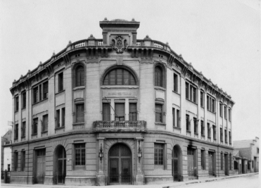

INSTITUT ESCOLA DEL TREBALL DE LLEIDA

MÀSTER FORMACIÓ PROFESSORAT SECUNDÀRIA 2024/25 TREBALL DEL PRÀCTICUM.

Alumne: Josep Segués Sabaté

Josep Segués Sabaté

Màster Formació Professorat Secundària 2024/25

Pràcticum

Índex

A. Dades de l’estudiant 3 B. Primera part: El centre i la seva organització 4 1. Coneixement i funcionament del centre 4 2. Professorat, alumnat i famílies 6 3. Recursos 7 4. L’estada en l’empresa. La FP Dual. 8 5. Experiències viscudes 9 6. Connexions entre el centre i les assignatures del Mòdul genèric 10 C. Segona part. Didàctica específica i avaluació a l’aula. 11 1. L’organització didàctica del departament 11 2. Els grups-classe i el professorat 13 3. Elaboració del nucli formatiu, ensenyament-aprenentatge i actuació 14 4. Experiències viscudes 19 D. Reflexió final 23 E. Webgrafia 24

2

Josep Segués Sabaté

Màster Formació Professorat Secundària 2024/25

Pràcticum

A. Dades de l’estudiant

Els meus estudis estan encabits dins l'àmbit agrari/medi-ambient i els vaig iniciar l’any 2009 fent un Cicle de Grau Superior d’Obra Civil. Un cop acabat el cicle i havent treballat 2 anys, vaig iniciar el meu període a la Universitat estudiant un Grau en Enginyeria Forestal. Actualment, estic cursant el Màster en Formació del professorat d'Educació Secundària Obligatòria i Batxillerat, Formació professional i Ensenyament d'Idiomes.

La meva experiència professional, igual que els estudis, està relacionada amb el sector agrari/medi-ambient. Durant tot aquest temps, he pogut posar en pràctica tots els meus coneixements adquirits durant els anys de formació i també he pogut aprendre la realitat de les feines relacionades amb aquest sector, un dels sectors professionals més antics del món.

Les meves etapes professionals dins del sector han estat molt diverses, em vaig iniciar com ajudant d’Ofici Forestal, vaig continuar com a Controlador de Qualitat i vaig acabar com a Tècnic d’una Associació de Defensa Vegetal (ADV). Aquestes feines han ocupat gran part de la meva vida laboral, fet que m’ha permès veure diferents visions i aprendre d’aquest sector gràcies a treballar en diferents empreses i amb diferents administracions.

En referència a la meva experiència com a docent avui en dia és escassa, ja que no he tingut el plaer d’experimentar aquesta professió com a tal. La part de la meva vida que més s’hi ha aproximat ha estat en la part formativa en les diferents presentacions a l’aula i també en els 10 anys, aproximadament, que he fet d’entrenador d’atletisme. Aquests moments m’han servit per poder experimentar breument com pot ser l’ofici d’un docent i la preparació, esforç i dedicació que hi ha darrere.

La meva experiència al món de la docència és molt limitada, per aquest motiu les pràctiques són importants per aprendre dins aquest camp. Considero que el més important en el context de l’aula no és només transmetre els coneixements a l’alumnat que es vol formar en aquest àmbit, també és important acompanyar-lo en el seu procés d’aprenentatge. Segons el meu punt de vista, la figura del professor ha de ser d’acompanyament i de guia, ja que la informació avui en dia està a l’abast de tothom. Un bon docent ha de ser una persona amb capacitat de motivar l’alumnat perquè aquest sigui el protagonista del seu aprenentatge i també sigui responsable, fent que la seva implicació vagi molt més enllà de superar assignatures o assolir objectius.

3

Josep Segués Sabaté

Màster Formació Professorat Secundària 2024/25

Pràcticum

B. Primera part: El centre i la seva organització

1. Coneixement i funcionament del centre

L’Institut Escola del Treball de Lleida és un centre escolar públic, es troba al centre de la ciutat de Lleida; a la comarca del Segrià, concretament al carrer Pi i Margall nº51. La titularitat pertany al Departament d’Ensenyament de la Generalitat de Catalunya. Aquest centre es caracteritza per la seva oferta única d’ensenyament professional i val a dir que alguns d’aquests estudis són d’oferta única en tot el territori lleidatà.

Aquest centre es va inaugurar el 14 de gener de 1932, amb l’excepció de l’etapa de la Guerra Civil, l’edifici sempre ha estat dedicat a l’ensenyament. Durant la seva història s’ha reformat i ampliat les instal·lacions fins a tenir el centre d’avui en dia.

Als anys 90, amb la reforma educativa de la LOGSE el centre va passar a IES i impartia cicles formatius de Grau mig i Superior, ESO i batxillerat. Posteriorment, concretament l’any 2013, centra la seva oferta educativa a la Formació Professional.

Actualment, s’hi imparteixen estudis de set famílies professionals, Administració, Comerç, Electricitat, Energia i Aigua, Fusta, Seguretat i Medi Ambient i Química. Aquestes famílies professionals estan formades per 5 cicles formatius de grau mitjà i 12 cicles formatius de grau superior.

El centre escolar també disposa d’altres estudis formatius com estudis de programes de formació i inserció (PFI), Itineraris formatius específics (IFE), Certificats de professionalitat (CP), Formació d’empresa (FE) i Cursos d’especialització de postgrau d'FP.

4

Josep Segués Sabaté

Màster Formació Professorat Secundària 2024/25

Pràcticum

Els organismes de govern del centre, estan degudament desenvolupats en els apartats corresponents de les NOFC (document que conté l’Organigrama del centre), es diferencien quatre grans blocs:

● Equip directiu, format per:

La directora,

El secretari,

La cap d’estudis

El cap d’estudis adjunt

L'administradora

El coordinador pedagògic.

● El consell escolar, està format per:

El director/a, que n’és el/la president/a.

El/la cap d’estudis

5 professors/es elegits pel Claustre

Un regidor/a o representant de l’ajuntament

4 alumnes

1 pare/mare

Un/a representant del personal d’administració i serveis del centre  El/la secretari/ària de l’institut, aquest darrer, amb veu i sense vot.

● El claustre de professora, format per:

71 professors de les diferents especialitats que s’imparteixen al centre.

● El consell de direcció, format per:

La directora

El secretari

La cap d’estudis

El coordinador pedagògic

L’administradora

El cap d’estudis adjunt

Els coordinadors de les línies estratègiques del centre: la coordinadora de Qualitat, la coordinadora de PRL, el coordinador TAC, el coordinador de FP, la coordinadora de Dinamització, la coordinadora d’Emprenedoria, el coordinador de Transferència, el coordinador de Mobilitat internacional, la coordinadora d’orientació, la coordinadora de Dual i la Coordinadora de Comunicació.

● Els Departaments de les 7 famílies professionals que s’imparteixen al centre, a més a més del departament de FOL i de Llengües Estrangeres.

● Els equips docents dels 45 grups classe.

● Les coordinacions i comissions

5

Josep Segués Sabaté

Màster Formació Professorat Secundària 2024/25

Pràcticum

Com a organització, i enfocat a la gestió del centre, l’Institut compta amb els següents documents, tots ells actualitzats:

● Projecte Educatiu de Centre (PEC) (actualitzat l’any 2022).

● Pla d’Acció Tutorial del Centre (PAT) (actualitzat l’any 2023).

● Projecte Lingüistic del Centre (PLC) (actualitzat l’any 2018).

● Normes d'Organització i Funcionament del Centre (NOFC) (actualitzat l’any 2024).

L'Institut també efectua una formació per al nou professorat, acollint alumnes dels diferents màsters que realitzen les diferents universitats catalanes i que et formen com a docent.

2. Professorat, alumnat i famílies

L’equip de professors (71 docents en el curs 23/24) no només realitzen les funcions de docents a les seves respectives assignatures, sinó que també duen a terme altres tasques com cap de departament, coordinador de departament, cap d’equip de millora, cap de grup de treball, tutor pedagògic, tutor d’FCT i responsables de laboratori i de taller.

La tipologia d’alumnat que hi podem trobar en aquest institut al Grau Mitjà és procedent majoritàriament de la ciutat de Lleida i de les comarques properes a la ciutat. L’alumnat de Grau Superior, segueix el mateix patró que en el Mitjà, però aquest es desplaça des de poblacions més llunyanes, com pot ser Fraga, que forma part de l’Aragó, però per proximitat i per interès en una especialitat, decideixen venir a estudiar en aquest centre.

Els motius de per què els alumnes s’incorporen al grau mitjà són diversos, alguns d’aquests motius són perquè no han volgut fer un batxillerat, perquè provenen d’un PFI, perquè no han aconseguit superar el batxillerat, perquè tenen clar l’ofici que volen desenvolupar i per continuar formant-se, sense tenir clar si els acabarà agradant. Els motius perquè els alumnes s’incorporen al grau superior també són diversos, però principalment són perquè provenen d’un Grau Mitjà, perquè han provat una carrera universitària i no l’han pogut acabar o no els ha agradat, perquè provenen del batxillerat i volen continuar formant-se, sense tenir del tot clar si els acabarà agradant.

En referència a l’atenció a les famílies, el centre promou, en el marc de les seves competències, les mesures adequades per a facilitar l'assistència de mares i pares o tutors legals de l’alumnat menor d’edat, a les reunions de tutoria i l'assistència dels representants als consells escolars, així com als altres òrgans de representació en els quals participin.

D’aquesta manera, a les NOFC es recull que, les mares, els pares o els tutors legals de l’alumnat menor d’edat, a més dels altres drets que els reconeix la legislació vigent

6

Josep Segués Sabaté

Màster Formació Professorat Secundària 2024/25

Pràcticum

en matèria d'educació, tenen dret a rebre informació sobre el projecte educatiu i el caràcter propi del centre, els serveis que s’ofereix i les característiques que té, les normes d'organització i funcionament del centre (NOFC) i la programació general anual del centre (PGA), les activitats complementàries, les activitats extraescolars i els serveis que s'ofereixen, el caràcter voluntari que aquestes activitats i serveis tenen, l'aportació econòmica que comporta i altra d'informació rellevant relativa a les activitats, les beques i els ajuts a l'estudi.

L’atenció a la diversitat a L’Institut Escola del Treball de Lleida, es porta a terme amb l’alumnat amb necessitats educatives especials a través de l’acció tutorial i de l'orientació i amb mesures universals que fomenten tots els tipus d’aprenentatge per a tot l’alumnat.

La convivència i el clima escolar és un element fonamental del procés educatiu i així ho expressa el PEC. Tots els membres de la comunitat educativa tenen dret a conviure en un bon clima escolar i el deure de facilitar-lo amb bona actitud i conducta en tot moment, i, en tots els àmbits de l’activitat del centre.

3. Recursos

El centre és conscient de la importància que té en l’actualitat les tecnologies de la informació, per aquest motiu, potencia l'aprenentatge de recursos TAC per facilitar la tasca docent diària i per a afavorir l’aprenentatge de l’alumnat en aquest àmbit. L’institut promou la formació del professorat en l’ús d’aquestes tecnologies i la participació en projectes i programes que permeten la seva implementació i difusió. Així mateix, el centre dota dins del marge dels recursos disponibles de les eines necessàries per a la seva aplicació.

En referència a les TIC, cada família professional utilitza els programes i recursos que considera necessaris per a impartir les seves classes. En el cas de la família de química, utilitzen sistemes com: Kahoot!, sistemes de presentació digitals com Canva o Genially i Corubrics com a sistema de coavaluació.

En aquest centre s’estableixen tot un seguit de relacions, que són les que segueixen a continuació:

Relacions del centre educatiu amb els recursos de l’entorn

L’institut vetlla per mantenir unes relacions de col·laboració estreta amb les institucions públiques com l’Ajuntament de Lleida (La Paeria), els Consells comarcals, la Cambra de comerç, la Universitat i altres institucions. Aquestes relacions s’entenen com un servei públic, atesa la condició de centre educatiu públic, però també com una oportunitat de col·laboració, que comporta beneficis diversos per a l’alumnat.

L’institut per la seva condició, té relació especial i comparteix interessos i projectes amb els altres centres de formació professional de la ciutat. El centre es relaciona amb altres centres escolars de la demarcació a través de diferents fòrums com són la junta territorial de centres de secundària i el Consell Escolar. S’estableixen acords de

7

Josep Segués Sabaté

Màster Formació Professorat Secundària 2024/25

Pràcticum

col·laboració entre els centres de col·laboració per a la realització d’FCT i d’altres projectes comuns.

Els recursos organitzatius i metodològics

Els recursos organitzatius depenen de cada departament d’FP i de cada professor/a, on en una sèrie de reunions a principis de curs, estableixen les programacions de les diferents sessions teòriques/pràctiques, visites, conferències, etc.

Quan els docents volen adquirir o comprar recursos per a l’aprenentatge del seu alumnat, és necessari anar a les reunions de cada departament, on els docents fan constar les seves necessitats en funció de l’activitat que volen dur a terme. En cas d’haver d’adquirir eines, instruments, materials, etc., s’ha d’omplir un document de departament per formalitzar la sol·licitud, s’ha acceptat, i finalment el director tindrà l'última paraula.

Les eines tecnològiques

El centre potencia l'aprenentatge de recursos TAC per facilitar la tasca docent diària i d'aprenentatge de l'alumnat, incorporant noves eines en un procés de millora de les competències d’informació i de les capacitats de l'alumnat cap a aquest tipus de recursos. L’institut promou la formació del professorat en l’ús d’aquestes tecnologies i la participació en projectes i programes que permetin la seva implementació i difusió.

En referència a l'organització del centre en matèria digital, el centre té una Estratègia Digital de Centre (EDC) definida.

L’alumnat disposa de diferents eines digitals proporcionades pel centre, algunes eines són el Correu Electrònic, Drive, Calendar i Meet. Per tal facilitar el treball als alumnes, el centre proporciona un entorn col·laboratiu per facilitar la gestió docent, l’aprenentatge i el treball col·laboratiu, l’Entorn Virtual d’Aprenentatge (EVA) que utilitza el Cicle Formatiu de Química és el Classroom, però l’institut també disposa del Moodle que l’utilitzen altres Cicles Formatius del centre.

Pel que fa al professorat, el centre està treballant amb l’aplicatiu Ieduca, però als cicles de la família de Química s’està utilitzant un aplicatiu nou que l’està desenvolupant el mateix centre per tal de substituir l’Ieduca, aquest aplicatiu nou es diu Ekatúa.

4. L’estada en l’empresa. La FP Dual.

A l’Institut Escola del Treball de Lleida la realització de les pràctiques FCT com la formació DUAL es porten a terme a segon curs, ja sigui de grau mitjà com de grau superior. És interessant saber que en ser un centre de formació professional específica, la formació en centres de treball (FCT) és un pilar bàsic en la formació de l’alumnat. L’organització i desenvolupament de la FCT està descrita en tota la documentació de gestió de centre associada al procés clau Ensenyament-aprenentatge. La direcció de l’institut vetlla per donar una FCT de qualitat a l’alumnat i que faciliti la seva inserció laboral.

8

Josep Segués Sabaté

Màster Formació Professorat Secundària 2024/25

Pràcticum

A cada Cicle Formatiu hi ha un professor/a encarregat de cercar centres de treball per a FCT o de formació DUAL. Es formalitza un conveni de col·laboració entre l'Institut Escola del Treball i l'empresa, on s'acorda el pla d'activitats que realitzarà l'alumne a l'empresa, el calendari i l'horari.

Els docents intenten fomentar poder fer pràctiques en mètode DUAL. Als estudiants se’ls ha explicat els beneficis i els desavantatges que té aquest mètode. Diferents alumnes, sobretot els que treballen, se’ls aconsella fer FCT, el motiu d’aquesta recomanació és que aquesta modalitat no requereix tanta disponibilitat de temps i és més fàcil adaptar-se per a l’alumnat.

En general, la majoria dels alumnes d’aquest cicle formatiu estan cursant les pràctiques en modalitat FCT, el principal motiu és per les menors hores que requereix cursar-les en aquest format en comparació amb DUAL. En canvi, hi ha 3 dels alumnes que les estan fent en modalitat DUAL, el motiu d’aquesta elecció ha estat per la remuneració del treball i l’interès en una futura contractació en acabar el cicle.

5. Experiències viscudes

Com ja he fet saber en el primer apartat, la meva experiència docent era gairebé inexistent abans de començar pràctiques. També voldria destacar que l’especialitat de química, en la qual estic fent les pràctiques, és una de les que menys domino, fet que m’ha fet sentir molt insegur als inicis d’aquesta etapa de pràctiques.

Fins al moment només he estat amb dos grups diferents, un que correspon al primer curs del CFGS de Laboratori d’anàlisi i control de qualitat, que forma part del departament de Química, i un altre que correspon al segon curs d’aquest mateix cicle. L’equip docent d’aquest departament és reduït, ja que està format per tres docents i dos més que imparteixen assignatures transversals com FOL i Anglès en aquest cicle.

En el segon curs del CFGS de Laboratori d’anàlisi i control de qualitat, és on he passat més hores fins al dia d’avui, en aquest temps he pogut saber que el curs està format per tres pràctiques, les quals, són les que avaluaran els professors per valorar el grau d’assoliment dels continguts de l’alumnat. També he assistit a la presentació per part de l’alumnat d’una d’aquestes pràctiques i he pogut apreciar com és de complicada la feina docent en l’Aprenentatge Basat en Projectes (ABP). M’ha sorprès molt la feina que hi ha darrere de cada pràctica i tota la gestió que comporta en l'àmbit organitzatiu poder treballar mitjançant aquesta metodologia.

Actualment, estic assistint a moltes classes, la major part són classes pràctiques, però també n’hi ha de teòriques. D’altra banda, he pogut veure com són les tutories amb els alumnes des del punt de vista del docent. Pròximament, m’han convidat a assistir a una fira on participa el centre escolar, també a les sortides programades del cicle que falten fins al final de curs. Com a novetat, m’han invitat al dinar de Nadal que organitza el centre. Per tant, puc dir que m’han acollit molt bé i que estic observant moltes situacions diferents del centre que fan que cada dia estigui més còmode en l’ambient docent.

9

Josep Segués Sabaté

Màster Formació Professorat Secundària 2024/25

Pràcticum

Fins al dia d'avui, no he pogut apreciar les carències que pot tenir el Cicle o el Centre. Es nota que el personal docent d’aquest cicle té molta experiència, aquest bagatge s’aprecia a l’hora de gestionar l’aula i donar solucions als diferents problemes que es poden plantejar.

Una cosa que m’ha cridat l’atenció i he pogut veure és que l’alumnat en general, no pren apunts a l’aula. D’aquest assumpte n’he pogut parlar amb diversos professors/es i m’han comentat que és un problema cada cop més gran, ja que, provoca la repetició de molts conceptes i continguts que dificulten el desenvolupament del projecte. També m’agradaria comentar una observació que he fet durant aquest temps i que m’ha cridat l’atenció, fa referència al rol que adopta el docent dins de l’aula, sent flexibilitat en algunes ocasions i rígid en algunes altres. He pogut apreciar l’empatia que ha de tenir el docent dins de l’aula i saber reconèixer quan és moment de cedir sense crear precedents ni perdre el respecte.

6. Connexions entre el centre i les assignatures del Mòdul genèric

És interessant veure com la majoria de les assignatures que he cursat fins ara al màster, estan relacionades amb la pràctica docent a l’aula, ja que, els coneixements adquirits m’han estat molt útils per entendre el funcionament del centre i de l’aula.

L’assignatura a destacar és la d’Organització escolar, perquè m’ha ajudat a entendre millor l’estructura i les normatives del centre a l’hora d’iniciar les pràctiques. Coneixement de les NOFC, PEC i altres documents de centre així com l’organització del departament, el professorat i les seves especialitats. Tot això ho he pogut saber i entendre la seva importància gràcies al contingut adquirit a aquesta assignatura.

L’assignatura de Didàctica és imprescindible per poder entendre l’objectiu del docent en la formació de l’alumnat del cicle. He pogut veure que el fet de treballar per projectes (ABP) dificulta identificar en algunes ocasions els resultats d’aprenentatge (RA) concrets. He vist que els docents complementen els projectes amb activitats control per poder justificar alguns resultats d’aprenentatge.

L’assignatura d’Aprenentatge, conducta i desenvolupament de la personalitat, m’ha ajudat a veure, entendre i posar en pràctica: la gestió de l’aula, les diferents conductes relacionades amb l’adolescència, les tutories, etc. També he vist la relació directa entre l’assignatura teòrica impartida i la realitat diària de l’aula. El desenvolupament de la personalitat i la conducta es posa de manifest en una aula on hi ha alumnat d’edats diverses. Tot i que en aquest cas és un grup cohesionat i amb bones dinàmiques, fet que facilita la gestió de l’aula per part del docent.

L’assignatura de Societat, família i educació, fa referència a les diferents disciplines de conducta, he pogut comprovar que aquestes conductes són visibles a l’aula.

L’assignatura d’Antecedents i orientació, m’ha ajudat a veure i conèixer els materials emprats, també m’ha facilitat la identificació dels diferents recursos i de les tècniques TIC utilitzades pels docents a l’hora d’impartir les seves classes.

10

Josep Segués Sabaté

Màster Formació Professorat Secundària 2024/25

Pràcticum

C. Segona part. Didàctica específica i avaluació a l’aula. 1. L’organització didàctica del departament

El Departament de Química està format únicament per un Cicle Superior i el formen tres docents (2 professores i 1 professor). A més a l’equip docent s’integren una docent de FOL i una altra d'Anglès .

A continuació es detalla el cicle que es fa des d’aquest departament:

Grau Superior

- CFGS de Laboratori d’anàlisi i control de qualitat

Aquests estudis capaciten per organitzar i supervisar l’activitat d’un laboratori i per desenvolupar i aplicar tècniques d’assaig i anàlisis físiques, químiques i microbiològiques sobre matèries primeres i productes químics o aliments per a la investigació i el control de qualitat.

La durada és de 2.000 hores (1.551 en el centre educatiu i 449 en un centre de treball) distribuïdes en dos cursos acadèmics.

L’alumnat pot realitzar pràctiques en empreses estrangeres dins del programa europeu de mobilitat Erasmus, la qual cosa pot complementar els seus estudis i ajudar-los de cara a la inserció dins del món laboral.

Pel que fa al departament, aquest desenvolupa la seva activitat a partir de reunions de caràcter setmanal, on es treballen diferents aspectes clau per al bon funcionament. La cap de departament juga un paper fonamental, ja que assisteix tant al Consell Escolar com a les Juntes d’Avaluació, i fa arribar al professorat del departament les novetats i decisions preses en aquests òrgans.

Durant les trobades setmanals, es duu a terme una avaluació i anàlisi acadèmica de l’alumnat, i també es tracten possibles conflictes a l’aula, ja sigui relacionats amb el comportament, l’absentisme, la manca de continuïtat o altres factors que puguin interferir en el correcte desenvolupament de les classes.

A més, es dedica temps a la planificació i elaboració de propostes per a l’aprenentatge dins del departament de química, així com a la coordinació d’activitats didàctiques com conferències o tallers. També es tracten aspectes com l’assignació de noves responsabilitats entre els docents, la revisió de tècniques d’estudi i la proposta de millores, i la coordinació i seguiment dels projectes, la seva temporització i l’evolució de l’alumnat respecte als continguts treballats.

El CFGS de Laboratori d’Anàlisi i Control de Qualitat s’ha dissenyat íntegrament amb la metodologia ABP (Aprenentatge Basat en Projectes).

L’Escola del Treball aposta per treballar conjuntament amb les empreses de l’entorn, entitats de promoció econòmica del territori i institucions. La col·laboració i feedback amb el sector empresarial ha de ser constant i una de les prioritats, per aquesta raó,

11

Josep Segués Sabaté

Màster Formació Professorat Secundària 2024/25

Pràcticum

s’estableixen una sèrie de competències professionals més àmplies que les estrictament curriculars. D’aquesta manera s’incorpora a l’organització del cicle, l’aprenentatge de competències tècniques alhora que competències transversals i competències pseudotècniques.

Junt amb les competències establertes al currículum del CFGS de laboratori d’anàlisi i control de qualitat s’ha incorporat:

● Competències en disseny en 2D

● Càlculs avançats en Excel

● Treball en equip

● Resolució de problemes

● Comunicació interpersonal

● Presa de decisions

● Compromís

● Flexibilitat

● Gestió del temps

● Lideratge

● Creativitat

● Responsabilitat

● Treball sota pressió

● Pensament estratègic

● Adaptació al canvi.

L’ús d’aquesta metodologia aporta múltiples avantatges tant per a l’alumnat com per al professorat. En primer lloc, l’alumnat es beneficia d’un aprenentatge col·laboratiu que fomenta una major motivació i una comprensió més profunda dels continguts. Aquest enfocament permet diagnosticar i definir problemes de manera més efectiva, alhora que es promou la cerca activa de solucions.

Els estudiants esdevenen protagonistes del seu propi aprenentatge, fet que afavoreix el desenvolupament de competències transversals essencials com el treball en equip, la comunicació, la resolució de problemes, la gestió del temps, la presa de decisions, el compromís, la flexibilitat, la creativitat, la responsabilitat, el treball sota pressió, el pensament estratègic i l’adaptació al canvi.

Pel que fa al professorat, aquesta metodologia redefineix el seu rol, que passa a ser el d’un guia o acompanyant en el procés d’aprenentatge. Això implica avantatges significatius com una major flexibilitat horària, una millor cohesió entre els membres de l’equip docent, una atenció més individualitzada a l’alumnat i una interacció més propera amb aquest, fet que contribueix a millorar l’atenció a la diversitat.

A més, es potencia l’aprofitament dels continguts impartits, s’evita la repetició innecessària de temes i es facilita una avaluació més adaptada al grau d’implicació de cada alumne. En definitiva, l’aprenentatge es construeix de manera horitzontal, promovent un entorn educatiu més inclusiu i eficient.

12

Josep Segués Sabaté

Màster Formació Professorat Secundària 2024/25

Pràcticum

2. Els grups-classe i el professorat

Durant la meva estada de pràctiques he pogut observar i acompanyar a diversos professors i professores, i a tot el seu alumnat. He pogut estar a les diferents classes dels dos cursos del Grau Superior de laboratori d’anàlisi i de qualitat.

Pel que fa a les característiques de l’alumnat del centre segons la seva procedència la gran majoria de l’alumnat són de la comarca del Segrià i de les comarques pròximes a aquesta com el Pla d’Urgell i la Noguera. Aproximadament un 5% dels alumnes provenen de la comunitat autònoma d’Aragó, ja que la proximitat els permet venir a cursar els seus estudis en aquest centre.

El primer curs està format per 16 alumnes, tots de la mateixa edat aproximadament, excepte d’una alumna d’uns 45 anys la qual està molt ben integrada al grup classe. El segon curs el formen 18 alumnes d’un perfil molt semblant als del primer curs, la majoria són joves procedents de CFGM i de Batxillerat, excepte dos alumnes de 30 anys, una dona que ha reprès els seus estudis i un home que prové de cursar la carrera de Química. Es nota que es tracta d’un CFGS, ja que l’alumnat a trets generals mostra interès en la gran majoria de les classes.

Respecte a les matèries que es desenvolupen, és del tot cert que l’atenció de l’alumnat és major quan les sessions són pràctiques; al laboratori, fet que millora la seva implicació i dedicació i, en conseqüència, l’assoliment dels continguts.

Com a estudiant en pràctiques he pogut observar i apreciar diferents estils entre professors i professores a l’hora de fer les classes, he pogut observar un total de 3 docents diferents. És cert que cadascú té la seva manera d’impartir les classes, tots demostren ganes i vocació per la professió que tenen i s’impliquen perquè la classe i l’alumnat sigui el més productiu possible, però sempre amb el seu estil personal.

Les metodologies d’aprenentatge no varien gaire entre els diferents docents, a l’inici de cada projecte imparteixen classes teòriques els tres docents a l’aula, presenten el projectes que realitzaran i cada un explica la part de la seva matèria. Durant la part pràctica del projecte, als alumnes els van sorgint dubtes, els docents els guien per poder resoldre els problemes i els dubtes que se’ls pugui plantejar.

Es tracta d’un departament molt petit i compacte, tenen molt bona relació entre ells i s’ajuden molt per tal d’anar tots a una. Tots els docents mostren una bona relació i implicació amb l’alumnat, ja que es tracta d’alumnes majors d’edat, que estan molt implicats en el cicle que estan cursant i amb les pràctiques que estan realitzant en les empreses, fet que genera un bon ambient a l’aula i permet que les sessions siguin molt productives i enriquidores tant per al professorat com per a l’alumnat.

La relació amb la tutora és bona, l’alumnat presenta i exposa les seves necessitats en relació amb l’aprenentatge que es desenvolupa al cicle. Tot i això, el fet de tenir pocs docents que passen moltes hores amb l’alumnat fa que totes les relacions siguin properes i que expressin les seves inquietuds a qualsevol dels tres.

13

Josep Segués Sabaté

Màster Formació Professorat Secundària 2024/25

Pràcticum

3. Elaboració del nucli formatiu, ensenyament-aprenentatge i actuació

El cicle formatiu on he desenvolupat i he fet les classes és en el CFGS de Laboratori d’anàlisi i control de qualitat, concretament he fet la intervenció en el mòdul MP4 Assajos físics. Aquest mòdul 4 està format per 2 unitats formatives (UF), he pogut desenvolupar amb l’ajuda dels professors titulars una sessió teòrica i una de pràctica, pertanyent a la UF2 assajos físics destructius i no destructius.

A continuació es presenten els continguts que forma el MP4:

MÒDUL PROFESSIONAL 4: ASSAJOS FÍSICS

Durada: 99 hores

Equivalència en crèdits ECTS: 9

Unitats formatives que el componen:

UF 1: tipus de materials. 39 hores

UF 2: assajos físics destructius i no destructius. 60 hores

UF2 Assajos físics destructius i no destructius. (60 hores)

Resultats d’aprenentatge i criteris d’avaluació

1. Prepara les condicions de l’anàlisi relacionant la naturalesa de la mostra amb el tipus d’assaig Criteris d’avaluació

1.1 Planifica el procés analític identificant-ne cada una de les etapes. 1.2 Identifica els diferents tipus d’assajos físics.

1.3 Analitza els procediments de preparació de mostres i provetes. 1.4 Ajusta les provetes a les formes i dimensions normalitzades.

1.5 Identifica el tipus de material objecte de l’assaig i les seves característiques.

1.6 Relaciona les característiques del material i el seu ús amb els paràmetres analitzats.

1.7 Actua sota normes i procediments de seguretat.

1.8 Separa els residus generats, segons les seves característiques, per a la seva gestió posterior.

14

Josep Segués Sabaté

Màster Formació Professorat Secundària 2024/25

Pràcticum

2. Prepara els equips, interpretant-ne els elements constructius i el funcionament 2.1 Selecciona l’equip apropiat segons el paràmetre que s’ha de mesurar.

2.2 Descriu els elements constructius de l’equip indicant-ne la funció de cada un dels components.

2.3 Comprova el funcionament correcte de l’equip, efectuant-ne el manteniment bàsic.

2.4 Adapta l’equip al paràmetre que s’ha de mesurar i al tipus de material. 2.5 Calibra l’equip i valora la incertesa associada a la mesura.

2.6 Valora la necessitat del manteniment per conservar els equips en perfectes condicions d’ús.

2.7 Avalua els riscos associats a la utilització dels equips.

2.8 Aplica les normes de prevenció de riscos laborals i protecció ambiental requerides.

2.9 Aplica les mesures de seguretat en la neteja, el funcionament i el manteniment bàsic dels equips.

3. Analitza mostres aplicant les tècniques d’assajos físics

3.1 Classifica els diferents tipus d’assaig segons els paràmetres.

3.2 Identifica les lleis físiques que regeixen cada tipus d’assaig.

3.3 Analitza el procediment normalitzat de treball per a l’execució de l’assaig.

3.4 Assaja el nombre de provetes adequat i segueix la seqüència correcta d’execució.

3.5 Identifica un acer o fossa mitjançant la seva observació microscòpica. 3.6. Deixa l’equip net i en condicions d’ús després de l’assaig.

3.7 Aplica les normes de competència tècnica.

3.8 Separa els residus generats, segons les seves característiques, per a la seva gestió posterior.

3.9 Registra les dades de forma adequada (taules, gràfics, entre d’altres) i aplica programes informàtics de tractament de dades avançat.

4. Analitza els resultats i els compara amb els estàndards establerts

4.1 Executa els càlculs per obtenir el resultat, considerant les unitats adequades per a cada variable.

15

Josep Segués Sabaté

Màster Formació Professorat Secundària 2024/25

Pràcticum

4.2 Utilitza fulls de càlcul o altres programes informàtics per a l’obtenció del resultat.

4.3 Expressa el resultat considerant el valor mitjà de les provetes assajades o les mesures executades i la precisió de la mesura (desviació estàndard, variància, entre d’altres).

4.4 Utilitza correctament taules de característiques de materials.

4.5 Contrasta el resultat obtingut amb patrons de referència del mateix material. 4.6 Aplica la normativa sobre materials, segons l’ús que se li donarà.

4.7 Analitza si el material assajat compleix la normativa vigent o les especificacions donades pel fabricant.

4.8 Analitza els resultats anòmals per determinar les causes d’error atribuïbles al laboratori.

4.9 Reflecteix les dades als informes tècnics de la forma establerta al laboratori.

4.10 Presenta els informes en la forma i el temps establerts.

4.11 Considera la importància de la qualitat en tot el procés.

Continguts

1. Preparació de les condicions per als assajos físics

1.1 Fonament dels diferents tipus d’assajos físics: anàlisi tèrmica, assajos magnètics, assajos per mètodes elèctrics, assajos amb ultrasons, raigs X.

1.2 Assajos mecànics: tracció, compressió, cisallament, flexió, vinclament, torsió, duresa, resiliència, fatiga, assajos tecnològics.

1.3 Condicionament dels materials per l’assaig. Preparació de mostres i provetes.

2. Preparació d’equips per assajos físics

2.1 Operació i ús dels diferents equips.

2.2 Tècniques i procediments de manteniment bàsic.

2.3 Regulació de paràmetres i calibratge d’equips i instruments.

2.4 Riscos associats als equips d’assajos físics.

2.5 Seguretat en les activitats de neteja, funcionament i manteniment d’equips 16

Josep Segués Sabaté

Màster Formació Professorat Secundària 2024/25

Pràcticum

3. Anàlisi de mostres per a assajos físics destructius i no destructius 3.1 Assajos de característiques de materials. Granulometries.

3.1 Assajos mecànics no destructius o de defectes.

3.2 Assajos mecànics destructius: assajos de duresa, resistència a la tracció, compressió, resistència a la flexió, resiliència, resistència al desgast i l’abrasió, impacte i altres.

3.3 Assajos elementals de tractaments superficials. Corrosió o degradació. 3.4 Anàlisis d’estructures microscòpiques. Microscopi metal·logràfic. 3.5 Assajos tecnològics: embotició, plegat, guspira i tall, soldadura.

3.6 Registre i tractament de dades per aconseguir la mesura del paràmetre (taules, gràfics, etc.).

3.7 Incidència de l’ordre i la neteja durant les fases del procés.

3.8 Reconeixement i valoració de les normes de competència tècnica.

3.9 Anàlisis de la importància dels assajos físics per determinar la qualitat dels materials.

3.10 Compliment de normes de seguretat i salut laboral.

3.11 Eliminació i tractament de residus.

4. Anàlisi de resultats dels assajos físics

4.1 Utilització de programes informàtics de tractament de dades avançat. 4.2 Interpretació de gràfics.

4.3 Utilització de taules de dades i gràfics de propietats físiques.

4.4 Assegurament de la qualitat. Anàlisi de resultats anòmals.

4.5 Aplicació de les normes de qualitat en el conjunt del procés

4.6 Redacció i presentació d’informes.

17

Josep Segués Sabaté

Màster Formació Professorat Secundària 2024/25

Pràcticum

A continuació es presenta la programació de la sessió que he impartit en aquest CFGS, s’ha efectuat dins del marc de la UF 2, corresponent al mòdul professional 4:

18

Josep Segués Sabaté

Màster Formació Professorat Secundària 2024/25

Pràcticum

En la intervenció que he fet, puc dir que tant la classe a l’aula com la pràctica al laboratori va anar bastant bé. La gran majoria de l’alumnat atenia les explicacions. A la sessió teòrica vaig utilitzar recursos facilitats per part dels docents, com posar exemples, fer alguna broma, fer preguntes i fer-los participar. D'aquesta manera, vaig aconseguir que mantinguessin l’atenció i vaig intentar fer l’exposició dels continguts teòrics més amena.

Al principi de la sessió vaig estar molt nerviós, ja que era la primera vegada que feia una classe, notava els nervis a flor de pell, certa velocitat desmesurada a les explicacions, alguns entrebancs a l’hora d’exposar el contingut... fets que van anar disminuint amb el pas dels minuts i la retroacció i respostes de l’alumnat. Vaig acabar la sessió trobant-me realment còmode. Els continguts teòrics i pràctics els vaig preparar jo a la meva manera, fet que em va ajudar molt a l’hora de trobar-me còmode i agafar confiança davant de l’alumnat. A la sessió pràctica els alumnes estaven molt participatius i feien preguntes, inclús explicaven vivències, aquest fet em va demostrar que es van trobar còmodes dins la meva intervenció i que la temàtica i forma de treballar-la els va resultar engrescadora.

Al moment de la finalització de la sessió vaig poder constatar que l’alumnat havia entès l’objectiu de la pràctica i l’aplicació dels conceptes teòrics desenvolupats a l’exposició docent. Per últim, la seva retroacció cap a la sessió i cap a mi va ser positiva, la qual cosa va ser molt gratificant per mi.

4. Experiències viscudes

Durant les 180 hores de pràctiques he viscut diverses experiències amb l’alumnat, la gran majoria del temps l’he passat amb l’alumnat del 2n curs d’aquest CFGS. He de dir que l’alumnat de 2n està format per un grup bastant cohesionat i responsable, fet que facilita molt la feina docent amb un grup com aquest. Els diferents professors del cicle coincideixen amb aquesta opinió.

He pogut comparar de forma puntual l’actitud dels alumnes de 1r amb els de 2n, i he de dir que l'actitud a l’aula és molt diferent, ja que la motivació i bona actitud que se sent a l’aula de 2n no es veu a l’aula de 1r. D’una banda, els alumnes de 2n són alumnes que ja fa dos anys que estudien junts, han compartit projectes en comú els uns amb els altres i el fet d’estar cursant les pràctiques, ajuda a fer que siguin més responsables i sàpiguen aprofitar més el temps dins el centre. D’altra banda, els alumnes de 1r estan acabant de descobrir si realment els agrada el que estan estudiant, això es pot observar en algunes baixes que han anat tenint al llarg del curs dins el grup. També es pot observar la falta de treball en equip en alguns casos. Alguns membres dels grups de treball tenen diferències, això es reflecteix en les coavaluacions que fan dels projectes. En les entregues dels projectes també es pot observar una falta de responsabilitat i compromís per part d’alguns alumnes, no compleixen amb els terminis d’entrega o entreguen treballs molt deficients.

19

Josep Segués Sabaté

Màster Formació Professorat Secundària 2024/25

Pràcticum

També m’agradaria aprofitar aquest apartat per posar el focus en la tasca que desenvolupa el docent, fent una crítica constructiva al sistema educatiu actual, ja que, a través de la meva experiència, he pogut observar de primera mà la gran quantitat de feina que hi ha darrere de cada acció docent, sovint invisible o poc reconeguda. És molt fàcil, des de fora, tenir una imatge simplificada de la feina del professorat, limitada únicament a les hores lectives dins l’aula. Però la realitat és molt més complexa. El docent no només imparteix continguts, sinó que planifica, coordina, adapta materials, fa seguiments personalitzats, gestiona conflictes, atén la diversitat, participa en reunions, forma part de projectes, innova constantment i, sobretot, acompanya emocionalment l’alumnat. I tot això, moltes vegades, enmig de condicions que no sempre faciliten el desenvolupament d’aquesta tasca amb la qualitat i el temps que es mereixeria.

M’agradaria recalcar que aquesta és una opinió completament personal i que forma part de les reflexions que extrec després d’haver viscut aquesta experiència des de dins, en una posició que m’ha permès veure la feina docent amb una mirada molt més informada, empàtica i crítica. “Fer de docent” és molt més que tenir coneixement d’una matèria. Per aquest motiu, considero fonamental que es reconegui socialment el valor d’aquesta professió i que es prenguin mesures per millorar-ne les condicions i el benestar. Només així podrem garantir una educació de qualitat compromesa amb la realitat de l’alumnat i amb els reptes del món actual.

He pogut estar en un CFGS on es treballa amb la metodologia ABP i he vist la dificultat que suposa pels docents la burocràcia del sistema a l’hora de preparar les sessions per complir les exigències del sistema educatiu. Gran part del temps del docent s’ha de dedicar a registrar i preparar/adaptar la documentació per les auditories que ha de passar el departament, fet que deixa en un segon pla la feina principal del docent que és ensenyar i preparar les sessions per adaptar-les a les necessitats de l’alumnat. A aquest fet se suma tots els canvis de normativa i de currículum que han de fer any sí any no.

5. Assistència a jornades didàctiques o a fires

En aquest apartat mencionaré les diferents xerrades, sortides i fires que he assistit durant el meu període de pràctiques. Aquestes han estat les següents:

● Visita a EDAR (estació depuradora d’aigües residuals) de Lleida amb els alumnes de 1r.

● Xerrada sobre la policia científica amb els alumnes de 2n.

● Fira FormaOcupa a Lleida

20

Josep Segués Sabaté

Màster Formació Professorat Secundària 2024/25

Pràcticum

Imatge de la sortida que es va fer a EDAR (l’estació depuradora d’aigües Residuals) de Lleida. Al llarg de la visita ens van mostrar les seves instal·lacions i laboratoris, ens van explicar les diferents etapes del procés que es realitza en les instal·lacions i els tipus d’anàlisis que es realitzen per garantir que l’aigua compleixi els paràmetres establerts. En la visita se’ns va mostrar com l’aigua residual que es recull en el sistema de clavegueram de la ciutat arriba a l’EDAR, com aquesta és sotmesa a diferents processos fisico-químics i biològics per netejar-la, fins a alliberar-la finalment un altre cop al riu Segre depurada, complint els nivells requerits legalment.

Aquest saló FormaOcupa s’ha desenvolupat durant els dies 13, 14 i 15 de febrer al pavelló firal de la ciutat de Lleida. L’objectiu d’aquest saló és orientar i assessorar els joves i a les seves famílies de cara al seu futur acadèmic i laboral, mostrant les possibilitats d’ocupació del territori i orientant en l’accés al mercat laboral coneixent les ofertes de treball, conèixer l’oferta acadèmica en Formació Professional, conèixer el servei d’assessorament i reconeixement de competències professionals, el servei d’acreditació de competències, informar de l’oferta de cursos de formació ocupacional i

21

Josep Segués Sabaté

Màster Formació Professorat Secundària 2024/25

Pràcticum

certificats de professionalitat, conèixer la formació contínua per a treballadors ocupats oferint-los una formació per expandir les seves habilitats i impulsar la competitivitat de les empreses, i finalment, presentar els serveis d’assessorament per impulsar l’emprenedoria coneixent les oportunitats de negoci i l’autoocupació.

Durant aquests dies, els alumnes del CFGS de Laboratori d’anàlisi i control de qualitat, han realitzat diferents pràctiques per grups en l’estand habilitat per aquest cicle en aquest saló. La finalitat era donar a conèixer aquest cicle, informar a altres persones interessades a formar-se en aquest àmbit i poder demostrar els coneixements i les habilitats adquirides amb la seva formació.

22

Josep Segués Sabaté

Màster Formació Professorat Secundària 2024/25

Pràcticum

D. Reflexió final

Durant el meu període de pràctiques he experimentat i iniciat el meu paper com a docent, fet que m’ha fet sortir de la meva zona de confort i ha resultat més engrescador inclús del que havia pogut imaginar.

He viscut diverses experiències que m’han ajudat a veure aquesta professió d'un altre punt de vista, el qual no es pot entendre fins que no es viu.

Les pràctiques les he cursat en un cicle el qual imparteix una matèria que no tinc molt controlada i que em queda molt lluny d'ençà que la vaig cursar. Aquest fet em va fer sentir insegur al principi i em va dificultar trobar el meu rol dins l’aula com a docent en pràctiques, tot i que amb esforç, dedicació i hores d’estudi em va permetre revertir la situació.

El fet de ser un docent en pràctiques i establir-me com una figura d'autoritat a l'aula també em va resultar una mica complicat inicialment. L’alumnat pot tenir dificultats per acceptar i respectar a un docent que no coneixen bé i que estarà un període curt amb ells. Ser proper, mantenir un tracte cordial, compartir experiències personals com a estudiant per donar consells i marcant algunes línies d’autoritat, sense entrar en la confrontació, m’ha ajudat a trobar el meu lloc dins de l’aula.

Amb el temps he pogut conèixer millor el centre, als docents i l’alumnat, fet que m’ha ajudat a sentir-me còmode a l’aula i a trobar el meu estil com a docent.

Per finalitzar, voldria agrair als docents del CFGS de Laboratori d’anàlisi i control de qualitat de l’Escola del Treball de Lleida tot el que m’han ensenyat i la paciència que han tingut amb mi, he après molt i he gaudit d’aquestes pràctiques. Tampoc em voldria oblidar de l’alumnat, que amb el seu interès i bona predisposició van fer que la meva intervenció fos molt gratificant per mi.

23

Josep Segués Sabaté

Màster Formació Professorat Secundària 2024/25

Pràcticum

E. Webgrafia

● https://www.escoladeltreball.cat/wp-content/uploads/2022/02/Projecte_Educatiu_Ce ntre._v.2.2.pdf

● https://www.escoladeltreball.cat/wp-content/uploads/2023/02/06_Pla_Accio_Tutorial _FP_v1.10.pdf

● https://www.escoladeltreball.cat/wp-content/uploads/2024/01/04-Normes_Organitza cio_Funcionament_Centre_23_24_v1.9.pdf

● https://www.escoladeltreball.cat/

24

### Tabla 1

| Mòdul professional: 4  | UF: 2  | UF: 2  | Hores: 3  | Hores: 3  | Codi 
activitat | M4P  |

| --- | --- | --- | --- | --- | --- | --- |

| Nom de l’activitat: Pràctica de Penetrometria i Refractometria | Nom de l’activitat: Pràctica de Penetrometria i Refractometria | Nom de l’activitat: Pràctica de Penetrometria i Refractometria | Nom de l’activitat: Pràctica de Penetrometria i Refractometria | Nom de l’activitat: Pràctica de Penetrometria i Refractometria | Codi 
activitat | M4P  |

| Descripció: Classe teòrica i pràctica al laboratori de penetrometria i refractometria. | Descripció: Classe teòrica i pràctica al laboratori de penetrometria i refractometria. | Descripció: Classe teòrica i pràctica al laboratori de penetrometria i refractometria. | Descripció: Classe teòrica i pràctica al laboratori de penetrometria i refractometria. | Descripció: Classe teòrica i pràctica al laboratori de penetrometria i refractometria. | Descripció: Classe teòrica i pràctica al laboratori de penetrometria i refractometria. | Descripció: Classe teòrica i pràctica al laboratori de penetrometria i refractometria. |

| Resultats 
d’aprenentatge | Criteris d’avaluació  | Criteris d’avaluació  | Criteris d’avaluació  | Continguts | Continguts | Continguts |

| RA 1, RA 2 i RA 4 | 1.1, 1.2, 1.3, 1.5, 1.7, 2.1,2.2, 2.3, 2.4, 2.5, 2.6, 2.7, 2.8, 2.9, 4.1, 4.2, 4.3, 4.4, 4.5, 4.6, 4.7, 4.8, 4.9, 4.10 i 4.11. | 1.1, 1.2, 1.3, 1.5, 1.7, 2.1,2.2, 2.3, 2.4, 2.5, 2.6, 2.7, 2.8, 2.9, 4.1, 4.2, 4.3, 4.4, 4.5, 4.6, 4.7, 4.8, 4.9, 4.10 i 4.11. | 1.1, 1.2, 1.3, 1.5, 1.7, 2.1,2.2, 2.3, 2.4, 2.5, 2.6, 2.7, 2.8, 2.9, 4.1, 4.2, 4.3, 4.4, 4.5, 4.6, 4.7, 4.8, 4.9, 4.10 i 4.11. | 1.1, 1.2, 1.3, 2.1, 2.2, 2.3, 2.4, 2.5, 4.1, 4.2, 4.3, 4.4, 4.5 i 4.6 | 1.1, 1.2, 1.3, 2.1, 2.2, 2.3, 2.4, 2.5, 4.1, 4.2, 4.3, 4.4, 4.5 i 4.6 | 1.1, 1.2, 1.3, 2.1, 2.2, 2.3, 2.4, 2.5, 4.1, 4.2, 4.3, 4.4, 4.5 i 4.6 |

| Mentors: Pepita Oms i Robert Marsellès, professors de l’escola del treball de Lleida. | Mentors: Pepita Oms i Robert Marsellès, professors de l’escola del treball de Lleida. | Mentors: Pepita Oms i Robert Marsellès, professors de l’escola del treball de Lleida. | Mentors: Pepita Oms i Robert Marsellès, professors de l’escola del treball de Lleida. | Mentors: Pepita Oms i Robert Marsellès, professors de l’escola del treball de Lleida. | Mentors: Pepita Oms i Robert Marsellès, professors de l’escola del treball de Lleida. | Mentors: Pepita Oms i Robert Marsellès, professors de l’escola del treball de Lleida. |

| Seqüència de l’activitat d’ensenyament-aprenen tatge | Organització  | Temporització  | Temporització  | Metodologia  | Recursos | Recursos |

| Preparació de l'activitat per part del professor 
Pràctica al laboratori amb el material necessari i els EPIS corresponents per tal de realitzar la pràctica. 
Finalització de l'activitat i ràpida posada en comú dels resultats obtinguts | Classe a l'aula 
Pràctica al 
Laboratori 
Xerrada amb 
els alumnes tot acabada la 
pràctica. | 60 min 
1h i 45 min 
15 min | 60 min 
1h i 45 min 
15 min | Exposició 
docent 
Aprenentatg e vivencial 
Aprenentatg e per síntesi | Projector, 
power point i material 
didàctic per 
prendre 
apunts. 
Documentació lliurada per 
part del docent i explicacions durant la 
classe 
magistral. 
Repàs dels 
resultats | Projector, 
power point i material 
didàctic per 
prendre 
apunts. 
Documentació lliurada per 
part del docent i explicacions durant la 
classe 
magistral. 
Repàs dels 
resultats |

| Documentació: Power point presentat a l'aula i document de la pràctica lliurada per part del docent a l’alumnat. | Documentació: Power point presentat a l'aula i document de la pràctica lliurada per part del docent a l’alumnat. | Documentació: Power point presentat a l'aula i document de la pràctica lliurada per part del docent a l’alumnat. | Documentació: Power point presentat a l'aula i document de la pràctica lliurada per part del docent a l’alumnat. | Documentació: Power point presentat a l'aula i document de la pràctica lliurada per part del docent a l’alumnat. | Documentació: Power point presentat a l'aula i document de la pràctica lliurada per part del docent a l’alumnat. | Documentació: Power point presentat a l'aula i document de la pràctica lliurada per part del docent a l’alumnat. |

| Instruments d’avaluació: Pràctica realitzada amb el document de seguiment, resultats i conclusions. | Instruments d’avaluació: Pràctica realitzada amb el document de seguiment, resultats i conclusions. | Instruments d’avaluació: Pràctica realitzada amb el document de seguiment, resultats i conclusions. | Instruments d’avaluació: Pràctica realitzada amb el document de seguiment, resultats i conclusions. | Instruments d’avaluació: Pràctica realitzada amb el document de seguiment, resultats i conclusions. | Instruments d’avaluació: Pràctica realitzada amb el document de seguiment, resultats i conclusions. | Instruments d’avaluació: Pràctica realitzada amb el document de seguiment, resultats i conclusions. |

> **Descripción del diagrama:**
> This image is **not a technical diagram** (such as UML, ER, flowchart, etc.). Instead, it is a **historical black-and-white photograph** of a building.

---

### Concise Description of Content:

The image shows a multi-story, corner-facing building with classical architectural features. The structure appears to be from the late 19th or early 20th century, likely in an urban setting. Key architectural elements include:

- A prominent corner design with rounded edges and arched windows.
- Multiple levels: at least three floors above ground, plus a basement or ground level with arched entrances.
- Decorative cornices and a small balustrade on the roofline.
- Symmetrical window placement, with larger arched windows on the upper floors and smaller rectangular ones below.
- A central entrance on the ground floor, flanked by columns or pilasters.
- Ornamental details around windows and doors, including moldings and possibly stone carvings.
- The building’s facade is constructed from light-colored stone or brick.

There are no visible signs, text, or labels in the photograph that identify the building’s name or purpose. The surrounding area appears to be a street with minimal activity—possibly due to the age of the photo or the time of day it was taken.

---

### Summary:

- **Type**: Historical architectural photograph
- **Content**: Corner building with classical design elements, likely commercial or institutional use.
- **No technical diagram elements present** (no symbols, relationships, notation, or labeled entities).
- **Visual style**: Monochrome, grainy, indicative of early 20th-century photography.

This is not a diagram in any formal sense but rather a visual record of a physical structure.

> **Descripción del diagrama:**
> This image is **not a technical diagram** (such as UML, ER, flowchart, etc.). Instead, it is a **logo** or **institutional emblem**.

---

### Concise Description:

The image displays the logo of **"Escola del Treball"**, which translates to "School of Work" in Catalan. Below the main name, the tagline **"CENTRE EXCEL·LÈNCIA"** appears, meaning "Center of Excellence".

---

### Visual Elements:

1. **Graphic Symbol (Top Portion)**:
   - A stylized red architectural structure resembling a building or roof with symmetrical beams.
   - The design includes a central vertical element (like a chimney or tower) flanked by horizontal lines radiating outward, suggesting stability, education, or industry.
   - The shape may symbolize a school, workplace, or industrial facility, aligning with the institution’s focus on vocational or labor-related training.

2. **Text Elements**:
   - **Main Title**: "Escola del Treball" – written in bold, lowercase red letters with a modern sans-serif font.
   - **Subtitle/Tagline**: "CENTRE EXCEL·LÈNCIA" – in smaller, uppercase red letters, also sans-serif, positioned directly beneath the main title.

3. **Color Scheme**:
   - Predominantly red and white (or transparent background), conveying energy, strength, and professionalism.

4. **Typography**:
   - Clean, contemporary fonts that suggest modernity and clarity.

---

### Purpose:

This logo represents an educational or vocational institution focused on labor skills and excellence in training. It is likely used for branding purposes on official documents, websites, signage, and promotional materials.

---

### Conclusion:

This is **not a technical diagram**. It is a **corporate/institutional logo** designed to visually represent the identity of **Escola del Treball – Centre d’Excel·lència**. Its purpose is symbolic and communicative rather than analytical or structural.

> **Descripción del diagrama:**
> This image is **not a technical diagram** such as a UML diagram, ER diagram, flowchart, or any other type of structured visual representation used in software engineering, systems analysis, or data modeling.

---

### Description:

The image displays the **official logo of the Universitat Politècnica de Catalunya (UPC)**, also known as **BarcelonaTech**.

#### 1) Main Elements and Their Attributes/Labels:
- **Circular Blue Logo**: On the left side, there is a solid blue circle containing a 3x3 grid of white dots (9 dots total), arranged in a square pattern.
- **Text "UPC"**: Positioned at the bottom of the blue circle in white, uppercase letters.
- **Institutional Name**: To the right of the logo, written in two lines:
  - First line: “UNIVERSITAT POLITÈCNICA DE CATALUNYA” — in uppercase, blue text.
  - Second line: “BARCELONATECH” — in uppercase, black text, slightly smaller font size than the first line.

#### 2) Relationships and Multiplicities:
There are no relationships or multiplicities to describe, as this is not a diagram representing entities, classes, or processes. It is a **visual identity/logo**.

#### 3) Notation Used:
- Standard branding elements: color scheme (blue and white for the logo, blue and black for text), typography (sans-serif fonts), and layout (logo on the left, name aligned to the right).
- No technical notation (e.g., UML symbols, arrows, connectors, etc.) is present.

#### 4) Visible Text or Titles:
- “UNIVERSITAT POLITÈCNICA DE CATALUNYA”
- “BARCELONATECH”
- “UPC” (within the logo)

---

### Conclusion:
This is the **institutional logo** of the Universitat Politècnica de Catalunya (UPC), a public university located in Catalonia, Spain, specializing in engineering, architecture, and technology. The design reflects its identity as a modern, technological institution. It is **not a technical diagram**, but rather a **branding graphic**.

> **Descripción del diagrama:**
> This image is **not a technical diagram** such as a UML, ER, or flowchart. Instead, it is the **official logo of the Universitat Politècnica de Catalunya (UPC)**, also known as **BarcelonaTech**.

---

### **Description of Content:**

#### 1) **Main Elements and Their Attributes/Labels:**
- **Circular Blue Logo (Left Side):**
  - Contains a grid of **9 white squares** arranged in a 3x3 pattern.
  - Below the grid, the acronym **“UPC”** is written in white, bold, uppercase letters.
  - The circle has a solid blue background.
  
- **Text (Right Side):**
  - Written in **blue**, uppercase, sans-serif font.
  - Three lines:
    - **"UNIVERSITAT POLITÈCNICA"**
    - **"DE CATALUNYA"**
    - **"BARCELONATECH"**

#### 2) **Relationships and Multiplicities:**
- There are **no relationships or multiplicities** since this is not a diagram depicting entities or interactions. It’s a **visual identity mark**.

#### 3) **Notation Used:**
- **Logo Design Notation:** Standard institutional branding elements.
  - Color scheme: Blue and white (institutional colors).
  - Typography: Clean, modern, sans-serif typeface for readability and professionalism.
  - Symbolism: The 3x3 grid may represent structure, technology, or a network — common in engineering and technical institutions.

#### 4) **Visible Text or Titles:**
- As noted above:
  - “UNIVERSITAT POLITÈCNICA DE CATALUNYA”
  - “BARCELONATECH”
  - “UPC” inside the circular emblem.

---

### **Conclusion:**
This is the **official institutional logo** of the **Universitat Politècnica de Catalunya (UPC)**, a public university in Barcelona, Spain, specializing in engineering, architecture, and technology. The design combines symbolic imagery (grid) with clear textual identification to convey institutional identity and prestige.

It is **not a technical diagram** but rather a **branding element** used for official documents, websites, publications, and promotional materials.

