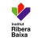

Memòria pràcticum

Autoria: Joan Bestué Valenzuela

Tutor i mentor: Meritxell Llevadias

Centre: IES Ribera Baixa // IES Illa dels Banyols

Adreça: C/ Aneto, 2-4 // C/ Lo Gaiter de Llobregat, 121-123 (Prat de Llobregat) Data: Maig 2025

ÍNDEX DE LA MEMÒRIA

A) DADES DE L’ESTUDIANT

a) Resum biogràfic

b) Descripció de la docència realitzada fins al moment

c) Filosofia docent

B1) PRIMERA PART. EL CENTRE I LA SEVA ORGANITZACIÓ

1. CONEIXEMENT I FUNCIONAMENT DEL CENTRE

a) Entorn i infraestructura del centre

b) Oferta formativa del centre

c) Òrgans de govern, coordinació i avaluació del centre

d) Organització i la gestió del centre: Documents

e) Projectes transversals de centre

2. PROFESSORAT, ALUMNAT, FAMÍLIES

a) Tipologia de l’alumnat

b) Professorat i altres treballadors

c) Atenció a la diversitat

d) Convivència i clima escolar

e) Relació amb les famílies

3. RECURSOS

a) Relacions del centre educatiu amb els recursos de l’entorn

b) Recursos organitzatius i metodològics

c) Grau Estrategia Digital

4. EXPERIÈNCIES DESTACADES

5. CONNEXIONS

B2) SEGONA PART. DIDÀCTICA ESPECÍFICA I ACTUACIÓ A L’AULA

1. L’organització didàctica del departament.

a) Funcionament del departament corresponent.

b) Tipologies d’activitats d’ensenyament-aprenentatge i estratègies d’aprenentatge c) Innovació educativa lligades a la nostra especialitat.

d) Recursos propis del departament (aules específiques, tallers, programari...)

e) Treball interdepartamental, si es cau.

2. Els grups classe i el professorat.

a) L’alumnat: observacions realitzades en diferents nivells, matèries. Comportament del grup, dinàmiques observades, comportaments individuals. Coeducació.

b) El professorat.

c) Les interaccions:

3. Programació (situacions d’aprenentatge) i actuació

a) Descripció del grup-classe a on es desenvolupa la intervenció.Context i repte.

b) Situació d’aprenentatge.

c) S’aprecia el tractament de components transversals

d) Quines activitats has utilitzat? Les has dissenyat tu?

e) Metodologies docents utilitzades.

2

h) Reflexioneu sobre la transferència de la programació dissenyada, a l’aula.

i) Dissenyeu i realitzeu una activitat (dins de la SA o com activitat puntual), que

tingui en compte al perspectiva de gènere.

j) Aplicació de la pràctica reflexiva en les intervencions.

Fase 1. Actuació, pràctica concreta.

Fase 2. Anàlisi i verbalització de la pròpia actuació

Fase 3. Procés de conscienciació:

Fase 4. Cerca d’alternatives i creació de nous mètodes

Fase 5. Aplicació dels nous mètodes. Cicle reflexiu.

5. Assistència a alguna de les Jornades o fires sobre innovació a l'ensenyament de la tecnologia, robòtica, programació.

C. REFLEXIÓ FINAL.

3

A. DADES DE L’ESTUDIANT/A:

a) Resum biogràfic. En poques línies, cal aportar dades personals com la titulació i la trajectòria professional i docent. Això ens permet situar l’autor/a.

Em dic Joan Bestué Valenzuela] i sóc graduat en Arquitectura Tècnica per l'Escola Politècnica Superior de Barcelona (EPSEB-UPC).

La meva curiositat per la docència comença durants els estudis d’educació secundària. Sempre m’ha agradat poder ajudar als companys en les matèries que més m’agradaven, habitualment ciències. Em feia sentir bé poder explicar als companys i companyes d’un altre manera les idees del mestre. A més, obtenia un feedback d'agraïment per part d’ells/es en aquest intercanvi.

Després, i amb el pas dels anys, i una vegada començo a dedicar-me professionalment al món de la construcció continuo amb aquesta dualitat, aprenent i ensenyant, el que podia, a l’obra.

Més tard, però, vaig decidir cambiar la direcció de la meva trajectòria professional degut a la manca de reforç personal que em retornava la professió i del negoci que envolta la construcció.

Aixì que finalment decideixo cursar el Màster de Professorat en Educació Secundària per retrobar aquest sentiment de pau i gratitud que em provoca ensenyar, ajudar i orientar a les noves generacions. Fet que m'ha portat a impartir classes durant l'últim any a l’ESO i Formació Professional.

Gràcies a la meva experiència relacionada amb l'ensenyament i l'àmbit acadèmic, esmentada durant aquest últim any, i també a la formació rebuda al màster m'ha permès adquirir habilitats pedagògiques i metodològiques fonamentals per a la docència.

b) Descripció de la docència realitzada fins al moment, si escau. Expliqueu les vostres experiències docents, en formació formal o informal.

- IES Joanot Martorell (Esplugues de Llobregat). Substitució durant els mesos de maig i juny del 2024. Vaig impartir classes a 3er d’ESO i 1er de Batxillerat. Ha estat la meva primera experiència com a docent. És tracta d’un centre de màxima complexitat, on he pogut desenvolupar moltes de les dinàmiques, tècniques didàctiques i de gestió d’aula estudiades al màster. També he descobert la dificultat i complexitat en l’organització d’un centre d’aquestes característiques.

- IES Illa dels Banyols (Prat del Llobregat). Substitució des del més de setembre del 2024 fins l’actualitat, amb previsió fins a final de curs. Imparteixo classe a un Cicle de Grau mig d’instal·lacions frigorífiques i de calefacció. Els mòduls que estic impartint són teòrics; termodinamica, representació de plànols, identificació d’elements, digitalització i síntesi (oficina tècnica).

4

- IES Ribera Baixa (Prat del Llobregat). Pràctiques màster professorat. Amb la meva tutora de pràctiques estic fent observacions molt interessants sobre gestió d’aula que m'aporten molts profits i utilitats. Estic en 4 grups diferents: Robòtica (optativa) de 3er ESO, Tecnología 4rt ESO, Robótica (1er Batxillerat) i Tecnologia 2on Batxillerat.

c) Filosofia docent: Reflexioneu com us veieu com a docents, en aquest moment inicial. Podeu contestar a les preguntes:

- Quins elements/valors són importants per a la docència i la funció docent?

Per mi els valors més importants per la docència són: Empatia, paciencia,

compromís, respecte, cooperació i responsabilitat.

Pel que fa els elements:

· Coneixement. Domini del contingut de la matèria.

· Didàctica i metodologia. Estratègies d’ensenyament.

· Planificació i organització. Disseny SA’s, temporització de les sessions.

· Tecnologies educatives. Integració de recursos digitals.

· Flexibilitat i innovació. Capacitat d’ajustar-se a les necessitats de l’alumnat.

· Gestió d’aula. Crear un ambient positiu i productiu.

- Quin impacte poden tenir en la teva manera de fer com a docent?

L’impacte d’aquests valors/elements a propiciat que la meva manera de fer

com a docent tingui una perspectiva mes orientadora, a més d’intentar crear

un clima de motivació a l’hora de preparar els continguts i dissenyar les SA’s.

- I en la teva relació amb l’alumnat?

Amb relació amb l’alumnat crec que amb tots aquests elements i valors, es

genera un clima de confiança i respecte propici per l’escolta activa, amb la

qual cosa millora l'ensenyament i l'educació a l’aula.

- Com t’imagines com a docent?

M’imagino, i m’agradaria, ser un docent on l’alumnat pugui sentir-se còmode i

on es pugui desenvolupar un clima confiança per poder orienta-los en

aquesta etapa de canvis que és l’adolescència. Aixì també, poder incentivar

un vincle que em pugui permetre apropar-me i aconseguir una autoritat des

del respecte i la confiança per introduir els continguts necessaris. Ajudant-los

no només a assolir coneixements acadèmics, sinó també a desenvolupar

habilitats socials i valors per a la vida.

- Quins canvis i millores penses que pots aportar a la professió docent?

Actualment des d’una perspectiva de docent novell se'm fa força complicat

poder aportar canvis o millores. Però tot i aixì, durant la meva pràctica

docent, aspiro a aportar innovació i adaptabilitat per millorar la qualitat de

l’ensenyament. Considero fonamental la integració de noves tecnologies a

l’aula per afavorir l’aprenentatge interactiu i fomentar la motivació dels

estudiants. També crec en la importància d’una educació inclusiva, adaptant

els materials i metodologies per garantir que tot l’alumnat tingui les mateixes

oportunitats d’èxit acadèmic. A més promoure un enfocament basat en

5

l’aprenentatge col·laboratiu i en el desenvolupament del pensament crític,

fomentant el debat i la resolució de problemes reals.

B. DESENVOLUPAMENT DELS DIFERENTS APARTATS DE LA MEMÒRIA:

Us proposem un guió, que permet organitzar les vostres observacions i intervencions en el centre de pràctiques. Es tracta de desenvolupar cadascun dels punts en funció de l’experiència viscuda i contrastar aquesta experiència amb el coneixement que esteu adquirint a la Universitat. És molt important incorporar les vostres reflexions sobre cadascun dels apartats.

PRIMERA PART. EL CENTRE I LA SEVA ORGANITZACIÓ

IES Illa dels Banyols

1. Coneixement i funcionament del centre

a) Entorn i infraestructura del centre

L'Institut Illa dels Banyols està situat al

carrer Lo Gaiter de Llobregat, 121-123, al

municipi del Prat de Llobregat. El centre es

troba en un entorn industrial i logístic,

proper a l'Aeroport Josep Tarradellas

Barcelona-El Prat, la qual cosa afavoreix la

seva especialització en formació

professional vinculada a sectors com el

manteniment aeromecànic i la logística.

Les instal·lacions de l'institut inclouen

tallers especialitzats, laboratoris, aules

equipades amb tecnologia avançada i

espais comuns que faciliten l'aprenentatge

pràctic i col·laboratiu. El centre ha estat

reconegut per la seva aposta per la qualitat

i la innovació educativa.

6

b) Oferta formativa del centre

L'Institut Illa dels Banyols ofereix una àmplia gamma de cicles formatius de grau mitjà i superior, així com Programes de Formació i Inserció (PFI). Entre els cicles destacats es troben:

● PFI:

○ Auxiliar de fontaneria, calefacció i climatització

○ Auxiliar de reparació i manteniment de vehicles lleugers

○ Auxiliar d'operacions aeroportuàries

● Grau Mitjà:

○ Avions amb motor de pistó

○ Electromecànica de maquinària

○ Electromecànica de vehicles automòbils

○ Instal·lacions elèctriques i automàtiques

○ Instal·lacions Frigorífiques i de Climatització

○ Instal·lacions de producció de calor

● Grau Superior:

○ Automatització i robòtica industrial.

○ Manteniment d'instal·lacions tèrmiques i de fluids

○ Manteniment Aeromecànic d’helicòpters.

○ Manteniment Aeromecànic d’Avions.

○ Manteniment de sistemes electrònics i d’aviònica d’aeronaus

○ Guia, Informació i Assistències Turístiques (adaptat amb Curs TCP)

El centre és l'únic a Catalunya que ofereix tota l'oferta de cicles de manteniment aeromecànic, destacant-se com a referent en aquest àmbit.

c) Òrgans de govern, coordinació i avaluació del centre

L'equip directiu de l'Institut Illa dels Banyols està format per professionals que lideren diferents àrees clau:

● Direcció:Juan Cañete

● Cap d'Estudis: Eduard Bartí

● Secretari: Marcos Lara

● Coordinació Pedagògica: Lorena Gallego

A més, el centre compta amb responsables de qualitat i millora, escola-empresa, prevenció de riscos laborals i informàtica, entre d'altres.

L'institut participa en programes de qualitat i innovació educativa, com la Xarxa de Comissió Digital de Centre, per tal de garantir una formació actualitzada i adaptada a les necessitats del mercat laboral.

7

d) Organització i gestió del centre

L'Institut Illa dels Banyols disposa de Normes d'Organització i Funcionament de Centre (NOFC) que regulen aspectes com la convivència, l'ús de les tecnologies i la participació de la comunitat educativa. A més, el centre gestiona projectes de mobilitat internacional, com Erasmus+, i col·labora amb empreses del sector per oferir formació dual i pràctiques professionals.

IES Ribera Baixa

1. Coneixement i funcionament del centre

a) Entorn i infraestructura del centre.

L'Institut Ribera Baixa està situat al carrer

Aneto, 2-4, al barri de Sant Jordi-Ribera Baixa

del Prat de Llobregat. Aquest barri,

tradicionalment de classe treballadora, ha

experimentat una notable diversitat cultural a

causa de l'arribada de nous residents al llarg

dels anys.

Pel que fa a la infraestructura de l'institut,

compta amb un equip de prop de 50 docents i

4 treballadors d'administració i serveis, atenent

aproximadament 600 estudiants d'entre 11 i 18

anys.

b) Oferta formativa del centre.

L'oferta educativa inclou l'Educació Secundària Obligatòria (ESO) i el Batxillerat (Ciències i Tecnologia i Humanitats i Ciències Socials). El centre està equipat amb les noves tecnologies necessàries per a l'ensenyament actual i mostra un interès evident per treballar mitjançant projectes.

c) Òrgans de govern, coordinació i avaluació del centre (projecte de qualitat i millora continua, si escau)

L'Institut Ribera Baixa compta amb diversos òrgans de govern i coordinació que asseguren el bon funcionament del centre. L'equip directiu està format per la direcció (Ana Belén Barrena), secretaria (Silvia Polis), la cap d'estudis (Pilar Ruiz) i la coordinació pedagògica (Ana Maria Rodrigo). Aquests òrgans s'encarreguen de la gestió diària i de la implementació de les polítiques educatives del centre.

A més, l'Institut Ribera Baixa participa en el Programa de Qualitat i Millora Contínua (PQiMC), una iniciativa que té com a objectiu ajudar els centres educatius a assolir la millora en totes les àrees i processos, mitjançant la implantació de sistemes de gestió de la qualitat basats en el model europeu EFQM, adaptats al sector educatiu.

8

d) Organització i la gestió del centre:

Les NOFC. No he tingut accés a l'última versió de les NOFC, pero si que he pogut tenir la versió anterior (aprovada al 2020 al consell escolar). Aquesta última versió inclou: El canvi de normativa en l’ús del telèfon mòbil i es defineix la coordinació de mobilitat en projectes Erasmus +.

1RA PART: Reglament del Règim Intern:

9

2NA PART: Criteris i mecanismes de coordinació educativa

En aquesta segona part es defineixen molts aspectes d’organització: ràtios, moments de distribució, organització de grups de treball, atenció a la diversitat i necessitats educatives especials, a l’alumnat benvingut i a altes capacitats.

També s’estableixen criteris en cas d’absentisme prolongat, d’estada a l’empresa, organització d’equips docents.

Es tracten els mecanismes d’acció tutorial, la participació en la comunitat escolar, l’intercanvi d’informació entre escola i famílies, l'orientació acadèmica. També inclou la carta de compromís.

Aquesta segona part mostra com el centre desenvolupa la gran diversitat de tasques de coordinació interna. A parer meu, representa una de les parts més significatives de les NOFC. En general, les NOFC regulen la major part dels aspectes quotidians del centre.

Altres documents a destacar sobre el funcionament del centre:

- Pla general Anual (PGA) 2024-2025

- Memòria 2023- 2024

- Pla d’acció tutorial.

Que destaqueu del PEC?

El Projecte Educatiu de Centre (PEC) de l'Institut Ribera Baixa estableix les bases del seu model d'ensenyament, posant èmfasi en l'aprenentatge d'idiomes, especialment l'anglès, i en el desenvolupament de competències digitals. Per facilitar la pràctica oral de l'anglès, es fan sessions en grups reduïts a primer d'ESO. També es dóna molta importància a l'ús de les TIC, integrant-les en totes les matèries per millorar les habilitats dels alumnes en aquest àmbit.

L'avaluació formativa és un altre dels pilars del centre, ja que permet fer un seguiment continu del progrés de l'alumnat i adaptar les metodologies segons les seves necessitats. A més, el centre participa en projectes d’innovació educativa reconeguts pel Departament d’Educació, amb l’objectiu de millorar constantment i aplicar nous enfocaments pedagògics.

En definitiva, el PEC de l'Institut Ribera Baixa busca oferir una educació integral que prepari els estudiants per als reptes acadèmics i professionals, fomentant la seva autonomia i confiança en l’aprenentatge.

IES Illa dels Banyols

1. Identitat i caràcter del centre:

● El centre es defineix com inclusiu, laic i compromès amb la qualitat educativa

i l’equitat.

● Té una clara orientació cap a la formació professional industrial i a la relació

amb l’entorn productiu, especialment amb sectors com l’aeronàutic, l’energia i

l’automatització.

10

2. Missió, visió i valors

● Missió: Oferir una formació professional de qualitat que garanteixi la inserció

laboral i l’aprenentatge permanent.

● Visió: Ser un centre innovador, referent en FP, amb una forta connexió amb el

teixit empresarial.

● Valors: Compromís, responsabilitat, igualtat, sostenibilitat, innovació i treball

en equip.

3. Inclusió i atenció a la diversitat

● Es despleguen plans d’acollida per alumnat, famílies i professorat nouvingut,

així com protocols específics per garantir la igualtat d’oportunitats.

● L'atenció a la diversitat es concreta en criteris metodològics adaptats i

suports personalitzats.

4. Avaluació i millora contínua

● El centre utilitza indicadors de progrés i sistemes d’avaluació interna

periòdica per revisar objectius, pràctiques educatives i resultats.

● Aquest seguiment inclou la valoració de competències, l’abandonament

escolar i la inserció laboral.

e) Projectes transversals de centre (projectes europeus, d’innovació, d’autonomia del centre, lingüístics, educació inclusiva, transformació digital.).

L'Institut Ribera Baixa del Prat de Llobregat participa en diversos projectes transversals que abasten àmbits com la innovació educativa, la internacionalització, la inclusió i la transformació digital.

Projectes Europeus i d'Internacionalització:

● Projecte Erasmus+ KA2: El centre forma part del programa Erasmus+ KA2, que promou la cooperació per a la innovació i l'intercanvi de bones pràctiques entre institucions educatives europees. Aquesta participació facilita l'intercanvi cultural i acadèmic, enriquint l'experiència educativa tant per a l'alumnat com per al professorat.

● Projectes eTwinning: L'institut participa en projectes eTwinning, una plataforma que permet als centres educatius europeus col·laborar mitjançant l'ús de les tecnologies de l'informació i la comunicació (TIC), fomentant així el treball conjunt i l'intercanvi cultural.

Projectes d'Innovació i Autonomia del Centre:

● Projectes de Sensibilització d'Emprenedoria: En col·laboració amb la fundació FemCAT, el centre desenvolupa projectes que promouen l'esperit emprenedor entre l'alumnat, fomentant la creativitat i la iniciativa empresarial.

● Servei Comunitari: L'institut impulsa projectes de servei comunitari que involucren els estudiants en activitats de voluntariat i participació ciutadana, promovent valors de responsabilitat social i compromís cívic.

11

Projectes Lingüístics:

● Grup d'Experimentació per al Plurilingüisme (GEP): El centre participa en el GEP, una iniciativa que té com a objectiu millorar la competència lingüística de l'alumnat en diverses llengües, promovent el plurilingüisme i la diversitat cultural.

Projectes d'Educació Inclusiva:

● Acollida per a Alumnes Nouvinguts: L'institut disposa de programes d'acollida específics per a alumnes que arriben de fora de Catalunya, facilitant la seva integració acadèmica i social.

● Projecte Horitzó: Escola Inclusiva: L'Institut està compromès amb una educació inclusiva, atenent les necessitats educatives especials (NEE) dels seus estudiants. Aquest enfocament es reflecteix en el seu "Projecte Horitzó: Escola Inclusiva", que destaca l'evolució de l'atenció educativa per a alumnes amb NEE i la importància de la inclusió en l'àmbit educatiu.

● Mediació Escolar: El centre ofereix serveis de mediació escolar per resoldre conflictes i promoure un clima de convivència positiu, involucrant tant alumnat com professorat en la gestió pacífica de les diferències.

Projectes de Transformació Digital:

● Taller de Fabricació Digital i Impressió 3D: L'institut compta amb un taller equipat amb ordinadors i impressores 3D, on l'alumnat pot desenvolupar projectes des dels primers cursos, fomentant les competències digitals i tecnològiques.

A l’institut Illa dels Banyols destacaria els següents projectes i xarxes:

Participa activament en programes com Erasmus+, Xarxa de qualitat, FP Dual i innovació pedagògica. A més, hi ha un fort impuls als projectes de col·laboració amb empreses i l'actualització dels currículums segons les demandes del sector productiu.

12

2. Professorat, alumnat, famílies.

a) Tipologia de l’alumnat (procedència de l’alumnat: geogràfic, social; necessitats educatives especials...).

L'alumnat del IES Ribera Baixa és procedent en major part del Prat del Llobregat, del barri Sant Jordi-Ribera baixa i dels barris adjacents. La matrícula de l’Institut és una matrícula viva, de manera que al llarg del curs arriben nouvinguts.

A l’institut Illa dels Banyols l’alumnat procedeix de tota Catalunya, degut a que els cicles que s’ofereixen no están disponibles en totes les comarques.

En tots dos instituts l’origen de l’alumnat és divers: la majoria nascuts a Catalunya, també hi ha una part de l’alumnat procedent de l’ètnia gitana de la comunitat del barri, i hi ha un percentatge creixent d’altres nacionalitats com seria la sud-americana, nord-africana i asiàtica, en especial del Marroc i Pakistan.

En el context econòmic-social, podem dir que la població és majoritàriament de classe treballadora, però en les darreres dècades s'ha observat una major diversitat cultural i socioeconòmica.

Al IES Ribera Baixa algunes de les necessitats educatives a l’escola són: dificultats d’aprenentatge, dificultat de comprensió del català o el castellà, TDAH i TDA i autisme.El centre ha implementat una Unitat de Suport a l'Educació Especial (USEE) per oferir una atenció més personalitzada als estudiants que ho requereixen. Aquesta unitat treballa conjuntament amb l'equip docent per adaptar el currículum i les metodologies d'ensenyament, assegurant que tots els alumnes tinguin accés a una educació de qualitat.

Aquestes iniciatives reflecteixen el compromís de l'Institut Ribera Baixa amb la inclusió i la qualitat educativa, assegurant que tots els estudiants, independentment de les seves necessitats, rebin una educació adequada i equitativa.

b) Funcions del professorat (a part de les funcions docents pròpiament dites, quines altres observeu que desenvolupa el professorat (coordinacions i tutories..).

No he trobat diferències important a destacar en aquest aspecte entre els dos instituts.

Els docents estan organitzats a les diferents àrees i departaments de l’institut. A cada àrea hi ha un coordinador que s’encarrega de traspassar les directrius de direcció als docents i coordinar les diferents assignatures entre elles. Les àrees organitzen una o dues reunions trimestrals, tot i que també n'hi poden haver extraordinàries.

El conjunt de docents es reuneix als claustres, on es tracten temes generals de l’escola, aquests claustres tenen lloc una vegada cada trimestre.

13

Aquells docents que són tutors, participen setmanalment a les reunions de tutors del mateix cicle. Aquests han de fer una reunió a principi de curs amb totes les famílies, així com a mínim una reunió individualitza al llarg del curs on participa la família i l’alumne.

Els docents també poden participar en diferents comissions de treball com per exemple la revisió del PEC, elaboració del pla digital, participació en projectes internacionals… Entre altres.

c) Atenció a la diversitat.

IES Ribera Baixa

Per a l’atenció a la diversitat el centre compta de les següents estratègies:

Reunions periòdiques amb la psicòloga del centre, pla individualitzat si s’escau, aula d’acollida, comissió d’atenció a la diversitat, codocència, vetlladors, treball cooperatiu.

IES Illa dels Banyols

En aquest cas, en cada reunió d’equip docent es comenta amb la orientadora del centre cada conflicte, rendiments acadèmics de l’alumnat i possibles actuacions, arribant a acords entre tot l’equip docent.

d) Convivència i clima escolar. Prevenció, gestió i resolució de conflictes.

Considero que la convivència i el clima tanta a l’Institut Ribera Baixa com al Illa de Banyols són bons. Aquest aspecte és difícil de mesurar de forma qualitativa, ja que són aspectes perceptius i, per tant, subjectius.

Tots dos instituts tenen eines diferents per la prevenció i la gestió de conflictes: l’acció tutorial, plans de convivència, mecanismes de resolució de conflictes com el programa de mediació, la carta de compromís i les NOFC.

e) Relació amb les famílies.

IES Ribera Baixa

La relació amb les famílies es manté de manera directa mitjançant reunions amb els tutors cada X, i si calgués alguna extraordinaria. Pel que fa la comunicació amb la resta de l’organització la podem establir amb el següent esquema:

14

IES Illa de Banyols

Les reunions amb les famílies es realitzen conjuntament, 3 en tot el curs ( inici nadal- final de curs). Si calgués alguna reunió individual, tant pel rendiment de l’alumne com pel seu comportament o actitud a classe es farà saber a la familia a través de trucada telefonica. Depén del tutor si vol tenir l’alumne present en aquesta reunió.

3. Recursos

a) Relacions del centre educatiu amb els recursos de l’entorn, (ajuntament, centres de recursos específics, universitats, empreses...) .

IES Ribera Baixa

L’Institut Ribera Baixa treballa en projectes amb l’ajuntament del Prat sobre sostenibilitat (aquest any estan fent una cerca sobre l’energia solar i les seves possibilitats), l’alumnat de 4rt d’ESO aniran a un centre esportiu municipal per veure d’aprop aquest tipus de sistema de captació d’energia solar i com s'implementa en un complex esportiu amb piscina.

També treballen en equip amb la resta d’escoles, tant de primaria com de secundaria, realitzant fires d’exposicions dels projectes treballats a classe, aixì també fan millorar la convivència entre els centres educatius de la zona.

Un altre projecte és amb la UPC de Vilanova i la Geltrú, on els alumnes de 1er i 2on de Batxillerat reben unes explicacions per posteriorment realitzar uns tallers sobre les propietats i assaigs dels materials.

15

IES Illa de Banyols

A l’institut Illa dels Banyols destacaria sobre tot la relació amb les empreses, ja que son molt necessàries de cara a fer les pràctiques de l’alumnat. L’institut fa una recerca molt intensiva d’empreses de cada sector per tal de poder fer convenis col·laboradors.

A més, durant una setmana en cada curs acadèmic fan un acte nomenat “Jornades Tècniques” on les empreses de cada sector venen al centre a fer xerrades a l’alumnat dels diversos cicles formatius. Durant aquesta setmana s’organitza un horari lectiu diferent per que l’alumnat pugui assitir a aquestes ponències.

b) Recursos organitzatius i metodològics (agrupaments, tallers, aules informàtiques, espais pel treball per projectes...).

IES Ribera baixa

L’Institut consta de 3 aules d'informàtica, 4 tallers de tecnologia i 2 laboratoris de ciencies. En aquestes aules es fan agrupaments de ½ grup. L’altre ½ grup fa classe d’un altre assignatura al taller/laboratori.

En el cas de Tecnología de 4rt d’ESO es porta al grup sencer ja que és una assignatura d'especialitat i el grup no és molt nombrós (17 alumnes).

Ordinadors Portàtils: L'alumnat de tercer de l'ESO a segon de Batxillerat disposa de portàtil personal, per treballar tant a l'institut com a casa. Els dos primers cicles de l'ESO disposen d'ordinadors portàtils distribuïts en tres carros, fet que permet treballar a tot l'almunat, a l'aula, amb el seu propi ordinador.

Robòtica i Programació: Pel desenvolupament de projectes transversals i donar resposta als currículums de les assignatures amb contingut tecnològic i digital (Tecnologia i Digitalització, Tecnologia, Digitalització, Robòtica i Programació i Tecnologia i Enginyeria), l'institut disposa de 20 robots 3dBot i així com plaques Arduino, sensors i actuadors pel muntatge de robots i automatismes.

Impressió 3D i Fabricació Digital: L'institut disposa d'un taller de fabricació digital i impressió 3D dotat amb ordinador i impressora 3D pel desenvolupament de projectes des dels primers cursos de l'ESO fins segon de Batxillerat.

IES ILLA DE BANYOLS

L’institut consta de 4 sales d'informàtica (una d’elles d’us exclusiu per els alumnes de avionica). Com es tracta d’un centre exclusivament de cicles formatius hi han molts tallers:

3 Taller hangar d’avionica, en aquest tallers es on es poden trobar els avions amb els que l'alumnat realitza les pràctiques.

4 tallers d’automoció, on hi han una serie de cotxes i motors per l’alumnat.ç

4 trallers de climatitazació, on estan els aparells de fred (AACC) i calor (calderes, radiadors,..) on els alumnes fan les classes de practica.

1 taller de mecanització i soldadura, aquest taller es compartit per tots els cicles.

En el que respecta a la cicle on estic exercint de professor, cal dir que s'utilitzen 3 aules per realitzar la part teorica, aquestes aules estan connectades directament

16

amb els tallers per si cal veure un material o maquina per que l’alumnat pugui entendre millor alguns conceptes. Totes les aules de teoria tenen una pantalla tàctil rebudes de la dotació d’aquest curs de la generalitat.

Agrupaments: Els agrupaments es realitzen a l’hora de fer pràctiques a taller en grups de 15 alumnes com a màxim. Separant aixi la classe en grup A i grup B amb un altre mòdul (assignatura) de taller. En les classes teòriques no es realitzen agrupaments.

Les diferencies en aquest apartat son bastant evidents, ja que l’activitat dista força d’un centre a un altre en aquest aspecte. Tot i així, els agrupaments i la dinamiques de grup son forces similars.

c) Grau de desenvolupament de l’estratègia digital de centre: Tenen definida una estratègia digital de centre (EDC)? fan servir plataforma virtual? quina? quin és el posicionament del centre respecte a l’utilització de dispositius mòbils? compten amb l’assessorament d’un “mentor digital”?

L’Estratègia Digital de Centre (EDC) és el document que recull totes les accions que es realitzen o realitzaran en un centre per aconseguir la màxima competència digital de l’alumnat, del professorat i del centre educatiu. Té com a referent el Pla d’educació digital de Catalunya, on s’indica la necessitat d’assolir la fita d’una societat digitalment competent, fent èmfasi en l’equitat i tenint en compte l’evolució del context social i tecnològic.

IES Ribera Baixa

Per fer la diagnosi de l'estat del centre, a l'Institut Ribera Baixa han fet servir l'enquesta SELFIE, una eina proporcionada per la Comissió Europea que serveix per a avaluar l'estat de maduresa digital del centre educatiu. Tant l'alumnat com el professorat i l'equip directiu van fer enquestes durant les primeres setmanes lectives de l'any 2022 amb els següents resultats.

Fan servir la plataforma virtual per passar llista Clickedu, encara que les incidències encara fan servir paper. El suport didàctic a l’alumnat es fa a través del Classroom de Google.

IES Illa dels Banyols

A l’IES Illa dels Banyols fan servir la plataforma virtual iEduca tant per passar llista, com per notificar incidències, reservar aules, posar notes d’avaluacions, penjar actes de reunions, fitxatge d’horari dels professors, etc. Tota la part més burocratica es realitza amb aquesta plataforma.

Conclusió, en aquest aspecte crec que l’IES Illa de Banyols té un ordre i un sistema més eficient de cara als docents, més encara si es tracta de novells.

17

Punts forts

IES Ribera Baixa

● El centre té equips propis per a l'alumnat de 1r, 2n, 3er i 4rt d'ESO rebuts de

la dotació de la Generalitat.

● El centre disposa de maquinari específic com Robots 3dbot, plaques Arduino

o impressores 3d.

● Gran capacitat d'adaptació del professorat

IES Illa de Banyols

● El centre disposa de 4 sales d'informàtica.

● Disposem de 8 carrets de portàtils amb el programari necessari.

● El centre disposa de totes les eines necessàries als tallers de totes les

famílies dels CFGM.

● Tot està molt organitzat i protocolaritzat, s’agreix quan una docent nouvingut

arriba.

Punts febles

IES Ribera baixa

● Les famílies no tenen capacitat de resoldre dubtes tècnics de l'alumnat

● L'alumnat té poca capacitat de resoldre incidències tècniques per si sols

● Poca relació amb el professorat d'altres centres a través de xarxes

● Molta mobilitat de professorat entre anys acadèmics

● Manca de sistematització a l'hora d'avaluar amb mitjans digital.

● La documentació quant a l'àmbit digital està desactualitzada.

IES Illa de Banyols

● L'alumnat té poca capacitat de resoldre incidències tècniques per si sols.

● Les famílies no tenen capacitat de resoldre dubtes tècnics de l'alumnat.

● Molta mobilitat de professorat entre anys acadèmics

● Només l’alumnat de primer curs de CFGM tenen ordinador de les dotació de

la Generalitat.

IES Ribera Baixa

A partir de la diagnosi realitzada i de la visió i objectius del PEC, es defineixen cinc objectius que poden ajudar el centre a desenvolupar millor la seva tasca pel que fa a l'ús de les TAC.

1. Implementar pràctiques d'avaluació amb mitjans digitals

2. Aplicar una política de protecció de dades al centre

3. Capacitar l'alumnat per detectar i resoldre problemes tècnics

4. Millorar la comunicació d'incidències tècniques i resoldre-les més

ràpidament

5. Redactar i revisar la documentació referent a l'ús de les TAC

18

Pel que fa l’ús de telèfons mòbils les NOFC recull la següent normativa:

(En els dos centres funcionen d’una manera molt semblant, no he trobat diferències gaire destacables - Ribera Baixa i Illa de Banyols)

- L'ús del mòbil està restringit: no es pot utilitzar a l'hora del pati.

- L'ús del mòbil queda limitat a activitats pedagògiques.

- 1a vegada que l’alumnat incompleix la normativa:

L'alumne, acompanyat del professor/a, deixarà el mòbil apagat al despatx de

la Cap d'Estudis i l’alumne el podrá recollir a les 14:30h. Full d'incidència.

- 2a vegada que l’alumnat incompleix la normativa:

L'alumne, acompanyat del professor/a, deixarà el mòbil apagat al despatx de

la Cap d'Estudis i la família el podrá recollir a les 14:30h. Full d'incidència.

- 3a vegada que l’alumnat incompleix la normativa:

L'alumne, acompanyat del professor/a, deixarà el mòbil apagat al despatx de

la Cap d'Estudis i la família el podrá recollir a les 14:30h. Es demana a la

família que no es porti el mòbil durant una setmana. Full d'incidència.

- 3a vegada que l’alumnat incompleix la normativa:

L'alumne, acompanyat del professor/a, deixarà el mòbil apagat a la Cap

d'Estudis.

REITERACIÓ = Falta greument perjudicial a la convivència=obertura d'expedient

4. Destaqueu algunes experiències que penseu que són rellevants en el centre o d’altres que no funcionen. Argumenteu la vostra resposta.

IES Ribera Baixa: En aquest mes de gener que porto a l’Institut Ribera Baixa no tinc gaires experiències rellevants a explicar. Encara que sí podría explicar una cosa que m’ha sobtat força. És tracta sobre la diferencia en l’alumnat que cursa 4rt d’ESO, 1er i 2on de batxillerat. Es una passada com en aquest període de temps l’alumnat comença a responsabilitzar-se i a tenir un pensament molt més crític, comences a veure com aquells nens es transformen en adults.

IES Illa de Banyols: Seguint el fil del que he comentat anteriorment, en aquest centre també succeeix d’alguna manera un canvi interessant a nivell maduratiu en els nois i noies de 1er de CFGM i de 2on. En el primer curs l’alumnat té una actitud com si estigués cursant un “5é d’ESO”, en canvi en el segon curs l’alumnat està molt més centrat en els seus estudis, crec que en els cicles es dóna aquest “fenomen” perquè es veuen molt a prop d’acabar els estudis i sortir al mercat laboral.

19

5. Quines connexions realitzes entre el que has vist en el centre i els continguts tractats en les assignatures del Mòdul genèric (organització escolar, aprenentatge i conducta i societat i família)?

20

1. L’organització didàctica del departament

a) Funcionament del departament corresponent.

IES Ribera Baixa

L’àrea de tecnologia i digitalització es compon d’un cap de departament i de 4 professors que treballen en les diferents assignatures de tecnologia, optatives tècniques (Robòtica, TIC, mecanografia, programació) i informàtica als cursos d’ESO i batxillerat. Part del professorat també imparteix classes de matemàtiques i molts d’ells són tutors.

L’àrea de tecnologia es troba al costat dels tallers de tecnologia i aules d’informàtica, al meu entendre aquest fet facilita la feina als docents de l’àrea, ja que els manté molt a prop els uns dels altres podent col·laborar al seu dia a dia.

IES Illa dels Banyols

El departament es compon d’un cap de departament i 9 professors. Aquest department s’anomena Departament d'Instal·lacions i manteniment, agrupa dos CFGM i un CFGS. L’institut té una disposició dels departaments que s’engloben tots en un mateix edifici. En aquest cas lluny de les aules i els tallers.

b) Tipologies d’activitats d’ensenyament-aprenentatge i estratègies d’aprenentatge

IES Ribera Baixa

L’assignatura de tecnologia de primer a tercer d’ESO es distribueix en una hora setmanal de teoria amb el grup sencer i cada dues setmanes es realitzen pràctiques de dues hores amb el grup partit. La meitat del curs les pràctiques es realitzen al taller i l’altra meitat a l’aula d’informàtica. El desdoblament de grups per realitzar les pràctiques es coordina amb l’àrea de biologia, de manera que mig grup realitza pràctiques de tecnologia i l’altra meitat realitza pràctiques de biologia/experimentals.

L’alumnat de l’ESO que he estat més present a les seves classes es el de l’optativa de robòtica, es treballa sense cap tipus de llibre, la professora en aquest porta material preparat en forma de presentació i unes fitxes on s’explica que s’ha de fer i com per després donar pas la part pràctica de taller.

IES Illa dels Banyols

Cada cicle té unes estipulades unes hores de classes pràctiques. En el meu cas, els cicles on jo exerceixo de professor, l’horari esta repartit en el primer curs on hi ha una càrrega de part teorica més elevada, 16 hores setmanals, i en el segon curs del cicle on hi ha menys càrrega teòrica i més pràctica, 18 hores setmanals.

L’alumnat no disposa de llibres per els mòduls, a excepció de digitalització. Mòdul nou que s’ha instaurat de manera colectiva a tots els cicles. La resta, els professors son els encarregats de preparar els seu propi material.

21

c) Innovació educativa (participació en programes d’intercanvi, elaboració de materials propis, d’altres...) lligades a la nostra especialitat.

IES Ribera Baixa

Als cursos de primer i tercer d’ESO es fa l’assignatura de robòtica on s’entrena a l’alumnat a pensar a través del pensament computacional. L’escola utilitza les plaques Microbit, 3dBots i Arduino.

A l’assignatura de tecnologia de tercer d’ESO es proposa el disseny en tres dimensions, amb el programa Tinkercad que permet fer dissenys per enviar a imprimir els arxius en 3D amb la impressora 3D.

En el grup de robòtica de 4rt d’ESO, Un cop l’alumnat ha après a programar, l’alumnat forma grups per fer una proposta de solucions domòtica per afavorir la sostenibilitat. Aquestes maquetes es portaran en el mes de juny a una fira organitzada per l'ajuntament on s’exposaran a l’alumnat de primaria.

IES Illa dels Banyols

Els cicles estan molt enfocats a la sortida laboral, i per tant, a les instal·lacions frigorífiques i de climatització. En el meu cas, al primer curs treballen amb tots els tipus de soldadura, ja que a segon curs treballen molt sobre equips reals en les sessions de taller. A les sessions teòriques, s’expliquen conceptes com; el principi termodinàmic de les màquines de fred/calor, per poder calcular i dimensionar les instal·lacions, o a fer servir programa de dibuix (Autocad).

d) Recursos propis del departament (aules específiques, tallers, programari...)

IES Ribera Baixa

El departament de tecnologia disposa de:

- Àrea de tecnologia amb taules de treball per als docents.

- Tres tallers amb les eines necessàries per als projectes de tecnologia, tecnologia industrial i robòtica.

- Dues aules d’informàtica.

- Quatre “aules d’informàtica mòbils”: armari amb rodes amb ordinadors portàtils.

- L’alumnat de primer fins a quart d’ESO tenen Chromebook personal.

- Una impressora 3D.

- Kits Arduino l’optativa de robòtica.

- Material d’electrònica i robòtica pel batxillerat tecnològic.

- Llicències de programes específics per les pràctiques de digitalització.

IES Illa dels Banyols

El departament de instal·lacions i manteniment disposa de:

- Quatre tallers amb les eines necessàries per dur a terme les diferents pràctiques proposades pels docents.

- 3 aules d'informàtica (s'ha de reservar amb anterioritat a través de la plataforma virtual del centre iEduca)

- Aula de mecanitzat i soldadura, pels alumnes de primer curs.

- Material fungible per realitzar pràctiques.

22

e) Treball interdepartamental, si es cau. (funcionament dels projectes, avaluació, creació d’activitats...)

IES Ribera Baixa

S’ha realitzat una activitat entre els departaments de tecnologia i ciències: Els l’alumnat de robotica han creat un muntatge amb Arduino i una serie de sensors per mesurar diferents valors de l'entorn per després entregar-ho a l'alumnat de ciències per realitzar un treball de camp on van a prendre les mesures sobre la contaminació del municipi.

L’escola està treballant per implementar projectes entre diferents àrees els cursos vinents.

IES Illa dels Banyols

En aquest institut el treball interdepartamental és més complicat. Ja que cada cicle té una finalitat i un enfocament laboral específic.

2. Els grups classe i el professorat.

a) L’alumnat: observacions realitzades en diferents nivells, matèries. Comportament del grup, dinàmiques observades, comportaments individuals. Coeducació (hi ha diferències entre el comportament i els processos d’ensenyament-aprenentatge de noi i noies?)

IES Ribera Baixa

Els cursos on he estat fent el seguiment són els grups de tercer i quart de l’ESO. Així i tot, també he pogut seguir classes de primer i segon d’ESO i batxillerat. Els grups classe són nombrosos, arribant a trenta alumnes per grup, per la qual cosa he pogut estar en contacte amb un gran nombre d’adolescents. L’alumnat prové principalment del barri de Sant Jordi-Ribera Baixa, així que la major part de l’alumnat té un perfil semblant els uns dels altres. La diversitat més gran que he pogut observar al llarg de la meva estada és l’alumnat recent benvingut d’altres parts del món. M’ha sorprès els esforços que realitzen aquests alumnes per entendre el funcionament de les classes i donar resposta a les propostes didàctiques del professorat.

Al llarg de les meves observacions he pogut veure la diferència entre l’alumnat dels diferents cursos.

En iniciar l’ESO els he vist molt tranquils i silenciosos, a segon sembla que travessen un moment difícil on he vist diverses situacions conflictives a les aules. Els grups de tercer i quart els he trobat més relaxats i ja a batxillerat el canvi és significatiu, amb alumnat molt més madur preparant-se per les proves PAU.

També he pogut veure la diferència del grup en funció de l’hora del dia i del dia de la setmana, sent les classes del dilluns al matí les més tranquil·les i les classes d’alguna tarda les més esvalotades.

IES Illa dels Banyols

Els cursos on he exercit de professor, han estat primer i segon de dos cicles formatius de grau mitjà. En aquest cas he trobat la bona cohesió de grup que es genera en poques setmanes en el grups de primer, son alumnes que provenen de diferents parts de Catalunya, que no es coneixen i que tenen una edat on encara estan un procés maduratiu important. Tot i així els grups encara son molt juganers, encara venen amb el xip de l’ESO i

23

pensen que el cicles son regalats. A segon curs, en canvi, quan comencen a veure la realitat del mon laboral que els hi espera a la volta de la cantonada comencen a tranquil·litzar-se força. Depenen molt de les seves emocions en el seu rendiment, i en aquesta fase de la seva vida, adolescencia, es una muntanya russa.

b) El professorat: observacions de l’actuació de diferents professors i professores. Diferències entre estils, en funció de la matèria, del nivell, metodologies docents observades, actuacions davant de determinades situacions, resposta del grup...

IES Ribera Baixa

Els docents de l’àrea de tecnologia provenen de diversos camps i estudis: arquitectura, informàtica, matemàtiques, enginyeria, física…

Actualment, a l’àrea hi ha 5 docents, aquests dediquen trenta hores d’estada a l’escola de les quals catorze hores són lectives.

El meva mentora a l’escola ha sigut la Meritxell Llevadies, qui m’ha acompanyat en tot moment durant les meves pràctiques a l’escola i ajudat i resolt els dubtes que m’han anat sortint.

Les meves pràctiques, tot haver-se centrat en el seguiment dels cursos que feia la Meritxell també he pogut veure uns deu docents més del centre realitzen les seves classes. D’aquesta experiència, de l’observació de la feina de tots ells n’he pogut aprendre molt i és d’on m’emporto els ensenyaments més significatius d’aquest curs de màster.

Estructura de les sessions: una forma de estructurar les sessions teòriques que he trobat molt interessants seria: exposició de la teoria, una breu anècdota o situació que lligui la teoria amb la pràctica i per acabar exercicis.

Metodologies a l’aula: he pogut veure com hi ha moltes maneres de fer les classes, entre elles: corregir els exercicis en veu alta, fer sortit a un alumne a la pissarra perquè el pugui fer en directe, portar material a l’aula i agrupar les taules en grups per a fer treball cooperatiu, fer exàmens amb el Chromebook…

Metodologies al taller: he vist com els docents prioritzaven la seguretat i l’ordre per sobre de la resta de coses quan es tracta d’estar al taller. També he vist com els docents explicaven a l’alumnat els objectius i els passos concrets de la sessió, recalcant-los a l’hora d’explicar-los i anotant-los a la pissarra perquè no quedin en un segon pla.

Metodologies al taller: he vist com els docents prioritzaven la seguretat i l’ordre per sobre de la resta de coses quan es tracta d’estar al taller. També he vist com els docents explicaven a l’alumnat els objectius i els passos concrets de la sessió, recalcant-los a l’hora d’explicar-los i anotant-los a la pissarra perquè no quedin en un segon pla.

Postura i actitud: Els docents solen gesticular molt, parlar amb veu alta i clara (sense forçar-la) i moure’s per l’aula amb seguretat.

Comunicació amb l’alumnat: molts docents repeteixen a l’alumnat els continguts i aspectes de la sessió més importants. Ho poden fer de forma oral, escrivint a la pissarra, remarcant el que volen dir de formes diferents. D’aquesta forma s’asseguren que els missatges més importants arriben als receptors.

24

Estratègies per la gestió d’aula: alguns docents abans d’entrar a classe s’esperen a la porta a què tot l’alumnat estigui assegut per així començar amb bon peu. Si hi ha xivarri a l’aula els docents no comencen a parlar, esperen amb paciència i serietat a què l’alumnat estigui en silenci.

IES Illa dels Banyols

Els docents del area d’instal·lacions i manteniment es divideixen en dos grups, els docents PS (professor secundària) i els docents PT (professor taller). Els docents PS provenen de camps com enginyeria i arquitectura. Els docents PT provenen del mon laboral del sector.

Dels 9 docents hi han 7 que fem jornada complerta i 2 que fan mitja jornada. A l’FP la disposició horaria és diferent de l’ESO. A la FP son 24h setmanals d’estada al centre, repartides en hores lectives, guàrdies, hores de reducció per càrrec i reunions de departament.

c) Les interaccions: relacions entre els alumnes, entre alumnes i professorat, entre el professorat.

IES Ribera Baixa

He pogut veure com alumnat i docents es relacionen al llarg del curs, la convivència que he observat en termes generals la considero molt bona tot i que en moments resulta difícil. He pogut assistir a alguna classe una mica caòtica on l’alumnat estava desconcentrat i dispers, a la majoria de sessions a les quals he assistit l’ambient ha estat bo.

IES Illa dels Banyols

Trobo que la interacció amb l’alumnat és molt positiva, en aquest institut es mira molt la cohesió. Es fan 3 sortides durant el curs acadèmic, una per trimestre, per reforçar aquest aspecte. L’alumnat participa activament en el tipus d’activitat a realitzar, acustamen a sortir activitats com jugar a futbol, pàdel, circuit de karts, etc. Es imprescindible que els professors també participin activament en aquestes activitats.

3. Programació (situacions d’aprenentatge) i actuació. La situació d’aprenentatge que incorporeu és la que heu impartit de forma autònoma en el centre. Es recomana que sigui la que s’ha elaborat en les classes del màster.

a) Descripció del grup-classe a on es desenvolupa la intervenció: nombre d’alumnat, característiques principals. Context i repte.

Títol : Encàrrec a robòtica, Munten un dispositiu amb sensor CO2.

Alumnat: activitat que va dirigida a l’alumnat de tercer d’ESO. 12 alumnes

Ubicació: L’acció es desenvolupa a les aules-taller de tercer de l’Institut Ribera Baixa als alumnes de l’optativa de robòtica. Les sessions tenen una durada de 1 hora.

Assignatura: Optativa Robòtica.

Àrea: tecnologia.

25

b) Situació d’aprenentatge: descripció, competències específiques, objectius d’aprenentatge, criteris d’avaluació i indicadors, sabers, desenvolupament de la SA, activitats d’aprenentatge que es plantegen en la SA, vectors, mesures i suports (universals, addicionals o intensius).

Descripció:

Els nivells de CO₂, temperatura i humitat són cada vegada més rellevants per entendre els efectes del canvi climàtic. A través de la robòtica, l’alumnat construirà un sistema de monitoratge ambiental utilitzant una pantalla OLED, sensors de temperatura/humitat i sensor de CO₂, integrats a una placa ESP32 Steamakers, programada mitjançant Arduinoblocks.

Competències específiques (tecnologia)

● C.E.1: Aplicar el pensament computacional per dissenyar, crear i avaluar solucions tecnològiques.

● C.E.3: Dissenyar, construir i verificar solucions tecnològiques mitjançant materials i dispositius.

● C.E.4: Desenvolupar actituds sostenibles i ètiques envers el medi ambient mitjançant la tecnologia.

Objectius d’aprenentatge

● Conèixer i aplicar conceptes bàsics d’electrònica i programació.

● Desenvolupar un projecte tecnològic aplicat a un problema ambiental real.

● Afavorir el treball en equip, el pensament crític i la resolució de problemes.

● Mostrar les dades ambientals en una pantalla OLED mitjançant una programació pròpia.

Materials

● Placa ESP32 Steamakers

● Pantalla OLED

● Sensor de temperatura i humitat (DHT11/DHT22)

● Sensor de CO₂ (MH-Z19 o similar)

● Cables, breadboard

● Ordinadors amb accés a ArduinoBlocks

26

Avaluació (rúbrica)

Ítem Iniciació En procés Assolit Excel·lent

Connexió física Dificultats per connectar

correctament

Connecta amb ajuda

Connexió funcional Connexió òptima i segura

Programació per blocs

Visualització OLED

No interpreta blocs bàsics

Missatge erroni o absent

Entén blocs bàsics

Missatge parcial

Programa

funcionalment

Mostra correcta de dades

Utilitza programació eficient i optimitzada

Presentació clara i personalitzada

Treball en equip No col·labora Participació irregular

Col·labora activament

Lidera i resol conflictes

Reflexió

ambiental

Temporització

No estableix relació Relació superficial

Relació clara amb el projecte

Reflexió crítica i propostes de millora

Sessió Activitat Descripció

1 Introducció Debat sobre el CO₂ i el canvi climàtic. Què és, com es mesura, com ens afecta.

2 Repte 1 Mostrar un missatge de benvinguda a la pantalla OLED. (Coneixement bàsic de pantalles i programació)

3 Repte 2 Connectar i programar el sensor de temperatura/humitat perquè aparegui la informació a la pantalla.

27

4 Repte 3 Afegir i programar el sensor de CO₂. Mostra simultània de les tres dades.

5 Disseny final Estètica, ubicació del dispositiu, missatge ambiental a incloure.

Criteris d’avaluació i indicadors

CTEC1.1. Dissenyar, construir i verificar solucions tecnològiques simples a problemes reals o quotidians.

CTEC2.1. Utilitzar els components bàsics de sistemes tecnològics (sensor, actuador, control) per aconseguir una funció concreta.

CTEC3.2. Programar utilitzant entorns gràfics i per blocs per controlar components electrònics.

CTEC4.1. Participar en treballs cooperatius assumint responsabilitats i utilitzant estratègies de resolució de conflictes.

CTEC5.2. Reconèixer l’impacte ambiental, social i ètic de l’ús de la tecnologia.

Sabers

Bloc: Sistemes tecnològics i control

Elabora un prototip funcional que mesura i mostra dades ambientals.

Connecta i integra correctament sensors amb una placa ESP32 i visualitza dades en pantalla OLED.

Utilitza Arduinoblocks per fer llegir i mostrar valors ambientals.

Mostra una actitud col·laborativa, aporta idees i compleix el rol assignat.

Explica com el seu projecte pot ajudar a entendre i combatre el canvi climàtic.

● Components electrònics: sensors, actuadors, microcontroladors. ● Programació per blocs amb entorns visuals.

● Integració de dispositius (pantalla OLED, sensor de temperatura/humitat i CO₂). ● Estructures bàsiques de control (bucle, condicional, lectura de sensors).

Bloc: Impacte de la tecnologia

● Emissions de CO₂ i canvi climàtic.

● Anàlisi crítica del paper de la tecnologia en la sostenibilitat.

28

● Desenvolupament d’actituds responsables davant el medi ambient.

Bloc: Treball col·laboratiu

● Organització del treball per equips.

● Assignació de rols i presa de decisions conjunta.

● Autoavaluació i coavaluació.

Desenvolupament de la SA

1. Contextualització i motivació

Es planteja als alumnes el problema real del canvi climàtic i l'excés de CO₂. Se'ls desafia a crear un dispositiu que pugui mesurar la qualitat de l’aire i mostrar dades en una pantalla.

2. Fase d'exploració

Aprenen què és un sensor, com es connecta, com funciona una pantalla OLED i com s’utilitza Arduinoblocks. Es treballen els reptes de forma guiada (Repte 1: pantalla OLED, Repte 2: temperatura/humitat, Repte 3: CO₂).

3. Disseny i execució del projecte

Per equips, integren tot l’aprenentatge per crear un dispositiu complet. Es fomenta la personalització (text a pantalla, ubicació, ús estètic).

4. Avaluació i tancament

Es fa una coavaluació i autoavaluació. També es recullen les dades de l’observació del docent i la rúbrica.

Activitats d'aprenentatge

Sessió Activitat Tipologia

1 Introducció al problema del CO₂ i canvi climàtic. Investigació guiada + debat 2 Connexió de pantalla OLED i visualització de missatges. Pràctica guiada (Repte 1) 3 Sensor de temperatura i humitat: connexió i programació. Pràctica (Repte 2)

29

4 Sensor de CO₂: connexió i integració de dades. Pràctica (Repte 3)

5 Disseny i muntatge del dispositiu final. Projecte cooperatiu

Vectors

Digitalització: ús d’ArduinoBlocks i sistemes físics programables.

Sostenibilitat: enfocament en el canvi climàtic i sensors ambientals.

Gènere: foment de la participació equitativa en rols tècnics.

Pensament crític i creativitat: en la presa de decisions sobre el projecte i el seu impacte.

Mesures i suport d’inclusió

Universals (per a tot l’alumnat):

● Ús d’Arduinoblocks (programació visual i intuïtiva).

● Treball cooperatiu per afavorir l’ajuda entre iguals.

● Rúbrica d’avaluació compartida des del principi.

● Suport visual i instruccions pas a pas.

Addicionals (alumnat amb dificultats específiques):

● Documents d’ajuda imprimibles i visuals.

● Assignació de rols adequats (per exemple, lideratge en connexions o redacció de continguts).

● Temps addicional i assessorament del docent.

Intensius (alumnat amb NEE):

● Adaptació del repte: només un sensor.

● Guia individualitzada i tutories amb l’educador/a de suport.

● Avaluació alternativa basada en la participació o el procés.

c) S’aprecia el tractament de components transversals (resolució de problemes, ODS, pensament crític, perspectiva de gènere,....)

Pensament crític i resolució de problemes

● Com es treballa? L’alumnat ha d’analitzar un problema real (canvi climàtic i

contaminació per CO₂), interpretar dades ambientals i prendre decisions tècniques (com mostrar-les, com configurar els sensors).

● Impacte: Es fomenta la capacitat de raonament crític sobre l’ús de la tecnologia i el seu impacte al món real.

30

Objectius de Desenvolupament Sostenible (ODS)

● ODS treballats específicament:

○ ODS 13: Acció pel clima → Mitjançant la detecció de nivells de CO₂ i reflexió

sobre emissions i escalfament global.

○ ODS 4.7: Educació per a la sostenibilitat i la ciutadania global.

● Com es treballa? L’alumnat pren consciència de l’impacte ambiental i desenvolupa actituds sostenibles mitjançant la tecnologia.

Perspectiva de gènere i equitat

● Com es treballa?

○ Assignació rotativa de rols (programador/a, connectador/a, portaveu,

responsable de documentació) dins dels equips.

○ Visibilització de referents femenins i diversos en ciència i tecnologia (ex. a

través de vídeos o reflexions a l’inici de la SA).

● Impacte: Es promou l’accés equitatiu i la participació activa de tots els alumnes, independentment del seu gènere o experiència prèvia amb tecnologia.

d) Quines activitats has utilitzat? Les has dissenyat tu? En cas que no, d'on has tret la idea? Intenteu dissenyar alguna activitat o recurs d’aula que que comporti la Competència Digital Docent (CDD)

He realitzat totes les activitats amb l’alumnat. El disseny va partir a través de la petició de la professora de ciencies, llavors tant la meva mentora com jo vam dissenyar aquestes activitats.

e) Metodologies docents utilitzades com per exemple: mètode de projectes, ABP, treball en equip, gamificació…

Aprenentatge Basat en Projectes (ABP)

● Descripció: L’alumnat treballa durant diverses sessions en el disseny i construcció d’un dispositiu funcional que respon a un repte real: mesurar i visualitzar dades

ambientals per entendre millor el canvi climàtic.

● Aplicació a la SA: El producte final és un sistema integrat (pantalla OLED +

sensors) amb una presentació oral o audiovisual. El repte guia tot el procés

d’aprenentatge.

31

Metodologia per reptes

● Descripció: Basada en problemes concrets que activen la motivació i l’aprenentatge significatiu. Cada repte (Repte 1, 2 i 3) introdueix nous sabers i habilitats.

● Aplicació a la SA: Els reptes progressius (pantalla, sensors, integració) estructuren l’aprenentatge pas a pas fins arribar al projecte final.

Treball cooperatiu

● Descripció: L’alumnat s’organitza en equips petits amb rols assignats, fomentant l’ajuda mútua, la corresponsabilitat i el diàleg.

● Aplicació a la SA: Cada equip ha de coordinar-se per completar el muntatge i

programació del dispositiu, així com la seva presentació.

i) Dissenyeu i realitzeu una activitat (dins de la SA o com activitat puntual), que tingui en compte al perspectiva de gènere. Aporteu a la memòria la descripció de l’activitat i una valoració de la seva transferència a l’aula.

Es podria abordar com una activitat introductòria o com una activitat transversal.

El nom de l’activitat podria ser: “Penseu un nom” i la premisa seria que els alumnes apuntessin en un paper el nom d’una dona inventora, enginyera o científica en robòtica o tecnologia. Normalment hi ha una gran diferència respecte als noms masculins.

Això ens portaria a una reflexió de classe, perquè creuen que passa?

A partir d'aquí es podria fer una recerca guiada. Els alumnes, en petits grups, busquen breument informació sobre dones destacades en ciència, tecnologia o sostenibilitat.ç Es podria també a continuació realitzar una petita exposició de la recerca i un debat a l’aula.

j) Aplicació de la pràctica reflexiva en les intervencions. Fases a desenvolupar:

Fase 1. Actuació, pràctica concreta.

Durant la implementació de la Situació d’Aprenentatge, vaig dur a terme una sessió centrada en el Repte 2, on l’alumnat havia de connectar un sensor de temperatura/humitat a la placa ESP32 i programar-lo perquè mostrés dades reals en una pantalla OLED. La sessió es va desenvolupar en equips de treball cooperatiu, amb rols rotatius assignats (programador/a, connectador/a, documentador/a, portaveu).

Fase 2. Anàlisi i verbalització de la pròpia actuació

Després de la sessió, vaig fer una anàlisi crítica de la meva actuació com a docent en pràctiques. Vaig observar que, tot i haver preparat materials clars i una seqüència coherent, la gestió del temps es va desajustar: alguns grups van acabar molt abans que d’altres, i vaig haver de donar suport intensiu a tres alumnes que van expressar dificultats amb el cablejat i el llenguatge de blocs.

També vaig adonar-me que, malgrat haver insistit en la rotació de rols, alguns alumnes (especialment noies) no van participar activament en la part de connexió tècnica i programació.

32

Fase 3. Procés de conscienciació:

3.a. Reflexió individual

Em vaig adonar que havia confiat massa en la capacitat autònoma dels equips per repartir-se les tasques de manera equitativa. També vaig veure que, tot i fer una introducció visual del repte, potser calia modelar en directe (amb la placa projectada) una part del muntatge per garantir millor comprensió.

3.b. Reflexió compartida (amb el mentor/a)

Després de la primera intervenció, la meva mentora em va fer una observació clau: em va comentar que, tot i que la sessió estava ben estructurada i conduïda, faltava una visió més global de l'activitat. És a dir, calia que transmetés millor com es connectava la pràctica concreta (el repte del sensor i la pantalla OLED) amb el repte global i el propòsit final de la Situació d’Aprenentatge. També em va recomanar fer explícita la transferència a altres àmbits, com l’impacte ambiental o l’ús social de la tecnologia.

En les següents intervencions, vaig aplicar els seus suggeriments. Vaig començar cada sessió amb un breu recordatori del propòsit general del projecte, connectant el que fèiem amb el problema real (el canvi climàtic i la importància de controlar el CO₂). La meva mentora va valorar molt positivament aquest canvi, i em va reconèixer una millora notable en l’enfocament didàctic i comunicatiu.

Fase 4. Cerca d’alternatives i creació de nous mètodes que milloren les pràctiques posteriors

Arran de la reflexió compartida, vaig implementar dues millores essencials:

1. Contextualització inicial a cada sessió: Començava les sessions amb una diapositiva o breu introducció oral per recordar quin era el repte global del projecte i com s’hi

connectava el que anàvem a fer aquell dia. Això va ajudar l’alumnat a tenir una visió més holística i motivadora.

2. Reforç de les connexions interdisciplinàries: Durant l’activitat, vaig fer preguntes o comentaris per vincular el que fèiem amb aspectes de ciències naturals (clima,

gasos, fotosíntesi) o educació en valors (sostenibilitat, responsabilitat tecnològica).

Aquestes estratègies em van ajudar a millorar la coherència pedagògica de les sessions i a oferir una experiència d’aprenentatge més significativa i contextualitzada.

Fase 5. Aplicació dels nous mètodes.

En les sessions següents (Repte 3 i presentació del projecte final), vaig aplicar aquests canvis. Els resultats van ser significatius:

● Els equips van treballar de manera més fluïda i equitativa, i es van reduir els dubtes sobre connexions bàsiques.

● Les noies van participar de forma més activa en el muntatge i la programació,

gràcies al compromís explícit amb els rols i a la visibilització de referents.

33

● L’alumnat va valorar molt positivament la mini-demostració en directe, i es va

generar més autonomia i confiança.

Aquest procés de pràctica reflexiva ha estat clau per millorar la meva intervenció docent, prenent consciència dels desequilibris que poden aparèixer a l’aula i implementant canvis basats en l’evidència observada.

5. Destaqueu algunes experiències que penseu que són rellevants, a nivell docent, o d’altres que no funcionen. Argumenteu la vostra resposta. Descripció de la gestió d’aula: Amb quines situacions t’has trobat? Quina ha estat la teva intervenció davant aquest cas? Fes-ne una valoració.

A nivell docent una de les experiències més significatives va ser observar l’autonomia progressiva de l’alumnat durant els reptes de la SA. A mesura que avançaven en la programació amb Arduinoblocks i les connexions físiques dels sensors, els alumnes es van sentir més segurs i capaços d’experimentar, adaptar el seu codi o ajudar altres grups.

Un cas concret va ser quan un grup va modificar el disseny de la pantalla OLED per mostrar no només les dades, sinó també un missatge personalitzat relacionat amb el canvi climàtic. Aquesta acció espontània em va fer veure la importància de deixar espai a la creativitat i la iniciativa pròpia, ja que reforça la motivació i la vinculació emocional amb el projecte.

5. ASSISTÈNCIA A ALGUNA DE LES JORNADES

Sento molt no haver poder assistit en aquest curs a cap de les jornades que s’han publicat. Una vegada acabi l'última avaluació a l'institut, les pràctiques del màster i el TFM m'apunto a alguna per gaudir-la bé i amb tranquil·litat. La meva mentora de pràctiques, la Meritxell, m’ha engrescat per que vagi amb ella al 1er Congrés de professorat Stem de secundaria: https://esdeveniments.upc.edu/127813/detail/i-congres-de-professorat-stem-de-secundaria.h tml

La veritat que té molt bona pinta, esta en el primer lloc del ranking.

Encara aixì faré aquesta activitat sobre l'assistència del MWC 2024 (mschools).

a) En què consisteix l’activitat

Gràcies a l’acreditació que em va proporcionar l’UPC com a estudiant del màster de professorat vaig tenir l’oportunitat d’assistir acompanyat per la professora i coordinadora de pràctiques Maica Sanz, a la jornada educativa mSchools Student Awards celebrada en el marc del Mobile World Congress (MWC 2024) a Barcelona. Aquesta trobada, organitzada per Mobile World Capital Barcelona, forma part del programa mSchools, que impulsa l’ús de la tecnologia digital i la innovació educativa a les aules.

Durant la jornada, es van presentar diferents projectes desenvolupats per alumnes de secundària i batxillerat. Aquests projectes integraven tecnologia, creativitat i impacte social. En les exposicions dels alumnes s’abordaven temes com la sostenibilitat, l’ús responsable de les tecnologies digitals, la creació d’aplicacions mòbils i robòtica enfocada benestar

34

col·lectiu. També es va parlar de temes sobre l'ús de la intel·ligència artificial com a eina educativa i en l'aprenentatge basat en reptes (ABR).

A més, vam poder assistir a diverses ponències sobre com integrar la tecnologia en l'educació de manera transversal, així com casos reals d’aules que havien incorporat metodologies actives a través del programa mSchools.

b) Què has après en aquesta trobada, jornada, congrés?

L’assistència a aquesta jornada em va permetre veure de primera mà com la tecnologia pot ser una eina potent per millorar la motivació i la implicació de l’alumnat en el seu procés d’aprenentatge. Vaig observar com l’alumnat presentava els seus projectes davant de més de 100 persones que els miraven esperant les seves explicacions. Aquests projectes estaven clarament directament relacionats amb els Objectius de Desenvolupament Sostenible (ODS) i com s’utilitza la tecnologia per abordar problemes socials reals.

Una de les aportacions més interessants de la jornada va ser comprovar com l’ús d’eines digitals, com AppInventor o sensors Arduino (que llavors encara desconeixia força), pot fomentar el treball cooperatiu, el pensament computacional i la resolució de problemes de manera creativa. També vaig entendre millor la importància de promoure projectes interdisciplinaris que connectin l’àmbit tecnològic amb l’humanístic, així com el valor de generar aliances entre escoles i entitats per donar suport a l’alumnat.

Finalment, em va semblar molt satisfactori veure com la jornada afavoria l’equitat i la inclusió a través de la participació de centres de contextos molt diversos, oferint a l’alumnta la possibilitat de ser protagonistes del canvi gràcies a la tecnologia en seu ús més educatiu.

C. REFLEXIÓ FINAL:

Quan penso en tot el que he viscut durant aquest pràcticum, m’adono que ha estat una experiència molt transformadora. Ha sigut l’espai del màster on realment he entès què vol dir ser docent, estar en un institut, davant d’un grup d’adolescents reals, amb les seves mirades, preguntes, silencis, entusiasmes i resistències.

Recordo els primers dies... Tenia molts dubtes i moltes pors. No sabia si connectaria amb l’alumnat, si em farien cas, si sabria respondre bé a preguntes que no tenia previstes, i sobretot em feia por no dominar del tot alguns continguts tècnics. Em sentia vulnerable, com si tothom se n’adonés que estava aprenent a ser “profe”.

Però mica en mica, a mesura que passaven els dies, em vaig anar relaxant. Vaig començar a sentir que aquell institut ja no em resultava estrany. Que l’alumnat em

reconeixia, que ens saludàvem amb complicitat, que jo també podia ocupar aquell espai amb naturalitat. I, de sobte, vaig començar a gaudir-ho.

He après que ser docent no és tenir totes les respostes, sinó saber escoltar, saber acompanyar, saber estar. He après que la paciència és una eina fonamental, i que

35

explicar una cosa tres vegades no vol dir que estigui sortint malament, sinó que

l’aprenentatge és així: un camí ple de repeticions, intents, encerts i errors.

També he entès que tenir cura d’un mateix és clau per poder cuidar els altres. Hi ha dies que costa, dies que estàs cansat, i quan estàs cansat tot pesa més: els conflictes, les petites coses que no surten, els dubtes. Per això, dormir bé, respirar, i fer coses que et connectin amb tu són tan importants com preparar bé una classe.

Durant aquest període, he vist alumnes que al principi no entenien gaire què feien i que, al cap d’unes setmanes, connectaven cables, provaven codis i explicaven el projecte amb orgull. Veure això m’ha emocionat. Perquè, més enllà del contingut, he vist persones que creixien, i he sentit que la meva presència tenia un sentit.

Ara em sento més preparat/ada, però també més conscient del que encara em falta per aprendre. Sé que vull seguir creixent com a docent, que vull estar en espais educatius que apostin per la innovació, pel treball en equip, per una educació inclusiva i amb sentit. I, sobretot, vull ser una d’aquelles persones que ajuda l’alumnat a descobrir que són capaços, que poden, que tenen alguna cosa a dir i a construir.

Aquest pràcticum no ha estat només una etapa de formació: ha estat una experiència vital. I em sento molt agraït/da d’haver-la viscut.

36

### Tabla 1

| Definició de l’escola 
Definició dels òrgans de govern | Aquest títol em sembla important per situar l’estructura de l’escola i conèixer les funcions dels diferents agents. |

| --- | --- |

| Organització de l’acció educativa escolar: es defineix les programacions, l’acció docent, les mesures de convivència, les activitats complementàries i la salut i la seguretat |  |

| Integrants de la comunitat educativa: - Alumnat: admissió, matrícula, drets i deures, normes de convivència… 
- Docents: selecció, contractació… 
-Personal d’atenció educativa: drets i deures de vetlladors, pedagogs, psicòlegs, orientadors, bibliotecaris… | Aquest capítol m’ha semblat molt extens i amb una estructura que mostra que és un document que s’ha redactat per addició de continguts a les diferents versions sense refer la totalitat del capítol. Pel que el pot fer una mica confús, per una banda, però per l’altra hi queda molta informació recollida i detallada. Entenc que és un dels capítols que més es deu emprar i consultar de les NOFC perquè s'explica com actuar en funció de casuístiques molt diverses. 
Considero que aquest capítol és important conèixer-lo com a docent perquè específica i detalls tots els aspectes de la professió dins del centre. |

| Usos dels recursos educatius: TIC, TAC, llibres de text, biblioteca, tallers. 
Protecció de dades de caràcter personal, protecció de materials i protecció de la imatge. | Aquest títol és interessant perquè defineix espais de l’escola que tenen les seves característiques pròpies i, per tant, la seva forma pròpia de ser utilitzats. |

### Tabla 2

| Experiència viscuda, 
activitat... | Contingut concret i 
assignatura | Reflexiona, argumenta la 
connexió feta |

| --- | --- | --- |

| En un dels grups hi ha un alumne que ha estat 
víctima d'assetjament verbal per part de bona part dels companys de classe. | Societat i família: TEMA 4 VIOLÈNCIES I 
ASSETJAMENT ENTRE 
IGUALS | Vaig recordar, tal com ens va explicar la Patrícia, que 
l'alumne víctima gairebé mai és capaç d'identificar el que li passava, a més de la seva incapacitat per poder 
comunicar-ho a la resta per poder posar fi. La manera de tractar el tema va ser molt semblant al que ens van 
explicar a l’assignatura |

| Realització d’activitats en grup utilitzant la tècnica del puzle/experts. | Organització escolar | Estava pensant com poder engrescar i que mostressin un mica més d’interès els alumnes per la realització d’exercicis per la preparació d’un examen que tenien aviat. Vaig recordar una activitat feta amb el Toni Garcia que ens va proposar fer-la amb aquest mètode. Finalment, la vaig exportar a l’aula i va ser un èxit. |

| Excursió on vam poder veure un “mapping”. | Aprenentatge i conducta | Gràcies a l’assignatura, i a les aportacions d’en Marc Sibila, vam descobrir a classe 
tècniques com el “mapping”, i la incorporació d’aquestes realitzant projectes amb els alumnes al Scratch. No hem fet cap S.A. al respecte a l’escola, però vaig poder explicar una pinzellada de com es fa. És una de les S.A.’s que tinc 
apuntades a la meva llista de pendents per a quan pugui fer la meva programació de tecnologia. |

