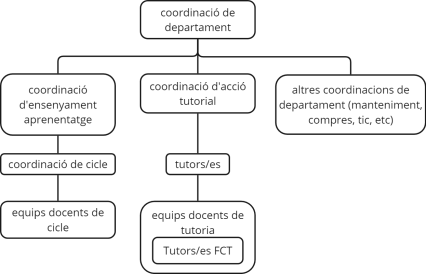
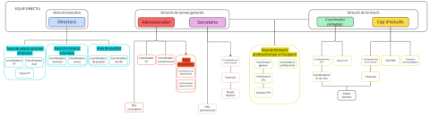

Memòria Practicum

Joan Aguayo Morales

Màster professorat FP2

Institut Castellarnau

Mentor: Fernando Lopez

Curs 2024/25

PART A – Dades de l’estudiant 3 Biografia breu 3 Experiència docent 3 Filosofia docent 4

PART B – Desenvolupament de la memòria 5 1. Coneixement i funcionament del centre 5 2. Professorat, alumnat, famílies 6 3. Recursos del centre 7 4. FP Dual (si és aplicable) 8 5. Experiències rellevants 10 6. Connexió amb assignatures del màster 11

PART C – Actuació didàctica 12 1. Organització del departament 12 Organització didàctica del departament d’automoció 13

Tipologies d’activitats d’ensenyament-aprenentatge i estratègies metodològiques 13

Innovació educativa i projectes singulars 14 Recursos propis del departament 14 Treball interdepartamental 15

2. Els grups-classe i el professorat 15 a. L’alumnat: observacions sobre comportament, dinàmica i coeducació 15 b. El professorat: estils docents i gestió d’aula 16 c. Les interaccions: relacions entre l’alumnat, amb el professorat i entre el

professorat 16 Relacions entre l’alumnat 16 Relacions entre l’alumnat i el professorat 17 Relacions entre el professorat 17

3. Disseny i aplicació de l’AEA (incloent l’adaptació per a la diversitat) 17 4. Experiències viscudes 21 Reflexió amb mentor/a i aplicació del cicle reflexiu 22 5. Assistència a activitats de formació externa 22 PART D – Reflexió final 23 Canvis en la filosofia docent 23 Objectius futurs com a docent 23 Valoració global del pràcticum 24 Bibliografia 24

2

PART A – Dades de l’estudiant

Biografia breu

Soc en Joan Aguayo Morales, docent en actiu a l’àmbit de la Formació Professional, especialitzat en l’àrea d’automoció. Després de completar la meva formació tècnica, vaig iniciar la meva trajectòria professional treballant en diversos entorns del sector automobilístic, la qual cosa m’ha proporcionat una base sòlida de coneixements pràctics i aplicats que trasllado diàriament a l’aula. Actualment, exerceixo com a professor a l’Institut Castellarnau de Sabadell, un centre de referència a la comarca del Vallès Occidental, on imparteixo docència als cicles formatius de grau mitjà i grau superior vinculats a la família professional de transport i manteniment de vehicles. Aquesta experiència docent em permet mantenir un vincle viu entre el món professional i el món educatiu, fet que considero fonamental en la formació de l’alumnat de FP.

Experiència docent

La meva experiència com a docent va començar de forma formal el curs 2021-2022, tot i que prèviament ja havia participat en accions formatives en entorns no reglats i en el marc d’activitats de formació interna d’empresa. La incorporació a l’Institut Castellarnau va representar una gran oportunitat per consolidar el meu perfil com a docent i poder aplicar, dins d’un entorn educatiu estructurat, els coneixements i metodologies que havia adquirit en la meva etapa prèvia com a tècnic.

Al centre, imparteixo mòduls professionals com ara “Sistemes de suspensió, direcció i frens” al cicle formatiu de grau mitjà d’Electromecànica de vehicles automòbils, i també “Sistemes de transmissió i frens” en el cicle superior d’Automoció, incloent continguts com caixes de canvi, grups reductors i diferencials.

Aquesta diversitat de nivells i continguts m’ha permès adquirir una visió àmplia i profunda dels processos d’ensenyament-aprenentatge dins de l’àmbit de l’automoció, així com desenvolupar una major capacitat d’adaptació a les necessitats específiques de l’alumnat segons la seva etapa formativa i els seus interessos professionals.

Durant aquest període he participat activament en la vida del centre, més enllà de la docència directa. He estat present en reunions de departament, coordinacions amb altres docents i he contribuït a l’elaboració i millora de materials didàctics específics, adaptats a les característiques del nostre alumnat. Aquesta participació activa m’ha ajudat a entendre millor l’organització interna del centre i el paper fonamental que juga la coordinació entre equips per garantir un aprenentatge significatiu i coherent.

També he tingut l’oportunitat de viure de prop l’evolució de l’alumnat al llarg del curs i d’intervenir en processos de tutoria i acompanyament personalitzat, especialment en el moment de desenvolupar activitats pràctiques al taller. Aquesta relació més directa i propera amb l’alumnat ha estat especialment enriquidora, ja que m’ha permès no només guiar-los des d’un punt de vista tècnic, sinó també ajudar-los en la seva evolució personal i en la presa de decisions sobre el seu futur professional.

3

Filosofia docent

La meva filosofia docent es fonamenta en una concepció pràctica i vivencial de l’aprenentatge. Considero que l’alumne ha de ser el centre actiu del procés formatiu, assumint un paper protagonista i responsable del seu propi aprenentatge. En aquest sentit, aposto per metodologies actives i situacions d’aprenentatge que reprodueixin entorns professionals reals o versemblants, on l’estudiant pugui experimentar, equivocar-se, corregir i, sobretot, reflexionar.

El taller és, per a mi, molt més que un espai físic; és un entorn pedagògic privilegiat on es connecten teoria i pràctica, i on l’alumnat pot desenvolupar les competències tècniques però també transversals: responsabilitat, treball en equip, capacitat de resoldre problemes i iniciativa. Per això, dissenyo activitats rotatives que permetin a tot l’alumnat passar per diverses estacions de treball, afavorint l’autonomia, la col·laboració i la versatilitat.

La diversitat dins de l’aula és una realitat i una riquesa. Per això, intento dissenyar activitats adaptades a diferents perfils d’aprenentatge, preparant materials diferenciats o adaptacions concretes quan cal. També dono molta importància a la comunicació clara i efectiva, tant amb els alumnes com amb l’equip docent i les famílies. Entenc que una bona comunicació és clau per generar un entorn de confiança, respectuós i propici per l’aprenentatge.

Un altre dels pilars de la meva filosofia és la reflexió sobre la pròpia pràctica. Considero fonamental revisar allò que faig, escoltar el feedback de companys i alumnes, i buscar de forma constant millores. Per aquest motiu, valoro molt el paper dels mentors i companys amb experiència, així com l’aprenentatge permanent a través de formació contínua o jornades educatives.

Finalment, entenc l’educació com una eina transformadora. Com a docent, no només transmeto coneixements tècnics sinó que, de manera inevitable, participo en la construcció de la identitat i el projecte vital de cada alumne. Aquesta responsabilitat m’inspira i m’obliga a mantenir un alt compromís amb la qualitat educativa i amb la millora constant.

4

PART B – Desenvolupament de la memòria

1. Coneixement i funcionament del centre

L’Institut Castellarnau de Sabadell és un centre públic d’educació postobligatòria especialitzat en la Formació Professional, amb una trajectòria consolidada i reconeguda dins del sistema educatiu català. Amb més de quaranta anys d’història, el centre s’ha posicionat com una institució de referència a la comarca del Vallès Occidental, destacant tant per la seva oferta formativa com per la seva aposta per la qualitat educativa i la innovació pedagògica.

El centre ofereix una àmplia gamma de cicles formatius, organitzats en quatre famílies professionals principals: Sanitat, Automoció, Edificació i Obra Civil, i Química i Salut Ambiental. Aquesta varietat d’oferta es complementa amb Programes de Formació i Inserció (PFI) i cursos d’especialització com el de Vehicle Híbrid i Elèctric o el de Cultius Cel·lulars, responent així a les necessitats del teixit productiu i empresarial de l’entorn. En aquest sentit, el centre no només imparteix ensenyament, sinó que actua com a nexe entre el món educatiu i el món laboral, fomentant la inserció laboral i la qualificació professional de l’alumnat.

L’organització interna del centre es fonamenta en una estructura clara, coordinada i orientada a l’aprenentatge de qualitat. L’equip directiu, format per direcció, caps d’estudis i coordinacions de famílies professionals, vetlla pel bon funcionament del centre i per la coherència pedagògica dels projectes educatius. El Projecte Educatiu de Centre (PEC), juntament amb altres documents com la Programació General Anual (PGA), el Projecte de Direcció i el NOFC (Normes d’Organització i Funcionament del Centre), estableixen les línies estratègiques, metodològiques i organitzatives que donen sentit a l’acció educativa. Aquests documents reflecteixen un enfocament centrat en la millora contínua, l’equitat educativa i la innovació didàctica.

Pel que fa als horaris, el centre ofereix torns de matí i de tarda, permetent així una organització flexible que facilita l’accés a l’educació i la conciliació personal i laboral de l’alumnat. A la família professional d’Automoció, on exerceixo com a docent, l’horari del torn de matí s’estén de 8:00 a 14:30, mentre que el de tarda va de 15:30 a 22:00. Aquesta distribució afavoreix una millor planificació de les activitats pràctiques al taller, així com un seguiment més proper i personalitzat dels processos d’aprenentatge.

El centre també ha fet una aposta decidida per la qualitat i la innovació educativa. En aquest sentit, des de l’any 2004 compta amb la certificació ISO:9001, una evidència del seu compromís amb l’eficiència, la gestió responsable i l’excel·lència formativa. Aquesta certificació implica un sistema de gestió que garanteix la revisió i actualització constant dels processos, així com una atenció curosa a la satisfacció dels diferents agents implicats: alumnat, famílies, professorat i empreses col·laboradores.

Les instal·lacions del centre són àmplies, modernes i adequades a les necessitats específiques de cada família professional. En el cas de l’àmbit de l’automoció, es disposa de tallers plenament equipats amb tecnologia actual, aixecadors, bancs de proves i vehicles per a pràctiques, així com aules específiques per al desenvolupament de les unitats formatives teòriques. Aquesta dotació material permet reproduir condicions de treball reals, aspecte clau per garantir una formació pràctica i orientada al món professional.

5

En paral·lel, el centre fomenta l’ús de les tecnologies digitals com a eina d’aprenentatge i de comunicació. A través de plataformes com Moodle o altres entorns virtuals, es facilita l’accés a recursos didàctics, es promou l’autoaprenentatge i es potencia la competència digital tant de l’alumnat com del professorat. També s’utilitzen canals institucionals per mantenir informades les famílies i per compartir la vida acadèmica i institucional del centre.

Finalment, cal destacar el paper actiu del centre en la promoció de la convivència i la participació. S’organitzen activitats transversals, jornades i projectes que reforcen la cohesió del grup i el sentit de pertinença. A més, es treballa en la prevenció de conflictes i en l’atenció a la diversitat, garantint un entorn educatiu inclusiu i respectuós. Aquest enfocament es veu reforçat per la col·laboració constant entre el professorat, els equips de tutoria i altres professionals del centre, com l’orientador/a o el coordinador/a de convivència.

En resum, el coneixement i funcionament de l’Institut Castellarnau es caracteritzen per una estructura organitzada, una clara orientació cap a la qualitat educativa i una implicació activa en el desenvolupament personal i professional de l’alumnat. Aquesta realitat esdevé un escenari idoni per a la formació de futurs docents i per al desplegament d’un pràcticum enriquidor i significatiu.

2. Professorat, alumnat, famílies

El funcionament eficaç d’un centre de formació professional com l’Institut Castellarnau es fonamenta, en gran part, en la interacció entre els diferents membres de la comunitat educativa. L’anàlisi de les dinàmiques entre professorat, alumnat i famílies esdevé clau per comprendre la complexitat i la riquesa del procés educatiu, així com per reflexionar críticament sobre el paper del docent en aquest ecosistema. Aquesta mirada es reforça a través del pràcticum, on el contacte directe amb el centre permet observar i analitzar el funcionament real d’aquestes relacions i la seva incidència en l’aprenentatge.

Pel que fa al professorat, l’Institut Castellarnau disposa d’un equip multidisciplinari amb una elevada qualificació tècnica i pedagògica. La major part dels docents tenen una àmplia experiència en el sector professional i, alhora, estan implicats en processos de millora educativa. Aquesta combinació d’expertesa pràctica i reflexió pedagògica és fonamental per al bon desenvolupament dels cicles formatius, on la transferència del coneixement aplicat és clau per a la formació dels futurs professionals.

A més de la docència directa, els professors participen activament en comissions de treball i projectes de centre, com les comissions de qualitat, convivència, coeducació i TIC. Aquest treball col·laboratiu es veu reflectit en l’existència de reunions periòdiques de departament, on s’analitzen tant les qüestions curriculars com les necessitats dels alumnes. En aquestes reunions, he pogut constatar un clima de cooperació, on es comparteixen recursos i es busquen estratègies comunes per afrontar els reptes quotidians de l’aula. Aquesta cultura de treball en equip reforça la cohesió del claustre i facilita la implementació de projectes educatius innovadors.

Pel que fa a l’alumnat, el centre presenta una gran diversitat pel que fa a l’origen geogràfic, el context sociocultural i les trajectòries acadèmiques. A la família d’Automoció, on se centra la meva activitat docent, hi trobem un alumnat amb un fort interès per la formació pràctica, però amb necessitats educatives diferenciades. Aquesta heterogeneïtat suposa un repte docent constant, especialment pel que fa a la planificació d’activitats adaptades als diferents nivells i ritmes d’aprenentatge.

Aquesta inclusivitat es manifesta en l’estructura del centre, que disposa d’un Departament 6

d’Orientació que vetlla pel seguiment dels casos amb dificultats específiques i coordina les actuacions amb serveis externs. També s’aplica un pla d’atenció a la diversitat que inclou mesures com l’adaptació de continguts, l’acompanyament emocional i el reforç educatiu, especialment en els primers cursos dels cicles. Aquest treball conjunt entre docents, tutors i orientadors és fonamental per garantir l’equitat i l’accés a l’aprenentatge de tot l’alumnat.

Quant a la relació amb les famílies, el centre aposta per una comunicació fluida i constructiva, tot i les dificultats inherents a una etapa postobligatòria on, en molts casos, l’alumnat ja és major d’edat. En el cas d’alumnes menors, la relació amb les famílies es gestiona a través de tutories individuals, reunions informatives i comunicació per canals digitals. Aquesta interacció amb les famílies contribueix a la prevenció de l’abandonament escolar i a la detecció precoç de dificultats. No obstant això, es constata una implicació desigual per part de les famílies, especialment en entorns vulnerables o amb un menor capital cultural. Aquesta realitat suposa un repte per al centre, que continua buscant estratègies per fomentar una participació més activa i efectiva.

En resum, l’articulació entre professorat, alumnat i famílies constitueix una peça clau per al bon funcionament de l’Institut Castellarnau i per al desenvolupament d’un model educatiu inclusiu, equitatiu i de qualitat. La meva estada com a docent en actiu dins aquest centre m’ha permès observar i comprendre amb més profunditat la importància de generar vincles educatius sòlids, empàtics i professionalitzadors. Aquestes relacions són, en definitiva, les que fan possible un aprenentatge significatiu i una escola transformadora.

3. Recursos del centre

Un dels elements fonamentals per a garantir una educació de qualitat en els ensenyaments de formació professional és la disponibilitat, adequació i actualització dels recursos educatius. L’Institut Castellarnau destaca, en aquest sentit, per disposar d’un conjunt d’espais, equipaments i recursos didàctics alineats amb les exigències del món laboral i amb els requeriments pedagògics d’una formació centrada en la pràctica. A través de l’experiència com a docent en aquest centre, he pogut observar com aquests recursos es converteixen en una eina clau per facilitar l’adquisició de competències professionals, fomentar l’autonomia de l’alumnat i consolidar metodologies actives d’aprenentatge.

En primer lloc, cal destacar la qualitat i especialització de les instal·lacions físiques. L’edifici, ampli i ben distribuït, compta amb una clara diferenciació entre espais comuns i espais específics de cada família professional. En el cas de la família d’Automoció, els tallers mecànics reprodueixen entorns reals de treball, equipats amb elevadors hidràulics, bancs de proves de frens, sistemes de suspensió, bancs de diagnosi i maquinària diversa. Aquesta infraestructura permet a l’alumnat simular situacions tècniques reals, fet que no només millora l’assimilació dels continguts, sinó que també contribueix a la seva motivació i implicació en el procés formatiu.

Aquest entorn material es complementa amb aules polivalents dotades de recursos digitals, com projectors, ordinadors, pantalles interactives i connexió estable a internet, que permeten implementar metodologies combinades (blended learning) i activitats de treball col·laboratiu. La utilització d’aquest tipus d’aules esdevé fonamental, especialment en mòduls on es combina teoria i pràctica, ja que facilita la transició entre conceptes tècnics i la seva aplicació real. En aquest context, l’equip docent dissenya unitats didàctiques que integren l’ús de simuladors, vídeos explicatius, activitats gamificades i pràctiques guiades, generant un ecosistema d’aprenentatge dinàmic, interactiu i diversificat.

7

Un altre recurs fonamental és la plataforma educativa Moodle, que el centre utilitza com a entorn virtual d’aprenentatge per a gestionar continguts, seguiment d’activitats, avaluacions i comunicació amb l’alumnat. Aquesta eina permet una major flexibilitat i personalització del procés d’ensenyament-aprenentatge, afavorint l’autoregulació de l’alumne i el seu accés permanent als materials del curs. En un context on les competències digitals són cada vegada més imprescindibles, aquesta integració d’entorns virtuals representa un avenç important cap a una docència més adaptada als reptes del segle XXI.

L’Institut Castellarnau també compta amb una biblioteca equipada, sales específiques per a formació transversal (com educació en riscos laborals), laboratoris de química i biologia —especialment rellevants per a les famílies de Sanitat i Salut Ambiental—, així com espais exteriors adequats per a activitats educatives, lúdiques i esportives. Aquests recursos contribueixen a una formació integral i afavoreixen la cohesió entre els diferents col·lectius d’alumnat.

Pel que fa a recursos humans i organitzatius, el centre disposa de professionals especialitzats que donen suport a l’acció docent, com ara tècnics de taller, orientadors i assessors digitals. A més, s’han implementat rols com el “mentor digital” dins de cada família professional, que actua com a referent per a la integració pedagògica de les tecnologies i la dinamització de pràctiques innovadores dins de l’equip docent. Aquesta figura esdevé especialment rellevant per al desplegament del Pla d’Estratègia Digital del centre, un document viu que orienta la transició cap a una escola digitalment competent i pedagògicament avançada.

Un aspecte a destacar és la preocupació del centre per la formació contínua del professorat. El claustre participa de manera regular en jornades tècniques, cursos de formació del Departament d’Educació i activitats de col·laboració amb empreses i centres d’innovació. Aquesta actitud activa de desenvolupament professional reforça l’actualització metodològica i assegura que els recursos disponibles s’utilitzin de manera eficient i amb finalitats educatives transformadores.

En definitiva, la dotació de recursos a l’Institut Castellarnau respon a un model educatiu integrador i orientat a la qualitat, on les condicions materials i tecnològiques es posen al servei d’una pedagogia activa, reflexiva i centrada en l’alumnat. La meva experiència docent en aquest centre m’ha permès constatar que l’ús eficient i estratègic dels recursos, juntament amb una visió compartida entre docents i equips directius, constitueix un dels pilars per assolir una educació professionalitzadora i amb impacte real en la preparació per al món laboral.

4. FP Dual (si és aplicable)

La Formació Professional Dual constitueix un dels eixos fonamentals de transformació del sistema educatiu professionalitzador a Catalunya i a Europa. El seu plantejament es basa en la combinació de l’aprenentatge acadèmic dins del centre educatiu i la formació pràctica en entorns laborals reals, mitjançant convenis de col·laboració amb empreses. Aquesta modalitat, més exigent en termes organitzatius, però altament valuosa des del punt de vista pedagògic i professional, permet una transició més fluida entre el món educatiu i el laboral, millorant així les opcions d’inserció de l’alumnat i afavorint una formació contextualitzada.

A l’Institut Castellarnau, la implementació de la FP Dual és especialment significativa dins de la família d’Automoció, i cada curs s’hi sumen més alumnes i empreses col·laboradores. Des de la meva posició com a docent en actiu dins d’aquest centre, he pogut observar de prop el funcionament d’aquest sistema, les seves virtuts i també els seus reptes. Un dels primers

8

aspectes a destacar és la solidesa del teixit empresarial de l’entorn, que facilita l’establiment de convenis amb empreses del sector. Això permet oferir a l’alumnat experiències formatives diverses, des de petits tallers locals fins a grans concessionaris o serveis tècnics especialitzats.

El procés d’assignació de places en empreses es duu a terme a través de la coordinació entre el centre, el tutor o tutora de pràctiques, i els responsables de les empreses, tenint en compte tant els interessos de l’alumnat com els requisits tècnics de les organitzacions. Un cop iniciada l’estada, l’alumne compta amb un tutor de centre i un tutor d’empresa, els quals mantenen una comunicació fluida per fer el seguiment del pla formatiu, l’avaluació de les competències i la resolució de possibles incidències. Aquest diàleg entre centre i empresa esdevé clau per garantir que les activitats realitzades a l’empresa siguin realment formatives i no simplement tasques productives.

En aquest sentit, el pla de formació individualitzat és un dels elements centrals de la FP Dual. Aquest document defineix les competències a assolir, els objectius específics i la temporalització de les tasques, establint així una continuïtat coherent entre el que s’aprèn al centre i el que es practica a l’empresa. He pogut observar com aquesta eina, quan està ben dissenyada i revisada conjuntament amb l’empresa, millora l’orientació i el rendiment de l’alumnat. No obstant això, també és cert que en alguns casos aquest pla esdevé poc operatiu si no hi ha una implicació real de totes les parts, fet que posa de manifest la necessitat de continuar formant i implicant les empreses en el projecte educatiu.

D'altra banda, la modalitat Dual també planteja reptes organitzatius importants per al centre. Entre els més destacats hi ha la coordinació horària entre la formació al centre i les jornades a l’empresa, la gestió de la documentació i el seguiment individualitzat de cada alumne. Això requereix una estructura clara, amb figures com la coordinació de pràctiques i la direcció de

família professional molt ben definides. A l’Institut Castellarnau, aquestes figures desenvolupen una tasca essencial i treballen de forma col·laborativa per garantir la qualitat del procés.

Un aspecte especialment positiu és la valoració que l’alumnat fa de l’experiència Dual. Molts expressen que el contacte directe amb l’entorn professional els ajuda a consolidar coneixements, a guanyar confiança i a entendre la realitat del sector. Així mateix, l’empresa pot arribar a fer una oferta laboral al final del període de pràctiques, fet que suposa una oportunitat clara d’inserció. Aquesta valoració coincideix amb les conclusions d’estudis recents que afirmen que la FP Dual incrementa notablement les opcions d’inserció i redueix l’abandonament escolar.

No obstant això, també cal ser crític i reconèixer els possibles desequilibris que es poden produir, com ara el perill que l’empresa prioritzi la productivitat per sobre de l’aprenentatge o que l’alumne no tingui un acompanyament pedagògic adequat durant l’estada. Aquestes situacions són minoritàries, però posen en evidència la necessitat d’una supervisió més gran i d’una cultura compartida de formació entre empreses i centres educatius.

En resum, la Formació Professional Dual representa una aposta clara per una educació adaptada a les necessitats del mercat laboral, però amb vocació formadora. L’Institut Castellarnau n’ha fet una implementació sòlida i progressiva, i des del meu rol com a docent, considero que és una eina poderosa per millorar l’eficàcia del sistema educatiu i dotar l’alumnat de competències reals i transferibles. La clau del seu èxit radica en la col·laboració constant entre totes les parts implicades i en la voluntat de mantenir una mirada pedagògica que posi l’alumne al centre del procés.

9

5. Experiències rellevants

Al llarg del meu període com a docent en actiu a l’Institut Castellarnau, he tingut l’oportunitat de viure diverses experiències que m’han fet créixer no només com a professional, sinó també com a persona. Aquestes vivències han estat particularment significatives en el context del pràcticum, ja que m’han permès posar en pràctica els coneixements adquirits al màster, reflexionar sobre la meva tasca docent i confrontar-me amb situacions reals que han posat a prova la meva capacitat d’adaptació, lideratge i empatia.

Una de les experiències més rellevants ha estat la planificació i execució de la meva AEA (Activitat d’Ensenyament i Aprenentatge) en el context del taller d’automoció. La proposta es va basar en un sistema de pràctiques rotatives durant vuit setmanes, en què l’alumnat, dividit en grups petits, passava per diferents estacions pràctiques relacionades amb la suspensió, la direcció, els frens i la transmissió. Aquest plantejament em va obligar a fer una planificació molt detallada de temps, recursos i metodologia, així com a preveure adaptacions per a diferents ritmes i nivells de competència.

Durant el desenvolupament d’aquesta AEA, vaig experimentar per primera vegada la sensació de tenir el control complet d’una seqüència didàctica, tot assumint la responsabilitat de la gestió d’espais, materials, avaluació i seguiment individualitzat de l’alumnat. Va ser especialment significatiu observar com alumnes que inicialment mostraven desmotivació, s’implicaven activament quan la proposta connectava amb els seus interessos i necessitats. Aquest fet va reforçar la meva convicció sobre la importància de crear experiències d’aprenentatge significatives, contextualitzades i que parteixin del “fer” per arribar al “comprendre”.

Una altra experiència rellevant va ser la retroalimentació rebuda per part del meu mentor, Fernando López, després d’una de les sessions observades. La seva valoració, tant pel que fa als aspectes metodològics com a la gestió emocional i comunicativa dins del taller, em va permetre identificar punts forts, com ara la claredat en les explicacions i la capacitat d’adaptació a imprevistos, però també aspectes a millorar, com la gestió del temps en grups heterogenis i la necessitat de fer pauses més freqüents per verificar la comprensió dels continguts. Aquest feedback, integrat dins del cicle reflexiu, m’ha ajudat a modificar certs enfocaments i a incorporar pràctiques més efectives de seguiment i avaluació.

També considero significativa la meva participació en les observacions a altres docents del centre. Poder veure com altres professors amb més experiència gestionen les dinàmiques d’aula, fan ús dels recursos i interaccionen amb l’alumnat m’ha proporcionat un ventall de referents pedagògics molt útils. No es tracta de copiar estils, sinó d’enriquir la pròpia mirada docent a partir d’una actitud oberta, observadora i crítica.

Finalment, voldria destacar una situació puntual que va suposar un repte: la gestió d’un conflicte entre alumnes dins el taller. La situació va requerir una intervenció immediata per evitar que escalés, així com una actuació coordinada amb la tutora i el Departament d’Orientació. Tot i que va ser una experiència tensa, em va fer prendre consciència de la importància de mantenir la calma, actuar amb justesa i escoltar activament totes les parts implicades. Aquest episodi, lluny de desmotivar-me, va reforçar la meva capacitat de lideratge i em va animar a seguir desenvolupant habilitats relacionals dins de la meva pràctica docent.

En conjunt, aquestes experiències han estat claus per consolidar la meva identitat com a docent, i m’han permès integrar la teoria del màster amb la realitat de l’aula. Cada situació viscuda m’ha proporcionat una nova oportunitat per aprendre, revisar i millorar. I aquest

10

procés, que no acaba amb el pràcticum, és justament el que dona sentit a la meva vocació educativa.

6. Connexió amb assignatures del màster

Una de les aportacions més valuoses del pràcticum com a part del Màster en Formació del Professorat és la possibilitat de connectar els coneixements teòrics treballats durant el curs acadèmic amb l'experiència real en el context educatiu. Aquesta connexió entre teoria i pràctica ha estat constant al llarg de la meva estada com a docent en actiu a l’Institut Castellarnau, i m’ha permès entendre de manera profunda la complexitat del rol docent, així com la importància d’una formació fonamentada, crítica i en permanent evolució.

Una de les assignatures que més directament he pogut aplicar durant el pràcticum ha estat “Aprenentatge i desenvolupament de la personalitat”. Aquesta matèria em va proporcionar eines per comprendre els processos de maduració, motivació i conducta de l’alumnat adolescent i jove. Aquest marc teòric m’ha estat especialment útil a l’hora d’entendre els comportaments dins el taller, identificar perfils de risc o desmotivació i adaptar les activitats per promoure una millor resposta emocional i cognitiva. Per exemple, he pogut aplicar estratègies de reforç positiu, tècniques de gestió d’aula orientades a la prevenció de conflictes, i maneres d’abordar la diversitat d’interessos i estils d’aprenentatge presents dins del grup.

Una altra assignatura clau ha estat “Processos i contextos educatius”, que m’ha ajudat a situar la meva pràctica dins del marc normatiu i institucional del sistema educatiu. Comprendre documents com el Projecte Educatiu de Centre (PEC), la Programació General Anual (PGA) o els Plans d’Atenció a la Diversitat, m’ha permès integrar-me millor dins l’estructura del centre i entendre la importància de la coherència entre projecte institucional i actuació a l’aula. Aquesta mirada sistèmica ha estat molt útil a l’hora de participar en reunions de coordinació, de proposar adaptacions metodològiques o d’analitzar les dinàmiques de convivència del centre.

També cal destacar la relació amb l’assignatura de “Didàctica específica de la família professional”, que en el meu cas ha estat fonamental per aprofundir en les metodologies més adients per a l’ensenyament de l’automoció. Els continguts treballats m’han ajudat a plantejar activitats didàctiques basades en la simulació de situacions reals, la resolució de problemes i l’aprenentatge cooperatiu, estratègies que he pogut posar en pràctica al taller de l’Institut Castellarnau. A més, el debat sobre com adaptar la docència a les exigències dels sectors productius i a l’evolució tecnològica permanent m’ha fet prendre consciència de la necessitat de mantenir-me format i vinculat amb el món laboral.

Finalment, voldria destacar l’aportació de “Societat, família i educació”, una assignatura que m’ha ajudat a comprendre millor el context sociocultural de l’alumnat i la importància del vincle escola-família. A través d’aquesta mirada, he pogut valorar més profundament les dificultats que tenen algunes famílies per implicar-se en el procés educatiu, però també les oportunitats que es generen quan es construeix un vincle de confiança i col·laboració. Aquesta assignatura em va ajudar a posar el focus no només en l’aula, sinó també en l’entorn de l’alumne, com a element clau per a l’èxit educatiu.

En conclusió, el pràcticum m’ha permès no només aplicar coneixements, sinó integrar-los, reinterpretar-los i ampliar-los. Les assignatures del màster han estat una guia fonamental per donar sentit i coherència a la meva pràctica, i alhora han esdevingut un punt de partida per continuar formant-me com a docent reflexiu, compromès i preparat per afrontar els

11

reptes educatius actuals i futurs.

PART C – Actuació didàctica

1. Organització del departament

12

Organització didàctica del departament d’automoció

El claustre de professors de l’Institut Castellarnau de Sabadell s’organitza en departaments docents, cadascun liderat per una coordinació de departament. Existeix una coordinació per a cada família professional, a més de coordinacions específiques per a FOL (Formació i Orientació Laboral) i Llengües Estrangeres. Aquesta estructura facilita la coordinació interna, l’especialització docent i una millor atenció a les necessitats de cada àmbit formatiu.

En el cas concret del departament d’Automoció, l’organització interna compta amb tres coordinadors que s’encarreguen de garantir el funcionament global del departament. Aquests, al seu torn, designen coordinadors de taller, que són els responsables de vetllar pel bon funcionament dels espais pràctics. També són els encarregats de detectar i comunicar qualsevol incidència o problemàtica relacionada amb els tallers, així com de proposar solucions i deixar-ne constància en les actes de les reunions mensuals que es duen a terme per fer el seguiment del curs.

Paral·lelament, es convoquen també reunions de departament amb l’objectiu de revisar el desenvolupament de les programacions, coordinar activitats comunes i compartir bones pràctiques docents.

Tipologies d’activitats d’ensenyament-aprenentatge i estratègies metodològiques

Pel que fa a les estratègies metodològiques, tot i que cada docent disposa de cert grau d’autonomia per dissenyar les seves sessions, existeix una línia metodològica comuna basada en:

- Sessions magistrals

- Activitats d’aula guiades

- Disseny i ús de dossiers de treball que es van completant al llarg del curs - Projectes cooperatius, que fomenten el treball en equip i el desenvolupament de competències transversals

A la part pràctica, cada docent té assignat un taller específic on es duen a terme activitats basades en la programació curricular i els resultats d’aprenentatge del mòdul corresponent. Els alumnes treballen de manera habitual en parelles o petits grups, seguint una dinàmica cooperativa que simula l’entorn professional real i afavoreix l’adquisició d’hàbits laborals adaptats a la realitat del sector.

Les pràctiques s’organitzen en funció dels vehicles i recursos assignats a cada mòdul, i aborden tant tasques quotidianes de reparació com aspectes més específics i tecnològicament avançats. En funció del mòdul, els projectes poden tenir una durada curta (setmanal) o bé ser de llarg termini (al llarg de tot el curs escolar).

13

Innovació educativa i projectes singulars

El departament d’Automoció participa activament en diversos projectes d’innovació educativa, molts d’ells en col·laboració amb altres famílies professionals del centre. Entre les iniciatives més destacades hi trobem:

- Electrocat, un projecte d’automoció elèctrica que fomenta la recerca i el desenvolupament de solucions sostenibles en l’àmbit de la mobilitat.

- Erasmus+, que permet la mobilitat internacional d’alumnat i professorat per fer pràctiques o estades formatives a l’estranger.

- Les 24 hores de motociclisme de Montmeló, sens dubte el projecte intermodular més rellevant del centre, on participen totes les famílies professionals

(automoció, sanitat, imatge personal, etc.). Aquesta activitat fomenta una experiència realista i intensiva que exigeix la col·laboració entre estudiants i docents de diferents àmbits. L’organització, logística, assistència mecànica, suport sanitari i comunicació de l’equip són assumides pel propi alumnat del centre.

Aquest projecte ha estat reconegut per empreses del sector, com Kawasaki Espanya, que ha valorat molt positivament la tasca del centre i l’organització exemplar de l’activitat, deixant el llistó alt en representació de l’ensenyament públic.

En cursos anteriors, el centre també ha participat en altres projectes d’innovació com el Greenpower Gathering o el Shell Eco-marathon, que complementen l’oferta educativa i reforcen el compromís del centre amb la formació pràctica i l’educació ambiental i tecnològica.

Recursos propis del departament

El departament d’Automoció de l’Institut Castellarnau disposa d’una sèrie de recursos específics que permeten dur a terme una formació pràctica de qualitat, adaptada a les necessitats del sector professional actual.

Els espais formatius estan formats per diversos tallers mecànics especialitzats, cadascun equipat amb eines, utillatge i vehicles adaptats als diferents mòduls i continguts. Aquests tallers reprodueixen de manera fidel l’entorn de treball d’un taller mecànic real, fet que facilita la transferència d’aprenentatges al món laboral. Entre els recursos disponibles hi trobem:

- Elevadors i bancs de treball

- Vehicles de combustió interna i elèctrics per a pràctiques específiques - Eines manuals i electròniques

- Màquines de diagnosi

- Equipament per al treball de carrosseria i pintura

- Ordinadors amb programari tècnic específic (Autodata, Workshop data, Crocodile, entre d’altres)

- Material audiovisual i pissarres digitals per a les sessions teòriques

La combinació d’aquests recursos, juntament amb la implicació del professorat, permet oferir una formació actualitzada i centrada en l’adquisició de competències professionals reals.

14

Treball interdepartamental

Tot i que cada família professional té una estructura pròpia i uns objectius específics, a l’Institut Castellarnau es promou el treball interdepartamental, especialment a través de projectes comuns que integren diferents àrees de coneixement.

Un clar exemple d’aquesta col·laboració és el projecte de les 24 hores de Montmeló, esmentat anteriorment, on intervenen diverses famílies professionals: Automoció, Sanitat, Imatge Personal i FOL, entre d’altres. Aquesta activitat requereix una coordinació transversal entre docents per tal de preparar els estudiants des de múltiples vessants: tècnica, comunicativa, emocional i sanitària.

Altres formes de col·laboració interdepartamental inclouen:

- Coordinació amb el departament de FOL per treballar aspectes com la prevenció de riscos laborals dins dels tallers o les simulacions d’entrevistes laborals. - Activitats conjuntes amb Orientació per acompanyar l’alumnat en la transició al món laboral, especialment dins del marc de l’FP Dual.

- Participació conjunta en fires d’orientació educativa com la de Sabadell, on diferents departaments presenten l’oferta formativa del centre de manera integrada.

Aquest enfocament col·laboratiu no només enriqueix l’experiència de l’alumnat, sinó que també afavoreix una visió global del procés educatiu, potenciant les competències transversals i la capacitat d’adaptació als entorns canviants del món professional.

2.Els grups-classe i el professorat

a. L’alumnat: observacions sobre comportament, dinàmica i coeducació

Durant el període de pràctiques a l’Institut Castellarnau de Sabadell, he tingut l’oportunitat d’observar diversos grups classe dels cicles formatius de grau mitjà d’Automoció. En general, l’alumnat mostra un alt grau de motivació en les sessions pràctiques, ja que són activitats estretament lligades a la seva futura realitat laboral. En canvi, en les sessions teòriques, en alguns casos s’observa una implicació menor, fet que obliga el professorat a adoptar estratègies més actives per mantenir l’atenció i la participació.

Entre aquestes estratègies destaquen la utilització d’experiències reals, la discussió de problemàtiques habituals dins del taller, i l’ús d’activitats teòriques dinàmiques per mantenir la ment desperta. També es recomana evitar l’ús indiscriminat de pantalles com a eina per prendre apunts, ja que això pot facilitar la dispersió i la desconnexió de l’alumnat.

Pel que fa a la coeducació, s’ha constatat una presència clarament majoritària de nois als cicles d’Automoció, fet habitual en aquest tipus d’estudis. Això provoca que, en alguns grups, la participació femenina sigui minoritària o fins i tot inexistent, fet que pot influir tant en la dinàmica de grup com en la percepció dels rols professionals.

Tot i això, en els casos en què hi ha presència de noies a l’aula, s’ha observat una bona integració i una participació activa, amb un tracte igualitari per part del professorat i dels companys. Ara bé, cal destacar que no totes les alumnes adopten el mateix rol dins el

15

grup: algunes mantenen certa distància respecte als comportaments més típics del grup classe, mentre que d’altres s’hi adapten completament, fins al punt que es dilueixen les diferències i el grup es percep com a homogeni.

Aquest fenomen també es pot observar pel que fa a l’edat de l’alumnat. En grups on conviuen estudiants joves amb persones adultes, sovint aquestes últimes actuen com a referents naturals dins l’aula. El seu enfocament més seriós i orientat a aprofitar el temps d’aprenentatge ajuda a establir límits i a generar un clima de respecte que beneficia el conjunt del grup.

És important remarcar que no s’han detectat diferències significatives en els processos d’aprenentatge en funció del gènere. Tot i així, seria convenient continuar potenciant accions de sensibilització i promoció de la igualtat, amb l’objectiu de trencar estereotips i fomentar una major presència femenina en aquest àmbit professional, tot afavorint la diversitat i la inclusió a l’aula.

b. El professorat: estils docents i gestió d’aula

L’observació de diferents docents del departament d’Automoció m’ha permès identificar diversos estils metodològics, adaptats tant al perfil del grup com al tipus de continguts que s’imparteixen. En general, el professorat combina explicacions magistrals amb activitats pràctiques guiades, fomentant un aprenentatge significatiu a partir de l’experiència directa.

A nivell metodològic, s’han detectat diferències segons el mòdul impartit. En mòduls més teòrics, alguns docents opten per estructurar la sessió amb esquemes visuals, ús de dossiers i recursos audiovisuals. En canvi, en mòduls eminentment pràctics, com Sistemes de Suspensió i Direcció o Manteniment de Vehicles, la classe es desenvolupa en l’entorn de taller, amb una metodologia molt més vivencial i centrada en la resolució de problemes reals.

Pel que fa a la gestió de l’aula, cada docent adopta estratègies diferents davant situacions de conflicte, dispersió o falta de motivació. Alguns opten per una gestió més dialogant i propera, mentre que d’altres apliquen un enfocament més normatiu i estructurat. Aquesta diversitat d’estils enriqueix el clima educatiu del centre i permet atendre millor les necessitats de l’alumnat, tot mantenint una línia comuna de respecte, responsabilitat i treball col·laboratiu.

En general, es pot afirmar que el professorat del departament d’Automoció mostra un alt nivell de compromís amb l’ensenyament i una bona capacitat d’adaptació a les particularitats de cada grup, aspectes fonamentals per a l’èxit de la formació professional.

c. Les interaccions: relacions entre l’alumnat, amb el professorat i entre el professorat

Durant el període de pràctiques al centre, s’han pogut observar diferents tipus d’interaccions que tenen lloc de manera quotidiana, tant dins com fora de l’aula. Aquestes interaccions tenen un impacte directe en el clima educatiu, el procés d’aprenentatge i la convivència dins del centre.

Relacions entre l’alumnat

Les relacions entre alumnes es caracteritzen, en general, per un ambient de companyonia i col·laboració, especialment en les activitats pràctiques de taller. El treball en grup o en parelles fomenta el suport mutu i l’intercanvi de coneixements. En alguns

16

casos, sobretot en els primers cursos, és habitual que es generin petits grups d’amistat que tendeixen a mantenir-se estables durant tot el curs.

També s’observa que en situacions de conflicte o discrepància, l’alumnat tendeix a resoldre-ho de manera informal, tot i que en alguns casos és necessària la intervenció docent per reconduir la situació. És interessant destacar que en entorns pràctics, on cal cooperar per completar una tasca, la necessitat d'entendre i coordinar-se actua com a factor cohesionador. encara que sempre hi ha grups que acaban trencant-se per falta de comunicació o empatia.

Relacions entre l’alumnat i el professorat

La relació entre alumnat i professorat és, en la gran majoria dels casos, cordial i basada en el respecte mutu. El professorat mostra una actitud propera però ferma, la qual cosa permet mantenir l’autoritat pedagògica alhora que es crea un vincle de confiança amb els alumnes. Aquesta confiança és clau per generar un entorn segur i motivador, on l’alumnat se senti escoltat i acompanyat en el seu procés formatiu.

Cal destacar també que el professorat fa un esforç constant per adaptar-se a les necessitats individuals de cada alumne, especialment en el cas d’estudiants amb dificultats d’aprenentatge o amb una situació personal més complexa.

Relacions entre el professorat

Pel que fa a les relacions entre docents, s’ha observat un bon nivell de coordinació i treball en equip, especialment dins del departament d’Automoció. Les reunions de departament i de taller són espais de comunicació fluida on es comparteixen incidències, bones pràctiques i propostes de millora. També és habitual que, fora d’aquestes reunions formals, es produeixin intercanvis informals d’informació i suport mutu, especialment entre professorat amb més experiència i els que s’incorporen nous al centre o en pràctiques.

Aquest bon ambient facilita la cohesió del departament i contribueix a mantenir una coherència pedagògica, tot i la diversitat d’estils docents. Això és especialment important en l’àmbit de la Formació Professional, on el treball transversal i la continuïtat metodològica afavoreixen un millor acompanyament a l’alumnat.

3. Disseny i aplicació de l’AEA (incloent l’adaptació per a la diversitat)

L’activitat didàctica que es presenta a continuació ha estat dissenyada i aplicada en el marc del mòdul professional de Sistemes de suspensió, direcció i frens del Cicle Formatiu de Grau Mitjà en Electromecànica de Vehicles Automòbils, impartit a l’Institut Castellarnau de Sabadell. Aquest mòdul es desenvolupa principalment al taller del centre, un espai altament funcional que simula les condicions reals d’un entorn de treball professional dins del sector de l’automoció.

L’alumnat destinatari de l’activitat està format per un grup de 22 estudiants d’entre 16 i 19 anys, amb perfils diversos tant a nivell competencial com motivacional. La major part d’ells tenen un gran interès per la pràctica mecànica, però també presenten dificultats per mantenir l’atenció en sessions teòriques prolongades. Aquest fet ha estat clau a l’hora de definir una proposta metodològica dinàmica i rotativa que afavoreixi la participació activa i mantingui un alt grau de motivació.

17

L’objectiu principal de l’activitat era consolidar, mitjançant la pràctica directa, els continguts relacionats amb els sistemes de suspensió, direcció i frens, amb una especial atenció a la identificació i el muntatge de components, l’ús correcte d’eines manuals i la seguretat al taller. Per fer-ho possible, es va dissenyar una dinàmica de pràctiques rotatives de quatre setmanes de durada, durant les quals els alumnes van passar per diferents estacions de treball especialitzades, cada una centrada en un component o sistema diferent.

Cada estació estava organitzada per treballar un objectiu específic:

-Estació 1: desmuntatge i muntatge de sistemes de suspensió McPherson.

-Estació 2: comprovació i ajust de la geometria de direcció.

-Estació 3: diagnosi i substitució de discos i pastilles de fre.

-Estació 4: ús del banc de proves per a sistemes de frenada hidràulics.

La rotació permetia treballar en petits grups de 4-5 alumnes, afavorint així la cooperació, la responsabilitat individual i la gestió autònoma del temps. A més, es fomentava l’ús de documentació tècnica i esquemes, preparant així l’alumnat per fer front a situacions reals del món laboral.

La planificació de l’activitat es va realitzar amb l’assessorament del mentor del pràcticum, i es va tenir en compte la distribució horària del mòdul, les condicions materials del taller i la disponibilitat dels recursos. L’activitat va ser implementada durant el segon trimestre del curs 2024-2025 i va representar una part significativa de l’avaluació formativa del mòdul.

Rubrica:

Criteris

d’avaluació

Coneixement del

procediment tècnic

Ús correcte de les eines i equipaments

Comprensió del sistema o component treballat

Capacitat de treball en

equip i

col·laboració

Participa

activament,

reparteix tasques i ajuda els

companys.

Treballa bé en equip, amb col·laboració constant.

Participa de

forma intermitent; li costa

organitzar-se amb el grup.

No col·labora o mostra actitud negativa.

18

Resolució de problemes i iniciativa

Respecte de les normes de seguretat i organització de l’espai

Comunicació oral i ús del vocabulari tècnic

L’activitat d’ensenyament i aprenentatge (AEA) que es presenta s’ha dissenyat amb l’objectiu d’afavorir l’assoliment de les competències professionals pròpies del mòdul “Sistemes de suspensió, direcció i frens”, emmarcat dins del Cicle Formatiu de Grau Mitjà en Electromecànica de Vehicles Automòbils. Aquesta proposta metodològica pretén vincular de manera directa els continguts curriculars amb situacions reals de taller, generant un escenari d’aprenentatge pràctic i contextualitzat que faciliti la transferència de coneixements i habilitats al món laboral.

Objectius específics de l’activitat

1. Reconèixer i identificar els principals components dels sistemes de suspensió, direcció i frens en vehicles lleugers.

2. Aplicar procediments tècnics per al desmuntatge, revisió i muntatge d’aquests sistemes amb criteris de seguretat i eficiència.

3. Utilitzar correctament les eines manuals i els equipaments de taller corresponents a cada estació de treball.

4. Interpretar esquemes tècnics i documentació del fabricant per guiar la intervenció mecànica.

5. Diagnosticar possibles avaries o desgasts mitjançant eines de mesura i proves pràctiques.

6. Treballar de manera col·laborativa, respectant els rols i funcions dins del grup. 7. Complir les normes de seguretat, higiene i organització establertes al taller. 8. Fer un ús adequat del llenguatge tècnic propi del sector de l’automoció.

19

Resultats d’aprenentatge vinculats (segons RD 1128/2010)

L’activitat contribueix principalment als següents resultats d’aprenentatge del mòdul MP09:

-RA1: Diagnostica disfuncions dels sistemes de suspensió, direcció i frens, aplicant tècniques d'inspecció i verificació.

-RA2: Repara els sistemes de suspensió, direcció i frens, seleccionant procediments i operacions de mecanització i muntatge.

-RA3: Verifica la funcionalitat del sistema després de la reparació, aplicant procediments establerts i criteris de qualitat.

-RA5: Aplica normes de seguretat, prevenció de riscos i protecció mediambiental durant les operacions de manteniment.

Competències professionals, personals i socials associades

-C2: Diagnosticar i reparar els sistemes mecànics del vehicle, utilitzant els procediments tècnics adequats i respectant les normes de seguretat i qualitat.

-C6: Realitzar operacions de manteniment i reparació de sistemes auxiliars amb autonomia i responsabilitat.

-C8: Aplicar protocols de seguretat i salut laboral en el desenvolupament de les activitats del taller.

-C10: Treballar en equip, comunicar-se eficaçment i gestionar les tasques de manera cooperativa.

Aquests objectius i competències s’han desenvolupat tenint en compte no només l’àmbit tècnic, sinó també el component formatiu i actitudinal, essencial en la formació professional inicial. L’activitat ha estat plantejada com un espai d’interacció entre coneixement, habilitats i valors, amb l’objectiu de formar professionals competents i responsables.

En el cas d’un alumne amb un Pla Individualitzat (PI) per dificultats d’aprenentatge i baixa autoestima, es van aplicar mesures específiques com:

-Acompanyament més proper del docent en les dues primeres sessions.

-Fitxa de treball simplificada amb pictogrames i menys ítems tècnics.

-Rúbrica adaptada centrada en l’esforç, la col·laboració i l’aplicació de consignes bàsiques de seguretat.

-Assignació d’un company amb rol de “parella tècnica” per facilitar el seguiment de la pràctica.

Aquestes actuacions han permès que l’alumne participés activament, guanyés confiança i mostrés una evolució significativa, tant en actitud com en domini tècnic. Casos com aquest posen de manifest la necessitat d’una mirada pedagògica flexible, capaç de reconèixer les potencialitats de cada alumne i d’ajustar la proposta educativa en conseqüència.

Finalment, cal destacar que el disseny de l’activitat, amb rotació per estacions i guies estructurades, ofereix de manera natural espais d’aprenentatge adaptables. Cada grup avança segons el seu ritme, amb l’acompanyament necessari, i es pot reforçar o ampliar el contingut en funció de les necessitats. Aquesta flexibilitat metodològica esdevé una eina

20

potent per atendre la diversitat dins del taller, i és una mostra clara de com es poden aplicar els principis d’escola inclusiva també en contextos de formació professional.

4. Experiències viscudes

Durant les primeres setmanes del pràcticum, en l’àmbit de les classes més teòriques, vaig voler experimentar una metodologia participativa per tal de millorar la implicació de l’alumnat. La proposta inicial consistia en impartir un temari corresponent a dues sessions lectives (4 hores) amb un enfocament dialogat: plantejant preguntes durant la sessió, donant temps de reflexió i obrint espais perquè els alumnes poguessin expressar els seus dubtes. Malgrat l’enfocament obert, vaig observar una resposta força passiva per part de l’alumnat. Les seves intervencions eren escasses i la interacció no va resultar tan enriquidora com havia esperat.

Davant aquesta situació, vaig decidir modificar l’estratègia per fomentar la participació activa d’una altra manera. Va ser aleshores quan vaig dissenyar un qüestionari amb 25 preguntes relacionades amb el contingut impartit, que havien de respondre i tenir completat abans del dia de l’examen. Aquest qüestionari es va entregar amb dues setmanes d’antelació i estava pensat com una eina de repàs, no com una tasca afegida ni avaluativa. Això es va acordar amb l’alumnat: només poden realitzar l’examen si portaven el qüestionari resolt, la qual cosa va generar un compromís clar per part seva.

A nivell metodològic, aquesta experiència va combinar estratègies de gamificació lleu i responsabilització, així com l’ús de materials de suport diversos: llibre de text, presentacions del docent, i experiències pràctiques treballades prèviament al taller. Es va fomentar la revisió dels coneixements previs i l’autonomia, ja que el qüestionari serveix com a guia d’estudi personalitzada.

Aquesta adaptació metodològica va tenir un impacte molt positiu. Vaig comprovar que l’alumnat arribava més preparat a l’examen i, en finalitzar-lo, molts comentaven que el qüestionari els havia ajudat a entendre millor el temari i que la prova havia resultat menys difícil del que esperaven, tot i que no contenia les mateixes preguntes literalment. Això indica que, més enllà de memoritzar, havien interioritzat millor els conceptes, especialment aquells relacionats amb el funcionament del sistemes del vehicle treballats a classe i aplicacions reals del taller.

Des del punt de vista reflexiu, considero que aquesta experiència m’ha aportat molt com a docent en formació. He après que la participació no sempre es pot forçar verbalment a l’aula, però sí es pot estimular creant situacions que connectin amb la seva motivació i que exigeixin una implicació progressiva. També he vist que els errors inicials (una classe massa oberta sense dinamitzadors concrets) poden esdevenir oportunitats de millora.

Aquesta experiència em confirma la utilitat d’introduir recursos previs a les avaluacions que serveixin no només per preparar l’examen, sinó per afavorir una comprensió més profunda i significativa dels continguts. En el futur, vull seguir desenvolupant aquest tipus d’eines i, si cal, adaptar-les segons el nivell i necessitats de cada grup.

21

Reflexió amb mentor/a i aplicació del cicle reflexiu

Al llarg del pràcticum he tingut el privilegi de comptar amb l’acompanyament i la supervisió del meu mentor, el professor Fernando López, amb qui he mantingut una relació professional propera, constructiva i altament formativa. Les trobades que hem compartit tant formals com informals han estat espais de reflexió pedagògica, revisió crítica de la meva pràctica i projecció de millores. Aquest diàleg docent m’ha permès aplicar de forma conscient el model de cicle reflexiu, tal com el vam treballar durant el màster.

Durant les sessions observades, Fernando va oferir una mirada externa i experta sobre la meva pràctica, destacant punts forts i àrees de millora. En la primera observació, centrada en la gestió d’un dels grups durant la rotació d’estacions, va destacar la meva capacitat de

mantenir una actitud propera i clara, així com la confiança tècnica en l’execució de la pràctica. No obstant això, també va assenyalar que tendia a donar moltes instruccions en poc temps i que això podia dificultar la comprensió per a alguns alumnes, especialment per aquells amb més dificultats de processament o llenguatge.

A partir d’aquesta retroalimentació, vaig iniciar el primer cicle reflexiu. En primer lloc, vaig descriure la situació viscuda i com em vaig sentir. Després, vaig identificar la bretxa entre el que havia fet i el que voldria haver aconseguit: una comunicació més pausada i escalonada. Això em va dur a formular una nova proposta d’actuació, que consistia a dividir les instruccions en dues parts, amb una petita pausa d’execució entre elles, i fer una breu repetició visual amb esquemes.

En la segona observació, vaig aplicar aquest canvi, i el mentor em va felicitar per la millora en la comprensió i organització de l’activitat per part de l’alumnat. Això em va fer adonar que la reflexió no ha de ser només introspectiva, sinó que guanya valor quan es contrasta amb altres mirades i es tradueix en accions concretes.

En conclusió, la mentoria no ha estat un simple acompanyament, sinó una veritable oportunitat d’aprenentatge entre iguals, on el cicle reflexiu ha deixat de ser una eina teòrica per convertir-se en un hàbit professional. Aquesta experiència m’ha reafirmat en la idea que ser bon docent no significa tenir totes les respostes, sinó estar disposat a escoltar, revisar i adaptar-se constantment.

5. Assistència a activitats de formació externa

Durant el període de pràcticum, vaig assistir a una jornada tècnica organitzada per una empresa proveïdora de sistemes de diagnosi per el vehicle, en col·laboració amb un centre de formació professional de la zona. L’activitat es va dur a terme a les instal·lacions del institut i va incloure una presentació de novetats tecnològiques, demostracions pràctiques i un espai de debat entre docents i tècnics de sector.

La participació en aquesta jornada va ser especialment enriquidora per diversos motius. En primer lloc, em va permetre actualitzar coneixements tècnics, especialment pel que fa a nous sistemes ADAS. Això m’ha donat recursos per respondre millor a preguntes dels alumnes que mostren interès per les innovacions del sector i, alhora, em permet incorporar exemples reals i actualitzats a les explicacions a l’aula.

En segon lloc, la jornada em va permetre establir contactes amb altres professionals del sector i de l’educació, amb qui vaig poder intercanviar experiències i bones pràctiques.

22

Aquest tipus de xarxa professional és fonamental per al meu desenvolupament com a docent, ja que facilita la col·laboració, l’intercanvi de recursos i la construcció d’una comunitat d’aprenentatge dins de l’àmbit de la FP.

Finalment, des d’un punt de vista pedagògic, participar en aquest tipus d’activitats reforça la meva identitat com a docent reflexiu i en formació contínua. Considero que és imprescindible mantenir un vincle viu amb el món professional, no només per estar al dia dels avenços tecnològics, sinó també per transmetre a l’alumnat una imatge realista i motivadora de la seva futura professió.

La formació externa, per tant, no és un afegit al meu rol docent, sinó una peça clau del compromís ètic i professional que assumim com a formadors. M’ha ajudat a veure l’aprenentatge com una trajectòria que no s’esgota dins del centre educatiu, sinó que es nodreix constantment de l’entorn, del contacte amb el sector i del desig d’aprendre i compartir.

PART D – Reflexió final

La realització del pràcticum ha suposat per a mi molt més que una simple etapa d’aplicació de coneixements: ha estat una experiència profunda de canvi, d’autoconeixement i de projecció professional. Aquest procés m’ha permès mirar-me com a docent amb nous ulls i ha donat lloc a una transformació clara en la meva filosofia docent, en els meus objectius a futur i en la manera com entenc el paper del professor a la Formació Professional.

Canvis en la filosofia docent

Abans d’iniciar aquest període, la meva visió de l’ensenyament estava molt centrada en l’eficiència tècnica, en la transmissió clara i precisa del coneixement, i en l’organització efectiva del taller. Tot i que aquests elements continuen sent importants, el pràcticum m’ha fet veure que ensenyar va molt més enllà d’instruir: és una acció educativa que implica acollir, comprendre, observar, escoltar i, sobretot, acompanyar. La tècnica, sense una pedagogia coherent, queda buida; però la tècnica unida a una mirada humana i reflexiva pot ser transformadora.

Aquest canvi de perspectiva s’ha produït gràcies a situacions reals viscudes amb l’alumnat, a l’anàlisi conjunta amb el mentor i al vincle amb els continguts del màster. Ara entenc que l’objectiu central de la meva tasca no és només formar bons tècnics, sinó contribuir a formar persones autònomes, responsables i crítiques, capaces de moure’s amb seguretat en entorns laborals i socials canviants. Aquesta nova mirada m’ha portat a incorporar metodologies més actives, dinàmiques de grup, instruments d’avaluació formativa i una major sensibilitat davant la diversitat.

Objectius futurs com a docent

El pràcticum també m’ha servit per definir amb més claredat els objectius que vull perseguir en el meu desenvolupament professional. El primer és continuar consolidant una pràctica pedagògica fonamentada en l’equitat i la inclusió, capaç de donar resposta a les diferents

23

necessitats de l’alumnat, especialment en un entorn com el de la FP, sovint molt heterogeni. Vull aprofundir en la personalització de l’aprenentatge i en el disseny d’activitats que connectin realment amb els interessos i motivacions dels estudiants.

El segon objectiu és continuar formant-me en metodologies didàctiques innovadores, especialment vinculades a l’ús pedagògic de la tecnologia i a l’aprenentatge basat en projectes. També em motiva explorar camins com la gamificació, l’aprenentatge servei i l’avaluació competencial, amb la voluntat d’oferir una experiència educativa més rica, significativa i transformadora.

Finalment, un objectiu que em plantejo a mitjà termini és participar activament en espais de treball col·laboratiu dins del centre, ja sigui com a tutor, coordinador o membre de comissions pedagògiques. Tinc clar que la qualitat educativa no es construeix de manera individual, sinó a través del treball compartit i de la construcció col·lectiva d’un projecte educatiu.

Valoració global del pràcticum

La meva valoració global del pràcticum és, sens dubte, molt positiva. Ha estat una experiència exigent, però alhora enormement enriquidora. He pogut contrastar teoria i pràctica, provar idees, ajustar-me, equivocar-me i tornar-ho a intentar. He après dels companys, dels alumnes, del mentor i de mi mateix. He experimentat l’esforç que suposa gestionar un grup, planificar amb rigor, respondre a situacions imprevistes i adaptar-me constantment, però també he viscut la satisfacció profunda de veure com els alumnes aprenen, creixen i confien més en les seves capacitats.

Aquest pràcticum m’ha confirmat que la docència és el camí professional que vull continuar recorrent, amb tot el que això implica: compromís, aprenentatge permanent, capacitat d’autocrítica i passió per educar. Tanco aquesta etapa amb la sensació d’haver iniciat un procés de transformació que no s’atura aquí. El que he viscut no només em serveix per finalitzar una assignatura del màster, sinó que em marca un punt d’inflexió real cap al que vull ser com a docent i com a persona.

Bibliografia

Generalitat de Catalunya. (2009). Llei 12/2009, del 10 de juliol, d'educació. Diari Oficial de la Generalitat de Catalunya, núm. 5422. https://dogc.gencat.cat

Generalitat de Catalunya. (2013). Decret 188/2013, de 17 de setembre, pel qual s'estableix l'ordenació dels ensenyaments de formació professional. Diari Oficial de la Generalitat de Catalunya, núm. 6451. https://dogc.gencat.cat

Generalitat de Catalunya. (2015). Decret 185/2015, de 25 d’agost, pel qual s’estableix el currículum del cicle formatiu de grau mitjà d’electromecànica de vehicles automòbils. Diari Oficial de la Generalitat de Catalunya, núm. 6944. https://dogc.gencat.cat

Institut Castellarnau. (2025). Normes d'Organització i Funcionament del Centre (NOFC) [Document intern]. Institut Castellarnau, Sabadell.

24

Institut Castellarnau. (2025). Programació didàctica del cicle formatiu de grau mitjà/superior d'automoció [Document intern]. Departament d'Automoció, Institut Castellarnau, Sabadell.

Institut Castellarnau. (2019). Projecte Educatiu de Centre (PEC) [Document intern]. Institut Castellarnau, Sabadell.

25

### Tabla 1

| Excel·lent (4)  | Notable (3)  | Suficient (2)  | Insuficient (1) |

| --- | --- | --- | --- |

| Aplica els 
procediments 
correctament i de forma autònoma. Explica amb 
claredat el què i el perquè. | Aplica els 
procediments 
correctament amb suport puntual. | Aplica els 
procediments amb errors menors i 
necessita ajuda 
freqüent. | No coneix ni aplica correctament els procediments. |

| Utilitza les eines amb seguretat, 
destresa i 
respecte per les normes del taller. | Utilitza les eines amb correcció 
general i 
precaució. | Mostra dubtes o 
errors en l’ús 
d’algunes eines i maquinària. | Fa un ús inadequat o perillós de les 
eines. |

| Mostra 
comprensió 
profunda del 
funcionament i 
interacció del 
sistema. | Entén el sistema i les seves funcions principals. | Té dificultats per entendre el 
conjunt; comprèn només parts 
aïllades. | No entén les 
funcions bàsiques del sistema 
treballat. |

### Tabla 2

| Identifica 
problemes i 
proposa 
solucions 
tècniques amb 
iniciativa i 
eficàcia. | Identifica 
problemes amb 
ajuda i col·labora en la cerca de 
solucions. | Requereix molta ajuda per 
entendre el 
problema i 
resoldre’l. | No mostra 
iniciativa ni 
participa en la 
resolució de 
problemes. |

| --- | --- | --- | --- |

| Aplica totes les normes de 
seguretat. Manté l’espai ordenat i net en tot 
moment. | Segueix les 
normes amb 
alguna distracció puntual. | Oblida o ignora 
algunes normes 
bàsiques; cal 
recordar-li sovint. | Incompleix normes de seguretat i 
manté l’espai 
desordenat. |

| S’expressa amb fluïdesa i utilitza correctament el vocabulari del 
sector. | Utilitza el 
vocabulari tècnic amb correcció 
general. | Té dificultats 
d’expressió o 
utilitza el 
llenguatge de 
manera 
imprecisa. | No utilitza 
vocabulari tècnic o no s’expressa amb claredat. |

